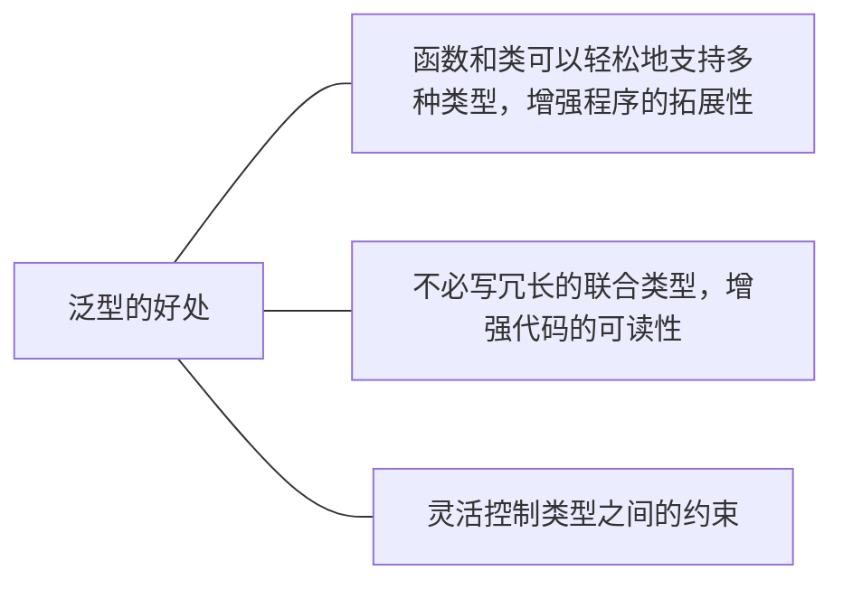

# TS 基础

[Typescript 在线编译平台](https://www.typescriptlang.org/play)

## 基础类型

### boolean、number 和 string 类型

**boolean**

```typescript
let isHandsome: boolean = true
```

赋值与定义的不一致，会报错，静态类型语言的优势就体现出来了，可以帮助我们提前发现代码中的错误。

```typescript
let isHandsome: boolean = 'true'
// Type 'string' is not assignable to type 'boolean'.
```

**number**

```typescript
let age: number = 18
```

**string**

```typescript
let realName: string = 'li'
let fullName: string = `A ${realName}` // 支持模板字符串
```

### undefined 和 null 类型

```typescript
let u: undefined = undefined // undefined 类型
let n: null = null // null 类型
```

默认情况下 `null` 和 `undefined` 是所有类型的子类型。就是说你可以把 null 和 undefined 赋值给 number 类型的变量。

```typescript
let age: number = null
let realName: string = undefined
```

但是如果指定了 `--strictNullChecks` 标记，null 和 undefined 只能赋值给 void 和它们各自，不然会报错。

```typescript
let age: number = null
// Type 'null' is not assignable to type 'number'.
```

### any、unknown 和 void 类型

**any**

不清楚用什么类型，可以使用 any 类型。这些值可能来自于动态的内容，比如来自用户输入或第三方代码库

```typescript
let notSure: any = 4
notSure = 'maybe a string' // 可以是 string 类型
notSure = false // 也可以是 boolean 类型

notSure.name // 可以随便调用属性和方法
notSure.getName()
```

不建议使用 any，不然就丧失了 TS 的意义。

**unknown 类型**

不建议使用 any，当我不知道一个类型具体是什么时，该怎么办？

可以使用 `unknown` 类型

`unknown` 类型代表任何类型，它的定义和 `any` 定义很像，但是它是一个安全类型，使用 `unknown` 做任何事情都是不合法的。

比如，这样一个 divide 函数，

```typescript
function divide(param: any) {
  return param / 2
}
```

把 param 定义为 any 类型，TS 就能编译通过，没有把潜在的风险暴露出来，万一传的不是 number 类型，不就没有达到预期了吗。

把 param 定义为 unknown 类型 ，TS 编译器就能拦住潜在风险，

```typescript
function divide(param: unknown) {
  return param / 2 // 'param' is of type 'unknown'.
}
```

因为不知道 param 的类型，使用运算符 `/`，导致报错。

再配合类型断言，即可解决这个问题，

```typescript
function divide(param: unknown) {
  return (param as number) / 2
}
```

**void**

`void`类型与 `any` 类型相反，它表示没有任何类型。

比如函数没有明确返回值，默认返回 Void 类型

```typescript
function welcome(): void {
  console.log('hello')
}
```

### never 类型

`never`类型表示的是那些永不存在的值的类型。

有些情况下值会永不存在，比如，

- 如果一个函数执行时抛出了异常，那么这个函数永远不存在返回值，因为抛出异常会直接中断程序运行。
- 函数中执行无限循环的代码，使得程序永远无法运行到函数返回值那一步。

```typescript
// 异常
function fn(msg: string): never {
  throw new Error(msg)
}

// 死循环 千万别这么写，会内存溢出
function fn(): never {
  while (true) {}
}
```

never 类型是任何类型的子类型，也可以赋值给任何类型。

没有类型是 never 的子类型，没有类型可以赋值给 never 类型（除了 never 本身之外）。即使 `any`也不可以赋值给 never 。

```typescript
let test1: never
test1 = 'li' // 报错，Type 'string' is not assignable to type 'never'

let test1: never
let test2: any

test1 = test2 // 报错，Type 'any' is not assignable to type 'never'
```

### 数组类型

```typescript
let list: number[] = [1, 2, 3]
list.push(4) // 可以调用数组上的方法
```

数组里的项写错类型会报错

```typescript
let list: number[] = [1, 2, '3'] // Type 'string' is not assignable to type 'number'
```

push 时类型对不上会报错

```typescript
let list: number[] = [1, 2, 3]
list.push('str')
// Argument of type 'string' is not assignable to parameter of type 'number'.
```

如果数组想每一项放入不同数据怎么办？用元组类型

### 元组类型

元组类型允许表示一个已知元素数量和类型的数组，各元素的类型不必相同。

```typescript
let tuple: [number, string] = [18, 'li']
```

写错类型会报错：

```typescript
let tuple: [number, string] = ['18', 'li'] // Type 'string' is not assignable to type 'number'.
```

越界会报错：

```typescript
let tuple: [number, string] = [18, 'li', 100]
// Type '[number, string, number]' is not assignable to type '[number, string]'. Source has 3 element(s) but target allows only 2.
```

可以对元组使用数组的方法，比如使用 push 时，不会有越界报错

```typescript
let tuple: [number, string] = [18, 'li']
tuple.push(100) // 但是只能 push 定义的 number 或者 string 类型
```

push 一个没有定义的类型，报错

```typescript
let tuple: [number, string] = [18, 'li']
tuple.push(true) // Argument of type 'boolean' is not assignable to parameter of type 'string | number'.
```

## 函数类型

TS 定义函数类型需要定义输入参数类型和输出类型。

输出类型也可以忽略，因为 TS 能够根据返回语句自动推断出返回值类型。

```typescript
function add(x: number, y: number): number {
  return x + y
}
add(1, 2)
```

函数没有明确返回值，默认返回 Void 类型

```
function welcome(): void {
    console.log('hello');
}
```

### 函数表达式写法

```
let add2 = (x: number, y: number): number => {
    return x + y
}
```

### 可选参数

参数后加个问号，代表这个参数是可选的

```
function add(x:number, y:number, z?:number):number {
    return x + y
}

add(1,2,3)
add(1,2)
```

注意可选参数要放在函数入参的最后面，不然会导致编译错误。

```typescript
function add(x: number, y?: number, z: number): number {
  return x + y
}
// 'z' is declared but its value is never read.(6133)
// A required parameter cannot follow an optional parameter.
```

### 默认参数

```typescript
function add(x: number, y: number = 100): number {
  return x + y
}

add(100) // 200
```

跟 JS 的写法一样，在入参里定义初始值。

和可选参数不同的是，默认参数可以不放在函数入参的最后面，

```typescript
function add(x: number = 100, y: number): number {
  return x + y
}

add(100)
// Expected 2 arguments, but got 1.(2554)
// input.tsx(1, 30): An argument for 'y' was not provided.
```

看上面的代码，add 函数只传了一个参数，如果理所当然地觉得 x 有默认值，只传一个就传的是 y 的话，就会报错。

编译器会判定你只传了 x，没传 y。

如果带默认值的参数不是最后一个参数，用户必须明确的传入 `undefined`值来获得默认值。

```typescript
add(undefined, 100) // 200
```

### 函数赋值

JS 中变量随便赋值没问题，

```javascript
let fn = () => {}
fn = '123'
```

但在 TS 中函数不能随便赋值，会报错的。

也可以用下面这种方式定义一个函数 add3，把 add2 赋值给 add3

```typescript
let add2 = (x: number, y: number): number => {
  return x + y
}

const add3: (x: number, y: number) => number = add2
```

有点像 es6 中的箭头函数，但不是箭头函数，TS 遇到 `:` 就知道后面的代码是写类型用的。

当然，不用定义 add3 类型直接赋值也可以，TS 会在变量赋值的过程中，自动推断类型，如下：

```typescript
let add2 = (x: number, y: number): number => {
  return x + y
}

const add3 = add2 // const add3: (x: number, y: number) => number
```

### 函数重载

函数重载是指两个函数名称相同，但是参数个数或参数类型不同，他的好处显而易见，不需要把相似功能的函数拆分成多个函数名称不同的函数。

#### 不同参数类型

比如我们实现一个 add 函数，如果传入参数都是数字，就返回数字相加，如果传入参数都是字符串，就返回字符串拼接，

```typescript
function add(x: number[]): number
function add(x: string[]): string
function add(x: any[]): any {
  if (typeof x[0] === 'string') {
    return x.join()
  }
  if (typeof x[0] === 'number') {
    return x.reduce((acc, cur) => acc + cur)
  }
}
```

在 TS 中，实现函数重载，需要多次声明这个函数，前几次是函数定义，列出所有的情况，最后一次是函数实现，需要比较宽泛的类型，比如上面的例子就用到了 any。

#### 不同参数个数

假设这个 add 函数接受更多的参数个数，比如还可以传入一个参数 y，如果传了 y，就把 y 也加上或拼接上，就可以这么写，

```typescript
function add(x: number[]): number
function add(x: string[]): string
function add(x: number[], y: number[]): number
function add(x: string[], y: string[]): string
function add(x: any[], y?: any[]): any {
  if (Array.isArray(y) && typeof y[0] === 'number') {
    return x.reduce((acc, cur) => acc + cur) + y.reduce((acc, cur) => acc + cur)
  }
  if (Array.isArray(y) && typeof y[0] === 'string') {
    return x.join() + ',' + y.join()
  }
  if (typeof x[0] === 'string') {
    return x.join()
  }
  if (typeof x[0] === 'number') {
    return x.reduce((acc, cur) => acc + cur)
  }
}

console.log(add([1, 2, 3])) // 6
console.log(add(['li', '18'])) // 'lin,18'
console.log(add([1, 2, 3], [1, 2, 3])) // 12
console.log(add(['li', '18'], ['man', 'handsome'])) // 'li,18,man,handsome'
```

其实写起来挺麻烦的，后面了解泛型之后写起来会简洁一些，不必太纠结函数重载，知道有这个概念即可，平时一般用泛型来解决类似问题。

## interface

### 基本概念

`interface`(接口) 是 TS 设计出来用于定义对象类型的，可以对对象的形状进行描述。

定义 interface 一般首字母大写，代码如下：

```typescript
interface Person {
  name: string
  age: number
}

const p1: Person = {
  name: 'li',
  age: 18,
}
```

属性必须和类型定义的时候完全一致。

少写了属性，报错：

```typescript
interface Person {
  name: string
  age: number
}

const p1: Person = {
  name: 'li',
} // Property 'age' is missing in type '{ name: string; }' but required in type 'Person'.
```

多写了属性，报错：

```typescript
interface Person {
  name: string
  age: number
}

const p1: Person = {
  name: 'li',
  age: 18,
  work: null,
} // Object literal may only specify known properties, and 'work' does not exist in type 'Person'.
```

> 注意：interface 不是 JS 中的关键字，所以 TS 编译成 JS 之后，这些 interface 是不会被转换过去的，都会被删除掉，interface 只是在 TS 中用来做静态检查。

### 可选属性

跟函数的可选参数是类似的，在属性上加个 `?`，这个属性就是可选的，比如下面的 age 属性

```typescript
interface Person {
  name: string
  age?: number
}

const p1: Person = {
  name: 'li',
}
```

### 只读属性

如果希望某个属性不被改变，可以这么写：

```typescript
interface Person {
  readonly id: number
  name: string
  age: number
}
```

改变这个只读属性时会报错。

```typescript
interface Person {
  readonly id: number
  name: string
  age: number
}

const p1: Person = {
  id: 1,
  name: 'li',
  age: 18,
}
p1.id = 2 // Cannot assign to 'id' because it is a read-only property.
```

### interface 描述函数类型

interface 也可以用来描述函数类型，代码如下：

```typescript
interface ISum {
  (x: number, y: number): number
}

const add: ISum = (num1, num2) => {
  return num1 + num2
}
```

### 自定义属性（可索引的类型）

上文中，属性必须和类型定义的时候完全一致，如果一个对象上有多个不确定的属性，怎么办？

可以这么写。

```
interface RandomKey {
    [propName: string]: string
}

const obj: RandomKey = {
    a: 'hello',
    b: 'lin',
    c: 'welcome',
}
```

如果把属性名定义为 number 类型，就是一个类数组了，看上去和数组一模一样。

```typescript
interface LikeArray {
  [propName: number]: string
}

const arr: LikeArray = ['hello', 'li']

arr[0] // 可以使用下标来访问值
```

当然，不是真的数组，数组上的方法它是没有的。

```typescript
interface LikeArray {
  [propName: number]: string
}
const arr: LikeArray = ['hello', 'li']
arr.push('18') // Property 'push' does not exist on type 'LikeArray'.
```

### duck typing

看到这里，你会发现，interface 的写法非常灵活，它不是教条主义。

用 interface 可以创造一系列自定义的类型。

事实上， interface 还有一个响亮的名称：`duck typing`(鸭子类型)。

> 当看到一只鸟走起来像鸭子、游泳起来像鸭子、叫起来也像鸭子，那么这只鸟就可以被称为鸭子。
> -- **James Whitcomb Riley**

这句话完美地诠释了 interface 的含义，只要数据满足了 interface 定义的类型，TS 就可以编译通过。

举个例子：

```typescript
interface FunctionWithProps {
  (x: number): number
  name: string
}
```

FunctionWithProps 接口描述了一个函数类型，还向这个函数类型添加了 name 属性，这看上去完全是四不像，但是这个定义是完全可以工作的。

```typescript
const fn: FunctionWithProps = (x) => {
  return x
}

fn.name = 'hello world'
```

## 类

我们知道， JS 是靠原型和原型链来实现面向对象编程的，es6 新增了语法糖 class。

TS 通过 `public`、`private`、`protected` 三个修饰符来增强了 JS 中的类。

在 TS 中，写法和 JS 差不多，只是要定义一些类型而已，我们通过下面几个例子来复习一下类的封装、继承和多态。

### 基本写法

定义一个 Person 类，有属性 name 和 方法 speak

```typescript
class Person {
  name: string
  constructor(name: string) {
    this.name = name
  }
  speak() {
    console.log(`${this.name} is speaking`)
  }
}

const p1 = new Person('li') // 新建实例

p1.name // 访问属性和方法
p1.speak()
```

### 继承

使用 extends 关键字实现继承，定义一个 Student 类继承自 Person 类。

```typescript
class Student extends Person {
  study() {
    console.log(`${this.name} needs study`)
  }
}

const s1 = new Student('li')

s1.study()
```

继承之后，Student 类上的实例可以访问 Person 类上的属性和方法。

#### super 关键字

注意，上例中 Student 类没有定义自己的属性，可以不写 super ，但是如果 Student 类有自己的属性，就要用到 super 关键字来把父类的属性继承过来。

比如，Student 类新增一个 grade(成绩) 属性，就要这么写：

```typescript
class Student extends Person {
  grade: number
  constructor(name: string, grade: number) {
    super(name)
    this.grade = grade
  }
}

const s1 = new Student('li', 100)
```

不写 super 会报错。

```typescript
class Student extends Person {
  grade: number
  constructor(grade: number) {
    // Constructors for derived classes must contain a 'super' call.
    this.grade = grade
  }
}

const s1 = new Student('li', 100)
```

### 多态

子类对父类的方法进行了重写，子类和父类调同一个方法时会不一样。

```typescript
class Student extends Person {
  speak() {
    return `Student ${super.speak()}`
  }
}
```

TS 中一般对抽象方法实现多态，详细见后文抽象类。

### public

`public`，公有的，一个类里默认所有的方法和属性都是 public。

比如上文中定义的 Person 类，其实是这样的：

```typescript
class Person {
  public name: string
  public constructor(name: string) {
    this.name = name
  }
  public speak() {
    console.log(`${this.name} is speaking`)
  }
}
```

public 可写可不写，不写默认也是 public。

### private

`private`，私有的，只属于这个类自己，它的实例和继承它的子类都访问不到。

将 Person 类的 name 属性改为 private。

```typescript
class Person {
  private name: string
  public constructor(name: string) {
    this.name = name
  }
  public speak() {
    console.log(`${this.name} is speaking`)
  }
}
```

实例访问 name 属性，会报错：

```typescript
class Person {
  private name: string
  public constructor(name: string) {
    this.name = name
  }
  public speak() {
    console.log(`${this.name} is speaking`)
  }
}

const p1 = new Person('li')
p1.name // Property 'name' is private and only accessible within class 'Person'.
```

继承它的子类 访问 name 属性，会报错：

```typescript
class Student extends Person {
  study() {
    console.log(`${this.name} needs study`) // Property 'name' is private and only accessible within class 'Person'.
  }
}
```

### protected

`protected` 受保护的，继承它的子类可以访问，实例不能访问。

将 Person 类的 name 属性改为 protected。

```typescript
class Person {
  protected name: string
  public constructor(name: string) {
    this.name = name
  }
  public speak() {
    console.log(`${this.name} is speaking`)
  }
}
```

实例访问 name 属性，会报错：

```typescript
class Person {
  protected name: string
  public constructor(name: string) {
    this.name = name
  }
  public speak() {
    console.log(`${this.name} is speaking`)
  }
}

const p1 = new Person('li')
p1.name // Property 'name' is protected and only accessible within class 'Person' and its subclasses.
```

子类可以访问。

```typescript
class Studeng extends Person {
  study() {
    console.log(`${this.name} needs study`)
  }
}
```

### static

`static` 是静态属性，可以理解为是类上的一些常量，实例和子类都不能访问。

比如一个 Circle 类，圆周率是 3.14，可以直接定义一个静态属性。

```typescript
class Circle {
  static pi: 3.14
  public radius: number
  public constructor(radius: number) {
    this.radius = radius
  }
  public calcLength() {
    return Circle.pi * this.radius * 2 // 计算周长，直接访问 Circle.pi
  }
}
```

实例访问，会报错：

```typescript
class Circle {
  static pi: 3.14
  public radius: number
  public constructor(radius: number) {
    this.radius = radius
  }
  public calcLength() {
    return Circle.pi * this.radius * 2 // 计算周长，直接访问 Circle.pi
  }
}

const c1 = new Circle(10)
c1.pi // Property 'pi' does not exist on type 'Circle'. Did you mean to access the static member 'Circle.pi' instead?
```

### 抽象类

抽象类，听名字似乎是非常难理解的概念，但其实非常简单。

TS 通过 `public`、`private`、`protected` 三个修饰符来增强了 JS 中的类。

其实 TS 还对 JS 扩展了一个新概念——`抽象类`。

所谓抽象类，是指**只能被继承，但不能被实例化的类**，就这么简单。

抽象类有两个特点：

- 抽象类不允许被实例化
- 抽象类中的抽象方法必须被子类实现

抽象类用一个 `abstract` 关键字来定义，我们通过两个例子来感受一下抽象类的两个特点。

#### 抽象类不允许被实例化

```typescript
abstract class Animal {}

const a = new Animal() // Cannot create an instance of an abstract class.
```

定义一个抽象类 Animal，初始化一个 Animal 的实例，直接报错。

#### 抽象类中的抽象方法必须被子类实现

```typescript
abstract class Animal {
  constructor(name: string) {
    this.name = name
  }
  public name: string
  public abstract sayHi(): void
}

class Dog extends Animal {
  constructor(name: string) {
    super(name)
  }
}
// Non-abstract class 'Dog' does not implement all abstract members of 'Animal'(18052)
// input.tsx(6, 21): Non-abstract class 'Dog' does not implement inherited abstract member 'sayHi' from class 'Animal'.
```

定义一个 Dog 类，继承自 Animal 类，但是却没有实现 Animal 类上的抽象方法 `sayHi`，报错。

正确的用法如下，

```typescript
abstract class Animal {
  constructor(name: string) {
    this.name = name
  }
  public name: string
  public abstract sayHi(): void
}

class Dog extends Animal {
  constructor(name: string) {
    super(name)
  }
  public sayHi() {
    console.log('wang')
  }
}
```

#### 为什么叫抽象类？

很显然，抽象类是一个广泛和抽象的概念，不是一个实体，就比如上文的例子，动物这个概念是很广泛的，猫、狗、狮子都是动物，但动物却不好是一个实例，实例只能是猫、狗或者狮子。

官方一点的说法是，在面向对象的概念中，所有的对象都是通过类来描绘的，但是反过来，并不是所有的类都是用来描绘对象的，如果一个类中没有包含足够的信息来描绘一个具体的对象，这样的类就是抽象类。

比如 Animal 类只是具有动物都有的一些属性和方法，但不会具体到包含猫或者狗的属性和方法。

所以抽象类的用法是用来定义一个基类，声明共有属性和方法，拿去被继承。

抽象类的好处是可以抽离出事物的共性，有利于代码的复用。

#### 抽象方法和多态

多态是面向对象的三大基本特征之一。

多态指的是，父类定义一个抽象方法，在**多个子类中有不同的实现**，运行的时候不同的子类就对应不同的操作，比如，

```typescript
abstract class Animal {
  constructor(name: string) {
    this.name = name
  }
  public name: string
  public abstract sayHi(): void
}

class Dog extends Animal {
  constructor(name: string) {
    super(name)
  }
  public sayHi() {
    console.log('wang')
  }
}

class Cat extends Animal {
  constructor(name: string) {
    super(name)
  }
  public sayHi() {
    console.log('miao')
  }
}
```

Dog 类和 Cat 类都继承自 Animal 类，Dog 类和 Cat 类都不同的实现了 sayHi 这个方法。

### this 类型

接下来，我们介绍一种特殊的类型，this 类型。

类的成员方法可以直接返回一个 `this`，这样就可以很方便地实现链式调用。

#### 链式调用

```typescript
class StudyStep {
  step1() {
    console.log('listen')
    return this
  }
  step2() {
    console.log('write')
    return this
  }
}

const s = new StudyStep()

s.step1().step2() // 链式调用
```

#### 灵活调用子类父类方法

在继承的时候，this 可以表示父类型，也可以表示子类型

```typescript
class StudyStep {
  step1() {
    console.log('listen')
    return this
  }
  step2() {
    console.log('write')
    return this
  }
}

class MyStudyStep extends StudyStep {
  next() {
    console.log('before done, study next!')
    return this
  }
}

const m = new MyStudyStep()

m.step1().next().step2().next() // 父类型和子类型上的方法都可随意调用
```

这样就保持了父类和子类之间接口调用的连贯性

## interface 和 class 的关系

上文中我们说过，interface 是 TS 设计出来用于定义对象类型的，可以对对象的形状进行描述。

interface 同样可以用来约束 class，要实现约束，需要用到 `implements` 关键字。

### implements

implements 是实现的意思，class 实现 interface。

比如手机有播放音乐的功能，可以这么写：

```typescript
interface MusicInterface {
  playMusic(): void
}

class Cellphone implements MusicInterface {
  playMusic() {}
}
```

定义了约束后，class 必须要满足接口上的所有条件。

如果 Cellphone 类上不写 playMusic 方法，会报错。

```typescript
interface MusicInterface {
    playMusic(): void
}

class Cellphone implements MusicInterface { }
// Class 'Cellphone' incorrectly implements interface 'MusicInterface'.
  Property 'playMusic' is missing in type 'Cellphone' but required in type 'MusicInterface'.
```

### 处理公共的属性和方法

不同的类有一些共同的属性和方法，使用继承很难完成。

比如汽车（Car 类）也有播放音乐的功能，你可以这么做：

- 用 Car 类继承 Cellphone 类
- 找一个 Car 类和 Cellphone 类的父类，父类有播放音乐的方法，他们俩继承这个父类

很显然这两种方法都不合常理。

实际上，使用 implements，问题就会迎刃而解。

```typescript
interface MusicInterface {
  playMusic(): void
}

class Car implements MusicInterface {
  playMusic() {}
}

class Cellphone implements MusicInterface {
  playMusic() {}
}
```

这样 Car 类和 Cellphone 类都约束了播放音乐的功能。

再比如，手机还有打电话的功能，就可以这么做，Cellphone 类 implements 两个 interface。

```typescript
interface MusicInterface {
  playMusic(): void
}

interface CallInterface {
  makePhoneCall(): void
}

class Cellphone implements MusicInterface, CallInterface {
  playMusic() {}
  makePhoneCall() {}
}
```

这个 CallInterface 也可以用于 iPad 类、手表类上面，毕竟他们也能打电话。

interface 来约束 class，只要 class 实现了 interface 规定的属性或方法，就行了，没有继承那么多条条框框，非常灵活。

### 约束构造函数和静态属性

使用 implements 只能约束类实例上的属性和方法，要约束构造函数和静态属性，需要这么写。

以我们上文提过的 Circl 类为例：

```typescript
interface CircleStatic {
  new (radius: number): void
  pi: number
}

const Circle: CircleStatic = class Circle {
  static pi: 3.14
  public radius: number
  public constructor(radius: number) {
    this.radius = radius
  }
}
```

未定义静态属性 pi，会报错：

```typescript
interface CircleStatic {
  new (radius: number): void
  pi: number
}

const Circle: CircleStatic = class Circle {
  // Property 'pi' is missing in type 'typeof Circle' but required in type 'CircleStatic'.
  public radius: number
  public constructor(radius: number) {
    this.radius = radius
  }
}
```

constructor 入参类型不对，会报错：

```typescript
interface CircleStatic {
  new (radius: number): void
  pi: number
}

const Circle: CircleStatic = class Circle {
  // Type 'typeof Circle' is not assignable to type 'CircleStatic'. Types of parameters 'radius' and 'radius' are incompatible. Type 'number' is not assignable to type 'string'.
  static pi: 3.14
  public radius: number
  public constructor(radius: string) {
    this.radius = radius
  }
}
```

## 枚举

在任何项目开发中，我们都会遇到定义常量的情况，常量就是指不会被改变的值。

TS 中我们使用 `const` 来声明常量，但是有些取值是在一定范围内的一系列常量，比如一周有七天，比如方向分为上下左右四个方向。

这时就可以使用枚举（Enum）来定义。

### 基本使用

```typescript
enum Direction {
  Up,
  Down,
  Left,
  Right,
}
```

这样就定义了一个**数字枚举**，他有两个特点：

- 数字递增
- 反向映射

枚举成员会被赋值为从 `0` 开始递增的数字，

```typescript
console.log(Direction.Up) // 0
console.log(Direction.Down) // 1
console.log(Direction.Left) // 2
console.log(Direction.Right) // 3
```

枚举会对枚举值到枚举名进行反向映射，

```typescript
console.log(Direction[0]) // Up
console.log(Direction[1]) // Down
console.log(Direction[2]) // Left
console.log(Direction[3]) // Right
```

如果枚举第一个元素赋有初始值，就会从初始值开始递增，

```typescript
enum Direction {
  Up = 6,
  Down,
  Left,
  Right,
}

console.log(Direction.Up) // 6
console.log(Direction.Down) // 7
console.log(Direction.Left) // 8
console.log(Direction.Right) // 9
```

### 反向映射的原理

枚举是如何做到反向映射的呢，我们不妨来看一下被编译后的代码，

```typescript
var Direction
;(function (Direction) {
  Direction[(Direction['Up'] = 6)] = 'Up'
  Direction[(Direction['Down'] = 7)] = 'Down'
  Direction[(Direction['Left'] = 8)] = 'Left'
  Direction[(Direction['Right'] = 9)] = 'Right'
})(Direction || (Direction = {}))
```

主体代码是被包裹在一个自执行函数里，封装了自己独特的作用域。

```typescript
Direction['Up'] = 6
```

会将 Direction 这个对象的 Up 属性赋值为 6，JS 的赋值运算符返回的值是被赋予的值。

```typescript
Direction["Up"] = 6 返回 6
// 执行 Direction[Direction["Up"] = 6] = "Up";

// 相当于执行
Direction["Up"] = 6
Direction[6] = "Up"
```

这样就实现了枚举的反向映射。

### 手动赋值

定义一个枚举来管理外卖状态，分别有已下单，配送中，已接收三个状态。

可以这么写，

```typescript
enum ItemStatus {
  Buy = 1,
  Send,
  Receive,
}

console.log(ItemStatus['Buy']) // 1
console.log(ItemStatus['Send']) // 2
console.log(ItemStatus['Receive']) // 3
```

但有时候后端给你返回的数据状态是乱的，就需要我们手动赋值。

比如后端说 Buy 是 100，Send 是 20，Receive 是 1，就可以这么写，

```typescript
enum ItemStatus {
  Buy = 100,
  Send = 20,
  Receive = 1,
}

console.log(ItemStatus['Buy']) // 100
console.log(ItemStatus['Send']) // 20
console.log(ItemStatus['Receive']) // 1
```

别问为什么，实际开发中经常会有这种情况发生。

### 计算成员

枚举中的成员可以被计算，比如经典的使用位运算合并权限，可以这么写，

```typescript
enum FileAccess {
  Read = 1 << 1,
  Write = 1 << 2,
  ReadWrite = Read | Write,
}

console.log(FileAccess.Read) // 2   -> 010
console.log(FileAccess.Write) // 4   -> 100
console.log(FileAccess.ReadWrite) // 6   -> 110
```

看个实例吧，Vue3 源码中的 patchFlags，用于标识节点更新的属性。

```typescript
// packages/shared/src/patchFlags.ts
export const enum PatchFlags {
  TEXT = 1, // 动态文本节点
  CLASS = 1 << 1, // 动态 class
  STYLE = 1 << 2, // 动态 style
  PROPS = 1 << 3, // 动态属性
  FULL_PROPS = 1 << 4, // 具有动态 key 属性，当 key 改变时，需要进行完整的 diff 比较
  HYDRATE_EVENTS = 1 << 5, // 具有监听事件的节点
  STABLE_FRAGMENT = 1 << 6, // 子节点顺序不会被改变的 fragment
  KEYED_FRAGMENT = 1 << 7, // 带有 key 属或部分子节点有 key 的 fragment
  UNKEYED_FRAGMENT = 1 << 8, // 子节点没有 key 的 fragment
  NEED_PATCH = 1 << 9, // 非 props 的比较，比如 ref 或指令
  DYNAMIC_SLOTS = 1 << 10, // 动态插槽
  DEV_ROOT_FRAGMENT = 1 << 11, // 仅供开发时使用，表示将注释放在模板根级别的片段
  HOISTED = -1, // 静态节点
  BAIL = -2, // diff 算法要退出优化模式
}
```

### 字符串枚举

字符串枚举的意义在于，提供有具体语义的字符串，可以更容易地理解代码和调试。

```typescript
enum Direction {
  Up = 'UP',
  Down = 'DOWN',
  Left = 'LEFT',
  Right = 'RIGHT',
}

const value = 'UP'
if (value === Direction.Up) {
  // do something
}
```

### 常量枚举

上文的例子，使用 const 来定义一个常量枚举

```typescript
const enum Direction {
  Up = 'UP',
  Down = 'DOWN',
  Left = 'LEFT',
  Right = 'RIGHT',
}

const value = 'UP'
if (value === Direction.Up) {
  // do something
}
```

编译出来的 JS 代码会简洁很多，提高了性能。

```typescript
const value = 'UP'
if (value === 'UP' /* Up */) {
  // do something
}
```

不写 const 编译出来是这样的，

```typescript
var Direction
;(function (Direction) {
  Direction['Up'] = 'UP'
  Direction['Down'] = 'DOWN'
  Direction['Left'] = 'LEFT'
  Direction['Right'] = 'RIGHT'
})(Direction || (Direction = {}))
const value = 'UP'
if (value === Direction.Up) {
  // do something
}
```

这一堆定义枚举的逻辑会在编译阶段会被删除，常量枚举成员在使用的地方被内联进去。

很显然，常量枚举不允许包含计算成员，不然怎么叫常量呢？

```typescript
const enum Test {
  A = 'li'.length, // const enum member initializers must be constant expressions.
}
```

这么写直接报错。

总结一下，常量枚举可以避免在额外生成的代码上的开销和额外的非直接的对枚举成员的访问。

### 小结

枚举的意义在于，可以定义一些带名字的常量集合，清晰地表达意图和语义，更容易地理解代码和调试。

常用于和后端联调时，区分后端返回的一些代表状态语义的数字或字符串，降低阅读代码时的心智负担。

## 类型推论

TypeScript 里，在有些没有明确指出类型的地方，类型推论会**帮助提供类型**。

这种推断发生在初始化变量和成员，设置默认参数值和决定函数返回值时。

### 定义时不赋值

```typescript
let a

a = 18
a = 'li'
```

定义时不赋值，就会被 TS 自动推导成 any 类型，之后随便怎么赋值都不会报错。

### 初始化变量

例如：

```typescript
let userName = 'li'
```

因为赋值的时候赋的是一个字符串类型，所以 TS 自动推导出 userName 是 string 类型。

这个时候，再更改 userName 时，就必须是 string 类型，是其他类型就报错，比如：

```typescript
let userName = 'li'
userName = function () {
  // Type '() => void' is not assignable to type 'string'.
}
```

### 设置默认参数值

函数设置默认参数时，也会有自动推导

比如，定义一个打印年龄的函数，默认值是 18

```typescript
function printAge(num = 18) {
  console.log(num)
  return num
}
```

那么 TS 会自动推导出 printAge 的入参类型，传错了类型会报错。

```typescript
function printAge(num = 18) {
  console.log(num)
  return num
}

printAge('18') // Argument of type 'string' is not assignable to parameter of type 'number'.
```

### 决定函数返回值

决定函数返回值时， TS 也会自动推导出返回值类型。

比如一个函数不写返回值，

```typescript
function welcome() {
  console.log('hello')
}
```

TS 自动推导出返回值是 void 类型

再比如上文的 printAge 函数，TS 会自动推导出返回值是 number 类型。

如果我们给 printAge 函数的返回值定义为 string 类型，看看会发生什么。

```typescript
function printAge(num = 18) {
  console.log(num)
  return num
}

interface PrintAge {
  (num: number): string
}

const printAge1: PrintAge = printAge
// Type '(num?: number) => number' is not assignable to type 'PrintAge'. Type 'number' is not assignable to type 'string'.
```

很显然，定义的类型和 TS 自动推导出的类型冲突，报错。

### 最佳通用类型

当需要从几个表达式中推断类型时候，会使用这些表达式的类型来推断出一个最合适的通用类型。比如，

```typescript
let arr = [0, 1, null, 'li'] // let arr: (string | number | null)[]
```

又比如：

```typescript
let pets = [new Dog(), new Cat()] // let pets: (Dog | Cat)[]
```

虽然 TS 可以推导出最合适的类型，但最好还是在写的时候就定义好类型，上文的例子，我们可以这么写：

```typescript
type arrItem = number | string | null
let arr: arrItem[] = [0, 1, null, 'li']

let pets: Pets[] = [new Dog(), new Cat()]
```

### 小结

类型推论虽然能为我们提供帮助，但既然写了 TS，除非是函数默认返回类型为 void 这种大家都知道的，其他的最好每个地方都定义好类型。

## 内置类型

JavaScript 中有很多**内置对象**，它们可以直接在 TypeScript 中当做定义好了的类型。

内置对象是指根据标准在全局作用域 `global` 上存在的对象，这里的标准指的是 `ECMAcript` 和其他环境（比如 DOM）的标准。

### JS 八种内置类型

```typescript
let name: string = 'lin'
let age: number = 18
let isHandsome: boolean = true
let u: undefined = undefined
let n: null = null
let obj: object = { name: 'lin', age: 18 }
let big: bigint = 100n
let sym: symbol = Symbol('lin')
```

### ECMAScript 的内置对象

比如，`Array`、`Date`、`Error` 等，

```typescript
const nums: Array<number> = [1, 2, 3]

const date: Date = new Date()

const err: Error = new Error('Error!')

const reg: RegExp = /abc/

Math.pow(2, 9)
```

以 `Array` 为例，按住 `comand/ctrl`，再鼠标左键点击一下，就能跳转到类型声明的地方。

可以看到，Array 这个类型是用 interface 定义的，有多个不同版本的 `.d.ts` 文件声明了这个类型。

在 TS 中，重复声明一个 interface，会把所有的声明全部合并，这里所有的 `.d.ts` 文件合并出来的 Array 接口，就组合成了 Array 内置类型的全部属性和功能。

再举个例子

### DOM 和 BOM

比如 `HTMLElement`、`NodeList`、`MouseEvent` 等

```typescript
let body: HTMLElement = document.body

let allDiv: NodeList = document.querySelectorAll('div')

document.addEventListener('click', (e: MouseEvent) => {
  e.preventDefault()
  // Do something
})
```

### TS 核心库的定义文件

**TypeScript 核心库的定义文件**[9]中定义了所有浏览器环境需要用到的类型，并且是预置在 TypeScript 中的。

比如 `Math.pow` 的类型定义如下，

```typescript
interface Math {
  /**
   * Returns the value of a base expression taken to a specified power.
   * @param x The base value of the expression.
   * @param y The exponent value of the expression.
   */
  pow(x: number, y: number): number
}
```

又比如，`addEventListener` 的类型定义如下，

```typescript
interface Document extends Node, GlobalEventHandlers, NodeSelector, DocumentEvent {
  addEventListener(type: string, listener: (ev: MouseEvent) => any, useCapture?: boolean): void
}
```

浅尝辄止，知道在哪里定义就行，真要去分析一些 Web Api 的类型实现，是很费精力的。

# TS 进阶

这一部分的内容就需要费点脑细胞了，毕竟学习一门语言，还是没那么容易的，最好把基础的内容都理解透彻之后再来学进阶。

## 高级类型（一）

高级类型分一和二两部分，一的部分不需要理解泛型也能理解，二的部分需要理解泛型之后才能理解，所以二被拆分到后面去了。

### 联合类型

如果希望一个变量可以支持多种类型，就可以用联合类型（union types）来定义。

例如，一个变量既支持 number 类型，又支持 string 类型，就可以这么写：

```typescript
let num: number | string

num = 8
num = 'eight'
```

联合类型大大提高了类型的可扩展性，但当 TS 不确定一个联合类型的变量到底是哪个类型的时候，只能访问他们共有的属性和方法。

### 交叉类型

如果要对对象形状进行扩展，可以使用交叉类型 `&`。

比如 Person 有 name 和 age 的属性，而 Student 在 name 和 age 的基础上还有 grade 属性，就可以这么写，

```typescript
interface Person {
  name: string
  age: number
}

type Student = Person & { grade: number }
```

这和类的继承是一模一样的，这样 Student 就继承了 Person 上的属性。

联合类型 `|` 是指可以取几种类型中的任意一种，而交叉类型 `&` 是指把几种类型合并起来。

交叉类型和 interface 的 extends 非常类似，都是为了实现对象形状的组合和扩展。

### 类型别名（type）

类型别名（type aliase），听名字就很好理解，就是给类型起个别名。

就像 NBA 球员 扬尼斯-阿德托昆博，名字太长难记，我们叫他`字母哥`。

就像我们项目中配置 `alias`，不用写相对路径就能很方便地引入文件

```typescript
import componentA from '../../../../components/componentA/index.vue'
变成
import componentA from '@/components/componentA/index.vue
```

类型别名用 `type` 关键字来书写，有了类型别名，我们书写 TS 的时候可以更加方便简洁。

比如下面这个例子，`getName` 这个函数接收的参数可能是字符串，可能是函数，就可以这么写。

```typescript
type Name = string
type NameResolver = () => string
type NameOrResolver = Name | NameResolver // 联合类型
function getName(n: NameOrResolver): Name {
  if (typeof n === 'string') {
    return n
  } else {
    return n()
  }
}
```

这样调用时传字符串和函数都可以。

```typescript
getName('li')
getName(() => 'li')
```

如果传的格式有问题，就会提示。

> 类型别名会给一个类型起个新名字。类型别名有时和接口很像，但是可以作用于原始值，联合类型，元组以及其它任何你需要手写的类型。-- TS 文档

类型别名的用法如下，

```typescript
type Name = string // 基本类型

type arrItem = number | string // 联合类型

const arr: arrItem[] = [1, '2', 3]

type Person = {
  name: Name
}

type Student = Person & { grade: number } // 交叉类型

type Teacher = Person & { major: string }

type StudentAndTeacherList = [Student, Teacher] // 元组类型

const list: StudentAndTeacherList = [
  { name: 'li', grade: 100 },
  { name: 'liu', major: 'Chinese' },
]
```

#### type 和 interface 的区别

比如下面这个例子，可以用 type，也可以用 interface。

```typescript
interface Person {
  name: string
  age: number
}

const person: Person = {
  name: 'li',
  age: 18,
}

type Person = {
  name: string
  age: number
}

const person: Person = {
  name: 'li',
  age: 18,
}
```

那 type 和 interface 难道都可以随便用，总得有个区别吧。

**两者相同点：**

- 都可以定义一个对象或函数
- 都允许继承

**都可以定义一个对象或函数**

定义对象上文已经说了，我们来看一下如何定义函数。

```typescript
type addType = (num1: number, num2: number) => number

interface addType {
  (num1: number, num2: number): number
}
// 这两种写法都可以定义函数类型

const add: addType = (num1, num2) => {
  return num1 + num2
}
```

**都允许继承**

我们定义一个 Person 类型和 Student 类型，**Student 继承自 Person**，可以有下面四种方式

```typescript
// interface 继承 interface
interface Person {
  name: string
}
interface Student extends Person {
  grade: number
}

const person: Student = {
  name: 'lin',
  grade: 100,
}

// type 继承 type
type Person = {
  name: string
}
type Student = Person & { grade: number } // 用交叉类型

// interface 继承 type
type Person = {
  name: string
}

interface Student extends Person {
  grade: number
}

// type 继承 interface
interface Person {
  name: string
}

type Student = Person & { grade: number } // 用交叉类型
```

interface 使用 extends 实现继承， type 使用交叉类型实现继承

**两者不同点：**

- interface（接口） 是 TS 设计出来用于定义对象类型的，可以对对象的形状进行描述。
- type 是**类型别名**，用于给各种类型定义别名，让 TS 写起来更简洁、清晰。
- type 可以声明基本类型、联合类型、交叉类型、元组，interface 不行
- interface 可以合并重复声明，type 不行

**合并重复声明：**

```typescript
interface Person {
  name: string
}

interface Person {
  // 重复声明 interface，就合并了
  age: number
}

const person: Person = {
  name: 'lin',
  age: 18,
}
```

重复声明 type ，就报错了

```typescript
type Person = {
  name: string
}

type Person = {
  // Duplicate identifier 'Person'
  age: number
}

const person: Person = {
  name: 'lin',
  age: 18,
}
```

这两者的区别说了这么多，其实本不该把这两个东西拿来做对比，他们俩是完全不同的概念。

interface 是**接口**，用于描述一个对象。

type 是**类型别名**，用于给各种类型定义别名，让 TS 写起来更简洁、清晰。

只是有时候两者都能实现同样的功能，才会经常被混淆

平时开发中，一般**使用组合或者交叉类型**的时候，用 type。

一般要用类的 **extends** 或 **implements** 时，用 interface。

其他情况，比如定义一个对象或者函数，就看你心情了。

### 类型保护

如果有一个 `getLength` 函数，入参是联合类型 `number | string`，返回入参的 length，

```typescript
function getLength(arg: number | string): number {
  return arg.length
}
```

从上文可知，这么写会报错，因为 number 类型上没有 length 属性。

这个时候，类型保护（Type Guards）出现了，可以使用 `typeof` 关键字判断变量的类型。

我们把 getLength 方法改造一下，就可以精准地获取到 string 类型的 length 属性了，

```typescript
function getLength(arg: number | string): number {
  if (typeof arg === 'string') {
    return arg.length
  } else {
    return arg.toString().length
  }
}
```

之所以叫类型保护，就是为了能够在不同的分支条件中缩小范围，这样我们代码出错的几率就大大降低了。

### 类型断言

上文的例子也可以使用类型断言来解决。

类型断言语法：

```typescript
值 as 类型
```

使用类型断言来告诉 TS，我（开发者）比你（编译器）更清楚这个参数是什么类型，你就别给我报错了，

```typescript
function getLength(arg: number | string): number {
  const str = arg as string
  if (str.length) {
    return str.length
  } else {
    const number = arg as number
    return number.toString().length
  }
}
```

> 注意，类型断言不是类型转换，把一个类型断言成联合类型中不存在的类型会报错。

比如，

```typescript
function getLength(arg: number | string): number {
  return (arg as number[]).length
  // Conversion of type 'string | number' to type 'number[]' may be a mistake because neither type sufficiently overlaps with the other. If this was intentional, convert the expression to 'unknown' first.
  // Type 'number' is not comparable to type 'number[]'.
}
```

### 字面量类型

有时候，我们需要定义一些常量，就需要用到字面量类型，比如，

```typescript
type ButtonSize = 'mini' | 'small' | 'normal' | 'large'

type Sex = '男' | '女'
```

这样就只能从这些定义的常量中取值，乱取值会报错，

```typescript
type Sex = '男' | '女'

const sex: Sex = '不男不女' // Type '"不男不女"' is not assignable to type 'Sex'.
```

## 泛型

泛型，是 TS 比较难理解的部分，拿下了泛型，对 TS 的理解就又上了一个台阶，对后续深入学习帮助很大。

### 为什么需要泛型？

如果你看过 TS 文档，一定看过这样两段话：

> 软件工程中，我们不仅要创建一致的定义良好的 API，同时也要考虑可重用性。组件不仅能够支持当前的数据类型，同时也能支持未来的数据类型，这在创建大型系统时为你提供了十分灵活的功能。
>
> **在像 C# 和 Java 这样的语言中，可以使用泛型来创建可重用的组件，一个组件可以支持多种类型的数据。这样用户就可以以自己的数据类型来使用组件。**

简直说的就不是人话，你确定初学者看得懂？

我觉得初学者应该要先明白为什么需要泛型这个东西，它解决了什么问题？而不是看这种拗口的定义。

我们还是先来看这样一个例子，体会一下泛型解决的问题吧。

定义一个 print 函数，这个函数的功能是把传入的参数打印出来，再返回这个参数，传入参数的类型是 string，函数返回类型为 string。

```typescript
function print(arg: string): string {
  console.log(arg)
  return arg
}
```

现在需求变了，我还需要打印 number 类型，怎么办？

可以使用联合类型来改造：

```typescript
function print(arg: string | number): string | number {
  console.log(arg)
  return arg
}
```

现在需求又变了，我还需要打印 string 数组、number 数组，甚至任何类型，怎么办？

有个笨方法，支持多少类型就写多少联合类型。

或者把参数类型改成 any。

```typescript
function print(arg: any): any {
  console.log(arg)
  return arg
}
```

且不说写 any 类型不好，毕竟在 TS 中尽量不要写 any。

而且这也不是我们想要的结果，只能说传入的值是 any 类型，输出的值是 any 类型，传入和返回**并不是统一的**。

这么写甚至还会出现 bug

```typescript
const res: string = print(123)
```

定义 string 类型来接收 print 函数的返回值，返回的是个 number 类型，TS 并不会报错提示我们。

这个时候，泛型就出现了，它可以轻松解决**输入输出要一致**的问题。

> 注意：泛型不是为了解决这一个问题设计出来的，泛型还解决了很多其他问题，这里是通过这个例子来引出泛型。

### 泛型基本使用

#### 处理函数参数

我们使用泛型来解决上文的问题。

泛型的语法是 `<>` 里写类型参数，一般可以用 `T` 来表示。

```typescript
function print<T>(arg: T): T {
  console.log(arg)
  return arg
}
```

这样，我们就做到了输入和输出的类型统一，且可以输入输出任何类型。

泛型中的 T 就像一个占位符、或者说一个变量，在使用的时候可以把定义的类型**像参数一样传入**，它可以**原封不动地输出**。

> 泛型的写法对前端工程师来说是有些古怪，比如 `<>` `T` ，但记住就好，只要一看到 `<>`，就知道这是泛型。

我们在使用的时候可以有两种方式指定类型。

- 定义要使用的类型
- TS 类型推断，自动推导出类型

```typescript
print<string>('hello') // 定义 T 为 string

print('hello') // TS 类型推断，自动推导类型为 string
```

我们知道，type 和 interface 都可以定义函数类型，也用泛型来写一下，type 这么写：

```typescript
type Print = <T>(arg: T) => T
const printFn: Print = function print(arg) {
  console.log(arg)
  return arg
}
```

interface 这么写：

```typescript
interface Iprint<T> {
  (arg: T): T
}

function print<T>(arg: T) {
  console.log(arg)
  return arg
}

const myPrint: Iprint<number> = print
```

#### 默认参数

如果要给泛型加默认参数，可以这么写：

```typescript
interface Iprint<T = number> {
  (arg: T): T
}

function print<T>(arg: T) {
  console.log(arg)
  return arg
}

const myPrint: Iprint = print
```

这样默认就是 number 类型了，怎么样，是不是感觉 `T` 就如同函数参数一样呢？

#### 处理多个函数参数

现在有这么一个函数，传入一个只有两项的元组，交换元组的第 0 项和第 1 项，返回这个元组。

```typescript
function swap(tuple) {
  return [tuple[1], tuple[0]]
}
```

这么写，我们就丧失了类型，用泛型来改造一下。

我们用 T 代表第 0 项的类型，用 U 代表第 1 项的类型。

```typescript
function swap<T, U>(tuple: [T, U]): [U, T] {
  return [tuple[1], tuple[0]]
}
```

这样就可以实现了元组第 0 项和第 1 项类型的控制。

#### 函数副作用操作

泛型不仅可以很方便地约束函数的参数类型，还可以用在函数执行副作用操作的时候。

比如我们有一个通用的异步请求方法，想根据不同的 url 请求返回不同类型的数据。

```typescript
function request(url: string) {
  return fetch(url).then((res) => res.json())
}
```

调一个获取用户信息的接口：

```typescript
request('user/info').then((res) => {
  console.log(res)
})
```

这时候的返回结果 res 就是一个 any 类型，非常讨厌。

我们希望调用 API 都**清晰的知道返回类型是什么数据结构**，就可以这么做：

```typescript
interface UserInfo {
  name: string
  age: number
}

function request<T>(url: string): Promise<T> {
  return fetch(url).then((res) => res.json())
}

request<UserInfo>('user/info').then((res) => {
  console.log(res)
})
```

这样就能很舒服地拿到接口返回的数据类型，开发效率大大提高

### 约束泛型

假设现在有这么一个函数，打印传入参数的长度，我们这么写：

```typescript
function printLength<T>(arg: T): T {
  console.log(arg.length) // Property 'length' does not exist on type 'T'.(
  return arg
}
```

因为不确定 T 是否有 length 属性，会报错

那么现在我想约束这个泛型，一定要有 length 属性，怎么办？

可以和 interface 结合，来约束类型。

```typescript
interface ILength {
  length: number
}

function printLength<T extends ILength>(arg: T): T {
  console.log(arg.length)
  return arg
}
```

这其中的关键就是 `<T extends ILength>`，让这个泛型继承接口 `ILength`，这样就能约束泛型。

我们定义的变量一定要有 length 属性，比如下面的 str、arr 和 obj，才可以通过 TS 编译。

```typescript
const str = printLength('lin')
const arr = printLength([1, 2, 3])
const obj = printLength({ length: 10 })
```

这个例子也再次印证了 interface 的 `duck typing`。

只要你有 length 属性，都符合约束，那就不管你是 str，arr 还是 obj，都没问题。

当然，我们定义一个不包含 length 属性的变量，比如数字，就会报错

```typescript
const num = printLength(18) // Argument of type 'number' is not assignable to parameter of type 'ILength'.
```

### 泛型的一些应用

使用泛型，可以在定义函数、接口或类的时候，不预先指定具体类型，而是在使用的时候再指定类型。

#### 泛型约束类

定义一个栈，有入栈和出栈两个方法，如果想入栈和出栈的元素类型统一，就可以这么写：

```typescript
class Stack<T> {
  private data: T[] = []
  push(item: T) {
    return this.data.push(item)
  }
  pop(): T | undefined {
    return this.data.pop()
  }
}
```

在定义实例的时候写类型，比如，入栈和出栈都要是 number 类型，就这么写：

```typescript
const s1 = new Stack<number>()
```

这样，入栈一个字符串就会报错：

```typescript
s1.push('li') // Argument of type 'string' is not assignable to parameter of type 'number'.
```

这是非常灵活的，如果需求变了，入栈和出栈都要是 string 类型，在定义实例的时候改一下就好了：

```typescript
const s1 = new Stack<string>()
```

特别注意的是，**泛型无法约束类的静态成员**。

给 pop 方法定义 `static` 关键字，就报错了

```typescript
class Stack<T> {
  private data: T[] = []
  push(item: T) {
    return this.data.push(item)
  }
  static pop(): T | undefined {
    // Static members cannot reference class type parameters
    return this.data.pop()
  }
}
```

#### 泛型约束接口

使用泛型，也可以对 interface 进行改造，让 interface 更灵活。

```typescript
interface IKeyValue<T, U> {
  key: T
  value: U
}

const k1: IKeyValue<number, string> = { key: 18, value: 'lin' }
const k2: IKeyValue<string, number> = { key: 'lin', value: 18 }
```

#### 泛型定义数组

定义一个数组，我们之前是这么写的：

```typescript
const arr: number[] = [1, 2, 3]
```

现在这么写也可以：

```typescript
const arr: Array<number> = [1, 2, 3]
```

### 小结

`泛型`（Generics），从字面上理解，泛型就是一般的，广泛的。

泛型是指在定义函数、接口或类的时候，不预先指定具体类型，而是在使用的时候再指定类型。

泛型中的 `T` 就像一个占位符、或者说一个变量，在使用的时候可以把定义的类型**像参数一样传入**，它可以**原封不动地输出**。

泛型**在成员之间提供有意义的约束**，这些成员可以是：函数参数、函数返回值、类的实例成员、类的方法等。



## 高级类型（二）

### 索引类型

从对象中抽取一些属性的值,然后拼接成数组，可以这么写，

```typescript
const userInfo = {
  name: 'li',
  age: '18',
}

function getValues(userInfo: any, keys: string[]) {
  return keys.map((key) => userInfo[key])
}

// 抽取指定属性的值
console.log(getValues(userInfo, ['name', 'age'])) // ['li', '18']
// 抽取obj中没有的属性:
console.log(getValues(userInfo, ['sex', 'outlook'])) // [undefined, undefined]
```

虽然 obj 中并不包含 `sex` 和 `outlook` 属性,但 TS 编译器并未报错

此时使用 TS 索引类型,对这种情况做类型约束，实现动态属性的检查。

理解索引类型，需先理解 `keyof（索引查询）`、`T[K]（索引访问）` 和 `extends (泛型约束)`。

#### keyof（索引查询）

`keyof` 操作符可以用于获取某种类型的所有键，其返回类型是联合类型。

```typescript
interface IPerson {
  name: string
  age: number
}

type Test = keyof IPerson // 'name' | 'age'
```

上面的例子，Test 类型变成了一个字符串字面量。

#### T[K]（索引访问）

`T[K]`，表示接口 T 的属性 K 所代表的类型，

```typescript
interface IPerson {
  name: string
  age: number
}

let type1: IPerson['name'] // string
let type2: IPerson['age'] // number
```

#### extends (泛型约束)

`T extends U`，表示泛型变量可以通过继承某个类型，获得某些属性，之前讲过，复习一下，

```typescript
interface ILength {
  length: number
}

function printLength<T extends ILength>(arg: T): T {
  console.log(arg.length)
  return arg
}
```

这样入参就一定要有 length 属性，比如 str、arr、obj 都可以， num 就不行。

```typescript
const str = printLength('li')
const arr = printLength([1, 2, 3])
const obj = printLength({ length: 10 })

const num = printLength(10) // 报错，Argument of type 'number' is not assignable to parameter of type 'ILength'
```

#### 检查动态属性

对索引类型的几个概念了解后,对 getValue 函数进行改造，实现对象上动态属性的检查。

改造前，

```typescript
const userInfo = {
  name: 'li',
  age: '18',
}

function getValues(userInfo: any, keys: string[]) {
  return keys.map((key) => userInfo[key])
}
```

- 定义泛型 T、K，用于约束 userInfo 和 keys
- 为 K 增加一个泛型约束,使 K 继承 userInfo 的所有属性的联合类型, 即`K extends keyof T`

改造后，

```typescript
function getValues<T, K extends keyof T>(userInfo: T, keys: K[]): T[K][] {
  return keys.map((key) => userInfo[key])
}
```

这样当我们指定不在对象里的属性时，就会报错，

```typescript
getValues(userInfo, ['sex', 'outlook']) // Type '"outlook"' is not assignable to type '"name" | "age"'
```

### 映射类型

TS 允许将一个类型映射成另外一个类型。

**in**

介绍映射类型之前，先介绍一下 `in` 操作符，用来对联合类型实现遍历。

```typescript
type Person = 'name' | 'school' | 'major'

type Obj = {
  [p in Person]: string
}
```

#### Partial

`Partial<T>`将`T`的所有属性映射为可选的，例如：

```typescript
interface IPerson {
  name: string
  age: number
}

let p1: IPerson = {
  name: 'li',
  age: 18,
}
```

使用了 IPerson 接口，就一定要传 name 和 age 属性。

使用 `Partial` 改造一下，就可以变成可选属性，

```typescript
interface IPerson {
  name: string
  age: number
}

type IPartial = Partial<IPerson>

let p1: IPartial = {}
```

**Partial 原理**

```typescript
Partial` 的实现用到了 `in` 和 `keyof
/**
 * Make all properties in T optional
 */
type Partial<T> = {
    [P in keyof T]?: T[P]
}
```

- `[P in keyof T]`遍历`T`上的所有属性
- `?:`设置为属性为可选的
- `T[P]`设置类型为原来的类型

#### Readonly

`Readonly<T>`将`T`的所有属性映射为只读的，例如：

```typescript
interface IPerson {
  name: string
  age: number
}

type IReadOnly = Readonly<IPerson>

let p1: IReadOnly = {
  name: 'li',
  age: 18,
}
```

**Readonly 原理**

和 `Partial` 几乎完全一样，

```typescript
/**
 * Make all properties in T readonly
 */
type Readonly<T> = {
  readonly [P in keyof T]: T[P]
}
```

- `[P in keyof T]`遍历`T`上的所有属性
- `readonly`设置为属性为可选的
- `T[P]`设置类型为原来的类型

#### Pick

`Pick`用于抽取对象子集，挑选一组属性并组成一个新的类型，例如：

```typescript
interface IPerson {
  name: string
  age: number
  sex: string
}

type IPick = Pick<IPerson, 'name' | 'age'>

let p1: IPick = {
  name: 'lin',
  age: 18,
}
```

这样就把 name 和 age 从 IPerson 中抽取出来。

**Pick 原理**

```typescript
/**
 * From T, pick a set of properties whose keys are in the union K
 */
type Pick<T, K extends keyof T> = {
  [P in K]: T[P]
}
```

Pick 映射类型有两个参数:

- 第一个参数 T，表示要抽取的目标对象
- 第二个参数 K，具有一个约束：K 一定要来自 T 所有属性字面量的联合类型

#### Record

上面三种映射类型官方称为同态,意思是只作用于 obj 属性而不会引入新的属性。

`Record` 是会创建新属性的非同态映射类型。

```typescript
interface IPerson {
  name: string
  age: number
}

type IRecord = Record<string, IPerson>

let personMap: IRecord = {
  person1: {
    name: 'lin',
    age: 18,
  },
  person2: {
    name: 'liu',
    age: 25,
  },
}
```

**Record 原理**

```typescript
/**
 * Construct a type with a set of properties K of type T
 */
type Record<K extends keyof any, T> = {
  [P in K]: T
}
```

Record 映射类型有两个参数:

- 第一个参数可以传入继承于 any 的任何值
- 第二个参数，作为新创建对象的值，被传入。

### 条件类型

```typescript
T extends U ? X : Y
//若类型 T 可被赋值给类型 U,那么结果类型就是 X 类型,否则就是 Y 类型
```

Exclude 和 Extract 的实现就用到了条件类型。

#### Exclude

Exclude 意思是不包含，`Exclude<T, U>` 会返回 `联合类型 T` 中不包含 `联合类型 U` 的部分。

```typescript
type Test = Exclude<'a' | 'b' | 'c', 'a'> // type Test = "b" | "c"
```

**Exclude 原理**

```typescript
/**
 * Exclude from T those types that are assignable to U
 */
type Exclude<T, U> = T extends U ? never : T
```

- `never`表示一个不存在的类型
- `never`与其他类型的联合后，为其他类型

```typescript
type Test = string | number | never // type Test = string | number
```

#### Extract

`Extract<T, U>`提取联合类型 T 和联合类型 U 的所有交集。

```typescript
type Test = Extract<'key1' | 'key2', 'key1'> // type Test = "key1"
```

**Extract 原理**

```typescript
/**
 * Extract from T those types that are assignable to U
 */
type Extract<T, U> = T extends U ? T : never
```

懂了 Exclude，也就懂了 Extract。

### 工具类型（Utility Types）

为了方便开发者使用， TypeScript 内置了一些常用的工具类型。

上文介绍的索引类型、映射类型和条件类型都是工具类型。

除了上文介绍的，再介绍一些常用的，毕竟工具函数遇到了去查就行，死记硬背就太枯燥了，熟能生巧，写多了自然就熟悉了。

#### Omit

`Omit<T, U>`从类型 `T` 中剔除 `U` 中的所有属性。

```typescript
interface IPerson {
  name: string
  age: number
}

type IOmit = Omit<IPerson, 'age'>
// type IOmit = {
//     name: string;
// }
```

这样就剔除了 IPerson 上的 age 属性。

**Omit 原理**

```typescript
/**
 * Construct a type with the properties of T except for those in type K.
 */
type Omit<T, K extends keyof any> = Pick<T, Exclude<keyof T, K>>
```

Pick 用于挑选一组属性并组成一个新的类型，Omit 是剔除一些属性，留下剩余的，他们俩有点相反的感觉。

那么就可以用 Pick 和 Exclude 实现 Omit。

当然也可以不用 Pick 实现，

```typescript
type Omit2<T, K extends keyof any> = {
  [P in Exclude<keyof T, K>]: T[P]
}
```

#### NonNullable

`NonNullable<T>` 用来过滤类型中的 null 及 undefined 类型。

```typescript
type T0 = NonNullable<string | number | undefined> // string | number
type T1 = NonNullable<string[] | null | undefined> // string[]
```

**NonNullable 原理**

```typescript
/**
 * Exclude null and undefined from T
 */
type NonNullable<T> = T extends null | undefined ? never : T
```

- `never`表示一个不存在的类型
- `never`与其他类型的联合后，为其他类型

#### Parameters

Parameters 获取函数的参数类型，将每个参数类型放在一个元组中。

```typescript
type T1 = Parameters<() => string> // []

type T2 = Parameters<(arg: string) => void> // [string]

type T3 = Parameters<(arg1: string, arg2: number) => void> // [arg1: string, arg2: number]
```

**Parameters 原理**

```typescript
/**
 * Obtain the parameters of a function type in a tuple
 */
type Parameters<T extends (...args: any) => any> = T extends (...args: infer P) => any ? P : never
```

在条件类型语句中，可以用 `infer` 声明一个类型变量并且对它进行使用。

- `Parameters`首先约束参数`T`必须是个函数类型
- 判断`T`是否是函数类型，如果是则使用`infer P`暂时存一下函数的参数类型，后面的语句直接用 P 即可得到这个类型并返回，否则就返回`never`

#### ReturnType

ReturnType 获取函数的返回值类型。

```typescript
type T0 = ReturnType<() => string> // string

type T1 = ReturnType<(s: string) => void> // void
```

**ReturnType 原理**

```typescript
/**
 * Obtain the return type of a function type
 */
type ReturnType<T extends (...args: any) => any> = T extends (...args: any) => infer R ? R : any
```

懂了 Parameters，也就懂了 ReturnType，

- `ReturnType`首先约束参数`T`必须是个函数类型
- 判断`T`是否是函数类型，如果是则使用`infer R`暂时存一下函数的返回值类型，后面的语句直接用 R 即可得到这个类型并返回，否则就返回`any`

### 类型体操是什么？

在本节中，我们熟悉了很多工具类型的作用和原理，其实已经在不知不觉中做了一些`类型体操`了

TypeScript 高级类型会根据类型参数求出新的类型，这个过程会涉及一系列的类型计算逻辑，这些类型计算逻辑就叫做`类型体操`。当然，这并不是一个正式的概念，只是社区的戏称，因为有的类型计算逻辑是比较复杂的。

想一想我们之前研究的这些工具类型，都是在对类型做计算返回新的类型啊。

Ts 是一门图灵完备的编程语言，即类型的可编码化，可以通过代码逻辑生成指定的各种类型，基于这点，才会有各种类型体操。

个人觉得 TS 类型体操这种东西，我们这些搬砖人不必像刷算法一样刻意去训练，浅尝辄止，了解即可。

## TS 声明文件

### declare

当使用第三方库时，很多三方库不是用 TS 写的，我们需要引用它的声明文件，才能获得对应的代码补全、接口提示等功能。

比如，在 TS 中直接使用 Vue，就会报错。

这时，我们可以使用 `declare` 关键字来定义 Vue 的类型，简单写一个模拟一下，

```typescript
interface VueOption {
  el: string
  data: any
}

declare class Vue {
  options: VueOption
  constructor(options: VueOption)
}

const app = new Vue({
  el: '#app',
  data: {
    message: 'Hello Vue!',
  },
})
```

这样就不会报错了，使用 declare 关键字，相当于告诉 TS 编译器，这个变量（Vue）的类型已经在其他地方定义了，你直接拿去用，别报错。

需要注意的是，`declare class Vue` 并没有真的定义一个类，只是定义了类 `Vue` 的类型，仅仅会用于编译时的检查，在编译结果中会被删除。它编译结果是：

```typescript
const app = new Vue({
  el: '#app',
  data: {
    message: 'Hello Vue!',
  },
})
```

### .d.ts

通常我们会把声明语句放到一个单独的文件（`Vue.d.ts`）中，这就是声明文件，以 `.d.ts` 为后缀。

```typescript
// src/Vue.d.ts
interface VueOption {
  el: string
  data: any
}

declare class Vue {
  options: VueOption
  constructor(options: VueOption)
}

// src/index.ts
const app = new Vue({
  el: '#app',
  data: {
    message: 'Hello Vue!',
  },
})
```

一般来说，ts 会解析项目中所有的 `*.ts` 文件，当然也包含以 `.d.ts` 结尾的文件。所以当我们将 `Vue.d.ts` 放到项目中时，其他所有 `*.ts` 文件就都可以获得 `Vue` 的类型定义了。

```shell
/path/to/project
├── src
|  ├── index.ts
|  └── Vue.d.ts
└── tsconfig.json
```

### 使用三方库

那么当我们使用三方库的时候，是不是所有的三方库都要写一大堆 decare 的文件呢？

答案是不一定，要看社区里有没有这个三方库的 TS 类型包（一般都有）。

社区使用 `@types` 统一管理第三方库的声明文件，是由 **DefinitelyTyped** 这个组织统一管理的

比如安装 lodash 的类型包，

```typescript
npm install @types/lodash -D
```

只需要安装了，就可以在 TS 里正常使用 lodash 了，别的啥也不用做。

当然，如果一个库本来就是 TS 写的，就不用担心类型文件的问题，比如 `Vue3`。

### 自己写声明文件

比如你以前写了一个请求小模块 `myFetch`，代码如下，

```typescript
function myFetch(url, method, data) {
  return fetch(url, {
    body: data ? JSON.stringify(data) : '',
    method,
  }).then((res) => res.json())
}

myFetch.get = (url) => {
  return myFetch(url, 'GET')
}

myFetch.post = (url, data) => {
  return myFetch(url, 'POST', data)
}

export default myFetch
```

现在新项目用了 TS 了，要在新项目中继续用这个 myFetch，你有两种选择：

- 用 TS 重写 myFetch，新项目引重写的 myFetch
- 直接引 myFetch ，给它写声明文件

如果选择第二种方案，就可以这么做，

```typescript
type HTTPMethod = 'GET' | 'POST' | 'PUT' | 'DELETE'

declare function myFetch<T = any>(url: string, method: HTTPMethod, data?: any): Promise<T>

declare namespace myFetch {
  // 使用 namespace 来声明对象下的属性和方法
  const get: <T = any>(url: string) => Promise<T>
  const post: <T = any>(url: string, data: any) => Promise<T>
}
```

比较麻烦的是需要配置才行，可以有两种选择，

1. ```
   创建一个 `node_modules/@types/myFetch/index.d.ts` 文件，存放 `myFetch` 模块的声明文件。这种方式不需要额外的配置，但是 `node_modules` 目录不稳定，代码也没有被保存到仓库中，无法回溯版本，有不小心被删除的风险，故不太建议用这种方案，一般只用作临时测试。
   ```

2. ```
   创建一个 `types` 目录，专门用来管理自己写的声明文件，将 `myFetch` 的声明文件放到 `types/myFetch/index.d.ts` 中。这种方式需要配置下 `tsconfig.json` 中的 `paths` 和 `baseUrl` 字段。
   ```

```json
// tsconfig.json
{
  "compilerOptions": {
    "module": "commonjs",
    "baseUrl": "./",
    "paths": {
      "*": ["types/*"]
    }
  }
}
```

感觉直接用 TS 重写比给老项目写声明文件更好，这样就不用专门维护类型模块了。

平时开发中用到的很多库，现在基本上都用 TS 重写了。
