# JavaScript 是单线程的语言

事件循环`Event Loop`，这是目前浏览器和`NodeJS`处理`JavaScript`代码的一种机制，而这种机制存在的背后，就有因为`JavaScript`是一门**单线程**的语言。

单线程和多线程最简单的区别就是：单线程同一个时间只能做一件事情，而多线程同一个时间能做多件事情。

而`JavaScript`之所谓设计为单线程语言，主要是因为它作为浏览器脚本语言，主要的用途就是与用户互动，操作`DOM`节点。

而在这个情景设定下，假设`JavaScript`同时有两个进程，一个是操作 A 节点，一个是删除 A 节点，这时候浏览器就不知道要以哪个线程为准了。

因此为了避免这类型的问题，`JavaScript`从一开始就属于单线程语言。

## 调用栈 Call Stack

在`JavaScript`运行的时候，主线程会形成一个栈，这个栈主要是解释器用来最终函数执行流的一种机制。通常这个栈被称为调用栈`Call Stack`，或者执行栈（`Execution Context Stack`）。

调用栈，顾名思义是具有 LIFO（后进先出，Last in First Out）的结构。调用栈内存放的是代码执行期间的所有执行上下文。

- 每调用一个函数，解释器就会把该函数的执行上下文添加到调用栈并开始执行；
- 正在调用栈中执行的函数，如果还调用了其他函数，那么新函数也会被添加到调用栈，并立即执行；
- 当前函数执行完毕后，解释器会将其执行上下文清除调用栈，继续执行剩余执行上下文中的剩余代码；
- 但分配的调用栈空间被占满，会引发”堆栈溢出“的报错。

现在用个小案例来演示一下调用栈。

```javascript
function a() {
  console.log('a')
}

function b() {
  console.log('b')
}

function c() {
  console.log('c')
  a()
  b()
}

c()

/**
 * 输出结果：c a b
 */
```

执行这段代码的时候，首先调用的是函数`c()`。因此`function c(){}`的执行上下文就会被放入调用栈中。

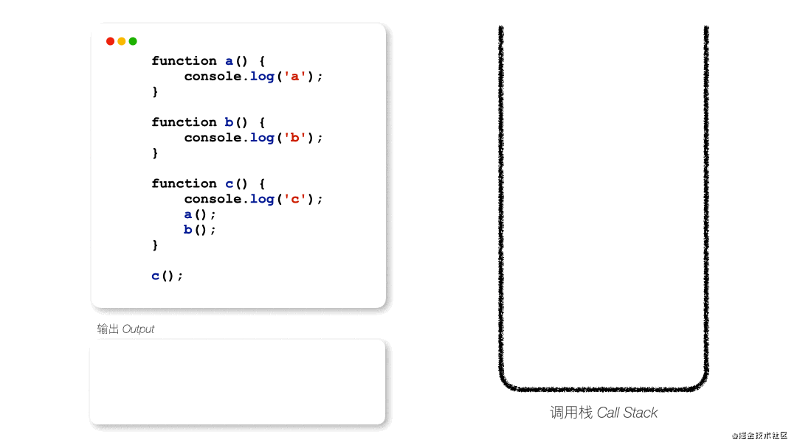

然后开始执行函数`c`，执行的第一个语句是`console.log('c')`。

因此解释器也会将其放入调用栈中。

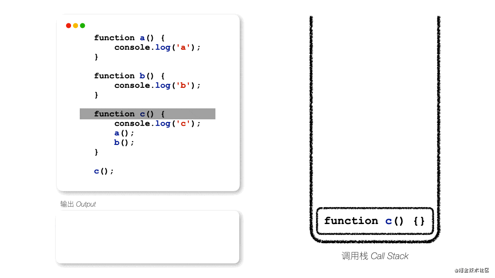

当`console.log('c')`方法执行完后，控制台打印了`'c'`，调用栈就会将其移除。

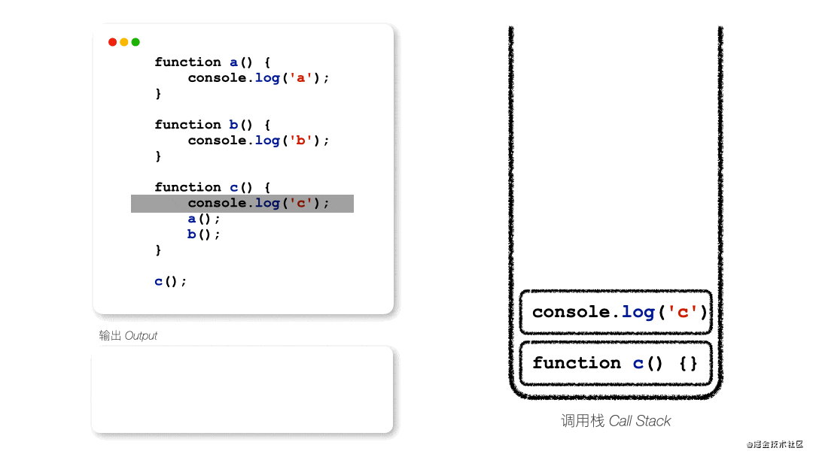

接着就是执行`a()`函数。

解释器就将`function a() {}`的执行上下文放入调用栈中。


紧接着就执行`a()`中的语句——`console.log('a')`。


当函数`a`执行结束后，调用栈就将执行上下文移除。

然后接着执行`c()`函数剩下的语句，也就是执行`b()`函数，因此它的执行上下文就加入调用栈中。

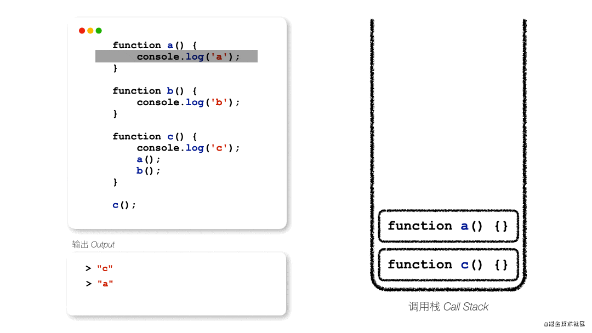

紧接着就执行`b()`中的语句——`console.log('b')`。

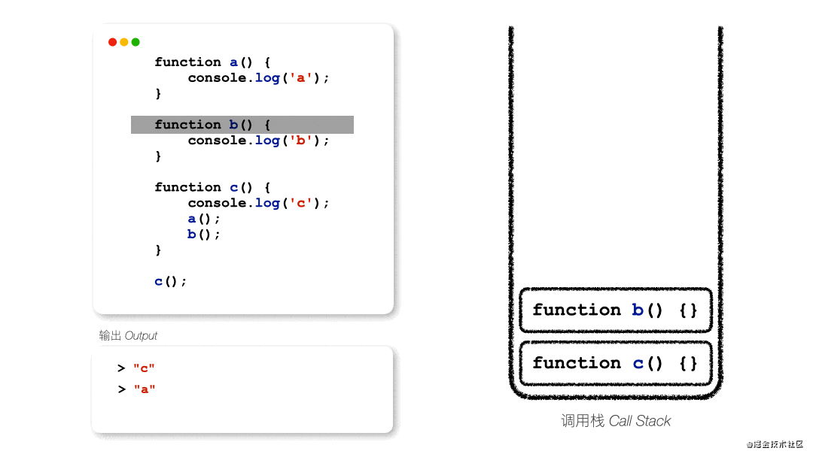

`b()`执行完后，调用栈就将其移出。

这时`c()`也执行结束了，调用栈也将其移出栈。


这时候，我们这段语句就执行结束了。

# 任务队列

上面的案例简单的介绍了关于`JavaScript`单线程的执行方式。

但这其中会存在一些问题，就是如果当一个语句也需要执行很长时间的话，比如请求数据、定时器、读取文件等等，后面的语句就得一直等着前面的语句执行结束后才会开始执行。

显而易见，这是不可取的。

## 同步任务和异步任务

因此，`JavaScript`将所有执行任务分为了同步任务和异步任务。

其实我们每个任务都是在做两件事情，就是**发起调用**和**得到结果**。

而同步任务和异步任务最主要的差别就是，同步任务发起调用后，很快就可以得到结果，而异步任务是无法立即得到结果，比如请求接口，每个接口都会有一定的响应时间，根据网速、服务器等等因素决定，再比如定时器，它需要固定时间后才会返回结果。

因此，对于同步任务和异步任务的执行机制也不同。

同步任务的执行，其实就是跟前面那个案例一样，按照代码顺序和调用顺序，支持进入调用栈中并执行，执行结束后就移除调用栈。

而异步任务的执行，首先它依旧会进入调用栈中，然后发起调用，然后解释器会将其**响应回调任务**放入一个**任务队列**，紧接着调用栈会将这个任务移除。当主线程清空后，即所有同步任务结束后，解释器会读取任务队列，并依次将**已完成的异步任务**加入调用栈中并执行。

这里有个重点，就是异步任务不是直接进入任务队列的。

这里举一个简单的例子。

```javascript
console.log(1)

fetch('https://jsonplaceholder.typicode.com/todos/1')
  .then((response) => response.json())
  .then((json) => console.log(json))

console.log(2)
```

很显然，`fetch()`就是一个异步任务。

但执行到`console.log(2)`之前，其实`fetch()`已经被调用且发起请求了，但是还未响应数据。而响应数据和处理数据的函数`then()`此时已经在**任务队列**中，等候`console.log(2)`执行结束后，所以同步任务清空后，再进入调用栈执行响应动作。

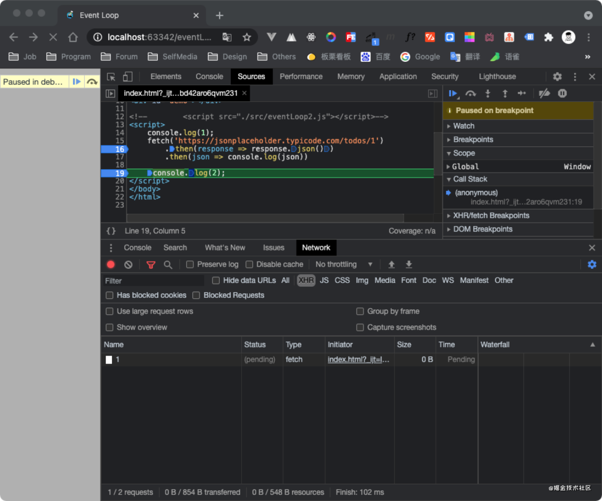

## 宏任务和微任务

前面聊到同步任务和异步任务的时候，提及到了**任务队列**。

在任务队列中，其实还分为**宏任务队列（Task Queue）**和**微任务队列（Microtask Queue）**，对应的里面存放的就是**宏任务**和**微任务**。

首先，**宏任务和微任务都是异步任务。**

而宏任务和微任务的区别，就是它们执行的顺序，这也是为什么要区分宏任务和微任务。

在同步任务中，任务的执行都是按照代码顺序执行的，而异步任务的执行也是需要按顺序的，队列的属性就是**先进先出（FIFO，First in First Out）**，因此异步任务会按照进入队列的顺序依次执行。

但在一些场景下，如果只按照进入队列的顺序依次执行的话，也会出问题。比如队列先进入一个一小时的定时器，接着再进入一个请求接口函数，而如果根据进入队列的顺序执行的话，请求接口函数可能需要一个小时后才会响应数据。

因此浏览器就会将异步任务分为宏任务和微任务，然后按照事件循环的机制去执行，因此不同的任务会有不同的执行优先级，具体会在事件循环讲到。

#### 任务入队

这里还有一个知识点，就是关于任务入队。

任务进入任务队列，其实会利用到浏览器的其他线程。虽然说`JavaScript`是单线程语言，但是浏览器不是单线程的。而不同的线程就会对不同的事件进行处理，当对应事件可以执行的时候，对应线程就会将其放入任务队列。

- **js 引擎线程**：用于解释执行 js 代码、用户输入、网络请求等；
- **GUI 渲染线程**：绘制用户界面，与 JS 主线程互斥（因为 js 可以操作 DOM，进而会影响到 GUI 的渲染结果）；
- **http 异步网络请求线程**：处理用户的 get、post 等请求，等返回结果后将回调函数推入到任务队列；
- **定时触发器线程**：`setInterval`、`setTimeout`等待时间结束后，会把执行函数推入任务队列中；
- **浏览器事件处理线程**：将`click`、`mouse`等 UI 交互事件发生后，将要执行的回调函数放入到事件队列中。

这个其实就可以解释了下列代码为什么后面的定时器会比前面的定时器先执行。因为后者的定时器会先被推进宏任务队列，而前者会之后到点了再被推入宏任务队列。

```javascript
setTimeout(() => {
  console.log('a')
}, 10000)

setTimeout(() => {
  console.log('b')
}, 100)
```

#### 宏任务

|                       | 浏览器 | Node |
| :-------------------- | :----: | :--: |
| 整体代码(script)      |   ✅   |  ✅  |
| UI 交互事件           |   ✅   |  ❌  |
| I/O                   |   ✅   |  ✅  |
| setTimeout            |   ✅   |  ✅  |
| setInterval           |   ✅   |  ✅  |
| setImmediate          |   ❌   |  ✅  |
| requestAnimationFrame |   ✅   |  ❌  |

#### 微任务

|                            | 浏览器 | Node |
| :------------------------- | :----: | :--: |
| process.nextTick           |   ❌   |  ✅  |
| MutationObserver           |   ✅   |  ❌  |
| Promise.then catch finally |   ✅   |  ✅  |

# 事件循环 Event Loop

其实宏任务队列和微任务队列的执行，就是事件循环的一部分了，所以放在这里一起说。

事件循环的具体流程如下：

1. 从宏任务队列中，按照**入队顺序**，找到第一个执行的宏任务，放入调用栈，开始执行；
2. 执行完**该宏任务**下所有同步任务后，即调用栈清空后，该宏任务被推出宏任务队列，然后微任务队列开始按照入队顺序，依次执行其中的微任务，**直至微任务队列清空为止**；
3. 当微任务队列清空后，一个事件循环结束；
4. 接着从宏任务队列中，找到下一个执行的宏任务，开始第二个事件循环，直至宏任务队列清空为止。

这里有几个重点：

- 当我们第一次执行的时候，解释器会将整体代码`script`放入宏任务队列中，因此事件循环是从第一个宏任务开始的；
- 如果在执行微任务的过程中，产生新的微任务添加到微任务队列中，也需要一起清空；微任务队列没清空之前，是不会执行下一个宏任务的。

接下来，通过一个常见的面试题例子来模拟一下事件循环。

```javascript
console.log('a')

setTimeout(function () {
  console.log('b')
}, 0)

new Promise((resolve) => {
  console.log('c')
  resolve()
})
  .then(function () {
    console.log('d')
  })
  .then(function () {
    console.log('e')
  })

console.log('f')

/**
 * 输出结果：a c f d e b
 */
```

首先，当代码执行的时候，整体代码`script`被推入宏任务队列中，并开始执行该宏任务。


按照代码顺序，首先执行`console.log("a")`。

该函数上下文被推入调用栈，执行完后，即移除调用栈。

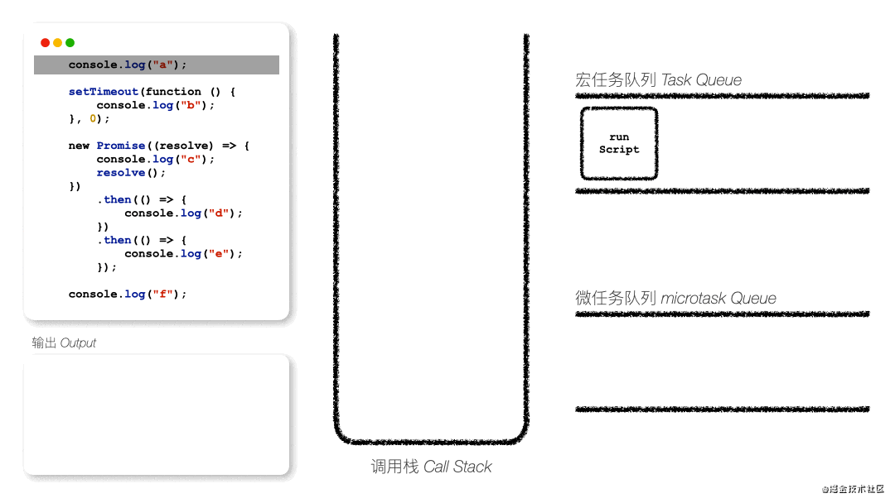

接下来执行`setTimeout()`，该函数上下文也进入调用栈中。


因为`setTimeout`是一个宏任务，因此将其`callback`函数推入宏任务队列中，然后该函数就被移除调用栈，继续往下执行。

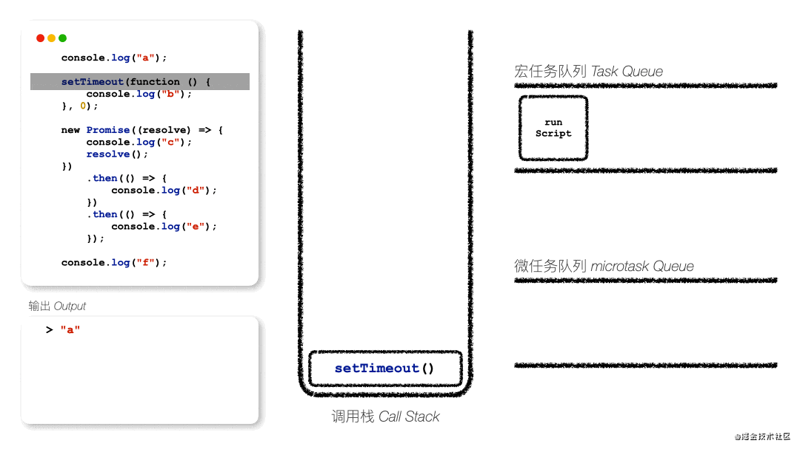

紧接着是`Promise`语句，先将其放入调用栈，然后接着往下执行。


执行`console.log("c")`和`resolve()`，这里就不多说了。


接着来到`new Promise().then()`方法，这是一个微任务，因此将其推入微任务队列中。

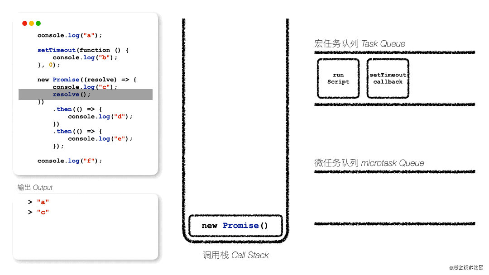

这时`new Promise`语句已经执行结束了，就被移除调用栈。

接着做执行`console.log('f')`。

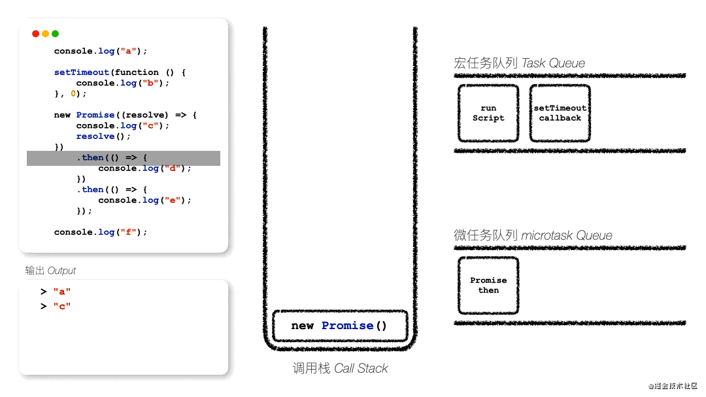

这时候，`script`宏任务已经执行结束了，因此被推出宏任务队列。

紧接着开始清空微任务队列了。首先执行的是`Promise then`，因此它被推入调用栈中。

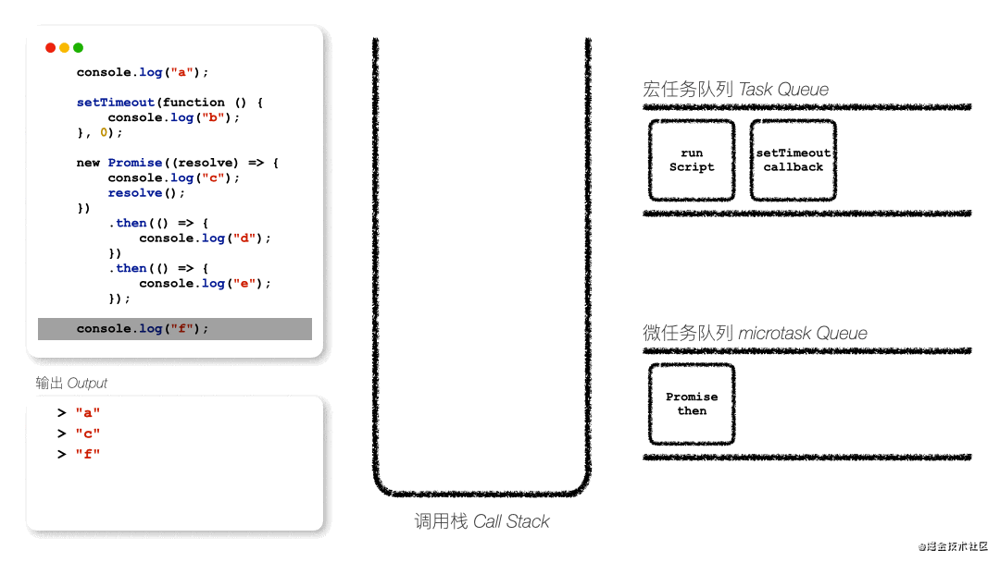

然后开始执行其中的`console.log("d")`。


执行结束后，检测到后面还有一个`then()`函数，因此将其推入微任务队列中。

此时第一个`then()`函数已经执行结束了，就会移除调用栈和微任务队列。

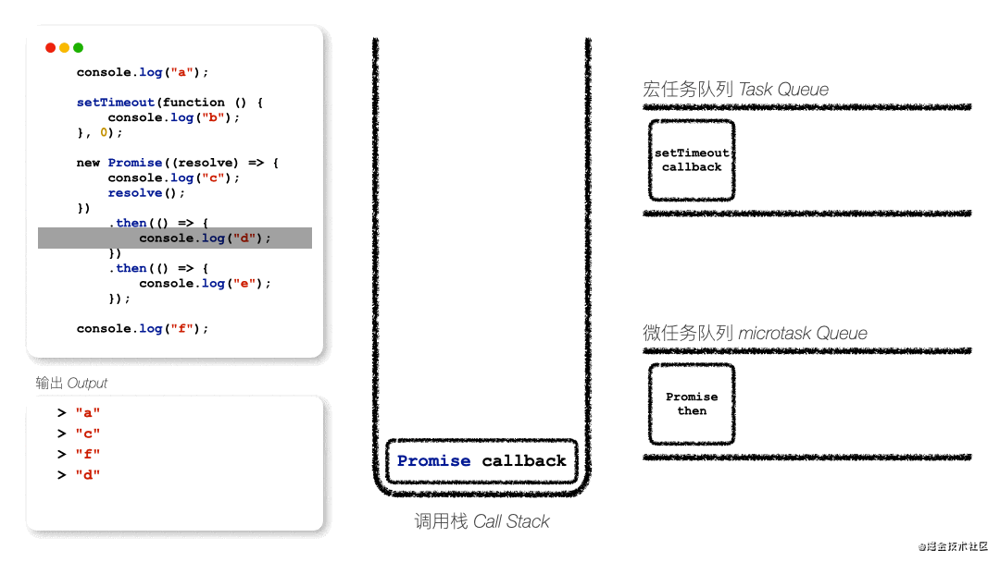

此时微任务队列还没被清空，因此继续执行下一个微任务。

执行过程跟前面差不多，就不多说了。

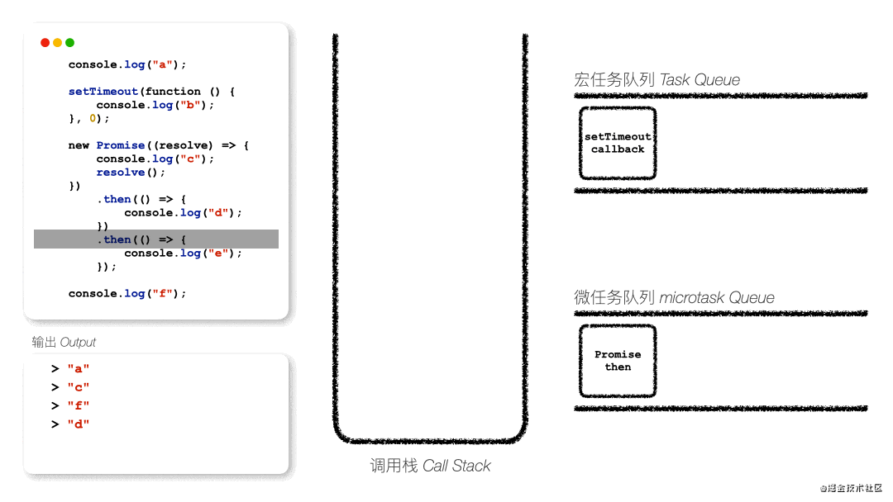

此时微任务队列已经清空了，第一个事件循环已经结束了。

接下来执行下一个宏任务，即`setTimeout callback`。

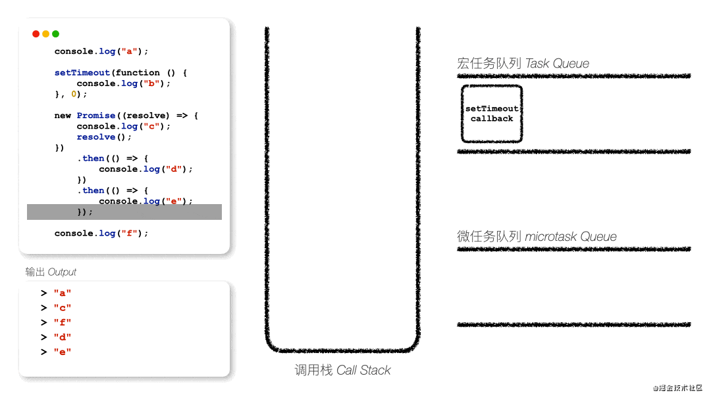

执行结束后，它也被移除宏任务队列和调用栈。

这时候微任务队列里面没有任务，因此第二个事件循环也结束了。

宏任务也被清空了，因此这段代码已经执行结束了。

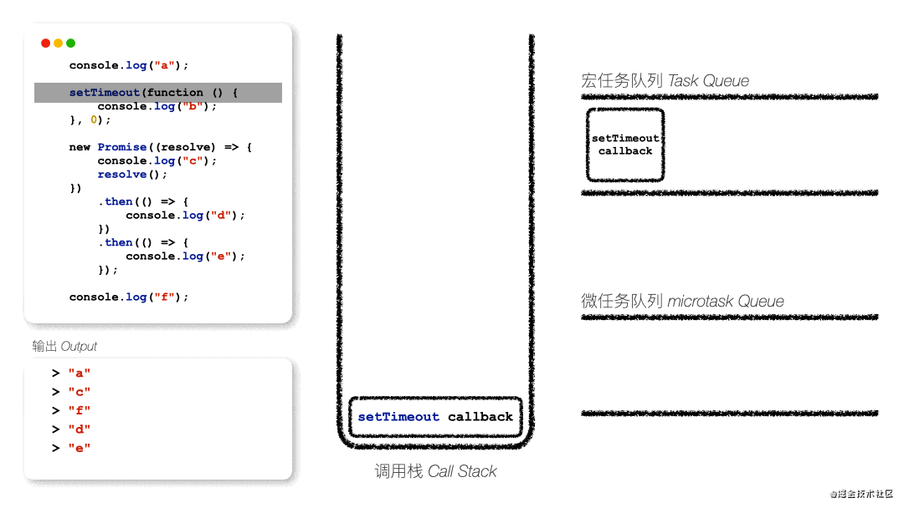

# await

ECMAScript2017 中添加了`async functions`和`await`。

`async`关键字是将一个同步函数变成一个异步函数，并将返回值变为`promise`。

而`await`可以放在任何异步的、基于`promise`的函数之前。在执行过程中，它会暂停代码在该行上，直到`promise`完成，然后返回结果值。而在暂停的同时，其他正在等待执行的代码就有机会执行了。

下面通过一个例子来体验一下。

```javascript
async function async1() {
  console.log('a')
  const res = await async2()
  console.log('b')
}

async function async2() {
  console.log('c')
  return 2
}

console.log('d')

setTimeout(() => {
  console.log('e')
}, 0)

async1().then((res) => {
  console.log('f')
})

new Promise((resolve) => {
  console.log('g')
  resolve()
}).then(() => {
  console.log('h')
})

console.log('i')

/**
 * 输出结果：d a c g i b h f e
 */
```

首先，开始执行前，将整体代码`script`放入宏任务队列中，并开始执行。

第一个执行的是`console.log("d")`。


紧接着是`setTimeout`，将其回调放入宏任务中，然后继续执行。

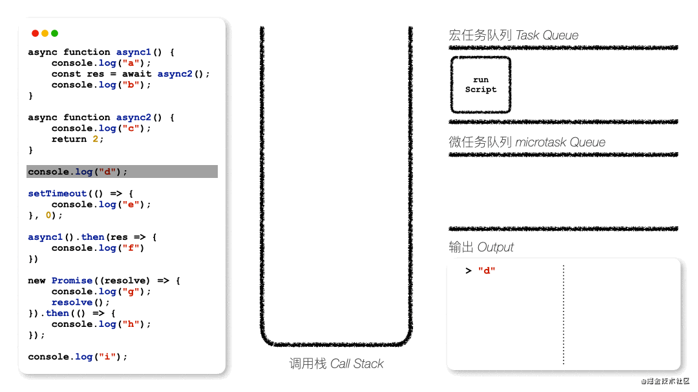

紧接着是调用`async1()`函数，因此将其函数上下文放置到调用栈。

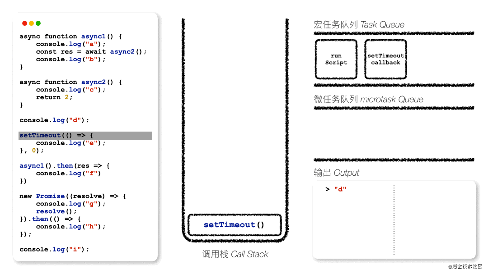

然后开始执行`async1`中的`console.log("a")`。

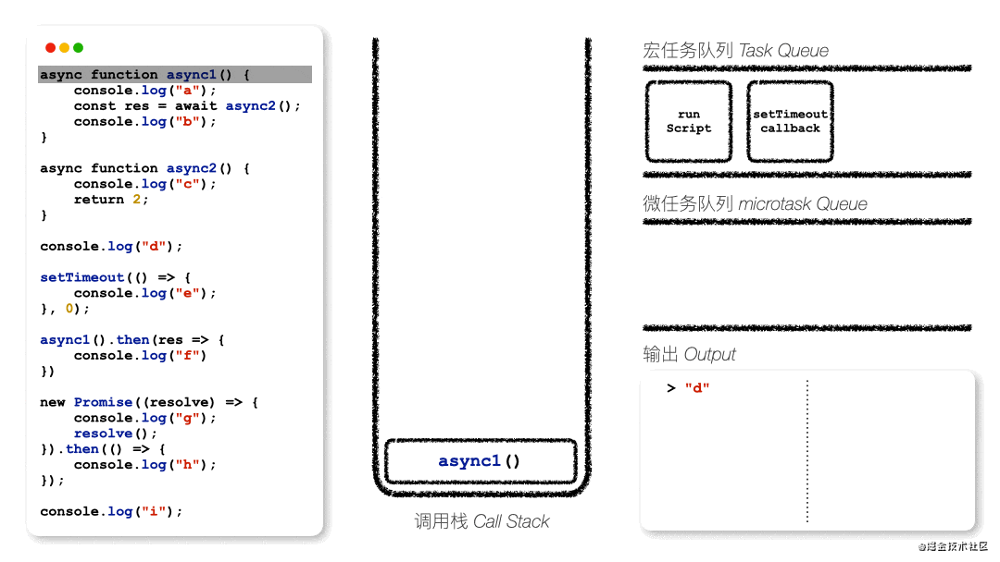

接下来就是`await`关键字语句。

`await`后面调用的是`async2`函数，因此我们将其放入调用栈。


然后开始执行`async2`中的`console.log("c")`，并`return`一个值。

执行完成后，`async2`就被移出调用栈。


这时候，`await`会阻塞`async2`的返回值，先跳出`async1`进行往下执行。

需要注意的是，现在`async1`中的`res`变量，还是`undefined`，没有赋值。

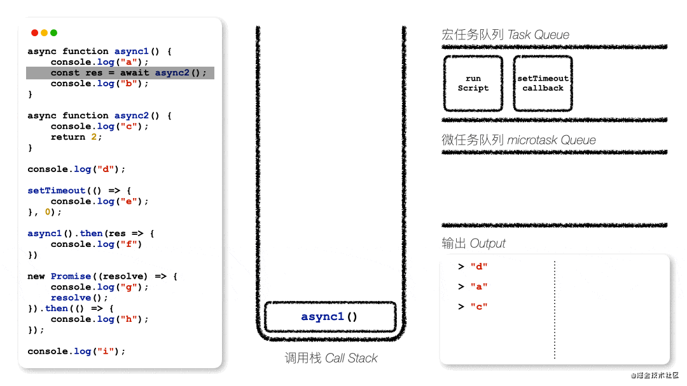

紧接着是执行`new Promise`。

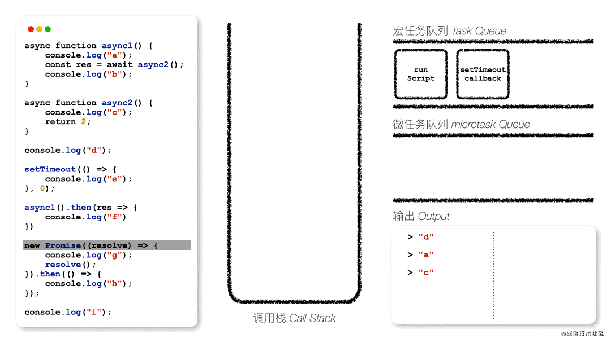

执行`console.log("i")`。


这时，`async1`外面的同步任务都执行完成了，因此就重新回到前面阻塞的位置，进行往下执行。

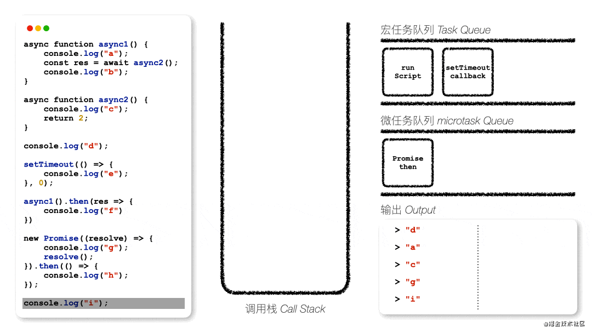

这时`res`成功赋值了`async2`的结果值，然后往下执行`console.log("b")`。


这时候`async1`才算是执行结束，紧接着再将其调用的`then()`函数放入微任务队列中。


这时`script`宏任务已经全部执行完了，开始准备清空微任务队列了。

第一个被执行的微任务队列是`promise then`，也就是将执行其中的`console.log("h")`语句。

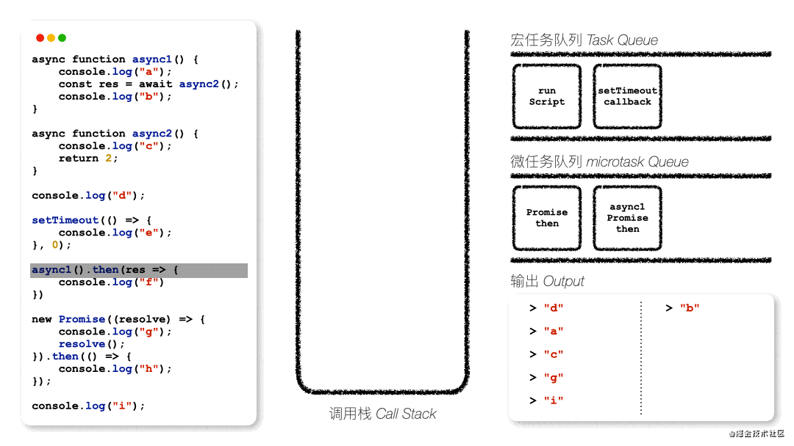

执行完`Promise then`微任务后，紧接着开始执行`async1`的`promise then`微任务。

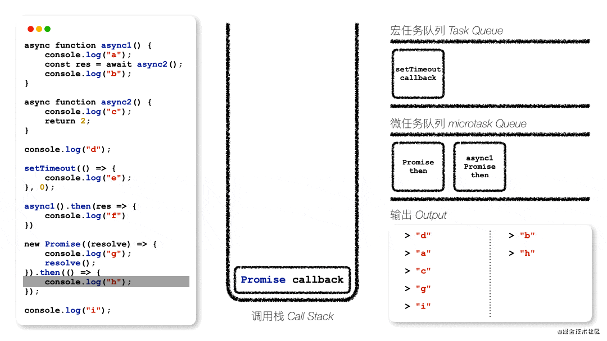

这时候微任务队列已经清空了，即开始执行下一个宏任务。

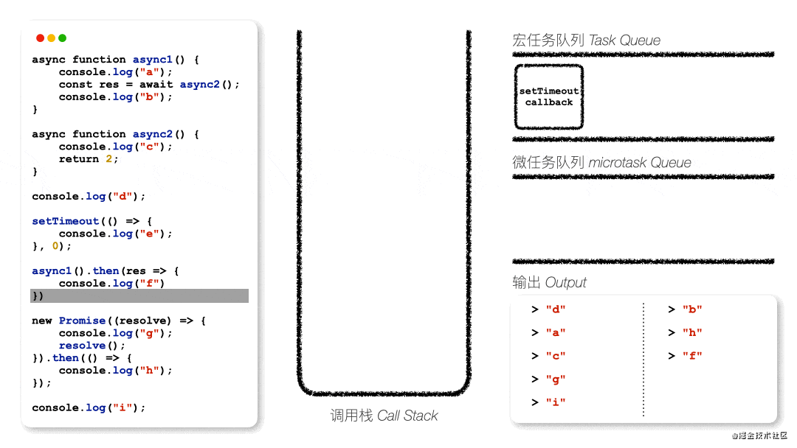

# 页面渲染

最后来讲将事件循环中的页面更新渲染，这也是`Vue`中异步更新的逻辑所在。

每次当一次事件循环结束后，即一个宏任务执行完成后以及微任务队列被清空后，浏览器就会进行一次页面更新渲染。

通常我们浏览器页面刷新频率是 60fps，也就是意味着 16.67ms 要刷新一次，因此我们也要尽量保证一次事件循环控制在 16.67ms 之内，这也是我们需要做代码性能优化的一个原因。

接下来还是通过一个案例来看一下。

```html
<!DOCTYPE html>
<html lang="en">
  <head>
    <meta charset="UTF-8" />
    <meta http-equiv="X-UA-Compatible" content="IE=edge" />
    <meta name="viewport" content="width=device-width, initial-scale=1.0" />
    <title>Event Loop</title>
  </head>
  <body>
    <div id="demo"></div>

    <script src="./src/render1.js"></script>
    <script src="./src/render2.js"></script>
  </body>
</html>
```

```javascript
// render1
const demoEl = document.getElementById('demo')

console.log('a')

setTimeout(() => {
  alert('渲染完成！')
  console.log('b')
}, 0)

new Promise((resolve) => {
  console.log('c')
  resolve()
}).then(() => {
  console.log('d')
  alert('开始渲染！')
})

console.log('e')
demoEl.innerText = 'Hello World!'
```

```javascript
// render2
console.log('f')

demoEl.innerText = 'Hi World!'
alert('第二次渲染！')
```

根据`HTML`的执行顺序，第一个被执行的`JavaScript`代码是`render1.js`，因此解释器将其推入宏任务队列，并开始执行。

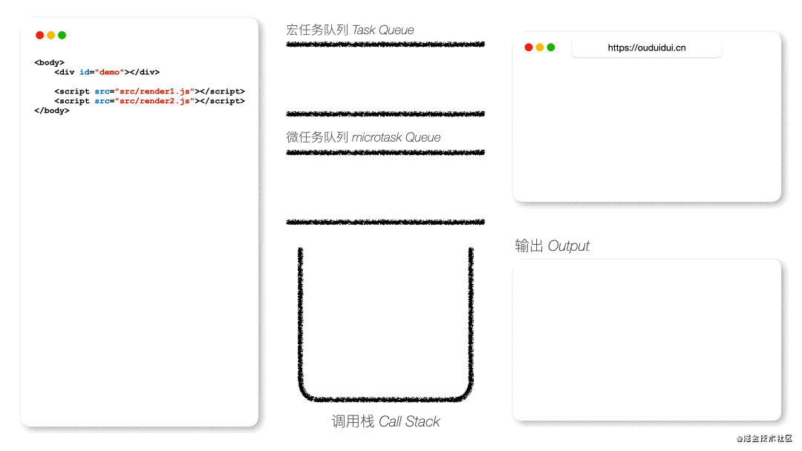

第一个被执行的是`console.log("a")`。

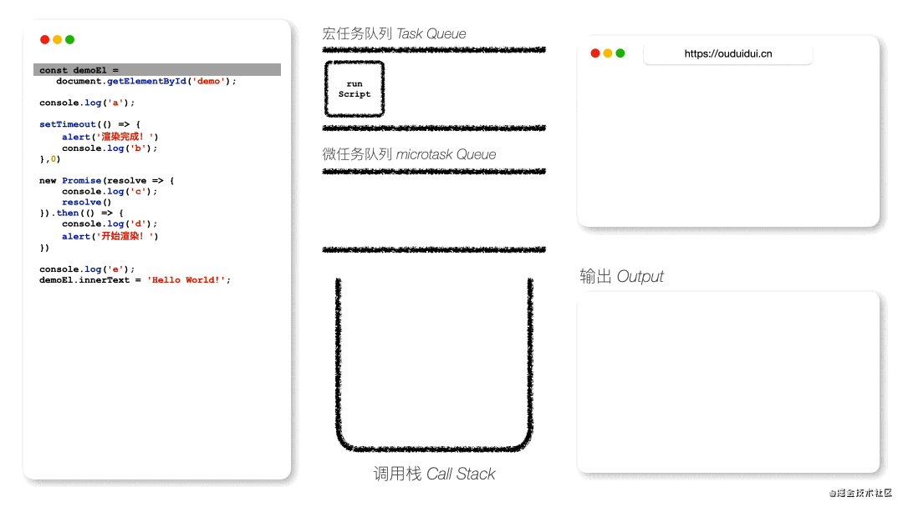

其次是`setTimeout`，并将其回调加入宏任务队列中。


紧接着执行`new Promise`。


同样，将其`then()`推入微任务队列中去。

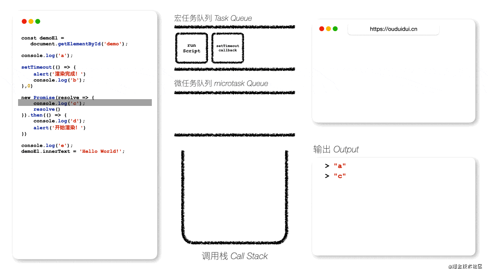

紧接着执行`console.log("e")`。


最后，修改 DOM 节点的文本内容，但是这时候页面还不会更新渲染。

这时候`script`宏任务也执行结束了。

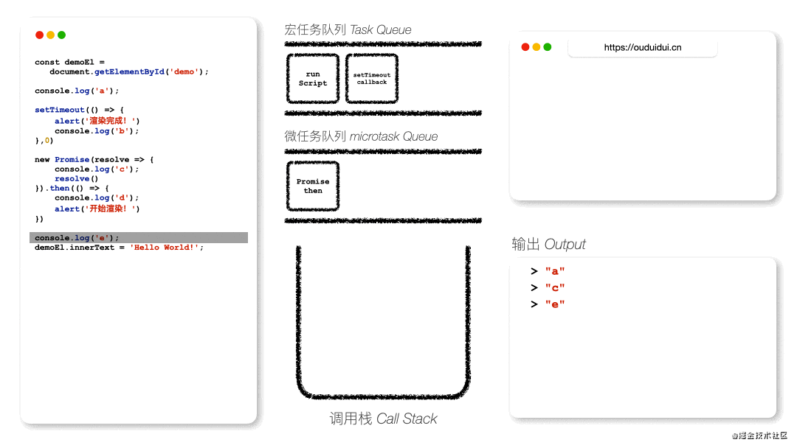

紧接着，开始清空微任务队列，执行`Promise then`。


这时候，`alert`一个通知，而这个语句结束后，则微任务队列清空，代表第一个事件循环结束，即将要开始渲染页面了。

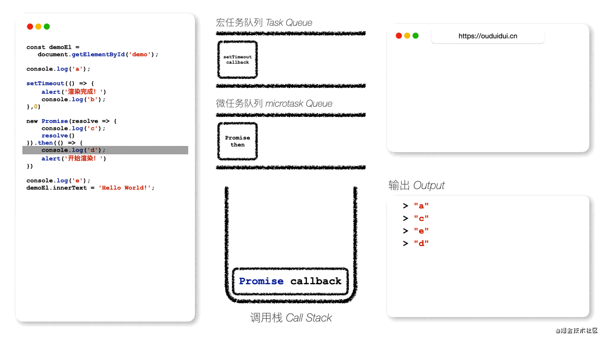

当点击关闭`alert`后，事件循环结束，页面也开始渲染。


渲染结束后，就开始执行下一个宏任务，即`setTimeout callback`。

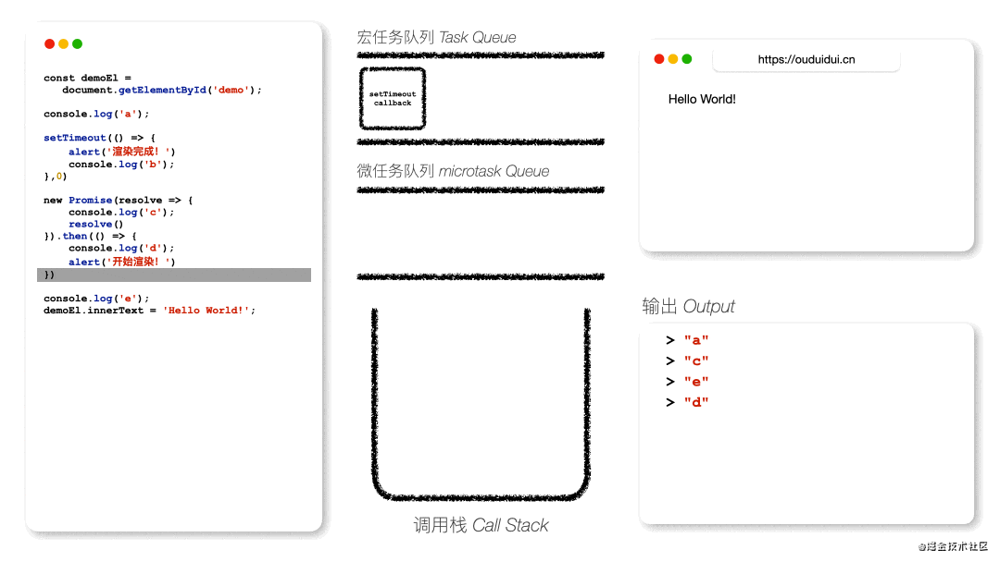

紧接着执行`console.log("b")`。


这时候宏任务队列已清空了，但是`html`文件还没执行结束，因此进入`render2.js`继续执行。


首先执行`console.log('f')`。

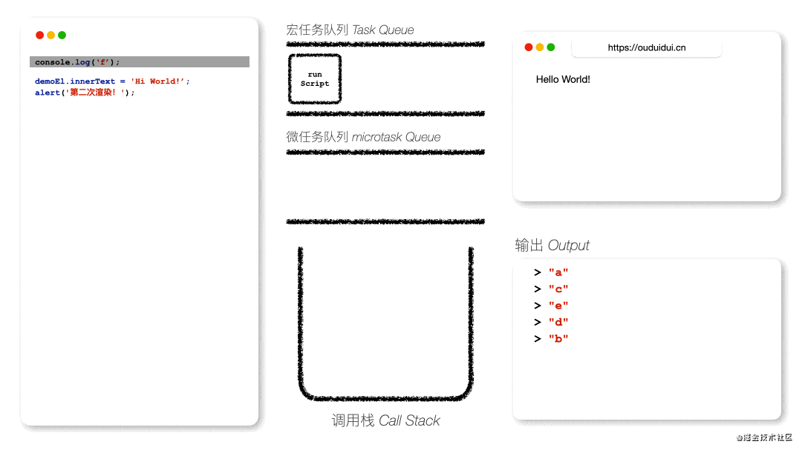

紧接着，再次修改节点的文本信息，此时依旧不会更新页面渲染。

接着执行`alert`语句，当关闭`alert`通知后，该宏任务结束，微任务队列也为空，因此该事件循环也结束了，这时候就开始第二次页面更新。


但如果将所有`JavaScript`代码使用内嵌方式的话，浏览器会先把两个`script`丢到宏任务队列中去，因此执行的顺序也会不一样，这里就不一一推导了。

```html
<!DOCTYPE html>
<html lang="en">
  <head>
    <meta charset="UTF-8" />
    <meta http-equiv="X-UA-Compatible" content="IE=edge" />
    <meta name="viewport" content="width=device-width, initial-scale=1.0" />
    <title>Event Loop</title>
  </head>
  <body>
    <div id="demo"></div>

    <script>
      const demoEl = document.getElementById('demo')

      console.log('a')

      setTimeout(() => {
        alert('渲染完成！')
        console.log('b')
      }, 0)

      new Promise((resolve) => {
        console.log('c')
        resolve()
      }).then(() => {
        console.log('d')
        alert('开始渲染！')
      })

      console.log('e')
      demoEl.innerText = 'Hello World!'
    </script>
    <script>
      console.log('f')

      demoEl.innerText = 'Hi World!'
      alert('第二次渲染！')
    </script>
  </body>
</html>
输出：a c e d "开始渲染！" f "第二次渲染！" "渲染完成！" b
```
