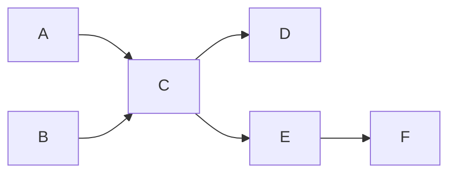

**【2009 统考真题】**三个进程 P~·~，P~2~，P~3~ 互斥使用一个包含 N(N>0) 个单元的缓冲区。P~1~ 每次用 produce() 生成一个正整数并用 put() 送入缓冲区某一空单元；P~2~ 每次用 getodd() 从该缓冲区中取出一个奇数并用 countodd() 统计奇数个数；P~3~ 每次用 geteven() 从该缓冲区中取出一个偶数并用 counteven() 统计偶数个数。请用信号量机制实现这三个进程的同步与互斥活动，并说明所定义的信号量的含义（要求用伪代码描述）。

【解答】

互斥资源：缓冲区只能互斥访问，因此设置互斥信号量 mutex。

同步问题：P~1~，P~2~ 因为奇数的放置与取用而同步，设同步信号量 odd；P~1~，P~3~ 因为偶数的放置与取用而同步，设置同步信号量 even；P~1~，P~2~，P~3~ 因为共享缓冲区，设置同步信号量 empty，初值为 N。程序如下：

```c
semaphore mutex=1;											 	// 缓冲区操作互斥信号量
semaphore odd=0, even=0;									// 奇数、偶数进程的同步信号量
semaphore empty=N;										    // 空缓冲区单元个数信号量
cobegin{
  Process P1()
  while(true){
    x=produce();
    P(empty);
    P(mutex);
    Put();
    V(mutex);
    if(x%2==0)
      V(even);
    else
      V(odd);
  }
  Process P2()
  while(true){
    P(odd);
    P(mutex);
    getodd();
    V(mutex);
    V(empty);
    countodd();
  }
  Process P3()
  while(true){
    P(even);
    P(mutex);
    geteven();
    V(mutex);
    V(empty);
    counteven();
  }
}coend
```

---

**【2011 统考真题】**某银行提供 1 个服务窗口和 10 个供顾客等待的座位。顾客到达银行时，若有空座位，则到取号机上领取一个号，等待叫号。取号机每次仅允许一位顾客使用。当营业员空闲时，通过叫号选取一位顾客，并为其服务。顾客和营业员的活动过程描述如下：

```c
cobegin{
  process 顾客 i{
    从取号机获取一个号码;
    等待叫号;
    获取服务;
  }
  process 营业员{
    while(true){
      叫号;
      为客户服务;
    }
  }
}coend
```

请添加必要的信号量和 P，V[或 wait(),signal()] 操作，实现上述过程中的互斥与同步。要求写出完成的过程，说明信号量的含义并赋初值。

【解答】

互斥资源：取号机（一次只有一位顾客领号），因此设置互斥信号量 mutex。

同步问题：顾客需要获得空座位等待叫号。营业员空闲时，将选取一位顾客并为其服务。空位的有无、无影响等待顾客的数量，顾客的有无决定了营业员是否能开始服务，因此分别设置信号量 empty 和 full 来实现这一同步关系。另外，顾客获得空座位后，需要等待叫号和被服务。这样，顾客与营业员就又构成了一个同步关系，定义信号量 service 来完成这一同步过程。

```c
semaphore empty=10;						// 空座位的数量，初值为10
semaphore mutex=1;						// 互斥使用取号机
semaphore full=0;							// 已占座位的数量，初值为0
semaphore service=0;					// 等待叫号
cobegin{
  Process 顾客 i{
    P(empty);									// 等空位
    P(mutex);									// 申请使用取号机
    从取号机上取号;
    V(mutex);									// 取号完毕
    V(full);									// 通知营业员有新顾客
    P(service);								// 等待营业员叫号
    接受服务;
  }
  Process 营业员{
    P(full);									// 没有顾客则休息
    V(empty);									// 离开座位
    V(service);								// 叫号
    为顾客服务
  }
}
```

---

**【2013 统考真题】**某博物馆最多可容纳 500 人同时参观，有一个出入口，该出入口一次仅允许一人通过。参观者的活动描述如下：

```c
cobegin
  参观者进程 i
  {
		...
    进门
   	...
    参观;
  	...
    出门
    ...
  }
coend
```

请添加必要的信号量和 P，V[或 wait(),signal()] 操作，实现上述过程中的互斥与同步。要求写出完成的过程，说明信号量的含义并赋初值。

【解答】

出入口一次仅允许一个人通过，设置互斥信号量 mutex，初值为 1。博物馆最多可同时容纳 500 人，因此设置信号量 empty，初值为 500。

```c
semaphore empty=500;						// 博物馆可以容纳的最多人数
semaphore mutex=1;							// 用于出入口资源的控制
cobegin
参观者进程 i
{
  ...
  P(empty);
  P(mutex);
  进门;
  V(mutex);
  参观;
  P(mutex);
  出门;
  V(mutex);
  V(empty);
  ...
}coend
```

---

**【2014 统考真题】**系统中有多个生产者进程和多个消费者进程，共享一个能存放 1000 件产品的环形缓冲区（初始为空）。缓冲区未满时，生产者进程可以放入其生产的一件产品，否则等待；缓冲区未空时，消费者进程可以从缓冲区取走一件产品，否则等待。要求一个消费者进程从缓冲区连续取出 10 件产品后，其他消费者进程才可以取产品。请使用信号量 P, V(wait(), signal()) 操作实现进程间的互斥与同步，要求写出完成的过程，并说明所用信号量的含义和初值。

【解答】

这是典型的生产者和消费者问题，只对典型问题加了一个条件，只需在标准模型上新加一个信号量，即可完成指定要求。

设置 4 个变量 mutex1，mutex2，empty 和 full，mutex1 用于控制一个消费者进程在一个周期（10 次）内对缓冲区的访问，初值为 1；mutex2 用于控制进程单次互斥地访问缓冲区，初值为 1；empty 代表缓冲区的空位数，初值为 1000；full 代表缓冲区的产品数，初值为 0，具体进程描述如下：

```c
semaphore mutex1;
semaphore mutex2;
semaphore empty=1000;
semaphore full=0;
producer(){
  while(1){
    生产一个产品;
    P(empty);
    P(mutex2);
    把产品放入缓冲区;
    V(mutex2);
    V(full);
  }
}
consumer(){
  while(1){
    P(mutex1);
    for(int i=0;i<10;i++){
      P(full);
      P(mutex2);
      从缓冲区取出一件产品;
      V(mutex2);
      V(empty);
      消费这件产品;
    }
    V(mutex1)
  }
}
```

---

**【2015 统考真题】**有 A，B 两人通过信箱进行辩论，每个人都从自己的信箱中取得对方的问题。将答案和向对方提出的新问题组成一个邮件放入对方的邮箱中。假设 A 的信箱最多放 M 个邮件，B 的信箱最多放 N 个邮件。初始时 A 的信箱中有 x 个邮件(0<x<M)，B 的信箱中有 y 个邮件(0<y<N)。辩论者每取出一个邮件，邮件数减 1。A 和 B 两人的操作过程描述如下：

```c
CoBegin
A{																	B{
  while(TRUE){											 	 while(TRUE){
    从A的信箱取出一个邮件;								 	从B的信箱取出一个邮件;
    回答问题并提出一个新问题;								 回答问题并提出一个新问题;
    将新邮件放入B的信箱;										 将新邮件放入A的信箱;
  }
}																		}
CoEnd
```

当信箱不为空时，辩论者才能从信箱中取邮件，否则等待。当信箱不满时，辩论者才能将新邮件放入信箱，否则等待。请添加必要的信号量和 P，V[或 wait(),signal()] 操作，实现上述过程中的互斥与同步。要求写出完成的过程，说明信号量的含义并赋初值。

【解答】

```c
semaphore Full_A=x;						// 表示A的信箱中的邮件数量
semaphore Empty_A=M-x;				// 表示A的信箱中还可存放的邮件数量
semaphore Full_B=y;						// 表示B的信箱中的邮件数量
semaphore Empty_A=N-y;				// 表示B的信箱中还可以存放的邮件数量
semaphore mutex_A=1;					// 用于A的信箱互斥
semaphore mutex_B=1;					// 用于B的信箱互斥
A{
  while(TRUE){
    P(Full_A);
    P(mutex_A);
    从A的信箱中取出一个邮件;
    V(mutex_A);
    V(Empty_A);
    回答问题并提出一个新的问题;
    P(Empty_B);
    P(mutex_B);
    将新邮件放入B的信箱;
    V(mutex_B);
    V(Full_B);
  }
}
B{
  while(TRUE){
    P(Full_B);
    P(mutex_B);
    从B的信箱中取出一个邮件;
    V(mutex_B);
    V(Empty_B);
    回答问题并提出一个新的问题;
    P(Empty_A);
    P(mutex_A);
    将新邮件放入B的信箱;
    V(mutex_A);
    V(Full_A);
  }
}
```

---

**【2017 统考真题】**某进程中有 3 个并发执行的线程 thread1，thread2 和 thread3，其伪代码如下所示。


请添加必要的信号量和 P，V[或 wait(),signal()] 操作，要求确保线程互斥访问临界资源，并且最大限度地并发执行。

【解答】

先找出线程对在各个变量上的互斥、并发关系。若为一读一写或两个都为写，则为互斥关系。每个互斥关系都需要一个信号量进行调节。

```c
semaphore mutex_y1=1;	// 用于thread1和thread3对变量y的互斥访问
semaphore mutex_y2=1;	// 用于thread2和thread3对变量y的互斥访问
semaphore muext_z=1;	// 用于变量z的互斥访问
```


---

**【2019 统考真题】**有 n(n≥3) 名哲学家围坐在一张圆桌边，每名哲学家交替地就餐和思考。在圆桌中心有 m(m≥1)个碗，每两名哲学家之间有一根筷子。每名哲学家必须取到一个碗和两侧的筷子后，才能就餐，进餐完毕，就碗和筷子放回原位，并继续思想。为使尽可能多的哲学家同时就餐，且防止出现死锁现象，请使用信号量的 P，V[或 wait(),signal()] 操作描述上述过程中的互斥与同步，并说明信号量及初值的含义。

【解答】

传统的哲学家问题避免死锁的方法：限制至多允许 n-1 名哲学家同时 “抢” 筷子，那么至少会有 1 名哲学家可以获得两根筷子并顺利进餐，于是不可能发生死锁的情况。

本题可以用碗这个限制资源来避免死锁：当碗的数量 m 小于哲学家的数量 n 时，可以直接让碗的资源量等于 m，确保不会出现所有哲学家都拿一侧筷子而无限等待另一侧筷子进而造成死锁的情况。当碗的数量大于或等于哲学家的数量 n 时，为了让碗起到同样的限制效果，我们让碗的资源量等于 n-1，这样就能保证最多只有 n-1 名哲学家同时进餐，所以得到碗的资源量为 min{n-1, m}。在进行 PV 操作时，碗的资源量起限制哲学家取筷子的作用，所以需要对碗的资源量进行 P 操作。具体过程如下：

```c
// 信号量
semaphore bowl;									// 用于协调哲学家对碗的使用
sempahore chopsticks[n];				 // 用于协调哲学家对筷子的使用
for(int i=0;i<n;i++){
  chopstiicks[i]=1;
}
bowl=min(n-1,m);
CoBegin
while(TRUE){										// 哲学家i的程序
  思考;
  P(bowl);
  P(chopsticks[i]);
  P(chopsticks[(i+1)%n]);
  就餐;
  V(chopsticks[i]);
  V(chopsticks[(i+1)%n]);
  V(bowl);
}
CoEnd
```

---

**【2020 统考真题】**现有 5 个操作 A、B、C、D 和 E，操作 C 必须在 A 和 B 完成后执行，操作 E 必须在 C 和 D 完成后执行，请使用信号量的 wait()、signal() 操作（P、V 操作）描述上述操作之间的同步关系，并说明所用信号量及其初值。

【解答】

本题要求实现操作的先后顺序，没有互斥关系，是一个简单的同步问题。

本题虽然有 5 个操作，但是只有 4 个同步关系，因此分别设置信号量 SAC、SBC、SCE 和 SDE 对应 4 个同步关系。

```c
semaphore SAC=0;					// 控制A和C的执行顺序
semaphore SBC=0;					// 控制B和C的执行顺序
semaphore SCE=0;					// 控制C和E的执行顺序
semaphore SDE=0;					// 控制D和E的执行顺序
CoBegin
A(){
  完成动作A;
  V(SAC);
}
B(){
  完成动作B;
  V(SBC);
}
C(){
  P(SAC);
  P(SBC);
  完成动作C;
  V(SCE);
}
D(){
	完成动作D;
  V(SDE);
}
E(){
  P(SCE);
  P(SDE);
  完成动作E;
}
```

---

**【2022 统考真题】**某进程的两个线程 T1 和 T2 并发执行 A、B、C、D、E 和 F 共 6 个操作，其中 T1 执行 A 、E 和 F，T2 执行 B、C、D。下图表示上述 6 个操作的执行顺序所必须满足的约束条件：C 在 A 和 B 完成后执行，D 和 E 在 C 完成后执行， F 在 E 完成后执行。请使用信号量的 wait()、signal() 操作描述 T1 和 T2 之间的同步关系，并说明信号量的作用及初值。



【解答】

进程 T1 要依次执行 A、E、F。进程 T2 要执行 B、C、D。由图可知，T2 执行 C 必须在 T1 执行完 A 之后；T1 执行 E 必须在 T2 执行完 C 之后。因此，有两对同步关系。信号量的定义和同步关系描述如下：

```c
semaphore SAC=0;// 描述A、C之间的同步关系
semaphore SCE=0;// 描述C、E之间的同步关系
T1:{
  A;
  signal(SAC);
  wait(SCE);
  E;
  F;
}
T2:{
  B;
  wait(SAC);
  C;
  signal(SCE);
  D
}
```

---

面包师有很多面包，由 n 名销售人员推销。每名顾客进店后取一个号，并且等待叫号，当一名销售人员空闲时，就叫下一个号。试设计一个使销售人员和顾客同步的算法。

【解答】顾客进店后按序取号，并等待叫号；销售人员空闲后也按序叫号，并销售面包。因此同步算法只要对顾客取号和销售人员叫号进行合理同步即可。我们使用两个变量 i 和 j 分别记录当前的取号值和叫号值，并各自使用一个互斥信号量用于对 i 和 j 进行访问和修改。

```c
int i=0, j=0;
semaphore mutex_i=1, mutex_j=1;
Consumer(){
  进入面包店;
  P(mutex_i);
  取号 i;
  i++;
  V(mutex_i);
  等待叫号 i 并购买面包
}
Seller(){
  while(1){
    P(mutex_j);
    if(j<i){
      叫号 j;
      j++;
      V(mutex_j);
      销售面包;
    }
    else{
      V(mutex_j);
      休息片刻;
    }
  }
}
```

---

某寺庙有小和尚、老和尚若干，有一水缸，由小和尚提水入缸供老和尚引用。水缸可容 10 桶水，水取自同一井中。水井径窄，每次只能容一个桶取水。水桶总数为 3 个。每次入缸取水仅为 1 桶水，且不可同时进行。试给出有关从缸取水、入水的算法描述。

【解答】从井中取水并放入水缸是一个连续的动作，可视为一个进程；从缸中取水可视为另一个进程。设水井和水缸为临界资源，引入 well 和 vat；三个水桶无论是从井中取水还是将水倒入水缸都是一次一个，应该给它们一个信号量 pail，抢不到水桶的进程只好等待。水缸满时，不可以再放水，设置 empty 信号量来控制入水量；水缸空时，不可以取水，设置 full 信号量来控制。

```c
semaphore well=1;													// 用于互斥地访问水井
semaphore vat=1;													// 用于互斥地访问水缸
semaphore empty=10;												// 用于表示水缸中剩余空间能容纳的水的桶数
semaphore full =0;												// 表示水缸中的水的桶数
semaphore pail=3;													// 表示有多少个水桶可以用，初值为3
// 老和尚
while(1){
  P(full);
  P(pail);
  P(vat);
  从水缸中打一桶水;
  V(vat);
  V(empty);
  喝水;
  V(pail);
}
// 小和尚
while(1){
  P(empty);
  P(pail);
  P(well);
  从井中打一桶水;
  V(well);
  P(vat);
  将水倒入水缸中;
  V(vat);
  V(full);
  V(pail);
}
```
