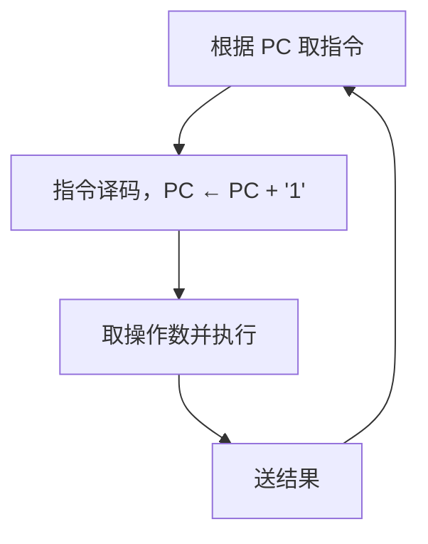

# 计算机组成原理

## 第 1 章 计算机系统概述

### 1.1 计算机发展历程

#### 1.1.1 计算机硬件的发展

<font size=2>新大纲中已删除，仅供学习时参考</font>

**1. 计算机的四代变化**

从 1946 年世界上第一台电子数字计算机（Electronic Numerical Integrator And Computer，ENIAC）问世以来，计算机的发展已经经历了四代。

1）第一代计算机（1946-1957 年）——电子管时代。特点：逻辑元件采用电子管：使用机器语言进行编程；主存用延迟线或磁鼓存储信息，容量极小；体积庞大，成本高；运算速度较低，一般只有几千次到几万次每秒。

2）第二代计算机（1958-1964 年）——晶体管时代。特点：逻辑元件采用晶体管；运算速度提高到几万次到几十万次每秒；主存使用磁芯存储器；计算机软件也得到了发展，开始出现了高级语言及其编译程序，有了操作系统的雏形。

3）第三代计算机（1965-1971 年）——中小规模集成电路时代。特点：逻辑元件采用中小规模集成电路；半导体存储器开始取代磁芯存储器；高级语言发展迅速，操作系统也进一步发展，开始有了分时操作系统。

4）第四代计算机（1972 年至今）——超大规模集成电路时代。特点：逻辑元件采用大规模集成电路和超大规模集成电路，产生了微处理器；诸如并行、流水线、高速缓存和虚拟存储器等概念用在了这代计算机中。

**2. 计算机元件的更新换代**

1）摩尔定律。当价格不变时，集成电路上可容纳的晶体管数目，约每隔 18 个月便会增加一倍，性能也将提升一倍。也就是说，我们现在和 18 个月后花同样的钱买到的 CPU，后者的性能是前者的两倍。这一定律揭示了信息技术进步的速度。

2）半导体存储器的发展。1970 年，仙童半导体公司生产出第一个较大容量的半导体存储器，至今，半导体存储器经历了 11 代：单芯片 1KB、4KB、16KB、64KB、256KB、1MB、4MB、16MB、64MB、256MB 和现在的 1GB。

3）微处理器的发展。自 1971 年 Intel 公司开发出第一个微处理器 Intel 4004 至今，微处理器经历了 Intel 8008（8 位）、Intel 8080（8 位）、Intel 8086（16 位）、Intel 8088（16 位）、Intel 80286（16 位）、Intel 80386（32 位）、Intel 80486（32 位）、Pentium（32 位）、Pentium pro（64 位）、Pentium II（64 位）、Pentium III（64 位）、Pentium 4（64 位）等。这里的 32 位、64 位指的是机器字长，是指计算机运行一次整数运算所能处理的二进制数据的位数。

#### 1.1.2 计算机软件的发展

计算机软件技术的蓬勃发展，也为计算机系统的发展做出了很大的贡献。

计算机语言的发展经历了面向机器语言和汇编语言、面向问题的高级语言。其中高级语言的发展真正促进了软件的发展，它经历了从科学计算和工程计算的 FORTRAN、结构化程序设计的 PASCAL 到面向对象的 C++ 和适应网络环境的 Java。

与此同时，直接影响计算机系统性能提升的各种系统软件也有了长足的发展，特别是操作系统，如 Windows、UNIX、Linux 等。

#### 1.1.3 计算机的分类与发展方向

电子计算机可分为电子模拟计算机和电子数字计算机。

数字计算机又可按用途分为专用计算机和通用计算机。这是根据计算机的效率、速度、价格及运行的经济性和适应性来划分的。

通用计算机又分为巨型机、大型机、中型机、小型机、微型机和单片机 6 类，它们的体积、功耗、性能、数据存储量、指令系统的复杂程度和价格依次递减。

此外，计算机按指令和数据流还可分为：

1）单指令流和单数据流系统（SISD），即传统的冯·诺依曼体系结构。

2）单指令流和多数据流系统（SIMD），包括阵列处理器和向量处理器系统。

3）多指令流和单数据流系统（MISD），这种计算机实际上不存在。

4）多指令流和多数据流系统（MIMD），包括多处理器和多计算机系统。

计算机的发展趋势正向着 “两极” 分化：一极是微型计算机向更微型化、网络化、高性能、多用途方向发展；另一极是巨型机向更巨型化、超高速、并行处理、智能化方向发展。

### 1.2 计算机系统层次结构

#### 1.2.1 计算机系统的组成

硬件系统和软件系统共同构成了一个完整的计算机系统。硬件是指有形的物理设备，是计算机系统中实际物理装置的总称。软件是指在硬件上运行的程序和相关的数据及文档。

计算机系统性能的好坏，很大程度上是由软件的效率和作用来表征的，而软件性能的发挥又离不开硬件的支持。对某一功能来说，其既可以用软件实现，又可以用硬件实现，则称为软硬件在逻辑上是等效的。在设计计算机系统时，要进行软/硬件的功能分配。通常来说，一个功能若使用较为频繁且用硬件实现的成本较为理想，则使用硬件解决可以提高效率。而用软件实现可以提高灵活性，但效率往往不如硬件实现高。

#### 1.2.2 计算机硬件

**1. 冯·诺依曼机基本思想**

冯·诺依曼在研究 EDVAC 机时提出了 “存储程序” 的概念，“存储程序” 的思想奠定了现代计算机的基本结构，以此概念为基础的各类计算机通称为冯·诺依曼机，其特点如下：

1）采用 “存储程序” 的工作方式。

2）计算机硬件系统由运算器、存储器、控制器、输入设备和输出设备 5 大部件组成。

3）指令和数据以同等地位存储在存储器中，并可按地址寻访，形式上没有区别，但计算机应能区分它们。

4）指令和数据均用二进制代码表示。指令由操作码和地址码组成，操作码指出操作的类型，地址码指出操作数的地址。

5）指令在存储器内按顺序存放。通常，指令是顺序执行的，在特定条件下可根据运算结果或根据设定的条件改变执行顺序。

6）早期的冯·诺依曼机以运算器为中心，输入/输出设备通过运算器与存储器传送数据。

典型的冯·诺依曼计算机结构如图 1.1 所示。


<center><font size="2">图1.1 典型的冯·诺依曼计算机结构</font></center>

**注意**：“存储程序” 的基本思想是：将事先编制好的程序和原始数据送入主存后才能执行，一旦程序被启动执行，就无须操作人员的干预，计算机会自动逐条执行指令，直至程序执行结束。

**2. 现代计算机的组织结构**

在微处理器问世之前，运算器和控制器分离，而且存储器容量很小，因此设计成以运算器为中心的结构，其他部件都通过运算器完成信息的传递，如图 1.1 所示。

而随着微电子技术的进步，同时计算机需要处理、加工的信息量也与日俱增，大量 I/O 设备的速度和 CPU 的速度差距悬殊，因此以运算器为中心的结构不能够满足计算机发展的要求。现代计算机已发展为以存储器为中心，使 I/O 操作尽可能地绕过 CPU，直接在 I/O 设备和存储器之间完成，以提高系统的征途运行效率，其结构如图 1.2 所示。


<center><font size="2">图1.2 以存储器为中心的计算机结构</font></center>

目前绝大多数现代计算机仍遵循冯·诺依曼的存储程序的设计思想。

**3. 计算机的功能部件**

传统冯·诺依曼计算机和现代计算机的结构虽然有所不同，但功能部件是一致的，它们的功能部件包括如下几种。

（1）输入设备

输入设备主要功能是将程序和数据以机器所能识别和接收的信息形式输入计算机。最常用的也最基本的输入设备是键盘，此外还有鼠标、扫描仪、摄像机等。

（2）输出设备

输出设备的任务是将计算机处理的结果以人们所能接受的形式或其他系统所要求的信息形式输出。最常用、最基本的输出设备是显示器、打印机。输入/输出设备（简称 I/O 设备）是计算机与外界联系的桥梁，是计算机中不可缺少的重要组成部分。

（3）存储器

存储器是计算机的存储部件，用来存放程序和数据。

存储器分为主存储器（简称主存，也称内存储器）和辅助存储器（简称辅存，也称外存储器）。CPU 能够直接访问的存储器是主存储器。辅助存储器用于帮助主存储器记忆更多的信息。辅助存储器中的信息必须调入主存后，才能为 CPU 所访问。

主存储器的工作方式是按存储单元的地址进行存取，这种存取方式称为按地址存储方式（相联存储器是按内容访问的）。

主存储器的最基本组成如图 1.3 所示。存储体存放二进制信息，地址寄存器（MAR）存放访存地址，经过地址译码后找到所选的存储单元。数据寄存器（MDR）用于暂存从存储器中读或写的信息，时序控制逻辑用于产生存储器操作所需的各种时序信号。


<center><font size="2">图1.3 主存储器逻辑图</font></center>

存储体由许多存储单元组成，每个存储单元包含若干存储元件，每个存储元件存储一位二进制代码 “0” 或 “1”。因此存储单元可存储一串二进制代码，称这串代码为存储字，称这串代码的位数为存储字长，存储字长可以是 1B（8bit）或是字节的偶数倍。

MAR 用于寻址，其位数对应着存储单元的个数，如 MAR 为 10 位，则有 2^10^ = 1024 个存储单元，记为 1K。MAR 的长度与 PC 的长度相等。

MDR 的位数和存储字长相等，一般为字节的 2 次幂的整数倍。

注意：MAR 和 MDR 虽然是存储器的一部分，但在现代计算机中却是存在于 CPU 中的；另外，后文提到的高速缓存（Cache）也存在于 CPU 中。

（4）运算器

运算器是计算机的执行部件，用于进行算术运算和逻辑运算。算术运算是按算术运算规则进行的运算，如加、减、乘、除；逻辑运算包括与、或、非、异或、比较、移位等运算。

运算器的核心是算术逻辑单元（Arithmetic and Logical Unit，ALU）。运算器包含若干通用寄存器，用于暂存操作数和中间结果，如累加器（ACC）、乘商寄存器（MQ）、操作数寄存器（X）、变址寄存器（IX）、基址寄存器（BR）等，其中前 3 个寄存器是必须具备的。

运算器内还有程序状态寄存器（PSW），也称标记寄存器，用于存放 ALU 运算得到的一些标志信息或处理机的状态信息，如结果是否溢出、有无产生进位或错位、结果是否为负等。

（5）控制器

控制器是计算机的指挥中心，由其 “指挥” 各部件自动协调地进行工作。控制器由程序计数器（PC）、指令寄存器（IR）和控制单元（CU）组成。

PC 用来存放当前欲执行指令的地址，具有自动加 1 的功能（这里的 “1” 指一条指令的长度），即可自动形成下一条指令的地址，它与主存的 MAR 之间有一条直接通路。

IR 用来存放当前的指令，其内容来自主存的 MDR。指令中的操作码 OP（IR）送至 CU，用以分析指令并发出各种微操作命令序列；而地址码 Ad(IR) 送往 MAR，用以取操作数。

一般将运算器和控制器集成到同一个芯片上，称为中央处理器（CPU）。CPU 和 主存储器共同构成主机，而除主机外的其他硬件装置（外存、I/O 设备等）统称为外部设备，简称外设。

图 1.4 所示为冯·诺依曼结构的模型机。CPU 包含 ALU、通用寄存器组 GPRs、标志寄存器、控制器、指令寄存器 IR、程序计算器 PC、存储器地址寄存器 MAR 和存储器数据寄存器 MDR。图中从控制器送出的虚线就是控制信号，可以控制如何修改 PC 以得到下一条指令的地址，可以控制 ALU 执行什么运算，可以控制主存是进行读操作还是写操作（读/写控制信号）。


<center><font size="2">图1.4 冯·诺依曼结构的模型机</font></center>

CPU 和主存之间通过一组总线相连，总线中有地址、控制和数据 3 组信号线。MAR 中的地址信息会直接送到地址线上，用于指向读/写操作的主存存储单元；控制线中有读/写信号线，指出数据是从 CPU 写入主存还是从主存读出到 CPU，根据是读操作还是写操作来控制将 MDR 中的数据是直接送到数据线上还是将数据线上的数据接收到 MDR 中。

#### 1.2.3 计算机软件的分类

**1. 系统软件和应用软件**

软件按其功能分类，可分为系统软件和应用软件

系统软件是一组保证计算机系统高效、正确运行的基础软件，通常作为系统资源提供给用户使用。系统软件主要有操作系统（OS）、数据库管理系统（DBMS）、语言处理程序、分布式软件系统、网络软件系统、标准库程序、服务性程序等。

应用软件是指用户为解决某个应用领域中的各类问题而编制的程序，如各种科学计算类程序、工程设计类程序、数据统计与处理程序等。

**注意**：数据库管理系统（DBMS）和数据库系统（DBS）是有区别的。DBMS 是位于用户和操作系统之间的一层数据管理软件，是系统软件；而 DBS 是指计算机系统中引入数据库后的系统，一般由数据库、数据库管理系统、数据库管理员（DBA）和应用系统构成。

**2. 三个级别的语言**

1）机器语言。又称二进制代码语言，需要编程人员记忆每条指令的二进制编码。机器语言是计算机唯一可以直接识别和执行的语言。

2）汇编语言。汇编语言用英文单词或其缩写代替二进制的指令代码，更容易为人们记忆和理解。使用汇编语言编辑的程序，必须经过一个称为汇编程序的系统软件的翻译，将其转换为机器语言程序后，才能在计算机的硬件系统上执行。

3）高级语言。高级语言（如 C、C++、Java 等）是为方便程序设计人员写出解决问题的处理方案和解题过程的程序。通常高级语言需要经过编译程序编译成汇编语言程序，然后经过汇编操作的得到机器语言程序，或直接由高级语言程序翻译成机器语言程序。

由于计算机无法直接理解和执行高级语言程序，需要将高级语言程序转换为机器语言程序，通常把进行这种转换的软件系统称为翻译程序。翻译程序有以下三类：

1）汇编程序（汇编器）。将汇编语言程序翻译成机器语言程序。

2）解释程序（解释器）。将源程序中的语句按执行顺序逐条翻译成机器指令并立即执行。

3）编译程序（编译器）。将高级语言程序翻译成汇编语言或机器语言程序。

**3. 软件和硬件的逻辑功能等价性**

硬件实现的往往是最基本的算术和逻辑运算功能，而其他功能大多通过软件的扩充得以实现。对某一功能来说，既可以由硬件实现，又可以由软件实现，从用户的角度来看，它们在功能上是等价的。这一等价性被称为软、硬件逻辑功能的等价性。例如，浮点数运算既可以用专门的浮点运算器硬件实现又可以通过一段子程序实现，这两种方法在功能上完全等效，不同的只是执行时间的长短而已，显然硬件实现的性能要优于软件实现的性能。

软件和硬件逻辑功能的等价性是计算机系统设计的重要依据，软件和硬件的功能分配及其界面的确定是计算机系统结构研究的重要内容。当研制一台计算机时，设计者必须明确分配每一级的任务，确定哪些功能使用硬件实现，哪些功能使用软件实现。软件和硬件功能界面的划分是由设计目标、性能价格比、技术水平等综合因素决定的。

#### 1.2.4 计算机系统的工作原理

计算机的工作过程分为以下三个步骤：

1）把程序和数据装入主存储器。

2）将源程序转换成可执行文件。

3）从可执行的文件首地址开始逐条执行指令。

**1. “存储程序” 工作方式**

“存储程序” 工作方式规定，程序执行前，需要将程序所含的指令和数据送入主存，一旦程序被启动执行，就无须操作人员的干预，自动逐条完成指令的取出和执行任务。如图所示，一个程序的执行就是周而复始地执行一条一条指令的过程。每条指令的执行过程包括：从主存取指令、对指令进行译码、计算下条指令地址取操作数并执行、将结果送回存储器。



<center><font size=2>图 程序执行过程</font></center>

程序执行前，先将程序第一条指令的地址存放到 PC 中，取指令时，将 PC 的内容作为地址访问主存。在每条指令执行过程中，都需要计算下条将执行指令的地址，并送至 PC。若当前指令为顺序型指令，则下条指令地址为 PC 的内容加上当前指令的长度；若当前指令为转跳型指令，则下条指令地址为指令中指定的目标地址当前指令执行完后，根据 PC 的值到主存中取出的是下条将要执行的指令，因而计算机能周而复始地自动取出并执行一条一条的指令。

**2. 从源程序到可执行文件**

在计算机编写的 C 语言程序，都必须被转换为一系列的低级机器指令，这些指令按照一种称为可执行目标文件的格式打好包，并以二进制磁盘文件的形式存放起来。

以 UNIX 系统中的 GCC 编译器程序为例，读取源程序文件 hello.c，并把它翻译成一个可执行目标文件 hello，整个翻译过程可分为 4 个阶段完成，如图 1.5 所示。


<center><font size="2">图1.5 源程序转换为可执行文件的过程</font></center>

1）预处理阶段：预处理器（cpp）对源程序中以字符 `#` 开头的命令进行处理，例如将 `#include` 命令后面的 `.h` 文件内容插入程序文件。输出结果是一个以 `.i` 为扩展名的源文件 `hello.i`。

2）编译阶段：编译器（ccl）对预处理后的源程序进行编译，生成一个汇编语言源程序 `hello.s`。汇编语言源程序中的每条语句都以一种文本格式描述了一条低级机器语言指令。

3）汇编阶段：汇编器（as）将 `hello.s` 翻译成机器语言指令，把这些指令打包成一个称为可重定位目标文件的 `hello.o`，它是一种二进制文件，因此在文本编辑器中打开它时会显示乱码。

4）链接阶段：链接器（ld）将多个可重定位目标文件和标准库函数合并为一个可执行目标文件，或简称可执行文件。本例中，链接器将 `hello.o` 和标准库函数 printf 所在的可重定位目标模块 `printf.o` 合并，生成可执行文件 `hello`。最终生成的可执行文件被保存在磁盘上。

**3. 程序执行过程的描述**

在图形化界面的操作系统中，可以采用双击图标的方式来执行程序。在 UNIX 系统中，可以通过 shell 命令行解释器来执行程序。通过 shell 命令行解释器执行程序的过程如下：

```shell
unix> ./hello
hello, world!
unix>
```

其中， "unix>" 是命令提示符，"./" 表示当前目标，"./hello" 是可执行文件的路径名。输入命令后按下 Enter 键才会执行，第 2 行是执行结果。图 1.6 所示为执行 hello 程序的过程。


<center><font size="2">图1.6 执hello程序的过程</font></center>

在图 1.6 中，shell 程序将用户从键盘输入的每个字符逐一读入 CPU 寄存器（对应 ①），然后保存到主存储器中，在主存的缓冲区形成字符串 "./hello"（对应 ②）。接收到 Enter 键时 shell 调出操作系统的内核程序，由内核来加载磁盘上的可执行文件 hello 到主存中（对应 ③）。内核加载完可执行文件中的代码和数据（这里是字符串 "hello world!\n"）后，将 hello 的第一条指令的地址送至 PC，CPU 随后开始执行 hello 程序，它将已加载到主存字符串 "hello world!\n" 中的每个字符从主存取到 CPU 的寄存器中（对应 ④），然后将 CPU 寄存器中的字符送到显示器（对应 ⑤）。由此可见，程序的执行过程就是数据在 CPU、主存储器和 I/O 设备之间流动的过程，所有数据流动都是通过总线、I/O 接口等进行的。

在程序的执行过程中，必须依靠操作系统的支持。特别是在涉及对键盘、磁盘等外部设备的操作时，用户程序不能直接访问这些底层硬件，需要依赖操作系统内核来完成。例如，用户程序需要调用内核的 read 系统调用来读取磁盘上的文件。

**4. 指令执行过程的描述**

可执行文件代码段是由一条一条机器指令构成的，指令是用 0 和 1 表示的一串 0/1 序列，用来指示 CPU 完成一个特定的原子操作。例如，取数指令从存储单元中取出一个数据送到 CPU 的寄存器中存数指令将 CPU 寄存器的内容吸入一个存储单元，ALU 指令将两个寄存器的内容进行某种算术或逻辑运算后送到一个 CPU 寄存器中，等等。指令的执行过程在第 5 章中详细描述。下面以取数指令（即将指令地址码指示的存储单元中的操作数取出后送至运算器的 ACC 中）为例进行说明，其信息流程如下：

1）取指令：PC → MAR → M → MDR → IR

根据 PC 取指令 到 IR。将 PC 的内容送 MAR，MAR 中的内容直接送地址线，同时控制器将读信号送读/写信号线，主存根据地址线上的地址和读信号，从指定存储单元读出指令，送到数据线上，MDR 从数据线接收指令信息，并传送到 IR 中。

2）分析指令：OP（IR） → CU

指令译码并送出控制信号。控制器根据 IR 中的指令的操作码，生成相应的控制信号，送到不同的执行部件。在本例中，IR 中是取数指令，因此读控制信号被送到总线的控制线上。

3）执行指令：Ad（IR） → MAR → M → MDR → ACC

取数操作。将 IR 中指令的地址码送 MAR，MAR 中的内容送地址线，同时控制器将读信号送读/写信号线，从主存指定存储单元读出操作数，并通过数据线送至 MDR，再传送到 ACC 中。

每取完一条指令，还须为取下一条指令做准备，计算下条指令的地址，即 (PC) + 1 → PC。

**注意**：(PC) 指程序计算器 PC 中存放的内容。PC → MAR 应理解为 (PC) → MAR，即程序计算器中的值经过数据通路送到 MAR，也即表示数据通路时括号可省略（因为只是表示数据流经的途径，而不强调数据本身的流动）。但运算时括号不能省略，即 (PC) + 1 → PC 不能写为 PC + 1 → PC。当题目中 (PC) → MAR 的括号未省略时，考生最好也不要省略。

#### 1.2.5 计算机系统的多级层次结构

现代计算机是一个硬件与软件组成的综合体。由于面对的应用范围越来越广，必须有复杂的系统软件和硬件的支持。由于软/硬件的设计者和使用者从不同的角度、用不同的语言来对待同一个计算机系统，因此他们看到的计算机系统的属性对计算机系统提出的要求也就各不相同。

计算机系统的多级层级结构的作用，就是针对上述情况，根据从各种角度所看到的机器之间的有机联系，来分清彼此之间的界面，明确各自的功能，以便构成合理、高效的计算机系统。

关于计算机系统层次结构的分层方式，目前尚未统一的标准，这里采用如图 1.6 所示的层次结构。


<center><font size="2">图1.6 计算机系统的多级层次结构</font></center>

第 1 级是微程序机器层，这是一个实在的硬件层，它由机器硬件直接执行微指令。

第 2 级是传统机器语言层，它也是一个实际的机器层，由微程序解释机器指令系统。

第 3 级是操作系统层，它由操作系统程序实现。操作系统程序是由机器指令和广义指令组成的，这些广义指令是为了扩展机器功能而设置的，是由操作系统定义和解释的软件指令，所以这一层也称混合层。

第 4 级是汇编语言层，它为用户提供一种符号化的语言，借此可编写汇编语言源程序。这一层由汇编程序支持和执行。

第 5 级是高级语言层，它是面向用户的，是为方便用户编写应用程序而设置的。该层由各种高级语言编译程序支持和执行。在高级语言层之上，还可以有应用程序层，它由解决实际问题和应用问题的处理程序组成，如文字处理软件、数据库软件、多媒体处理软件和办公自动化软件等。

通常把没有配备软件的纯硬件系统称为 “裸机”。第 3 层 ~ 第 5 层称为虚拟机，简单来说就是软件实现的机器。虚拟机只对该层的观察者存在，这里的分层和计算机网络的分层类似，对于某层的观察者来说，只能通过该层次的语言来了解和使用计算机，而不必关心下层是如何工作的。

层次之间的关系紧密，下层是上层的基础，上层是下层的扩展。随着超大规模集成电路技术的不断发展，部分软件功能将由硬件来实现，因而软/硬件交界面的划分也不是绝对的。

软件和硬件之间的界面就是指令集体系结构（ISA），ISA 定义了一台计算机可以执行的所有指令的集合，每条指令规定了计算机执行什么操作，以及所处理的操作数存放地址空间和操作数类型。可以看出，ISA 是指软件能感知到的部分，也称软件可见部分。

本门课程主要讨论传统机器 M1 和微程序机器 M0 的组成原理及设计思想。

### 1.3 计算机的性能指标

#### 1.3.1 计算机的主要性能指标

**1. 字长**

字长是指计算机进行一次整数运算（即定点整数运算）所能处理的二进制数据的位数，通常与 CPU 的寄存器位数、加法器有关。因此，字长一般等于内部寄存器的大小，字长越长，数的表示范围越大，计算精度越高。计算机字长通常选定为字节（8 位）的整数倍。

**注意**：机器字长、指令字长和存储字长的关系（见本章常见问题和易混淆知识点 4）。

**2. 数据通路带宽**

数据通路带宽是指数据总线一次所能并行传送信息的位数。这里所说的数据通路宽度是指外部数据总线的宽度，它与 CPU 内部的数据总线宽度（内部寄存器的大小）有可能不同。

**注意**：各个子系统通过数据总线连接形成的数据传送路径称为数据通路。

**3. 主存容量**

主存容量是指主存储器所能存储信息的最大容量，通常以字节来衡量，也可用字数 × 字长（如 512K × 16 位）来表示存储容量。其中，MAR 的位数反映存储单元的个数，MAR 的位数反映了存储单元的字长。例如，MAR 为 16 位，表示 2^16^ = 65536，即此存储体内有 65536 个存储单元（可称为 64K 内存，1K = 1024），若 MDR 为 32 位，表示存储容量为 64K × 32 位。

**4. 运算速度**

（1）吞吐量和响应时间。

- 吞吐量。指系统在单位时间内处理请求的数量。它取决于信息能多快地输入内存，CPU 能多快地取指令，数据能多快地从内存取出或存入，以及所得结果能多快地从内存送给一台外部设备。几乎每步都关系到主存，因此系统吞吐量主要取决于主存的存取周期。

- 响应时间。指从用户向计算机发送一个请求，到系统对该请求做出响应并获得所需结果的等待时间。通常包括 CPU 时间（运行一个程序所花费的时间）与等待时间（用于磁盘访问、存储器访问、I/O 操作、操作系统开销等的时间）。

（2）主频和 CPU 时钟周期。

- CPU 时钟周期。通常为节拍脉冲或 T 周期，即主频的倒数，它是 CPU 中最小的时间单位，执行指令的每个动作至少需要 1 个时钟周期。

- 主频（CPU 时钟频率）。机器内部主时钟的频率，是衡量机器速度的重要参数。对于同一个型号的计算机，其主频越高，完成指令的一个执行步骤所用的时间越短，执行指令的速度越快。例如，常用 CPU 的主频有 1.8GHz、2.4Ghz、2.8Ghz 等。

**注意**：CPU 时钟周期 = 1/主频，主频通常以 Hz（赫兹）为单位，1Hz 表示每秒 1 次。

（3）CPI（Cycle Per Instruction），即执行一条指令所需的时钟周期数。

不同指令的时钟周期数可能不同，因此对于一个程序或一台机器来说，其 CPI 指该程序或该机器指令集中的所有指令执行所需的平均时钟周期数，此时 CPI 是一个平均值。

（4）CPU 执行时间，指运行一个程序所花费的时间。

<center>CPU 执行时间 = CPU 时钟周期数/主频 = (指令条数 × CPI)/主频</center>

上式表明，CPU 的性能（CPU 执行时间）取决于三个要素：① 主频（时钟频率）；② 每条指令执行所用的时钟周期数（CPI）；③ 指令条数。

主频、CPI 和指令条数是相互制约的。例如，更改指令集可以减少程序所含指令的条数，但同时可能引起 CPU 结构的调整，从而可能会增加时钟周期的宽度（降低主频）。有关主频、CPI 和指令条数的相互制约关系，相信读者在学完指令系统、数据通路设计后会有更深刻的认识。

（5）MIPS（Million Instructions Per Second），即每秒执行多少百万条指令。

<center>MIPS = 指令条数/(执行时间 × 10<sup>6</sup>) = 主频/(CPI × 10<sup>6</sup>)</center>

MIPS 对不同的机器进行性能比较是有缺陷的，因为不同机器的指令集不同，指令的功能也就不同，比如在机器 M1 上某条指令的功能也许在机器 M2 上要用多条指令来完成；不同机器的 CPI 和 时钟周期也不同，因而同一条指令在不同机器上所用的时间也不同。

（6）MFLOPS、GFLOPS、TFLOPS、PFLOPS、EFLOPS 和 ZFLOPS

- MFLOPS（Mega Floationg-point Operations Per Second），即每秒执行多少百万次浮点运算。MFLOPS = 浮点操作次数/(执行时间 × 10^6^)。

- GFLOPS（Giga Floationg-point Operations Per Second），即每秒执行多少十亿次浮点运算。GFLOPS = 浮点操作次数/(执行时间 × 10^9^)。

- TFLOPS（Tera Floationg-point Operations Per Second），即每秒执行多少万亿次浮点运算。TFLOPS = 浮点操作次数/(执行时间 × 10^12^)。

- 此外，还有 PFLOPS = 浮点操作次数/(执行时间 × 10^15^)；EFLOPS = 浮点操作次数/(执行时间 × 10^18^)；ZFLOPS = 浮点操作次数/(执行时间 × 10^21^)。

**注意**：在描述存储容量、文件大小等时，K、M、G、T 通常用 2 的幂次表示，如 1Kb = 2^10^b；在描述速率、频率等时，k、M、G、T 通常用 10 的幂次表示，如 1kb/s = 10^3^b/s。通常前者用大写的 K，后者用小写的 k，但其他前缀均为大写，表示的含义取决于所用的场景。

**5. 基准程序**

基准程序（Benchmarks）是专门用来进行性能评价的一组程序，能够很好地反映机器在运行实际负载时的性能，可以通过在不同机器上运行相同的基准程序来比较在不同机器上的运行时间，从而评价其性能。对于不同的应用场合，应该选择不同的基准程序。

使用基准程序进行计算机性能评测也存在一些缺陷，因为基准程序的性能可能与某一小段的短代码密切相关，而硬件系统设计人员或编译器开发者可能会针对这些代码片段进行特殊的优化，使得执行这段代码的速度非常快，以至于得不到准确的性能评测结果。

#### 1.3.2 几个专业术语

1）系列机。具有基本相同的体系结构，使用相同基本指令系统的多个不同型号的计算机组成的一个产品系列。

2）兼容。指计算机软件或硬件的通用性，即运行在某个型号的计算机系统中的硬件/软件也能应用于另一个型号的计算机系统时，称这两台计算机在硬件或软件上存在兼容性。

3）软件可移植性。指把使用在某个系列计算机中的软件直接或进行很少的修改就能运行在另一个系列计算机中的可能性。

4）固件。将程序固定在 ROM 中组成的部件称为固件。固件是一种具有软件特性的硬件，固件的性能指标介于硬件与软件之间，吸收了软/硬件各自的优点，其执行速度快于软件，灵活性优于硬件，是软/硬件结合的产物。例如，目前操作系统已实现了部分固化（把软件永恒地存储于只读存储器（ROM）中）。

### 1.4 本章小结

1. 计算机由哪几部分组成？以哪部分为中心？

计算机由运算器、控制器、存储器、输入设备及输出设备五大部分构成，现代计算机通常把运算器和控制器集成在一个芯片上，合称为中央处理器。

而在微处理器面世之前，运算器和控制器分离，而且存储器的容量很小，因此设计成以运算器为中心的结构，其他部件都通过运算器完成信息的传递。

随着微电子技术的进步，同时计算机需要处理、加工的信息量也与日俱增，大量 I/O 设备的速度和 CPU 的速度差距悬殊，因此以运算器为中心的结构不能满足计算机发展的要求。现代计算机已经发展为以存储器为中心，使 I/O 操作尽可能地绕过 CPU，直接在 I/O 设备和存储器之间完成，以提高系统的整体运行效率。

2. 主频高的 CPU 一定比主频低的 CPU 快吗？为什么？

衡量 CPU 运算速度的指标有很多，不能以单独的某个指标来判断 CPU 的好坏。CPU 的主频，即 CPU 内核工作的时钟频率。CPU 的主频表示 CPU 内数字脉冲信号振荡的速度，主频和实际的运算速度存在一定的关系，但目前还没有一个确定的公式能够定量两者的数值关系，因为 CPU 的运算速度还要看 CPU 的流水线的各方面的性能指标（架构、缓存、指令集、CPU 的位数、Cache 大小等）。由于主频并不直接代表运算速度，因此在一定情况下很可能会出现主频较高的 CPU 实际运算速度较低的现象。

3. 不同级别的语言编写的程序有什么区别？哪种语言编写的程序能被硬件直接执行？

机器语言和汇编语言与机器指令对应，而高级语言不与指令直接对应，具有较好的可移植性。其中机器语言可以被硬件直接执行。

### 1.5 常见问题和易混淆知识点

1. 同一个功能既可以由软件实现又可以由硬件实现吗？

软件和硬件是两种完全不同的形态，硬件是实体，是物质基础；软件是一种信息，看不见，摸不到。但是逻辑功能上，软件和硬件是等效的。因此，在计算机系统中，许多功能既可以由硬件直接实现，又可以在硬件的配合下由软件实现。

例如，乘法运算既可用专门的乘法器（主要由加法器和移位器组成）实现，也可用乘法子程序（主要由加法指令和移位指令等组成）来实现。

2. 翻译程序、汇编程序、编译程序、解释程序的区别和联系是什么？

翻译程序是指把高级语言源程序翻译成机器语言程序（目标代码）的软件。

翻译程序有两种：一种是编译程序，它将高级语言源程序一次全部翻译成目标程序，每次执行程序时，只需执行目标程序，因此只要源程序不变，就无须重新翻译，请注意同一种高级语言在不同体系结构下，编译成目标程序是不一样的，目标程序与体系结构相关，但仍不是计算机硬件能够直接执行的程序。另一种是解释程序，它将源程序的一条语句翻译成对应的机器目标代码，并立即执行，然后翻译下一条源程序语句并执行，直至所有源程序语句全部被翻译并执行完。所以解释程序的执行过程是翻译一句执行一句，并且不会生成目标程序。

汇编程序也是一种语言翻译程序，它把汇编语言源程序翻译为机器语言程序。汇编语言是一种面向机器的低级语言，是机器语言的符号表示，与机器语言一一对应。

编译程序与汇编程序的区别：若源语言是诸如 C、C++、Java 等 “高级语言”，而目标语言是诸如汇编语言或机器语言之类的 “低级语言”，则这样的一个翻译程序称为编译程序。若源语言是汇编语言，而目标语言是机器语言，则这样一个翻译程序称为汇编程序。

3. 什么是透明性？透明是指什么都能看见吗？

在计算机领域中，站在某类用户的角度，若感觉不到某个事物或属性的存在，即 “看” 不到某个事物或属性，则称为 “对该用户而言，某个事物或属性是透明的”。这与日常生活中的 “透明” 概念（公开、看得见）正好相反。

例如，对于高级语言程序员来说，浮点数格式、乘法指令等这些指令的格式、数据如何在运算器中运算等都是透明的；而对于机器语言或汇编语言程序员来说，指令的格式、机器结构、数据格式等则不是透明的。

在 CPU 中，IR、MAR 和 MDR 对各类程序员都是透明的。

4. 字、字长、机器字长、指令字长、存储字长的区别和联系是什么？

在通常所说的 “某 16 位或 32 位机器”中，16、32 指的是字长，也称机器字长。所谓字长，通常是指 CPU 内部用于整数运算的数据通路的宽度，因此字长等于 CPU 内部用于整数运算的运算器位数和通用寄存器宽度，它反映了计算机处理信息的能力。字和字长的概念不同。字用来表示被处理信息的单位，用来度量数据类型的宽度，如 x86 机器中将一个字定义为 16 位。

指令字长：一个指令字中包含的二进制代码的位数。

存储字长：一个存储单元存储的二进制代码的长度。

它们都必须是字节的整数倍。

指令字长一般取存储字长的整数倍，若指令字长等于存储字长的 2 倍，则需要 2 个访存周期来取出一条指令，因此取值周期为机器周期的 2 倍；若指令字长等于存储字长，则取指周期等于机器周期。

早期的计算机存储字长一般和机器的指令字长与数据字长相等，因此访问一次主存便可取出一条指令或一个数据。随着计算机的发展，指令字长可变，数据字长也可变，但它们必须都是字节的整数倍。

请注意 64 位操作系统是指特别为 64 位架构的计算机而设计的操作系统，它能够利用 64 位处理器的优势。但 64 位机器既可以使用 64 位操作系统，又可以使用 32 位操作系统。而 32 位处理器是无法使用 64 位操作系统的。

5. 计算机体系结构和计算机组成的区别和联系是什么？

计算机体系结构是指机器语言和汇编语言程序员所看得到的传统机器的属性，包括指令集、数据类型、存储器寻址技术等，大都属于抽象的属性。

计算机组成是指如何实现计算机体系结构所体现的属性，它包含许多对程序员来说透明的硬件细节。例如，指令系统属于结构的问题，但指令的实现即如何取指令、分析指令、取操作数、如何运算等都属于组成的问题。因此，当两台机器指令系统相同时，只能认为它们具有相同的结构，至于这两台机器如何实现其指令，完全可以不同，即可以认为它们的组成方式是不同的。例如，一台机器是否具备乘法指令是一个结构的问题，但实现乘法指令采用什么方式则是一个组成的问题。许多计算机厂商提供一系列体系结构相同的计算机，而它们的组成却有相当大的的差别，即使是同一系列的不同型号机器，其性能和价格差异也很大。例如，IBM System/370 结构就包含了多种价位和性能的机型。

6. 基准程序执行得越快说明机器的性能越好吗？

一般情况下，基准测试程序能够反映机器性能的好坏。但是，由于基准程序中的语句存在频度的差异，因此运行结果并不能完全说明问题。

## 第 2 章 数据的表示和运算

### 2.1 数制与编码

#### 2.1.1 进位计数制及其相互转换

在计算机系统内部，所有的信息都是用二进制进行编码的，这样做的原因有以下几点。

1）二进制只有两种状态，使用有两个稳定状态的物理器件就可以表示二进制数的每一位，制造成本比较低，例如用高低电平或电荷的正负极性都可以很方便地表示 0 和 1。

2）二进制位 1 和 0 正好与逻辑值 “真” 和 “假” 对应，为计算机实现逻辑运算和程序中的逻辑判断提供了便利条件。

3）二进制的编码和运算规则都很简单，通过逻辑门电路都能方便地实现算术运算。

**1. 进位计数法**

进位计数法是一种计数的方法。常用的进位计数法有十进制、二进制、八进制、十六进制等。十进制数是日常生活中最常使用的，而计算机中通常使用二进制数、八进制数和十六进制数。

在进位计数法中，每个数位所用到的不同数码的个数称为基数。十进制的基数为 10（0~9），每个数位计满 10 就向高位进位，即 “逢十进一”。

十进制数 101，其个位的 1 显然与百位的 1 所表示的数值是不同的。每个数码所表示的数值等于该数码本身乘以一个它所在数位有关的常数，这个常数称为位权。一个进位数的数值大小就是它的各位数码按权相加。

一个 r 进制数 $(K_nK_{n-1}\cdots K_0K_{-1}\cdots K_{-m})$ 的数值可表示为

$$
K_nr^n+K_{n-1}r^{n-1}+\cdots+K_0r^0+K_{-1}r^{-1}+\cdots+K_{-m}r_{-m}=\sum\limits_{i=n}^{-m}K_ir^i
$$

式中，r 是基数：$r^i$ 是第 i 位的位权（整数位最低位规定为第 0 位）；$K_i$ 的取值可以是 0,1, ,r-1 共 r 个数码中的任意一个。

1）二进制。计算机中用得最多的基数为 2 的计数制，即二进制。二进制只有 0 和 1 两种数字符号，计数 “逢二进一”。它的任意数位的权为 2^i^，i 为所在位数。

2）八进制。八进制作为二进制的一种书写形式，其基数为 8，有 0~7 共 8 个不同的数字符号，计数 “逢八进一”。因为 r = 8 = 2^3^，所以只要把二进制的 3 位数码编为一组就是一位八进制数码，两者之间的转换极为方便。

3）十六进制。十六进制也是二进制的一种常用书写形式，其基数为 16，“逢十六进一”。每个数位可取 0~9、A、B、C、D、E、F 中的任意一个，其中 A、B、C、D、E、F 分别表示 10~15。因为 r = 16 = 2^4^，因此 4 位二进制数码与 1 位十六进制数码相对应。

**2. 不同进制数之间的相互转换**

（1）二进制数转换为八进制数和十六进制数

对于一个二进制混合数（既包含整数部分，又包含小数部分），在转换时应以小数点为界。其整数部分，从小数点开始往左数，将一串二进制数分为 3 位（八进制）一组或 4 位（十六进制）一组，在数的最左边可根据需要加 “0” 补齐；对于小数部分，从小数点开始往右数，也将一串二进制数分为 3 位一组或 4 位一组，在数的最右边也可根据需要加 “0” 补齐。最终使总的位数为 3 或 4 的整数倍，然后分别用对应的八进制数或十六进制数取代。

【例 2.1】将二进制数 1111000010.01101 分别转换为而金猪树和十六进制数。

解：

$$
&高位补0,凑足3位 \qquad\qquad &分界点 \qquad &低位补0，凑足3位\\
&\downarrow\qquad&\downarrow\qquad\qquad&\downarrow \\
& \underline{001}\quad\underline{111}\quad\underline{000}\quad\underline{000} &.\quad\underline{011}&\quad\underline{010}
$$

所以，对应的八进制数为 (1702.32)~8~ = (1111000010.01101)~2~。

$$
&高位补0,凑足4位 \qquad\qquad &分界点 \qquad &低位补0，凑足4位\\
&\downarrow\qquad&\downarrow\qquad\qquad&\downarrow \\
& \underbrace{0011}_3\quad\underbrace{1100}_C\quad\underbrace{0010}_2 &.\quad\underbrace{0110}_6&\quad\underbrace{1000}_8
$$

所以，对应的十六进制数为 (3C2.68)~16~ = (1111000010.01101)~2~。

同样，由八进制数或十六进制数转换成二进制数，只需要将每位改为 3 位或 4 位二进制数即可（必要时去掉整数最高位或小数最低位的 0）。八进制数和十六进制数之间的转换也能方便地实现，十六进制数转换为八进制数（或八进制数转换为十六进制数）时，先将十六进制（八进制）数转换为二进制数，然后由二进制数转换为八进制（十六进制）数较为方便。

（2） 任意数制转换为十进制数

将任意进制数的各位数码与它们的权值相乘，再把乘积相加，就得到了一个十进制数。这种方法称为按权展开相加法。

例如，$(11011.1)_2=1\times2^4+1\times2^3+0\times2^2+1\times2^1+1\times2^0+1\times2^{-1}=27.5$。

（3）十进制数转换为任意进制数

一个十进制数转换为任意进制数，常采用基数乘除法。这种转换方法对十进制数的整数部分和小数部分将分别进行处理，对整数部分用除基取余法，对小数部分用乘基取整法，最后将整数部分与小数部分的转换结果拼接起来。

除基取余法（整数部分的转换）：整数部分除基取余，最先取得的余数为数的最低位，最后取得的余数为数的最高位（即除基取余，先余为低，后余为高），商为 0 时结束。

【例 2.2】将十进制数 123.6875 转换成二进制数。

解：

整数部分：


因此，整数部分 123 = (1111011)~2~。

乘基取整法（小数部分的转换）：小数部分乘基取整，最先取得的整数为数的最高位，最后取得的整数为数的最低位（即乘基取整，先整为高，后整为低），乘积为 1.0（或满足精度要求）时结束。

小数部分：


因此小数部分 0.6875 = (0.1011)~2~，所以 123.6875 = (1111011.1011)~2~。

**注意**：在计算机中，小数和整数不一样，整数可以连续表示，但小数是离散的，所以并不是每个十进制小数都可以准确地用二进制表示。例如 0.3，无论经过多少次乘二取整转换都无法得到精确的结果。但任意一个二进制小数都可以用十进制小数表示，希望读者引起重视。

**注意**：关于十进制数转换为任意进制数为何采用除基取余法和乘基取整法，以及所取之数放置位置的原理，请结合 r 进制数的数值表示公式思考，而不应死记硬背。

**3 真值和机器数**

在日常生活中，通常用正号、负号来分别表示正数（正号可省略）和负数，如 +15、-8 等。这种带 “+” 或 “-” 符号的数称为真值。真值是机器数所代表的实际值。

在计算机中，通常采用数的符号和数值一起编码的方法来表示数据。常用的有原码、补码和反码表示法。这几种表示法都将数据的符号数字化，通常用 “0” 表示 “正”，用 “1” 表示 “负”。如 0,101（这里的逗号 “,” 实际上并不存在，仅为区分符号位与数值位）表示 +5。这种把符号 “数字化” 的数称为机器数。

#### 2.1.2 ※BCD 码

<font size=2>新大纲已删除，仅供学习时参考。</font>

二进制编码的十进制数（Binary-Coded Decimal，BCD）通常采用 4 位二进制数来表示一位十进制数中的 0~9 这 10 个数码。这种编码方式使二进制数和十进制数之间的转换得以快速进行。但 4 位二进制数可以组合出 16 种代码，因此必有 6 种状态为冗余状态。

下面列举几种常用的 BCD 码。

1）8421 码（最常用）。它是一种有权码，设其各位的数值为 $b_3,b_2,b_1,b_0$，则权值从高到低依次为 8,4,2,1，它表示的十进制数为 $D=8b_3+4b_2+2b_1+1b_0$。如 8 → 1000；9 → 1001。

若两个 8421 码相加之和小于等于 (1001)~2~ 即 (9)~10~，则不需要修正；若相加之和大于等于 (1010)~2~ 即 (10)~10~，则要加 6 修正（从 1010 到 1111 这 6 个为无效码，当运算结果落于这个区间时，需要将运算结果加上 6），并向高位进位，进位可以在首次相加或修正时产生。


2）余 3 码。这是一种无权码，是在 8421 码的基础上加 (0011)~2~ 形成的，因每个数都多余 “3”，因此称为余 3 码。如 8 → 1011；9 → 1100。

3）2421 码。这也是一种有权码，权值由高到低分别为 2,4,2,1，特点是大于等于 5 的 4 位二进制数中最高位为 1，小于 5 的最高位为 0。如 5 → 1011 而非 0101。

#### 2.1.3 定点数的 b 编码表示

根据小数点的位置是否固定，在计算机中有两种数据格式：定点表示和浮点表示。在现代计算机中通常用定点补码整数表示整数，用定点原码小数表示浮点数的尾数部分，用移码表示浮点数的阶码部分。

**1 机器数的定点表示**

定点表示即约定机器数中的小数点位置是固定不变的，小数点不再使用 “.” 表示，而是约定它的位置。理论上，小数点位置固定在哪一位都可以，但在计算机中通常采用两种简单的约定：将小数点的位置固定在数据的最高位之前，或固定在最低位之后。一般常称前者为定点小数，后者为定点整数。

（1）定点小数

定点小数是纯小数，约定小数点位置在符号位之后、有效数值部分最高位之前。若数据 X 的形式为 $X=x_0x_1x_2\cdots x_n$（其中 $x_0$ 为符号位，$x_1\sim x_n$ 是数值的有效部分，也称尾数，$x_1$ 为最高有效位），则在计算机中的表示形式如图 2.4 所示（设机器字长 n+1 位）。


<center><font size="2">图2.4 定点小数的格式</font></center>

当 $x_0=0,x_1~x_n$ 均为 1 时，X 为其所能表示的最大正数，真值等于 $1-2^{-n}$。

当 $x_0=1,x_1~x_n$ 均为 1 时，X 为其（原码）所能表示的最小负数，真值等于 $-(1-2^{-n})$。

（2）定点整数

定点整数是纯整数，约定小数点位置在有效数值部分最低位之后。若数据 X 的形式为 $X=x_0x_1x_2\cdots x_n$（其中 $x_0$ 为符号位，$x_1\sim x_n$ 是尾数，$x_n$ 为最低有效位），则在计算机中的表示形式如图 2.5 所示（设机器字长 n+1 位）。


<center><font size="2">图2.5 定点整数的格式</font></center>

当 $x_0=0,x_1~x_n$ 均为 1 时，X 为其所能表示的最大正数，真值等于 $2^{-n}-1$。

当 $x_0=1,x_1~x_n$ 均为 1 时，X 为其（原码）所能表示的最小负数，真值等于 $-(2^{-n}-1)$。

定点数编码表示法主要有以下 4 种：原码、补码、反码和移码。

**2. 原码、补码、反码、移码**

（1）原码表示法

原码是一种比较简单、直观的机器数表示法，用机器数的最高位表示该数的符号，其余的各位表示数的绝对值。原码的定义如下。

- 纯小数的原码定义

$$
[x]_原=
\begin{cases}
x \quad &0\leq x \lt 1\\
1-x=1+|x|\quad &-1\lt x \leq 0
\end{cases}
\quad([x]_原是原码机器数，x是真值)
$$

例如，若 $x_1=+0.1101,x_2=-0.1101$，字长为 8 位，则其原码表示为 $[x_1]_原=\underline0.1101000$，$[x_2]_原=1-(-0.1101)=\underline1.1101000$，其中最高位是符号位。

更一般地，对于正小数 $x=+0.x_1x_2\cdots x_n$，有 $[x]_原=0.x_1x_2\cdots x_n$；对于负小数 $x=-0.x_1x_2\cdots x_n$，有 $[x]_原=1.x_1x_2\cdots x_n$。

若字长为 n+1，则原码小数的表示范围为 $-(1-2^{-n})\leq x \leq 1-2^{-n}$（关于原点对称）。

- 纯整数的原码定义（了解）

$$
[x]_原=
\begin{cases}
0,x\quad &x^n\gt x\geq0\\
2^n-x=2^n=|x|\quad &0\geq x\gt-2^n
\end{cases}
\quad(x是真值，n 是整数位数)
$$

例如，若 $x_1=+1110,x_2=-1110$，字长为 8 位，则其原码表示为 $[x_1]_原=\underline0,0001110$，$[x_2]_原=2^7+1110=\underline1,0001110$，其中最高位是符号位。

若字长为 n+1，其中最高位是符号位。

若字长为 n+1，则原码整数的表示范围为 $-(2^n-1)\leq x\leq2^n-1$（关于原点对称）。

**注意**：真值零的原码表示有正零和负零两种形式，即 $[+0]_原=\underline00000$ 和 $[-0]_原=\underline10000$。

（2）补码表示法

原码表示法的加减法操作比较复杂，对于两个不同符号数的加法（或同符号数的减法），先要比较两个数的绝对值大小，然后用绝对值大的数减去绝对值小的数，最后还要给结果选择合适的符号。而补码表示法中的加减法则统一采用加法操作实现。

- 纯小数的补码定义

$$
[x]_补=
\begin{cases}
x\quad&1\gt x\geq0\\
2+x=2-|x|\quad&0\gt x\geq-1
\end{cases}
\quad(mod \, 2)
$$

例如，若 $x_1=+0.1001,x_2=-0.0110$，字长为 8 位，则其补码表示为：$[x_1]_补=\underline0.1001000$，$[x_2]_补=2-0.0110=\underline1.1010000$。

更一般地，对于正数 $x=+0.x_1x_2\quad x_n$，有 $[x]_补=0.x_1x_2\quad x_n$；对于负数 $x=-0.x_1x_2\quad x_n$，有 $[x]_补=10.00\quad0-0.x_1x_2\quad x_n(mod 2)$。

若字长为 n+1，则补码的表示范围为 $-1\leq x\leq 1-2^{-n}$（比原码多表示 -1）。

- 纯整数的补码定义

$$
[x]_补=
\begin{cases}
0,x\quad &2^n\gt x \geq 0\\
2^{n+1}+x=2^{n+1}-|x|\quad &x\geq x\geq-2^n
\end{cases}
\quad (mod \, 2^{n+1})
$$

例如，若 $x_1=+1010,x_2=-1101$，字长为 8 位，则其补码表示为：$[x_1]_补=\underline0,0001010$，$[x_2]_补=2^8-0,0001101=\underline1,1110011$。

若字长为 n+1，则补码的表示范围为 $-2^n\leq x\leq 2^n-1$（比原码多表示 $-2^n$）。

**注意**：真值零的补码表示是唯一的。即 $[+0]_补=[-0]_补=0.0000$，由定义 $[-1]_补=10.0000-1.0000=1.0000$，可见对于小数，补码比原码多表示一个 “-1”。类似地，对于整数，补码比原码多表示一个 “-2^n^”。

- 变形补码

变形补码，又称模 4 补码，双符号位的补码小数，其定义为

$$
[x]_补=
\begin{cases}
x\quad &1\gt x\geq 0 \\
4+x=4-|x|\quad & 0\gt x \geq -1
\end{cases}
\quad (mod \, 4)
$$

模 4 补码双符号位 00 表示正，11 表示负，用在完成算术运算的 ALU 部件中。

将 $[x]_补$ 的符号位与数值位一起右移一位并保持原符号位的值不变，可实现除法功能。

- 补码与真值之间的转换

对补码而言正数和负数的转换不同。正数的转换方式与原码的相同。

真值转换为补码：对于整数，与原码的方式一样。对于负数，符号位取 1，其余各位由真值 “各位取反，末位加 1” 得到。补码转换为真值：若符号位为 0，与原码方式一样。若符号位为 1，真值的符号为负，数值部分各位由补码 “各位取反，末位加 1” 得到。

（3）反码表示法

负数的补码可采用 “各位取反，末位加 1” 的方法得到，如果仅各位求反而末尾不加 1，那么就可得到负数的反码表示，因此负数的反码的定义就是在相应的补码表示中再末尾减 1,。正数反码的定义和相应的补码（或原码）表示相同。

反码表示存在以下几个方面的不足： 0 的表示不唯一（即存在正负 0）；表示范围比补码少一个最小负数。反码在计算机中很少使用，通常用作数码变换中间表示形式。

- 纯小数的反码定义

$$
[x]_反=
\begin{cases}
x\quad & 1\gt x\geq 0\\
(2-2^{-n})+x\quad & 0\geq x\gt -1
\end{cases}
\quad(mod \, 2-2^{-n})
$$

例如，若 $x_1=+0.0110,x_2=-0.0110$，字长为 8 位，则其反码表示为：$[x_1]_反=\underline0.0110000$，$[x_2]_反=1.1111111-0.0110000=\underline1.1001111$。

若字长为 n+1，则反码的表示范围为 $-(1-2^{-n})\leq x\leq 1-2^{-n}$（关于原点对称）。

**注意**：真值零的反码表示不唯一，负数的反码符号位为 “1”，数值部分求反，$[+0]_反=0.0000$；$[-0]_反=1.1111$。

- 纯整数的反码定义

$$
[x]_反=
\begin{cases}
0,x\quad & 2^n\gt x\geq 0\\
(2^{n+1}-1)+x\quad & 0\geq x\gt-2^n
\end{cases}
\quad (mod \, 2^{n+1}-1)
$$

例如，若 $x_1=+1011,x_2=-1011$，字长为 8 位，则其反码表示为 $[x_1]_反=\underline0,0001011$，$[x_2]_反=1,1111111-0,0001011=\underline1,1110100$。

若字长为 n+1，则反码的表示范围为 $-(2^n-1)\geq x\geq2^n-1$（关于原点对称）。

真值、原码、补码、反码、及 $[-x]_补$ 的转换规律，如图 2.6 所示。


<center><font size="2">图2.6 不同机器数之间的转换关系</font></center>

（4）移码表示法

移码常用来表示浮点数的阶码。它只能表示整数。

移码就是在真值 X 上加上一个常数（偏置值），通常这个常数取 2^n^，相当于 X 在数轴上向正方向偏移了若干单位，这就是 “移码” 一词的由来。移码定义为

$$
[x]_移=2^n+x(2^n\gt x\geq-2^n,其中机器字长为n+1)
$$

例如，若正数 $x_1=+10101,x_2=-10101$，字长为 8 位，则其移码表示为：$[x_1]_移=2^7+10101=1,0010101$；$[x_2]_移=2^7+(-10101)=0,1101011$。

移码具有以下特点：

① 移码中零的表示唯一，$[+0]_移=2^n+0=[-0]_移=2^n-0=\underline100\quad0$（n 个 “0”）。

② 一个真值的移码和补码仅差一个符号位，$[x]_补$ 的符号位取反即得 $[x]_移$ （“1” 表示正，“0” 表示负，这与其他机器数的符号位取值正好相反），反之亦然。

③ 移码全 0 时，对应真值的最小值 $-2^n$；移码全 1 时，对应真值的最大值 $2^n-1$。

④ 移码保持了数据原有的大小顺序，移码大真值就大，移码小真值就小。

原码、补码、反码和移码这 4 种编码表示的总结如下：

① 原码、补码、反码的符号位相同，正数的机器码相同。

② 原码、反码的表示在数轴上对称，二者都存在 +0 和 -0 两个零。

③ 补码、移码的表示在数轴上不对称，零的表示唯一，它们比原码、反码多表示一个数。

④ 整数的补码、移码的符号位相反，数值位相同。

⑤ 负数的反码、补码末位相差 1。

⑥ 原码很容易判断大小。而负数的反码、补码很难直接判断大小，可采用如下规则快速判断：对于负数，数值部分越大，绝对值越小，真值越大（更靠近 0）。

#### 2.1.4 整数的表示

**1. 无符号整数的表示**

当一个编码的全部二进制位均为数值位而没有符号位时，该编码表示就是无符号整数，也直接称为无符号数。此时，默认数的符号为正。由于无符号整数省略了一位符号位，所以在字长相同的情况下，它能表示的最大数比带符号整数能表示的大。例如，8 位无符号整数，对应的表示范围为 $0\sim2^8-1$，即最大数为 255，而 8 位带符号整数的最大数是 127。

一般在全部是正数运算且不出现负值结果的场合下，使用无符号整数表示。例如，可用无符号整数进行地址运算，或用它来表示指针。

**2. 带符号整数的表示**

将符号数值化，并将符号位放在有效数字的前面，就组成了带符号整数。虽然前面介绍的原码、补码、反码和移码都可以用来表示带符号整数，但补码表示有其明显的优势：

① 与原码和反码相比，0 的补码表示唯一。

② 与原码和移码相比，补码运算规则比较简单，且符号位可以和数值位一起参加运算。

③ 与原码和反码相比，补码比原码和反码多表示一个最小负数。

计算机中的带符号整数都用补码表示，故 n 位带符号整数的表示范围是 $-2^{n-1}\sim2^{n-1}-1$。

#### 2.1.5 字符与字符串

由于计算机内部只能识别和处理二进制代码，所以字符都必须按照一定的规则用一组二进制编码来表示。

**1. 字符编码 ASCII 码**

目前，国际上普遍采用的一种字符系统是 7 位二进制编码的 ASCII 码（每个字节的最高位保持为 0，可用于传输时的奇偶校验位），它可表示 10 个十进制数码、52 个英文大小写字母和小写字母（A~Z，a~z）及一定数量的专用符号（如 $、%、+、= 等），共 128 个字符。

在 ASCII 码中，编码值 0~31 为控制字符，用于通信控制或设备的功能控制；编码值 127 是 DEL 码；编码值 32 是空格 SP；编码值 32~126 共 95 个字符称为可印刷字符。

**提示**：0~9 的 ASCII 码值为 48（0110000）~57（0111001），即去掉高 3 位，只保留低 4 位，正好是二进制形式的 0~9。

**2. 汉字的表示和编码**

在 1981 年实施的国家标准 GB 2312——1980 中，每个编码用两字节表示，收录了一级汉字 3755 个、二级汉字 3008 个、各种符号 682 个，共计 7445 个。

目前最新的汉字编码是 2000 年公布的国家标准 GB 18030，它收录了 27484 个汉字。编码标准采用 1B、2B 和 4B。

汉字的编码包括汉字的输入编码、汉字内码、汉字字形码三种，它们是计算机中用于输入、内部处理和输出三种用途的编码。区位码是国家标准局于 1980 年颁布、1981 年实施的标准，它用两字节表示一个汉字，每字节用七位码，并将汉字和图形符号排列在一个 94 行 94 列的二维代码表中。区位码是 4 位十进制数，前 2 位是区码，后两位是位码，所以称为区位码。

国际码将十进制的区位码转换为十六进制数后，再在每字节上加上 20H。国际码两字节的最高位都是 0，ASCII 码的最高位也是 0。为了方便计算机区分中文字符和英文字符，将国际码的最高位都改为 “1”，这就是汉字内码。

区位码和国际码都是输入码，它们和汉字内码的关系（十六进制）如下：

$$
国标码=(区位码)_16+2020H
汉字内码=(国标码)_16+8080H
$$

#### ※2.1.6 校验码

在原编码上加一个校验位，它的码距等于 2，可以检测出一位错误（或奇数位错误），但不能确定出错的位置，也不能够检测出偶数位错误，增加的冗余位称为奇偶校验位。

奇偶检验实现的方法：由若干位有效信息（如 1B）再加上一个二进制位（校验位）组成校验码，如图 2.1 所示。校验位的取值（0 或 1）将使整个校验码中 “1” 的个数为奇数或偶数，所以有两种可供选择的校验规律。


<center><font size="2">图2.1 奇偶校验码的格式</font></center>

奇校验码：整个校验码（有效信息位和校验位）中 “1” 的个数为奇数。

偶校验码：整个校验码（有效信息位和校验位）中 “1” 的个数为偶数。

【例 2.3】给出两个编码 1001101 和 1010111 的奇校验码和偶校验码。

解：设最高位为校验位，余 7 位是信息位，则对应的奇偶校验码为

$$
1001101\qquad\underline11001101(奇校验)\qquad\underline01001101(偶校验) \\
1010111\qquad\underline01010111(奇校验)\qquad\underline11010111(偶校验)
$$

缺点：具有局限性，奇偶校验只能发现数据代码中奇数位出错情况，但不能纠正错误，常用于对存储器数据的检查。

**2. 海明校验码**

海明码（Hamming Code，也译为汉明码）是广泛采用的一种有效的校验码，它实际上是一种多重奇偶校验码。其实现原理是在有效信息位中加入几个校验位形成海明码，并把海明码的每个二进制位分配到几个奇偶校验组中。当某一位出错后，就会引起有关的几个校验位的值发生变化，这不但可以发现错位，还能指出错位的位置，为自动纠错提供依据。

根据纠错理论得

$$
L-1=D+C 且 D\geq C
$$

即编码最小码距 L 越大，其检测错误的位数 D 越大，纠正错误的位数 C 也越大，且纠错能力恒小于等于检错能力。海明码就是根据这一理论提出的具有纠错能力的一种编码。

【例 2.4】在 n=4、k=3 时，求 1010 的海明码。

解：

（1）确定海明码的位数

设 n 为有效信息的位数，k 为校验位的位数，则信息位 n 和校验位 k 应满足

$$
n+k\leq 2^k-1(若要检测两位错，则需再增加 1 位校验位，即 k+1 位)
$$

海明码位数为 $n+k=7\leq2^3-1$ 成立，则 n、k 有效。设信息位为 $D_4D_3D_2D_1(1010)$，共 4 位，校验位为 $P_3P_2P_1$，共 3 位，对应的海明码为 $H_7H_6H_5H_4H_3H_2H_1$。

（2）确定校验位的分布

规定校验位 P~i~ 在海明位号为 $2^{i-1}$ 的位置上，其余各位为信息位，因此有

P~1~ 的海明位号为 $2^{i-1}=2^0=1$，即 H~1~ 为 P~1~。

P~2~ 的海明位号为 $2^{i-1}=2^1=2$，即 H~2~ 为 P~2~。

P~3~ 的海明位号为 $2^{i-1}=2^2=4$，即 H~3~ 为 P~4~。

将信息位按原来的顺序插入，则海明码各位的分布如下：

$$
&H_7\quad&H_6\quad&H_5\quad&H_4\quad&H_3\quad&H_2\quad&H_1\\
&D_4\quad&D_3\quad&D_2\quad&P_3\quad&D_1\quad&P_2\quad&P_1
$$

（3）分组以形成校验关系

每个数据位用多个校验位进行校验，但要满足条件：被校验数据位的海明位号等于校验该数据位的各校验位海明位号之和。另外，校验位不需要再被校验。分组形成的校验关系如下。

$$
&&P_1(H_1)&&P_2(H_2)&&P_3(H_3)\\
D_1放在H_3上，由P_2P_1校验:\quad&3=&1&+&2&& \\
D_2放在H_5上，由P_3P_1校验:\quad&5=&1&+&&&4 \\
D_3放在H_6上，由P_3P_2校验:\quad&6=&&&2&+&4 \\
D_4放在H_7上，由P_3P_2P_1校验:\quad&7=&1&+&2&+&4 \\
&&第1组&&第2组&&第3组
$$

（4）校验位取值

校验位 P~i~ 的值第 i 组（由该校验位校验的数据位）所有位求异或。

根据 3）中的分组有

$$
P_1=D_1\oplus D_2\oplus D_4=0\oplus1\oplus1=0\\
P_2=D_1\oplus D_3\oplus D_4=0\oplus0\oplus1=1\\
P_3=D_2\oplus D_3\oplus D_4=1\oplus0\oplus1=0
$$

所以，1010 对应的海明码为 $101\underline00\underline{10}$（下画线为校验位，其他为信息位）。

（5）海明码的校验原理

每个校验组分别利用校验位和参与形成该校验位的信息位进行奇偶校验检查，构成 k 个校验方程：

$$
S_1=P_1\oplus D_1\oplus D_2\oplus D_4\\
S_2=P_2\oplus D_1\oplus D_3\oplus D_4\\
S_3=P_3\oplus D_2\oplus D_3\oplus D_4
$$

若 $S_3S_2S_1$ 的值为 “000”，则说明无错；否则说明出错，且这个数就是错误位的位号，如 $S_3S_2S_1=001$，说明第 1 位出错，即 H~1~ 出错，直接将该位取反就达到了纠错的目的。

**3. 循环冗余校验（CRC）码**

CRC 的基本思想是，在 K 位信息码后再拼接 R 位的校验码，整个编码的长度为 N 位，因此，这种编码又称（N，K）码，如图 2.2 所示。


<center><font size="2">图2.2 循环冗余校验码的格式</font></center>

CRC 码基于线性编码理论，在发送端，将要传送的 K 位二进制信息码左移 R 位，将它与生成多项式 $G(x)$ 做模 2 除法，生成一个 R 位校验码，并附在信息码后，构成一个新的二进制码（CRC 码），共 K + R 位。在接收端，利用生成多项式对接收到的编码做模 2 除法，以检测和确定出错的位置，如无错则整除，其中生成多项式是接收端和发送端的一个约定。

任意一个二进制数码都可用一个系数仅为 “0” 或 “1” 的 多项式与其对应。生成多项式 $G(x)$ 的最高幂次为 R，转换成对应的二进制数有 R+1 位。例如，生成多项式 $x^3+x^2+1$ 对应的二进制数为 1101，而二进制数 1011 对应的多项式为 $x^3+x^1+1$。下面用一个例子来介绍 CRC 的编码和检测过程。

【例 2.5】设生成多项式为 $G(x)=x^3+x^2+1$，信息码为 101001，对应的 CRC 码。

解：

R = 生成多项式最高幂次 = 3，K = 信息码长度 = 6，N = K + R = 9。

生成多项式 G(x) 对应的二进制码为 1101。

（1）移位

将原信息码左移 R 位，低位补 0，得到 101001000。

（2）相除

对移位后的信息码，用生成多项式进行模 2 除法，产生余数。

模 2 除法：模 2 加法和减法的结果相同，都是做异或运算。模 2 除法和算术除法类似，但每位除（减）的结果不影响其他位，即不借位，步骤如下。过程如图 2.3 所示。


<center><font size="2">图2.3 CRC码生成过程（模2取余）</font></center>

① 用除数对被除数最高几位做模 2 减（异或），不借位。

② 除数右移一位，若余数最高位为 1，商为 1，并对余数做模 2 减。若余数最高位为 0，商为 0，除数继续右移一位。

③ 循环直到余数位数小于除数时，该余数为最终余数。

模 2 除法过程如图 2.3 所示，得到余数为 001，则报文 101001 编码后的报文（即 CRC 码）为 $10101\underline{001}$（下画线为校验位）。

（3）检错和纠错

接收端收到的 CRC 码，用生成多项式 G(x) 做模 2 除法，若余数为 0，则码字无错。

若接收端收的 CRC 码为 $C_9C_8C_7C_6C_5C_4C_3C_2C_1=101001011$，将这个数据与 1101 进行模 2 除法，得到的余数为 010，则说明 C~2~ 出错，将 C~2~ 取反即可。

### 2.2 运算方法和运算电路

#### 2.2.1 基本运算部件

在计算机中，运算器由算术逻辑单元（Arithmetic Logic Unit，ALU）、移位器、状态寄存器和通用寄存器组等组成。运算器的基本功能包括加减、乘、除四则运算，与、或、非、异或等逻辑运算，以及移位、求补等操作。ALU 的核心部件是加法器。

**1. 一位全加器**

全加器（FA）是最基本的加法单元，有加数 A~i~、加数 B~i~ 与低位传来的进位 C~i-1~ 共三个输入，有本位和 S~i~ 与向高位的进位 C~i~ 共两个输出。全加器的逻辑表达式如下：

和表达式：$S_i=A_i\oplus B_i\oplus C_{i-1}(A_i、B_i、C_{i-1}中有奇数个1时，S_i=1;否则S_i=0)$

进位表达式：$C_i=A_iB_i+(A_i\oplus B_i)C_{i-1}$

一位全加器对应的逻辑结果如图 2.15(a) 所示，其逻辑符号如图 2.15(b) 所示。


<center><font size="2">图2.15 一位全加器</font></center>

**2. 串行加法器**

在串行加法器中，只有一个全加器，数据逐位串行送入加法器中进行运算。若操作数长 n 位，则加法就要分 n 次进行，每次产生一位和，并且串行逐位地送回寄存器。进位触发器用来寄存进位信号，以便参与下一次运算。

串行加法器具有器件少、成本低的优点，但运算速度慢，多用于某些低速的专用运算器。

**3. 并行加法器**

并行加法器由多个全加器组成，其位数与机器的字长相同，各位数据同时运算。并行加法器可同时对数据的各位相加，但存在一个加法的最长运算时间问题，原因是虽然操作数的各位是同时提供的，但低位运算所产生的进位会影响高位的运算结果。例如，$11\quad11$ 和 $00\quad01$ 相加，最低位产生的进位将逐位影响至最高位，因此并行加法器的最长运算时间主要是由进位信号的传递时间决定的，而每个全加器本身的求和延迟只是次要因素。

因此，提高并行加法器速度的关键是尽量加快进位产生和传递的速度。

并行加法器的进位产生和传递如下：并行加法器中的每个全加器都有一个从低位送来的进位输入和一个传送给高位的进位输出。通常将传递进位信号的逻辑线路连接起来构成的进位网络称为进位链。

并行加法器的进位通常分为串行进位和并行进位。

**（1）串行进位加法器**

把 n 个全加器串接起来，就可进行两个 n 位数的相加，这种加法器称为串行进位的并行加法器，如图 2.16 所示。串行进位又称行波进位，每级进位直接依赖于前一级的进位，即进位信号是逐级形成的。


<center><font size="2">图2.16 串行进位的并行加法器</font></center>

其中，

$$
\begin{aligned}
&C_1=A_1B_1+(A_1\oplus B_1)C_0\qquad & 或&(C_1=G_1+P_1C_0) \\
&C_2=A_2B_2+(A_2\oplus B_2)C_1\qquad  & 或&(C_2=G_2+P_2C_1)\\
&&&\\
&C_n=A_nB_n+(A_n\oplus B_n)C_{n-1}\quad & 或&(C_n=G_n+P_nC_{n-1})\\
\end{aligned}
$$

图 2.16 中的加法器实现了两个 n 位二进制数 $A=A_nA_{n-1}\cdots A_1$ 和 $B=B_nB_{n-1}\cdots B_1$ 逐位相加的功能，得到的二进制和为 $S=S_nS_{n-1}\cdots S_1$，进位输出为 $C_n$。例如，当 $A=11\cdots11$、$B=00\cdots01$ 时，结果输出为 $S=00\cdots00$ 且 $C_n=1$。由于位数有限，高位自动丢失，所以实际是模 $2^n$ 的加法运算。

在串行进位加法器中，低位运算产生进位所需要的时间将影响最高位运算的时间。因此，并行加法器的最长运算时间主要是由进位信号的传递时间决定的，位数越多延迟时间就越长，而全加器本身的求和延迟只为次要因素，所以加快进位产生和提高传递的速度是关键。

**（2）并行进位加法器**

G~i~ 是进位产生函数，$G_i=A_iB_i$；P~i~ 是进位传递函数，$P_i=A_i\oplus B_i$，全加器进位表达式为

$$
C_i=G_i+P_iC_{i-1}(G_i=1或P_iC_{i-1}=1时,C_i=1)
$$

式中，当 A~i~ 与 B~i~ 都为 1 时，C~i~ = 1，即有进位信号产生，所以将 A~i~B~i~ 称为进位产生函数或本地进位，并以 G~i~ 表示。$A_i\oplus B_i=1$ 且 C~i-1~ = 1 时，C~i~ = 1。这种情况可视为 $A_i\oplus B_i=1$，第 i-1 位的进位信号 C~i-1~ 可以通过本位向高位传送。因此，把 $A_i\oplus B_i$ 称为进位传递函数（进位传递条件），并以 P~i~ 表示。

并行进位又称先行进位、同时进位，其特点是各级进位信号同时形成。

采用并行进位的方案可以加快进位产生和提高传递的速度，即将各级低位产生的本级 G 和 P 信号依次同时送到高位各全加器的输入，以使它们同时形成进位信号，各进位信号表达式如下，可见它们可以同时形成进位信号：

$$
\begin{aligned}
&C_1=G_1+P_1C_0 \\
&C_2=G_2+P_2C_1=G_2+P_2G_1+P_2P_1C_0\\
&C_3=G_3+P_3C_2=G_3+P_3G_2+P_3P_2G_1+P_3P_2P_1C_0\\
&C_4=G_4+P_4C_3=G_4+P_4G_3+P_4P_3G_2+P_4P_3P_2G_1+P_4P_3P_2P_1C_0\\
\end{aligned}
$$

从上述表达式可以看出，$C_i$ 仅与 $A_i$、$B_i$ 及最低进位 $C_0$ 有关，相互之间的进位没有依赖关系。只要$A_1\sim A_4$、$B_1\sim B_4$ 和 $C_0$ 同时到达，就可几乎同时形成 $C_1\sim C_4$，并且同时生成各位的和。

实现上述逻辑表达式的电路称为先行进位（也称超前进位）部件，简称 CLA 部件，如图 2.5(a) 所示。通过这种进位方式实现的加法器称为全先行进位加法器。因为各个进位是并行产生的，所以是一种并行加法器，如图 2.5(b) 所示。


<center><font size="2">图2.5 4位CLA部件和4位全先行进位加法器</font></center>

这种进位方式是快速的，与字长无关。但随着加法器位数的增加，C~i~ 的逻辑表达式会变得越来越长，输入变量会越来越多，这会使电路结构变得很复杂，所以完全采用并行进位是不现实的。

更多位数的加法器可通过将 CLA 部件或全先行进位加法器串接起来实现。例如，对于 16 位加法器，可以分成 4 组，组内为 4 位先行进位，组件串行进位。为了进一步提高运算速度，也可以采用组内和组件都并行的进位方式。因为两级先行进位加法器组内和组间都采用先行进位方式，其延迟和加法器的位数没有关系。所以，通常采用两级或多级先行进位加法器。

分组并行进位方式，实际上通常采用分组并行进位方式。这种方式把 n 位全加器分为若干小组，小组内的各位之间实行并行快速进位，小组与小组之间可以采用串行进位方式，也可以采用并行快速进位方式，因此有以下两种情况。

① 单级先行进位方式，又称组内并行、组件串行进位方式。以 16 位加法器为例，可分为 4 组，每组 4 位。第一小组组内的进位逻辑函数 C~1~、C~2~、C~3~、C~4~ 的表达式与前述相同，C~1~ ~ C~4~ 信号是同时产生的，实现上述进位逻辑函数的电路称为 4 位先行进位电路（CLA）。

利用 4 位 CLA 电路及进位产生/传递电路和求和电路可以构成 4 位 CLA 加法器。用 4 个这样的 CLA 加法器构成的 16 位单级先行进位加法器如图 2.17 所示。


<center><font size="2">图2.17 16位单级先行进位加法器</font></center>

② 多级先行进位方式，又称组内并行、组件并行进位方式。下面仍以 16 位字长的加法器为例，分析两级先行进位加法器的设计方法。第一小组的进位输出 C~4~ 可以写为

$$
C_4=G_4+P_4G_3+P_4P_3G_2+P_4P_3P_2G_1+P_4P_3P_2P_1C_0=G_1^*+P_1^*C_0
$$

式中，$G_1^*=G_4+P_4G_3+P_4P_3G_2+P_4P_3P_2G_1$；$P_1^*=P_4P_3P_2P_1$。$G_i~^*$ 称为组进位产生函数，$P_i^*$ 称为组进位传递函数，这两个辅助函数只与 P~i~、G~i~ 有关。以此类推，可以得到

$$
\begin{aligned}
&C_8=G_2^*+P_2^*C_4=G_2^*+P_2^*G_1^*+P_2^*P_1^*C_0\\
&C_{12}=G_3^*+P_3^*G_2^*+P_3^*P_2^*G_1^*+P_3^*P_2^*P_1^*C_0\\
&C_{16}=G_4^*+P_4^*G_3^*+P_4^*P_3^*G_2^*+P_4^*P_3^*P_2^*G_1^*+P_4^*P_3^*P_2^*P_1^*C_0
\end{aligned}
$$

要产生组进位函数，需要对原来的 CLA 电路加以修改：

第 1 组内产生 $G_1^*$、$P_1^*$、C~3~、C~2~、C~1~，不产生 C~4~。

第 2 组内产生 $G_2^*$、$P_2^*$、C~7~、C~6~、C~5~，不产生 C~8~。

第 3 组内产生 $G_3^*$、$P_3^*$、C~11~、C~10~、C~9~，不产生 C~12~。

第 4 组内产生 $G_4^*$、$P_4^*$、C~15~、C~14~、C~13~，不产生 C~16~。

这种电路称为成组先行进位电路（BCLA）。利用这种 4 位的 BCLA 电路及进位产生与传递电路和求和电路可以构成 4 位 BCLA 加法器。16 位的两级先行进位加法器可由 4 个 BCLA 加法器和 1 个 CLA 电路构成，如图 2.18 所示。


<center><font size="2">图2.18 16位两级先行进位加法器</font></center>

这种方法可以扩展到多于两级的进位加法器，如用三级先行进位结构设计 64 位加法器。

这种加法器的优点是字长对加法时间影响甚小；缺点是造价极高。

**4. 带标志加法器**

无符号数加法器只能用于两个无符号数相加，不能进行带符号整数的加/减运算。为了能进行带符号整数的加/减运算，还需要在无符号数加法器的基础上增加相应的逻辑门电路，使得加法器不仅能计算和/差，还要能生成相应的标志信息。图 2.19 是带标志加法器的实现电路。


<center><font size="2">图2.19 用全加器实现n位带标志加法器的电路</font></center>

在图 2.19 中，溢出标志的逻辑表达式为 $OF=C_n\oplus C_{n-1}$；符号标志就是和的符号，即 SF = F~n-1~；零标志 ZF = 1 当且仅当 F = 0；进位/借位标志 $CF=C_{out}\oplus C_{in}$，即当 C~in~ = 0 时，CF 为进位 C~out~，当 C~in~ = 1 时，CF 为进位 C~out~ 取反。

值得注意的是，为了加快加法运算的速度，实际电路上一定使用多级先行进位方式，图 2.19(b) 是为了说明如何从加法运算结果中获得标志信息，因而使用全加器简化了加法器电路。

**5. 算术逻辑单元（ALU）**

ALU 是一种功能较强的组合逻辑电路，它能进行多种算术运算和逻辑运算。由于加、减、乘、除运算最终都能归结为加法运算，因此 ALU 的核心是带标志加法器，同时也能执行 “与“ “或” ”非” 等逻辑运算。ALU 的基本结构如图 2.20 所示，其中 A 和 B 是两个 n 位操作数输入端，C~in~ 是进位输入端，ALUop 是操作控制端，用来决定 ALU 所执行的处理功能。例如，ALUop 选择 Add 运算，ALU 就执行加法运算，输出的结果就是 A 加 B 之和。ALUop 的位数决定了操作的种类。例如，当位数为 3 时，ALU 最多只有 8 种操作。


<center><font size="2">图2.20 ALU的基本结构</font></center>

图 2.21 给出了能够完成 3 种运算 “与”、“或” 和 “加法” 的一位 ALU 结构图。其中，一位加法用一个全加器实现，在 ALUop 的控制下，由一个多路选择器（MUX）选择输出 3 种操作结果之一。这里有 3 种操作，所以 ALUop 至少要有两位。


<center><font size="2">图2.21 一位ALU的结构</font></center>

同时，ALU 也可以实现左移或右移的移位操作。

**注意**：MUX 是多路选择开关（多路选择器），它从多个输入信号中选择一个送到输出端。

#### 2.2.2 定点数的运算

移位运算根据操作对象的不同分为算术移位和逻辑移位。有符号数的移位称为算术移位，逻辑移位的操作对象是逻辑代码，可视为无符号数。

**1. 算术移位**

算术移位的对象是有符号数，在移位过程中符号位保持不变。

对于正数，由于 $[x]_原=[x]_补=[x]_反=真值$，因此移位后出现的空位均以 0 添之。对于负数，由于原码、补码、反码的表示形式不同，因此当机器数移位时，对其空位的填补规则也不同。

**注意**：不论是正数还是负数，移位后其符号位均不变，且移位后都相当于对真值补 0，根据补码、反码的特性，所以在负数时填补代码有区别。

对于带符号数，左移一位若不产生溢出，相当于乘以 2（与十进制的左移一位相当于乘以 10 类似），右移一位，若不考虑因移出而舍去的末位尾数，相当于除以 2。

由表 2.1 可以得出如下结论。

<center><font size=2><b>表2.1 不同机器数算术移位后的空位添补规则</b></font></center>

<table style="text-align:center;">
  <thead style="font-weight:600;">
  	<tr>
    	<td></td><td>码制</td><td>填补代码</td>
    </tr>
  </thead>
  <tbody>
  	<tr>
    	<td>正数</td><td>原码、补码、反码</td><td>0</td>
    </tr>
     <tr>
    	<td rowspan=4>负数</td><td>原码</td><td>0</td>
    </tr>
    <tr>
      <td rowspan=2>补码</td><td>左移添 0</td>
    </tr>
    <tr>
    	<td>右移添 1</td>
    </tr>
    <tr>
    	<td>反码</td><td>1</td>
    </tr>
  </tbody>
</table>

正数的原码、补码与反码都相同，因此移位后出现的空位均以 0 添之。对于负数，由于原码、补码和反码的表示形式不同，因此当机器数移位时，对其空位的添补规则也不同。

① 负数的原码数值部分与真值不同，因此在移位时只要使符号位不变，其空位均添 0。

② 负数的反码各位除符号位与负数的原码正好相反，因此移位后所添的代码应与原码相反，即全部添 1。

③ 分析以原码得到补码的过程发现，当对其由低位向高位找到第一个 “1” 时，在此 “1” 左边的各位均与对应的反码相同，而在此 “1” 的右边的各位（包括此 “1” 在内）均与对应的原码相同。因此负数的补码左移时，因空位出现在低位，则添补的代码与原码相同，即添 0；右移时因空位出现在高位，则添补的代码应与反码相同，即添 1。

三种机器数算术移位后的符号位均不变。对于正数，左移时高位丢 1，结果出错；右移时最低位丢 1，影响精度。对于负数，负数的原码左移时，高位丢 1，结果出错；右移时，低位丢 1，影响精度。负数的补码左移时，高位丢 0，结果出错；右移时，低位丢 1，影响精度。负数的反码左移时，高位丢 0，结果出错；右移时，低位丢 0，影响精度。

**2. 逻辑移位**

逻辑移位将操作数视为无符号数。

移位规则：逻辑左移时，高位移丢，低位添 0；逻辑右移时，低位移丢，高位添 0.

**注意**：逻辑移位不管是左移还是右移，都添 0。

**3. 循环移位**

循环移位分为带进位标志位 CF 的循环移位（大循环）和不带进位标志位的循环移位（小循环），过程如图 2.7 所示。


<center><font size="2">图2.7 循环移位</font></center>

循环移位的主要特点是，移出的数位又被移入数据中，而是否带进位则要看是否将进位标志位加入循环位移。例如，带进位位的循环左移 [见图 2.7(d)] 就是数据位连同进位标志位一起左移，数据的最高位移入进位标志位 CF，而进位位则依次移入数据的最低位。

循环移位操作特别适合将数据的低字节数据和高字节数据互换。

#### 2.2.3 定点数的加减法运算

事实上，在机器内部并没有小数点，只是人为约定了小数点的位置，小数点约定在最左边就是定点小数，小数点约定在最右边就是定点整数。因此，在运算过程中可以不用考虑对应的定点数是小数还是整数，而只需关心它们的符号位和数值位即可。

**1. 补码加减法运算**

补码加减法运算规则简单，易于实现，因此计算机系统中普遍采用补码加减法运算。补码运算的特点如下（设机器字长为 n+1）。

1）参与运算的两个操作数均用补码表示。若做加法，两数的补码直接相加；若做减法，则将被减数与减数的机器负数相加。

2）按二进制运算规则运算，逢二进一。

3）符号位与数值位按同样规则一起参与运算，符号位运算产生的进位要丢掉，结果的符号位由运算得出。

4）补码加减运算根据下面的公式进行。当参加运算的数是定点小数时，模 M = 2；当参加运算的数是定点整数时，模 M = 2^n+1^。

$$
&[A+B]_补=&[A]_补+[B]_补(mod \, M)\\
&[A-B]_补=&[A]_补+[-B]_补(mod \, M)
$$

**注意**：mod M 运算是为了将溢出位丢掉。

也就是说，若做加法，则两数的补码直接相加；若做减法，则将被减数与减数的机器负数相加。

5）最终运算结果的高位丢弃，保留 n+1 位，运算结果亦为补码。

【例 2.6】设机器字长为 8 位（含 1 位符号位），A = 15，B = 24，求 [A+B]~补~ 和 [A-B]~补~。

解：

A = +15 =+0001111，B = +24 = +0011000；得 [A]~补~ = 00001111，[B]~补~=00011000。

求得 [-B]~补~ = 11101000。所以

[A+B]~补~ = 00001111 + 00011000 = 00100111，其符号位为 0，对应真值为 +39。

[A-B]~补~ = [A]~补~ + [-B]~补~ = 00001111 + 11101000 = 11110111，其符号位为 1，对应真值为 -9。

**2. 补码加减运算电路**

假设一个数的补码表示为 Y，则这个数的负数的补码为 $\overline Y+1$，因此，只要在原加法器的 Y 输入端加 n 个反向器以实现各位取反的功能，然后加一个 2 选 1 多路选择器，用一个控制端 Sub 来控制，以选择是将原码 Y 输入加法器还是将 $\overline Y$ 输入加法器，并将控制端 Sub 同时作为低位进位送到加法器，如图 2.22 所示。该电路可实现补码加减运算。当控制端 Sub 为 1 时，做减法，实现 $X+\overline Y+1=[x]_补+[-y]_补$；当控制端 Sub 为 0 时，做加法，实现 $X+Y=[x]_补+[y]_补$。


<center><font size="2">图2.22 补码加减运算部件</font></center>

图 2.22 中的加法器是带标志加法器。无符号整数的二进制表示相当于正整数的补码表示，因此，该电路同时也能实现无符号整数的加/减运算。对于带符号整数 x 和 y，图中 X 和 Y 分别是 x 和 y 的补码表示；对于无符号整数 x 和 y，图中 X 和 Y 分别表示 x 和 y 的二进制表示。

可通过标志信息来 区分带符号整数运算结果和无符号整数运算结果。

零标志 ZF = 1 表示结果为 0。不管是作为无符号数还是作为带符号整数来运算，ZF 都有意义。

进/借位标志 CF 表示无符号数加/减运算时的进位/借位。加法时，CF = 1 表示无符号数加法溢出，因此 CF 等于进位输出 C~out~。减法时，CF = 1 表示有借位，即不够减，故将进位输出 C~out~ 取反来作为借位标志。综合可得 $CF=Sub\oplus C_{out}$。对于带符号整数运算，CF 没有意义。

溢出标志 OF = 1 表示带符号整数运算时结果发生溢出。对于无符号整数运算，OF 没有意义。

**注意**：如对电路基础知识不太熟悉，可参阅电路相关教材的基础部分。对此章电路内容亦不必过分深究，目前统考对电路的要求并不高，且本节也不属于重点内容。

**3.溢出概念和判别方法**

溢出是指运算结果超过了数的表示范围。通常，称大于机器所能表示的最大正数为上溢，称小于机器所能表示的最小负数为下溢。定点小数的表示范围为 $|x|\lt1$，如图 2.8 所示。


<center><font size="2">图2.8 定点小数的表示范围</font></center>

仅当两个符号相同的数相加或两个符号相异的数相减才可能产生溢出，如两个正数相加，而结果的符号位却为 1（结果为负）；一个负数减去一个正数，结果的符号位却为 0,（结果为正）。定点数加减运算出现溢出时，运算结果是错误的。

补码定点数加减运算溢出判断的方法有 3 种。

（1）采用一位符号位

由于减法运算在机器中是用加法器实现的，因此无论是加法还是减法，只要参加操作的两个数符号相同，结果又与原操作数符号不同，则表示结果溢出。

设 A 的符号为 A~s~，B 的符号为 B~s~，运算结果的符号为 S~s~，则溢出逻辑表达式为

$$
V =A_sB_s\overline{S_s}+\overline{A_sB_s}S_s
$$

若 V = 0，表示无溢出；若 V = 1，表示有溢出。

（2）采用双符号位

双符号位法也称模 4 补码。运算结果的两个符号为 $S_{s1}S_{s2}$ 相同，表示未溢出；运算结果的两个符号位 $S_{s1}S_{s2}$ 不同，表示溢出，此时最高位符号位代表真正的符号。

符号位 $S_{s1}S_{s2}$ 的各种情况如下：

① $S_{s1}S_{s2}=00$：表示结果为正数，无溢出。

② $S_{s1}S_{s2}=01$：表示结果正溢出。

③ $S_{s1}S_{s2}=10$：表示结果负溢出。

④ $S_{s1}S_{s2}=11$：表示结果为负数，无溢出。

溢出逻辑判断表达式为 $V=S_{s1}\oplus S_{s2}$，若 V = 0，表示无溢出；若 V = 1，表示有溢出。

（3）采用一位符号位根据数据位的进位情况判断溢出

若符号位的进位 C~s~ 与最高位数位进位 C~1~ 相同，则说明没有溢出，否则表示发生溢出。溢出逻辑判断表达式为 $V=C_s\oplus C_1$，若 V = 0，表示无溢出；V = 1，表示有溢出。

**4. 原码定点数的加减法运算（了解）**

设 $[X]_原=x_S.x_1x_2\quad x_n$ 和 $[Y]_原=y_S.y_1y_2\quad y_n$，进行加减法运算的规则如下。

加法规则：先判符号位，若相同，则绝对值相加，结果符号位不变；若不同，则做减法，绝对值大的数减去绝对值小的数，结果符号位与绝对值大的数相同。

减法规则：两个原码表示的数相减，首先将减数符号取反，然后将被减数与符号取反后的减数按原码加法进行运算。

**注意**：运算时注意机器字长，当左边位出现溢出时，将溢出位丢掉。

#### 2.2.4 定点数的乘除运算

**1. 定点数的乘法运算**

在计算机中，乘法运算由累加和右移操作实现。根据机器数的不同，可分为原码一位乘法和补码一位乘法。原码一位乘法的规则比补码一位乘法简单。

（1）原码一位乘法

原码一位乘法的特点是符号位与数值位是分开求的，乘积符号由两个数的符号位 “异或” 形成，而乘积的数值部分则是两个数的绝对值相乘之积。

设 $[X]_原=x_S.x_1x_2\quad x_n$，$[Y]_原=y_s.y_1y_2\quad y_n$，则运算规则如下：

① 被乘数和乘数均取绝对值参加运算，符号位为 $x_s\oplus y_s$。

② 部分积是乘法过程的中间结果。乘数的每一位 $y_i$ 乘以被乘数得 $X\times y_i$ 后，将该结果与前面所得的结果累加，就是部分积，初值为 0。

③ 从乘数的最低位 $y_n$ 开始判断：若 y~n~ = 1，则部分积加上被乘数 |x|，然后右移一位；若 y~n~ = 0，则部分积加上 0，然后右移一位。

④ 重复步骤 ③，判断 n 次。

由于乘积的数值部分是两数绝对值相乘的结果，因此原码一位乘法运算过程中的右移操作均为逻辑右移。

**注意**：考虑到运算时可能出现绝对值大于 1 的情况（产生进位，但此刻并非溢出），所以部分积和被乘数取双符号位。

【例 2.7】设机器字长为 5 位（含 1 位符号位，n = 4），x = -0.1101，y = 0.1011，采用原码一位乘法求 x·y。

解：|x| = 00.1101，|y| = 00.1011，原码一位乘法的求解过程如下。


符号位 $P_s=x_s\oplus y_s=1\oplus0=1$，得 x·y = -0.10001111。

（2）无符号数乘法运算电路

图 2.11 是实现两个 32 位无符号数乘法的逻辑结构图。


<center><font size="2">图2.11 32位无符号数乘法运算的逻辑结构图</font></center>

图 2.11 中，部分积和被乘数 X 做无符号数加法时，可能产生进位，因此需要一个专门的进位位 C。乘积寄存器 P 初始时置 0。计算器 $C_n$ 初值为 32，每循环一次减 1。ALU 是乘法器核心部件，对乘积寄存器 P 和被乘数寄存器 X 的内容做 “无符号加法”运算运算结果送回寄存器 P，进位存放在 C 中。每次循环都对进位位 C、乘积寄存器 P 和乘数寄存器 Y 实现同步 “逻辑右移”，此时，进位位 C 移入寄存器 P 的最高位，寄存器 Y 的最低位移出。每次从寄存器 Y 移出的最低位都被送到控制逻辑，以决定被乘数是否 “加”到部分积上。

（3）补码一位乘法（Booth 算法）

这是一种有符号数的乘法，采用相加和相减操作计算补码数据的乘积。

设 $[X]_补=x_S.x_1x_2\quad x_n$，$[Y]_补=y_s.y_1y_2\quad y_n$，则运算规则如下：

① 符号位参与运算，运算的数均以补码表示。

② 被乘数一般取双符号位参与运算，部分积取双符号位，初值为 0，乘数可取单符号位。

③ 乘数末位增设附加位 y~n+1~，且初值为 0。

④ 根据 (y~n~, y~n+1~) 的取值来确定操作，见表 2.2。

<center><font size=2><b>表2.2 Booth 算法的移位规则</b></font></center>

| y~n~ （高位） | y~n+1~ （低位） |            操作             |
| :-----------: | :-------------: | :-------------------------: |
|       0       |        0        |       部分积右移一位        |
|       0       |        1        | 部分积加 [X]~补~ ,右移一位  |
|       1       |        0        | 部分积加 [-X]~补~ ,右移一位 |
|       1       |        1        |       部分积右移一位        |

⑤ 移位按补码右移规则进行。

⑥ 按照上述算法进行 n+1 步操作，但第 n+1 步不再移位（共进行 n+1 次累加和 n 次右移），仅根据 y~n~ 与 y~n+1~ 的比较结果做相应的运算。

【例 2.8】设机器字长为 5 位（含 1 位符号位，n = 4），x = -0.1101，y = 0.1011，采用 Booth 算法求 x·y。

解：[x]~补~ = 11.0011，[-x]~补~ = 00.1101，[y]~补~ = 0.1011。Booth 算法的求解过程如下。


所以 [x·y]~补~ = 1.01110001，得 x·y = -0.10001111。

（4）补码乘法运算电路

图 2.12 是实现 32 位补码一位乘法的逻辑结构图，和图 2.11 所示的逻辑结构很相似。因为是带符号数运算，不需要专门的进位位。每次循环，乘积寄存器 P 和乘数寄存器 Y 实现同步 “算术右移”，每次从寄存器 Y 移出的最低位和它的前一位来决定是 $-[x]_补$、$+[x]_补$ 还是 +0。


<center><font size="2">图2.12 补码一位乘法的逻辑结构图</font></center>

（5）乘法运算总结

乘法运算总结见表 2.3。

<table style="text-align:center;">
  <tr style="font-weight:600;">
  	<td rowspan=2>乘法类型</td><td colspan=3>符号位</td><td rowspan=2>累加次数</td><td colspan=3>移位</td>
  </tr>
  <tr style="font-weight:600;">
    <td>参与运算</td><td>部分积</td><td>乘数</td><td>方向</td><td>次数</td><td>每位次数</td>
  </tr>
  <tr>
  	<td>原码一位乘法</td><td>否</td><td>2 位</td><td>0 位</td><td>n</td><td>右</td><td>n</td><td>1</td>
  </tr>
  <tr>
  	<td>补码一位乘法</td><td>是</td><td>2 位</td><td>1 位</td><td>n+1</td><td>右</td><td>n</td><td>1</td>
  </tr>
</table>

**2. 定点数的除法运算**

在计算机中，除法运算可转换成 “累加-左移”（逻辑左移），根据机器数的不同，可分为原码除法和补码除法。

（1）符号扩展

在计算机算术运算中，有时必须把采用给定位数表示的数转换成具有不同位数的某种表示形式。例如，某个程序需要将一个 8 位数与另外一个 32 位数相加，要想得到正确的结果，在将 8 位与 32 位数相加之前，必须将 8 位数转换成 32 位数形式，这称为 “符号扩展”。

正数的符号扩展非常简单，即原有形式的符号位移动到新形式的符号位上，新表示形式的所有附加位都用 0 进行填充。

负数的符号扩展方法则根据机器数的不同而不同。原码表示负数的符号扩展方法与正数相同，只不过此时符号位为 1。补码表示负数的符号扩展方法：原有形式的符号位移动到新形式的符号位上，新表示形式的所有附加位都用 1（对于整数）或 0（对于小数）进行填充。反码表示负数的符号扩展方法：原有的形式的符号位移动到新形式的符号位上，新表示形式的所有附加位都用 1 进行填充。

（2）原码除法运算（不恢复余数法）

原码除法主要采用原码不恢复余数法，也称原码加减交替除法。特点是商符和商值是分开进行的，减法操作用补码加法实现，商符由两个操作数的符号位 “异或” 形成。求商值的规则如下。

设被除数 $[X]_原=x_s.x_1x_2\quad x_n$，除数 $[Y]_原=y_s.y_1y_2\quad y_n$，则

① 商的符号：$Q_s=x_s\oplus y_s$。

② 商的数值：$|Q|=|X|/|Y|$。

求 |Q| 的不恢复余数运算规则如下。

① 符号位不参加运算。

② 先用被除数（$|X|-|Y|=|X|+(-|Y|)=|X|+[-|Y|]_补$），当余数为正时，商上 1，余数和商左移一位，再减去除数；当余数为负时，商上 0，余数和商左移一位，再加上除数。

③ 当第 n+1 步余数为负时，需加上 |Y| 得到第 n+1 步正确的余数（余数与被除数同号）。

【例 2.9】设机器字长为 5 位（含 1 位符号位，n = 4），x = 0.1011，y = 0.1101，采用原码加减交替除法求 x/y。

解：|x| = 0.1011，|y| = 0.1101，[|y|]~补~ = 0.1101，[-|y|]~补~ = 1.0011，原码不恢复余数法的求解过程如下。


因此， $Q_s=x_s\oplus y_s=0\oplus 0=0$，得 x/y = +0.1101，余 0.0111 × 2^-4^。

（3）补码除法运算（加减交替法）

补码一位除法的特点是，符号位与数值位一起参加运算，商符自然形成。除法第一步根据被除数和除数的符号决定是做加法还是减法；上商的原则根据余数和除数的符号位共同决定，同号上商 “1”，异号上商 “0”；最后一步商恒置 “1”。

加减交替法的规则如下：

① 符号位参加运算，除数与被除数均用补码表示，商和余数也用补码表示。

② 若被除数与除数同号，则被除数减去除数；若被除数与除数异号，则被除数加上除数。

③ 若余数与除数同号，则商上 1，余数左移一位减去除数；若余数与除数异号，则商上 0，余数左移一位加上除数。

④ 重复执行第 ③ 步操作 n 次。

⑤ 若对商的精度没有特殊要求，则一般采用 “末位恒置 1” 法。

【例 2.10】设机器字长为 5 位（含 1 位符号位，n = 4），x = 0.1000，y = -0.1011，采用补码加减交替法求 x/y。

解：采用两位符号表示，[x]~原~ = 00.1000，则 [x]~补~ = 00.1000。[y]~原~ = 11.1011，则 [y]~补~ = 11.0101，[-y]~补~ = 00.1011。补码加减交替法的求解过程如下。


所以有 [x/y]~补~ = 1.0101，余 0.0111 × 2^-4^。

由例 2.9 和例 2.10 可知，n 位定点数的除法运算，实际上是用一个 2n 位的数去除以一个 n 位的数，得到一个 n 位的商，因此需要对被除数进行扩展。对于 n 位定点正小数，只需在被除数低位添 n 个 0 即可。对于 n 位无符号数或定点正整数，只需在被除数高位添 n 个 0 即可。

（4）除法运算电路

图 2.13 是一个 32 位除法逻辑结构图，它和乘法逻辑结构图也很相似。


<center><font size="2">图2.13 32位除法运算的逻辑结构图</font></center>

初始时，寄存器 R 存放扩展被除数的高位部分，寄存器 Q 存放扩展被除数的低位部分。ALU 是除法器核心部件，对余数寄存器 R 和除数寄存器 Y 的内容做加/减运算，运算结果送回寄存器 R。每次循环，寄存器 R 和 Q 实现同步左移，左移时，Q 的最高位移入 R 的最低位，Q 中空出的最低位被上商。每次由控制逻辑根据 ALU 运算结果的符号来决定上商是 0 还是 1。

（5）除法运算总结

除法运算总结见表 2.4。

<center><font size=2><b>表2.4 除法运算总结</b></font></center>

<table style="text-align:center;">
  <tr style="font-weight:600">
  	<td rowspan=2>乘法类型</td><td rowspan=2>符号位参与运算</td><td rowspan=2>加减次数</td><td colspan=2>移位</td><td rowspan=2>说明</td>
  </tr>
  <tr style="font-weight:600">
  	<td>方向</td><td>次数</td>
  </tr>
  <tr>
  	<td>源码加减交替法</td><td>否</td><td>N+1 或 N+2</td><td>左</td><td>N</td><td>若最终余数为负，需恢复余数</td>
  </tr>
  <tr>
  	<td>补码加减交替法</td><td>是</td><td>N+1</td><td>左</td><td>N</td><td>商末位恒置 1</td>
  </tr>
</table>

#### 2.2.5 C 语言中的整数类型及类型转换

统考大纲要求考生具有对高级程序设计语言（如 C 语言）中相关问题进行分析的能力，而 C 语言变量之间的类型转换是统考中经常出现的题目，需要读者深入掌握这一内容。

**1. 有符号数和无符号数的转换**

C 语言允许在不同的数据类型之间做强制类型转换，而从数学的角度来说，可以想到很多不同的转换规则。就用户使用而言，对于两者都能表示的数，当然希望转换过程中数值本身不发生任何变化，而那些转换过后无法表示的数呢？请先观察如下这段程序：

```c
int main() {
  short x = -4321;
  unsigned short y = (unsigned short)x;
  printf("x=%d,y=%u\n", x, y);
}
```

有符号数 x 是一个负数，而无符号数 y 的表示范围显然不包括 x 的值。读者可以自己猜想一下这段程序的运行结果，再比较下面给出的运行结果。

在采用补码的机器上，上述代码会输出如下结果：

<center>x = -4321，y = 61215</center>

最后的结果中，得到的 y 值似乎与原来的 x 没有一点关系。不过将这两个数化为二进制表示时，我们就会发现其中的规律，如表 2.5 所示。

<center><font size=2><b>表2.5 y 与 x 的比较</b></font></center>

<table style="text-align:center;">
  <tr>
  	<td>变量</td><td>值</td><td colspan=16>位</td>
  </tr>
  <tr>
  	<td></td><td></td><td>15</td><td>14</td><td>13</td><td>12</td><td>11</td><td>10</td><td>9</td><td>8</td><td>7</td><td>6</td><td>5</td><td>4</td><td>3</td><td>2</td><td>1</td><td>0</td>
  </tr>
  <tr>
  	<td>x</td><td>-4321</td><td>1</td><td>1</td><td>1</td><td>0</td><td>1</td><td>1</td><td>1</td><td>1</td><td>0</td><td>0</td><td>0</td><td>1</td><td>1</td><td>1</td><td>1</td><td>1</td>
  </tr>
  <tr>
  	<td>y</td><td>61215</td><td>1</td><td>1</td><td>1</td><td>0</td><td>1</td><td>1</td><td>1</td><td>1</td><td>0</td><td>0</td><td>0</td><td>1</td><td>1</td><td>1</td><td>1</td><td>1</td>
  </tr>
</table>

其中 x 为补码表示，y 为无符号的二进制真值。观察可知，将 short int 强制转换为 unsigned short 只改变数值，而两个变量对应的每位都是一样的。通过这个例子就可以知道，强制类型转换的结果保持位值不变，仅改变了解释这些位的方式。

下面再来看一个 unsigned short 型转换到 short 型的例子。考虑如下代码：

```c
int main() {
  unsigned short x = 65535;
  short y = (short)x;
  printf("x=%u, y=%d\n", x, y);
}
```

同样在采用补码的机器上，上述代码会输出以下结果：

<center>x = 65535，y = -1</center>

同样可以把这两个数用之前的方法写成二进制，然后证实我们之前得出的结论。

**2. 不同字长整数之间的转换**

另一种常见的运算是在不同字长的整数之间进行数值转换。先观察如下程序：

```c
int main() {
  int x = 165537, u = -34991;
  short  y = (short)x, v = (short)u;
  printf("x=%d, y%d\n", x, y);
  printf("x=%d, y%d\n", u, v);
}
```

这段程序可以得到如下结果：

<center>x = 165537，y = -31071</center>
<center>x = -34991，y = 30545</center>

其中 x、y、u、v 的十六进制表示分别为 0x000286a1、0x86a1、0xffff7751、0x7751，观察上述数字很容易得出结论，当大字长变量向小字长变量强制类型转换时，系统把多余的高位字长部分直接截断，低位直接赋值，因此也是一种保持位值的处理方法。

最后来看小字长变量向大字长变量转换的情况。先观察下面这段程序：

```c
int main() {
  short x = -4321;
  int y = x;
  unsigned short u = (unsigned short)x;
  unsigned int v = u;
  printf("x=%d, y=%d\n",x, y);
  printf("u=%u, v=%u\n",u, v);
}
```

运行结果如下：

<center>x = -4321，y = -4321</center>
<center>u = 61215，v = 61215</center>

x、y、u、v 的十六进制表示分别是 0xwf1f、0xffffef1f1、0xef1f、0x0000ef1f，由本例可知短字长整数到长字长整数的转换，不仅要使相应的位置相等，高位部分还会扩展为原数字的符号位，这与之前的三个举例都不一样，从位值与数值的角度说，前三个举例的转换规则都是保证相应的位值相等，而短字长到长字长的转换，在位值相等的条件下还要补充高位的符号位，可以理解为数值的相等。注意，char 类型为 8 位 ASCII 码整数，其转换为 int 时，在高位部分补 0 即可。

#### 2.2.6 数据的存储和排列

**1. 数据的 “大端方式” 和 “小端方式” 存储**

在存储数据时，数据从低位到高位可以按从左到右排列，也可以按从右到左排列。因此，无法用最左或最右来表征数据的最高位或最低位，通常用最低有效字节（LSB）和最高有效字节（MSB）来分别表示数的低位和高位。例如，在 32 位计算机中，一个 int 型变量 i 的机器数为 01 23 45 67H，其最高有效字节 MSB = 01H，最低有效字节 LSB = 67H。

现代计算机基本上都采用字节编址，即每个地址编号中存放 1 字节。不同类型的数据占用的字节数不同，int 和 float 型数据占 4 字节，double 型数据占 8 字节等，而程序中对每个数据只给定一个地址。假设变量 i 的地址为 80 00H，字节 01H、23H、45H、67H 应该各有一个内存地址，那么地址 08 00H 对应 4 字节中哪字节的地址呢？这就是字节排列顺序问题。

多字节数据都存放在连续的字节序列中，根据数据中各字节在连续字节序列中的排列顺序不同，可以采用两种排列方式：大端方式（big endian）和小端方式（little endian），如图 2.9 所示。


<center><font size="2">图2.9 采用大端方式和小端方式存储数据</font></center>

大端方式按从最高有效字节到最低有效字节的顺序存储数据，即最高有效字节存放在前面；小端方式按从最低有效字节到最高有效字节的顺序存储数据，即最低有效字节存放在前面。

在检查底层机器级代码时，需要分清各类型数据字节序列的顺序，例如以下是由反汇编器（汇编的逆过程，即将机器代码转换为汇编代码）生成的一行机器级代码的文本表示：

4004d3: 01 05 64 94 04 08 add %eax, 0x8049464

其中，“4004d3” 是十六进制表示的地址，“01 05 43 0b 20 00” 是指令的机器代码，“add %eax, 0x8049464” 是指令的汇编形式，该指令的第二个操作数是一个立即数 0x8049464。执行指令时，从指令代码的后 4 字节中取出该立即数，立即数存放的字节序列为 64H、94H、04H、08H，正好与操作数的字节顺序相反，即采用的是小端方式存储，得到 08049464H，去掉开头的 0，得到值 0x8049464，在阅读小端方式存储的机器代码时，要注意字节是按相反顺序显示的。

**2. 数据按 “边界对齐” 方式存储**

假设存储字长为 32 位，可按字节、半字和字寻址。对于机器字长为 32 位的计算机，数据以边界对齐方式存放，半字地址一定是 2 的整数倍，字地址一定是 4 的整数倍，这样无论所取的数据是字节、半字还是字，均可一次访存取出。所存储的数据不满足上述要求时，通过填充空白字节使其符合要求。这样虽然浪费了一些存储空间，但可提高取指令和取数的速度。

数据不按边界对齐方式存储时，可以充分利用存储空间，但半字长或字长的指令可能会存储在两个存储字中，此时需要两次访存，并且对高低字节的位置进行调整、连接之后才能得到所要的指令或数据，从而影响了指令的执行效率。

例如，“字节 1、字节 2、字节 3、半字 1、半字 2、半字 3、字 1” 的数据按序存放在存储器中，按边界对齐方式和不对齐方式存放时，格式分别如图 2.10 和图 2.11 所示。


<center><font size="2">图2.10 边界对齐方式</font></center>


<center><font size="2">图2.11 边界不对齐方式</font></center>

边界对齐方式相对边界不对齐方式是一种空间换时间的思想。RISC 如 ARM 采用边界对齐方式，而 CISC 如 x86 对齐和不对齐都支持。因为对齐方式取指令时间相同，因此能适应指令流水。

### 2.3 浮点数的表示与运算

#### 2.3.1 浮点数的表示

浮点数表示法是指以适当的形式将比例因子表示在数据中，让小数点的位置根据需要而浮动。这样，在位数有限的情况下，既扩大了数的表示范围，又保持了数的有效精度。例如，用点定数表示电子的质量（9 × 10^28^g）或太阳的质量（2 × 10^33^）是非常不方便的。

**1. 浮点数的表示格式**

通常，浮点数表示为

$$
N=(-1)^S\times M\times R^E
$$

式中，S 取值 0 或 1，用来决定浮点数的符号；M 是一个二进制定点小数，称为尾数，一般用定点原码小数表示；E 是一个二进制定点整数，称为阶码或指数，用移码表示。R 是基数（隐含），可以约定为 2、4、16 等。可见浮点数由数符、尾数和阶码三部分组成。

图 2.17 是一个 32 位短浮点数格式的举例。


<center><font size="2">图2.17 浮点数格式的举例</font></center>

其中，第 0 位为数符 S；第 1~7 位为移码表示的阶码 E（偏置值为 64）；第 8~31 位为 24 位二进制原码小数表示的尾数 M；基数 R 为 2。阶码的值反映浮点数的小数点的实际位置；阶码的位数反映浮点数的表示范围；尾数的位数反映浮点数的精度。

**2. 浮点数的表示范围**

原码是关于原点对称的，故浮点数的范围也是关于原点对称的，如图 2.13 所示。


<center><font size="2">图2.13 浮点数的表示范围</font></center>

运算结果大于最大正数时称为正上溢，小于绝对值最大负数时称为负上溢，正上溢和负上溢统称上溢。数据一旦产生上溢，计算机必须中断运算操作，进行溢出处理。当运算结果在 0 至最小正数之间称为正下溢，在 0 至绝对值最小负数之间时称为负下溢，正下溢和负下溢统称下溢。数据下溢时，浮点数值趋于零，计算机仅将其当作机器零处理。

**3. 浮点数的规格化**

尾数的位数决定浮点数的有效数位，有效数位越多，数据的精度越高。为了在浮点数运算过程中尽可能多地保留有效数字的位数，使有效数字尽量占满尾数数位，必须在运算过程中对浮点数进行规格化操作。所谓规格化操作，是指通过调整一个非规格化浮点数的尾数和阶码的大小，使非零的浮点数在尾数的最高数位上保证是一个有效值。

左规：当运算结果的尾数的最高数位不是有效位，即出现 $\pm0.0\cdots0\times\cdots\times$ 的形式时，需要进行左规。左规时，尾数每左移一位、阶码减 1（基数为 2 时）。左规可能要进行多次。

右规：当运算结果的尾数的有效位进到小数点前面时，需要进行右规。将尾数右移一位、阶码加 1（基数为 2 时）。需要右规时，只需进行一次。

规格化浮点数的尾数 M 的绝对值应满足条件 $1/r\leq |M|\leq1$。若 r = 2，则有 $1/2\leq |M|\leq1$。原码规格化表示的规格化尾数形式如下：

1）正数为 $0.1xx\quad x$ 的形式，其最大值表示为 $0.11\quad1$，最小值表示为 $0.100\quad0$。尾数的表示范围为 $1/2\leq M\leq(1-2^{-n})$。

2）负数为 $1.1xx\quad x$ 的形式，其最大值表示为 $1.10\quad0$，最小值表示为 $1.11\quad1$。尾数的表示范围为 $-(1-2^{-n})\leq M\leq -1/2$。

补码规格化后

1）正数为 $0.1xx\quad x$ 的形式，其最大值表示为 $0.11\quad1$，最小值表示为 $0.100\quad0$。尾数的表示范围为 $1/2\leq M\leq(1-2^{-n})$。

2）负数为 $1.0xx\quad x$ 的形式，其最大值表示为 $1.01\quad1$，最小值表示为 $1.00\quad0$。尾数的表示范围为 $-1\leq M\leq-(1/2+2^{-n})$。

**注意**：这里的补码规格化尾数的最大负数形式为 $1.01\quad1$，而不是原码的形式 $1.10\quad0$，因为 $1.10\quad0$ 不是补码规格化数，所以规格化尾数的最大负数是 $-(0.10\quad0+0.0\quad01)=-0.10\quad01$，而 $(-0.10\quad01)_补=1.01\quad1$。

基数不同，浮点数的规格化形式也不同。当浮点数尾数的基数为 2 时，原码规格化数的尾数最高位一定是 1，补码规格化数的尾数最高位一定与尾数符号位相反。基数不同，浮点数的规格化形式也不同。当基数为 4 时，原码规格化形式的尾数最高两位不全为 0；当基数为 8 时，原码规格化形式的尾数最高 3 位不全为 0。

**4. IEEE 754 标准**

按照 IEEE 754 标准，常用的浮点数的格式如图 2.14 所示。


<center><font size="2">图2.14 IEEE 754标准浮点数的格式</font></center>

IEEE 754 标准规定常用的浮点数格式有短浮点数（单精度、float 型）、长浮点数（双精度、double 型）、临时浮点数，见表 2.6。IEEE 754 标准的浮点数（除临时浮点数外），是尾数用采取隐藏位策略的原码表示，且阶码用移码表示的浮点数。

<center><font size=2><b>表2.6 IEEE 754浮点数的格式</b></font></center>

<table style="text-align:center;">
  <tr style="font-weight:600">
  	<td rowspan=2>类型</td><td rowspan=2>数符</td><td rowspan=2>阶码</td><td rowspan=2>尾数数值</td><td rowspan=2>总位数</td><td colspan=2>偏置值</td>
  </tr>
  <tr style="font-weight:600">
    <td>十六进制</td><td>十进制</td>
  </tr>
  <tr>
  	<td>短浮点数</td><td>1</td><td>8</td><td>23</td><td>32</td><td>7FH</td><td>127</td>
  </tr>
  <tr>
  	<td>长浮点数</td><td>1</td><td>11</td><td>52</td><td>64</td><td>3FFH</td><td>1023</td>
  </tr>
  <tr>
  	<td>临时浮点数</td><td>1</td><td>15</td><td>64</td><td>80</td><td>3FFFH</td><td>16383</td>
  </tr>
</table>
以短浮点数为例，最高位为数符位；其后是 8 位阶码，以 2 为底，用移码表示，阶码的偏置值 2^8-1^ - 1 = 127；其后 23 位是原码表示的尾数数值位。在浮点格式中表示的 23 位尾数是纯小数。对于规格化的二进制浮点数，数值的最高位总是 “1”，为了能够使尾数多表示一位有效位，将这个 “1” 隐藏，称为隐藏位，因此 23 位尾数实际上表示了 24位有效数字。例如 (12)~10~ = (1100)~2~，将它规格化后结果为 1.1 × 2^3^，其中整数部分的 “1” 将不存储在 23 位尾数内。

**注意**：短浮点数与长浮点数都采用隐含尾数最高数位的方法，因此可多表示一位尾数，临时浮点数又称扩展精度浮点数，无隐含位。

阶码是以移码形式存储的。对于短浮点数，偏置值为 127；对于长浮点数，偏置值为 1023。存储浮点数阶码部分之前，偏置值要先加到阶码真值上。上例中，阶码值为 3，因此在短浮点数中，移码表示的阶码为 127 + 3 = 130(82H)；在长浮点数中，阶码为 1023 + 3 = 1026(402H)。

IEEE 754 标准中，规格化的短浮点数的真值为

$$
(-1)^s\times1.M\times2^{E-127}
$$

规格化长浮点数的真值为

$$
(-1)^s\times1.M\times2^{E-1023}
$$

式中，s = 0 表示正数，s = 1 表示负数；短浮点数 E 的取值为 1~254（8 位表示），M 为 23 位，共 32 位；长浮点数 E 的取值为 1~2046（11 位表示），M 为 52 位，共 64 位。IEEE 754 标准浮点数的范围见表 2.7。

<center><font size=2><b>表2.7 IEEE 754浮点数的范围</b></font></center>

|  格式  |                     最小值                     |                                     最大值                                     |
| :----: | :--------------------------------------------: | :----------------------------------------------------------------------------: |
| 单精度 |  $E=1,M=0$<br />$1.0\times2^{1-127}=2^{-126}$  |   $E=254,M=.111\quad,1.111\quad1\times2^{254-127}=2^{127}\times(2-2^{-23})$    |
| 双精度 | $E=1,M=0$<br />$1.0\times2^{1-1023}=2^{-1022}$ | $E=2046,M=.1111\quad,1.111\quad1\times2^{2046-1023}=2^{1023}\times(2-2^{-52})$ |

<font size=2>偏置值为 127（而非 128）时，空出 8 位全 1 来表示无穷大（若偏置值选 128，则不能区分无穷大）。此外，阶码值 E 的范围为 1~254，空出全 0 表示非规格化数。</font>

对于 IEEE 754 格式浮点数，阶码全 0 或 全 1 时，有其特别的解释，如表 2.8 所示。

<center><font size=2><b>表2.8 阶码全0或全1时IEEE75浮点数的解释</b></font></center>

<table style="text-align:center">
  <tr>
  	<td rowspan=2>值的类型</td>
    <td colspan=4>单精度（32位）</td>
    <td colspan=4>双精度（64位）</td>
  </tr>
  <tr>
  	<td>符号</td>
    <td>阶码</td>
    <td>尾数</td>
    <td>值</td>
    <td>符号</td>
    <td>阶码</td>
    <td>尾数</td>
    <td>值</td>
  </tr>
  <tr>
  	<td>正零</td>
    <td>0</td>
    <td>0</td>
    <td>0</td>
    <td>0</td>
    <td>0</td>
    <td>0</td>
    <td>0</td>
    <td>0</td>
  </tr>
  <tr>
  	<td>负零</td>
    <td>1</td>
    <td>0</td>
    <td>0</td>
    <td>-0</td>
    <td>1</td>
    <td>0</td>
    <td>0</td>
    <td>-0</td>
  </tr>
  <tr>
  	<td>正无穷大</td>
    <td>0</td>
    <td>255（全 1）</td>
    <td>0</td>
    <td>∞</td>
    <td>0</td>
    <td>2047（全 1）</td>
    <td>0</td>
    <td>∞</td>
  </tr>
  <tr>
  	<td>负无穷大</td>
    <td>1</td>
    <td>255（全 1）</td>
    <td>0</td>
    <td>-∞</td>
    <td>1</td>
    <td>2047（全 1）</td>
    <td>0</td>
    <td>-∞</td>
  </tr>
</table>

1）全 0 阶码全 0 尾数：+0/-0。零的符号取决于数符 S，一般情况下 +0 和 -0 是等效的。

2）全 1 阶码全 0 尾数：+∞/-∞。+∞ 在数值上大于所有有限数，∞ 则小于所有有限数。引入无穷大数的目的是，在计算过程出现异常的情况下使得程序能继续进行下去。

**5. 定点、浮点表示的区别**

（1）数值的表示范围

若定点数和浮点数的字长相同，则浮点表示法所能表示的数值范围将远远大于定点表示法。

（2）精度

所谓精度，是指一个数所含有效数值位的位数。对于字长相同的定点数和浮点数来说，浮点数虽然扩大了数的表示范围，但精度降低了。

（3）数的运算

浮点数包括阶码和尾数两部分，运算时不仅要做尾数的运算，还要做阶码的运算，而且运算结果要求规格化，所以浮点运算比定点运算复杂。

（4）溢出问题

在定点运算中，当运算结果超出数的表示范围时，发生溢出；浮点运算中，运算结果超出尾数表示范围却不一定溢出，只有规格化后阶码超出所表示的范围时，才发生溢出。

#### 2.3.2 浮点数的加减运算

浮点数运算的特点是阶码运算和尾数运算分开进行。浮点数的加减运算一律采用补码。浮点数的加减运算分为以下几步。

**1. 对阶**

对阶的目的是使两个操作数的小数点位置对齐，即使得两个数的阶码相等。为此，先求阶差，然后以小阶向大阶看齐的原则，将阶码小的尾数右移一位（基数为 2），阶加 1，直到两个数的阶码相等为止。尾数右移时，舍弃掉有效位会产生误差，影响精度。

**2. 尾数求和**

将对阶后的尾数按定点数加（减）运算规则运算。运算后的尾数不一定是规格化的，因此，浮点数的加减运算需要进一步进行规格化处理。

**3. 规格化**

IEEE 754 规格化尾数的形式为 $\pm1.\times\cdots\times$。尾数相加减后会得到各种可能结果，例如：

$$
1.\times\cdots\times+1.\times\cdots\times=\pm1\times.\times\cdots\times\\
1.\times\cdots\times-1.\times\cdots\times=\pm0.0\cdots01\times\cdots\times
$$

1）右规：当结果为 $\pm1\times.\times\cdots\times$ 时，需要进行右规。尾数右移一位，阶码加 1。尾数右移时，最高位 1 被移到小数点前一位作为隐藏位，最后一位移出时，要考虑舍入。

2）左规：当结果为 $\pm0.0\cdots01\times\cdots\times$ 时，需要进行左规。尾数每左移一位，阶码减 1。可能需要左规多次，直到将第一位 1 移到小数点左边。

**注意**：1）对于左规和右规，不应死记。考查尾数的大小，左规一次相当于乘 2，右规一次相当于除 2；2）[-1/2]~补~ = 1.1000 不是规格化数，需左规一次，[-1]~补~ = 1.0000 才是规格化数；3）需要右规时，只需进行一次。

**4. 舍入**

在对阶和右规的过程中，可能会将尾数进行右移，为保证运算精度，一般将低位移出的两位保留下来，参加中间过程的运算，最后将运算结果进行舍入，还原表示成 IEEE 754 格式。

常见的舍入方法有：“0” 舍 “1” 入法、恒置 “1” 法和截断法（恒舍法）。

“0” 舍 “1” 入法：类似于十进制数运算中的 “四舍五入” 法，即在尾数右移时，被移去的最高数值位为 0，则舍去；被移去的最高数值位为 1，则在尾数的末位 加 1。这样做可能会使尾数又溢出，此时需再做一次右规。

恒置 “1” 法：尾数右移时，不论丢掉的最高数值位是 “1” 还是 “0”，都使右移后的尾数末位恒置 “1”。这种方法同样有使尾数变大和变小的两种可能。

截断法：直接截取所需位数，丢弃后面的所有位，这种舍入处理最简单。

**5. 溢出判断**

在尾数规格化和尾数舍入时，可能会对阶码执行加/减运算。因此，必须考虑指数溢出的问题。若一个正指数超过了最大允许值（127 或 1023），则发生指数上溢，产生异常。若一个负指数超过了最小允许值（-126 或 -1022），则发生指数下溢，通常把结果按机器零处理。

1）右规和尾数舍入。数值很大的尾数舍入时，可能因为末位加 1 而发生尾数溢出，此时需要通过右规来调整尾数和阶。右规时阶加 1，导致阶增大，因此需要判断是否发生了指数上溢。当调整前的阶码为 111111110 时，加 1 后会变成 11111111 而发生指数上溢。

2）左规。左规时阶减 1，导致阶减小，因此需要判断是否发生了指数下溢。其判断规则与指数上溢类似，左规一次，阶码减 1，然后判断阶码是否为全 0 来确定是否指数上溢。

由此可见，浮点数的溢出并不是以尾数溢出来判断的，尾数溢出可以通过右规操作得到纠正。运算结果是否溢出主要看结果的指数是否发生了上溢，因此是由指数上溢来判断的。

**注意**：某些题目可能会指定尾数或阶码采用补码表示。通常采用双符号位，当尾数求和结果溢出（如尾数为 $10.\times\times\cdots\times$ 或 $01.\times\times\cdots\times$）时，需要右规一次；当结果出现 $00.0\times\times\cdots\times$ 或 $11.1\times\times\cdots\times$ 时，需要左规，直到尾数变为 $00.1\times\times\cdots\times$ 或 $11.0\times\times\cdots\times$

**6. C 语言中的浮点数类型及类型转换**

C 语言中的 float 和 double 类型分别对应于 IEEE 754 单精度浮点数和双精度浮点数。long double 类型对应于扩展双精度浮点数，但 long double 的长度和格式随编译器和处理器类型的不同而有所不同。在 C 程序中等式的赋值和判断中会出现强制类型转换，以 char → int → long → double 和 float → double 最为常见，从前到后范围和精度都从小到大，转换过程没有损失。

1）int 转换为 float 时，虽然不会发生溢出，但 float 尾数连隐藏位共 24 位，当 int 型数的第 24~31 位非 0 时，无法精确转换成 24 位浮点数的尾数，需进行舍入处理，影响精度。

2）int 或 float 转换为 double 时，因为 double 的有效位数更多，因此能保留精确值。

3）double 转换为 float 时，因为 float 表示范围更小，因此可能发生溢出。此外，由于有效位数变少，因此高精度数转换时会发生舍入。

4）float 或 double 转换为 int 时，因为 int 没有小数部分，所以数据可能会向 0 方向被截断（仅保留整数部分），影响精度。另外，由于 int 的表示范围更小，因此大数转换时可能会溢出。

在不同数据类型之间转换时，往往隐藏着一些不容易察觉的错误，编程时要非常小心。

### 2.4 本章小结

1. 在计算机中，为什么要采用二进制来表示数据？

从可行性来说，采用二进制，只有 0 和 1 两个状态，能够表示 0、1 两种状态的电子器件很多，如开关的接通和断开、晶体管的导通和截止、磁元件的正负剩磁、电位电平的高与低等，都可表示 0、1 两个数码。使用二进制，电子器件具有实现的可行性。

从运算的简易性来说，二进制数的运算法则少，运算简单，使计算机运算器的硬件结构大大简化（十进制的乘法九九口诀表有 55 条公式，而二进制乘法只有 4 条规则）。

从逻辑上来说，由于二进制 0 和 1 正好和逻辑代数的假（false）和真（true）相对应，有逻辑代数的理论基础，用二进制表示二值逻辑很自然。

2. 计算机在字长足够的情况下能够精确地表示每个数吗？若不能，请举例。

计算机采用二进制来表示数据，在字长足够时，可以表示任何一个整数。而二进制表示小数只能够用 1/(2^n^) 的和的任意组合表示，即使字长很长，也不可能精确表示出所有小数，只能无限逼近。例如 0.1 就无法用二进制精确地表示。

3. 字长相同的情况下，浮点数和定点数的表示范围与精度有什么区别？

字长相同时，浮点数取字长的一部分作为阶码，所以表示范围比定点数要大，而取一部分作为阶码也就代表着尾数部位的有效位减少，而定点数字长的全部位都用来表示数值本身，精度要比同字长的浮点数更大。

4. 用移码表示浮点数的阶码有什么好处？

移码的两个好处：

① 浮点数进行加减运算时，时常要比较阶码的大小，相对于原码和补码，移码比较大小更方便。

② 检验移码的特殊值（0 和 max）时比较容易。阶码以移码编码时的特殊值如下。0：表示指数为负无穷大，相当于分数分母无穷大，整个数无穷接近 0，在尾数也为 0 时可用来表示 0；尾数不为零表示未正规化的数。max：表示指数正无穷大，若尾数为 0，则表示浮点数超出表示范围（正负无穷大）；尾数不为 0，则表示浮点数运算错误。

### 2.5 常见问题和易混淆知识点

1. 如何表示一个数值数据？计算机中的数值数据都是二进制数吗？

在计算机内部，数值数据的表示方法有以下两大类。

① 直接用二进制数表示。分为无符号数和有符号数，有符号数又分为定点数表示和浮点数表示。无符号数用来表示无符号整数（如地址等信息）；定点数用来表示整数；浮点数用来表示实数。

② 二进制编码的十进制数，一般都采用 8421 码（也称 NBCD 码）来表示，用来表示整数。

所以，计算机中的数值数据虽然都用二进制来编码表示，但不全是二进制数，也有用十进制数表示的。后面一章有关指令类型的内容中，就有对应的二进制加法指令和十进制加法指令。

2. 在高级语言编程中所定义的 unsigned/short/int/long/float/double 型数据是怎么表示的？什么称为无符号整数的 “溢出”？

unsigned 型数据就是无符号整数，不考虑符号位。直接用全部二进制位对数值进行编码得到的就是无符号数，一般用补码表示。

int 型数据就是定点整数，一般用补码表示。int 型数据的位数与运行平台和编译器有关，一般是 32 位或 16 位。例如，真值是 -12 的 int 型整数，在机器内存储的机器数（假定用 32 位寄存器寄存）是 1111 1111 1111 1111 1111 1111 1111 0100。

long 型数据是用来表示实数的浮点数。现代计算机用 IEEE 754 标准表示浮点数，其中 32 位单精度浮点数就是 float 型，64 位双精度浮点数就是 double 型。

需要注意的是，C 语言中的 int 型和 unsigned 型变量的存储方式没有区别，都按照补码的形式存储，在不溢出范围内的加减法运算也是相同的，只是 int 型变量的最高位代表符号位，而 unsigned 型中的最高位表示数值位，两者在 C 语言中的区别体现在输出时到底是采用 %d 还是采用 %u。

对于无符号定点整数来说，若寄存器位数不够，则计算机运算过程中一般保留低 n 位，舍弃高位。这样，会产生以下两种结果。

① 保留的低 n 位数不能正确表示运算结果。在这种情况下，意味着运算的结果超出了计算机所能表达的范围，有效数值进到了第 n+1 位，称此时发生了 “溢出” 现象。

② 保留的低 n 位数能正确表达计算结果，即高位的舍去并不影响其运算结果。

3. 如果判断一个浮点数是否是规格化数？

为了使浮点数能尽量多地表示有效位数，一般要求运算结果用规格化数形式表示。规格化浮点数的尾数小数点后的第一位一定是个非零数。因此，对于原码编码的尾数来说，只要看尾数的第一位是否为 1 就行；对于补码表示的尾数，只要看符号位和尾数最高位是否相反。需要注意的是，IEEE 754 标准的浮点数尾数是用原码编码的。

4. 对于位数相同的定点数和浮点数，可表示的浮点数个数比定点数个数多吗？

不是，可表示的数据个数取决于编码所采用的位数。编码位数一定，编码出来的数据个数就是一定的。n 位编码只能表示 2^n^ 个数，所以对于相同位数的定点数和浮点数来说，可表示的数据个数应该一样多（有时可能由于一个值有两个或多个编码对应，编码个数会有少量差异）。

5. 浮点数如何进行舍入？

舍入方法选择的原则是：① 尽量使误差范围对称，使得平均误差为 0，即有舍有入，以防误差积累。② 方法要简单，以加快速度。

IEEE 754 有 4 种舍入方式。

① 就近舍入：舍入为最近可表示的数，若结果值正好落在两个可表示数的中间，则一般选择舍入结果为偶数。

② 正向舍入：朝 $+\infty$ 方向舍入，即取右边的那个数。

② 负向舍入：朝 $-\infty$ 方向舍入，即取左边的那个数。

④ 截去：朝 0 方向舍入，即取绝对值较小的那个数。

6. 现代计算机中是否要考虑原码加减运算？如何实现？

因为现代计算机中浮点数采用 IEEE 754 标准，所以在进行两个浮点数的加减运算时，必须考虑原码的加减运算，因为 IEEE 754 规定浮点数的尾数都用原码表示。

原码的加减运算可以有以下两种实现方式：

1）转换为补码后，用补码加减法实现，结果再转换为原码。

2）直接用原码进行加减法运算，符号和数值部分分开进行（具体过程见原码加减运算部分）。

7. 长度为 n+1 的定点数，按照不同的编码方式，表示的数值范围是多少？

各编码方式的数值范围见表 2.8。

<center><font size=2><b>表2.8 各编码方式的数值范围</b></font></center>

|    编码方式    |    最小值编码    |   最小值    |    最大值编码    |   最大值    |           数值范围            |
| :------------: | :--------------: | :---------: | :--------------: | :---------: | :---------------------------: |
| 无符号定点整数 | $0000\cdots000$  |     $0$     | $1111\cdots111$  | $2^{n+1}-1$ |    $0\leq x\leq2^{n+1}-1$     |
| 无符号定点小数 | $0.00\cdots000$  |     $0$     | $0.11\cdots111$  | $1-2^{-n}$  |     $0\leq x\leq1-2^{-n}$     |
|  原码定点整数  | $1111\cdots111$  |  $-2^n+1$   | $0111\cdots111$  |   $2^n-1$   |    $-2^n+1\leq x\leq2^n-1$    |
|  原码定点小数  | $1.111\cdots111$ | $-1+2^{-n}$ | $0.111\cdots111$ | $1-2^{-n}$  | $-1+2^{-n}\leq x\leq1-2^{-n}$ |
|  补码定点整数  | $1000\cdots000$  |   $-2^n$    | $0111\cdots111$  |   $2^n-1$   |     $-2^n\leq x\leq2^n-1$     |
|  补码定点小数  | $1.000\cdots000$ |    $-1$     | $0.111\cdots111$ | $1-2^{-n}$  |    $-1\leq x\leq1-2^{-n}$     |
|  反码定点整数  | $1000\cdots000$  |  $-2^n+1$   | $0111\cdots111$  |   $2^n-1$   |    $-2^n+1\leq x\leq2^n-1$    |
|  反码定点小数  | $1.000\cdots000$ | $-1+2^{-n}$ | $0.111\cdots111$ | $1-2^{-n}$  | $-1+2^{-n}\leq x\leq1-2^{-n}$ |
|  移码定点整数  | $0000\cdots000$  |   $-2^n$    | $1111\cdots111$  |   $2^n-1$   |     $-2^n\leq x\leq2^n-1$     |
|  移码定点小数  | 小数没有移码表示 |      -      |        -         |      -      |               -               |

8. 设阶码和尾数均用补码表示，阶码部分共 K+1 位（含 1 位阶符），尾数部分共 n+1 位（含 1 位数符），则这样的浮点数的表示范围是多少？

浮点数的表示范围见表 2.9。

<center><font size=2><b>表2.9 浮点数的表示范围</b></font></center>

|         浮点数         | 浮点表示-阶码 | 浮点表示-尾数  |               真值               |
| :--------------------: | :-----------: | :------------: | :------------------------------: |
|        最大正数        |  $01\cdots1$  | $0.11\cdots11$ |  $(1-2^{-n})\times2^{{2^k}-1}$   |
|     绝对值最大负数     |  $01\cdots1$  | $1.00\cdots00$ |      $-1\times2^{{2^k}-1}$       |
|        最小正数        |  $10\cdots0$  | $0.00\cdots01$ |      $2^{-n}\times2^{-2^k}$      |
|    规格化的最小正数    |  $10\cdots0$  | $0.10\cdots00$ |      $2^{-1}\times2^{-2^k}$      |
|     绝对值最小负数     |  $10\cdots0$  | $1.11\cdots11$ |     $-2^{-n}\times2^{-2^k}$      |
| 规格化的绝对值最小负数 |  $10\cdots0$  | $1.01\cdots11$ | $-(2^{-1}+2^{-n})\times2^{-2^k}$ |

## 第 3 章 存储系统

### 3.1 存储器概述

#### 3.1.1 存储器的分类

存储器种类繁多，可以从不同角度对存储器进行分类。

**1. 按在计算机中的作用（层次）分类**

1）主存储器。简称主存，又称内存储器（内存），用来存放计算机运行期间所需的大量程序和数据，CPU 可以直接随机地对其进行访问，也可以和高速缓冲存储器（Cache）及辅助存储器交换数据。其特点是容量较小、存取速度较快、每位价格较高。

2）辅助存储器。简称辅存，又称外存储器（外存），是主存储器的后援存储器，用来存放当前暂时不用的程序和数据，以及一些需要永久性保存的信息，它不能与 CPU 直接交换信息。其特点是容量极大、存取速度较慢、单位成本低。

3）高速缓冲存储器。简称 Cache，位于主存和 CPU 之间，用来存放正在执行的程序段和数据，以便 CPU 能高速地使用它们。Cache 的存取速度可与 CPU 的速度相匹配，但存储容量小、价格高。现代计算机通常将它们制作在 CPU 中。

**2. 按存储介质分类**

按存储介质，存储器可分为磁表面存储器（磁盘、磁带）、磁芯存储器、半导体存储器（MOS 型存储器、双极型存储器）和光存储器（光盘）。

**3. 按存取方式分类**

1）随机存储器（RAM）。存储器的任何一个存储单元的内容都可以随机存取，而且存取时间与存储单元的物理位置无关。其优点是读写方便、使用灵活，主要用作主存和高速缓冲存储器。RAM 又分为静态 RAM 和动态 RAM。

2）只读存储器（ROM）。存储器的内容只能随机读出而不能写入。信息一旦写入存储器就固定不变，即使断电，内容也不会丢失。因此，通常用它存放固定不变的程序、常数和汉字字库等。它与随机存储器可共同作为主存的一部分，统一构成主存的地址域。

由 ROM 派生出的存储器也包含可反复重写的类型，ROM 和 RAM 的存取方式均为随机存取。广义上的只读存储器已可通过电擦除等方式进行写入，其 “只读” 的概念没有保留，但仍保留了断电内容保留、随机读取特性，但其写入速度比读取速度慢得多。

3）串行访问存储器。对存储单元进行读/写操作时，需按其物理位置的先后顺序寻址，包括顺序存取存储器（如磁带）与直接存取存储器（如磁盘、光盘）。

顺序存取存储器的内容只能按某种顺序存取，存取时间的长短与信息在存储体上的物理位置有关，其特点是存取速度慢。直接存取存储器既不像 RAM 那样随机地访问任何一个存储单元，又不像顺序存取存储器那样完全按顺序存取，而是介于两者之间。存取信息时通常先寻找整个存储器中的某个小区域（如磁盘上的磁道），再在小区域内顺序查找。

**4. 按信息的可保存性分类**

断电后，存储信息即消失的存储器，称为易失性存储器，如 RAM。断电后信息仍然保持的存储器，称为非易失性存储器，如 ROM、磁表面存储器和光存储器。若某个存储单元所存储的信息被读出时，原存储信息被破坏，则称为破坏性读出；若读出时，被读单元原存储信息不被破坏，则称为非破坏性读出。具有破坏性读出性能的存储器，每次读出操作后，必须紧接一个再生的操作，以便恢复被破坏的信息。

#### 3.1.2 存储器的性能指标

存储器有 3 个主要性能指标，即存储容量、单位成本和存储速度。这 3 个指标相互制约，设计存储器系统所追求的目标就是大容量、低成本和高速度。

1）存储容量 = 存储字数 × 字长（如 1M × 8 位）。单位换算：1B（Byte，字节）= 8b（bit，位）。存储字数表示存储器的地址空间大小，字长表示一次存取操作的数据量。

2）单位成本：每位价格 = 总成本/总容量。

3）存储速度：数据传输率 = 数据的宽度/存取周期（或称存储周期）。

① 存取时间（T~a~）：存取时间是指从启动一次存储器操作到完成操作所经历的时间，分为读出时间和写入时间。

② 存取周期（T~m~）：存取周期又称读写周期或访问周期。它是指存储器进行一次完整的读写操作所需的全部时间，即连续两次独立访问存储器操作（读或写操作）之间所需的最小时间间隔。

③ 主存带宽（B~m~）：主存带宽又称数据传输率，表示每秒从主存进出信息的最大数量，单位为字/秒、字节/秒（B/s）或位/秒（b/s）。

存取时间不等于存储周期，通常存储周期大于存取时间。这是因为对任何一种存储器，在读写操作之后，总要有一段恢复内部状态的复原时间。对于破坏性读出的存储器，存取周期往往比存取时间大得多，甚至可达 T~m~ = 2T~a~，因为存储器中的信息读出后需要马上进行再生。

存取时间与存取周期的关系如图 3.1 所示。


<center><font size="2">图3.1 存取时间与存取周期的关系</font></center>

#### 3.1.3 多级层次的存储系统

为了解决存储系统大容量、高速度和低成本 3 个相互制约的矛盾，在计算机系统中，通常采用多级存储器结构，如图 3.2 所示。在图中由上至下，位价越来越低，速度越来越慢，容量越来越大，CPU 访问的频度也越来越低。


<center><font size="2">图3.2 多级存储器结构</font></center>

实际上，存储系统层次结构主要体现在 “Cache-主存” 层次和 “主存-辅存” 层次。前者主要解决 CPU 和主存速度不匹配的问题，后者主要解决存储系统的容量问题。在存储体系中，Cache、主存能与 CPU 直接交换信息，辅存则通过与 CPU 交换信息；主存与 CPU、Cache、辅存都能交换信息，如图 3.3 所示。


<center><font size="2">图3.3 三级存储系统的层次结构及其构成</font></center>

存储器层次结构的主要思想是上一层的存储器作为低一层存储器的高速缓存。从 CPU 的角度看，“Cache-主存” 层次速度接近于 Cache，容量和价格却接近于主存。从 “主存-辅存” 层次分析，其速度接近于主存，容量和价位却接近于辅存。这就解决了速度、容量、成本这三者之间的矛盾，现代计算机系统几乎都采用这种三级存储系统。需要注意的是，主存和 Cache 之间的数据调动是由硬件自动完成的，对所有程序员均是透明的；而主存和辅存之间的数据调动则是由硬件和操作系统共同完成的，对应用程序员是透明的。

在 “主存-辅存” 这一层次的不断发展中，逐渐形成了虚拟存储系统，在这个系统中程序员编程的地址范围与虚拟存储器的地址空间相对应。对具有虚拟存储器的计算机系统而言，编程时可用的地址空间远大于主存空间。

**注意**：在 “Cache-主存” 和 “主存-辅存” 层次中，上一层中的内容都只是下一层中的内容的副本，也即 Cache（或主存）中的内容只是主存（或辅存）中的内容的一部分。

### 3.2 主存储器

主存储器由 DRAM 实现，靠处理器的那一层（Cache）则由 SRAM 实现，它们都属于易失性存储器，只要电源被切断，原来保存的信息便会丢失。DRAM 的每比特成本低于 SRAM，速度也慢于 SRAM，价格差异主要是因为制造 SRAM 需要更多的硅。而 ROM 属于非易失性存储器。

#### 3.2.1 SRAM 芯片和 DRAM 芯片

**1. SRAM 的工作原理**

通常把存放一个二进制位的物理器件称为存储元，它是存储器的最基本的构件。地址码相同的多个存储元构成的一个存储单元。若干存储单元的集合构成存储体。

静态随机存储器（SRAM）的存储元是双稳态触发器（六晶体管 MOS）来记忆信息的，因此即使信息被读出后，它仍保持其原状态而不需要再生（非破坏性读出）。

SRAM 的存取速度快，但集成度低，功耗较大，所以一般用来组成高速缓冲存储器。

**2. DRAM 的工作原理**

与 SRAM 的存储原理不同，动态随机存储器（DRAM）是利用存储元电路中栅极电容上的电荷来存储信息的，DRAM 的基本存储元通常只使用一个晶体管，所以它比 SRAM 的密度要高很多。相对于 SRAM 来说，DRAM 具有容易集成、位价低、容量大和功耗低等优点，但 DRAM 的存取速度比 SRAM 的慢，一般用来组成大容量主存系统。

DRAM 采用地址复用技术，地址线是原来的 1/2，地址信号分行、列两次传送。

DRAM 电容上的电荷一般只能维持 1~2ms，因此即使电源不断电，信息也会自动消失。为此，每隔一定时间必须刷新，通常取 2ms，称为刷新周期。常用的刷新方式有 3 种：

1）集中刷新：指在一个刷新周期内，利用一段固定的时间，依次对存储器的所有行进行逐一再生，在此期间停止对存储器的读写操作，称为 “死时间”，又称访存 “死区”。优点是读写操作时不受刷新工作的影响；缺点是在集中刷新期间（死区）不能访问存储器。

2）分散刷新：把对每行的刷新分散到各个工作周期中。这样，一个存储器的系统工作周期分为两部分：前半部分用于正常读、写或保持；后半部分用于刷新。这种刷新方式增加了系统的存取周期，如存储芯片的存取周期为 0.5μs，则系统的存取周期为 1μs。优点是没有死区；缺点是加长了系统的存取周期，降低了整机的速度。

3）异步刷新：异步刷新是前两种方法的集合，它既可缩短 “死时间”，又能充分利用最大刷新间隔为 2ms 的特点。具体做法是将刷新周期除以行数，得到两次刷新操作之间的时间间隔 t，利用逻辑电路每隔时间 t 产生一次刷新请求。这样可以避免使 CPU 连续等待过长的时间，而且减少了刷新次数，从根本上提高了整机的工作效率。

DRAM 的刷新需注意以下问题：① 刷新对 CPU 是透明的，即刷新不依赖于外部的访问；② 动态 RAM 的刷新单元是行，由芯片内部自行生成行地址；③ 刷新操作类似于读操作，但又有所不同。另外，刷新时不需要选片，即整个存储器中的所有芯片同时被刷新。

读者需要注意易失性存储器和刷新的区别，易失性存储器是指断电后数据丢失，SRAM 和 DRAM 都满足断电内容消失，但需要刷新的只有 DRAM，而 SRAM 不需要刷新。

**3. DRAM 芯片的读写周期**

在读周期中为使芯片能正确接收行、列地址，在 $\overline{RAS}$ 有效前将行地址送到芯片的地址引脚，$\overline{CAS}$ 滞后 $\overline{RAS}$ 一段时间，在 $\overline{CAS}$ 有效前再将列地址送到芯片的地址引脚，$\overline{RAS}$、$\overline{CAS}$ 应至少保持 $t_{RAS}$ 和 $t_{CAS}$ 的时间。在读周期中 $\overline{WE}$ 为高电平，并在 $\overline{CAS}$ 有效前建立。

在写周期中，行列选通的时序关系和读周期相同。在写周期中 $\overline{WE}$ 为低电平，同样在 $\overline{CAS}$ 有效前建立。为了保证数据可靠地写入，写数据必须在 $\overline{CAS}$ 有效前在数据总线上保持稳定。

读（写）周期时间 $t_{RC}(t_{WC})$ 表示 DRAM 芯片进行两次连续读（写）操作时所必须间隔的时间。DRAM 芯片读写周期的时序图如图 3.4 所示。


<center><font size="2">图3.4 DRAM芯片读写周期时序图</font></center>

**4. RAM 芯片的读写周期**

（1）RAM 的读周期

从给出有效地址开始，到读出所选中单元的内容并在外部数据总线上稳定地出现所需的时间，称为读出时间（t~A~）。地址片选信号 $\overline{CS}$ 必须保持到数据稳定输出，t~CO~ 为片选的保持时间，在读周期中 $\overline{WE}$ 为高电平。RAM 芯片的读周期时序图如图 3.5 所示。


<center><font size="2">图3.5 RAM芯片的读周期时序图</font></center>

读周期与读出时间是两个不同的概念，读周期时间（t~RC~）表示存储芯片进行两次连续读操作时所必须间隔的时间，它总是大于等于读出时间。

（2）RAM 的写周期

要实现写操作，要求片选信号 $\overline{CS}$ 和写命令信号 $\overline{WE}$ 必须都为低电平。为使数据总线上的信息能够可靠地写入存储器，要求 $\overline{CS}$ 信号与 $\overline{WE}$ 信号相 “与” 的宽度至少为 t~W~。

为了保证在地址变化期间不会发生错误写入而破坏存储器的内容，$\overline{WE}$ 信号在地址变化期间必须为高电平。为了保证有效数据的可靠写入，地址有效的时间至少应为 t~WC~ = t~AW~ + t~W~ + t~WR~。为了保证在 $\overline{WE}$ 和 $\overline{CS}$ 变为无效前能把数据可靠地写入，要求写入的数据必须在 t~WD~ 以前在数据总线上已经稳定。RAM 芯片的写周期时序如图 3.6 所示。


<center><font size="2">图3.6 RAM芯片的写周期时序</font></center>

**5. SRAM 和 DRAM 的比较**

表 3.1 详细列出了 SRAM 和 DRAM 各自的特点。

<center><font size=2><b>表3.1 SRAM和DRAM各自的特点</b></font></center>

| 类型 →<br>特点 ↓ |   SRAM   |   DRAM   |
| :--------------: | :------: | :------: |
|     存储信息     |  触发器  |   电容   |
|    破坏性读出    |    非    |    是    |
|     需要刷新     |   不要   |   需要   |
|    送行列地址    |  同时送  | 分两次送 |
|     运行速度     |    快    |    慢    |
|      集成度      |    低    |    高    |
|  发热量（功耗）  |    大    |    小    |
|     存储成本     |    高    |    低    |
|     主要用途     | 高速缓存 | 主机内存 |

**6. 存储器芯片的内部结构**

如图 3.4 所示，存储器芯片由存储体、I/O 读写电路、地址译码和控制电路等部分组成。


<center><font size="2">图3.4 存储器芯片结构图</font></center>

1）存储体（存储矩阵）。存储体是存储单元的集合，它由行选择性（X）和列选择线（Y）来选择所访问单元，存储体的相同行、列上的位同时被读出或写入。

2）地址译码器。用来将地址转换为译码输出线上的高电平，以便驱动相应的读写电路。

3）I/O 控制电路。用以控制被选中的单元的读出或写入，具有放大信息的作用。

4）片选控制信号。单个芯片容量太小，往往满足不了计算机对存储器容量的要求，因此需用一定数量的芯片进行存储器的扩展。在访问某个字时，必须 “选中” 该存储字所在的芯片，而其他芯片不被 “选中”，因此需要有片选控制信号。

5）读/写控制信号。根据 CPU 给出的是读命令还是写命令，控制被选中单元进行读或写。

#### 3.2.2 只读存储器

**1. 只读存储器（ROM）的特点**

ROM 和 RAM 都是支持随机存取的存储器，其中 SRAM 和 DRAM 均为易失性半导体存储器。而 ROM 中一旦有了信息，就不能轻易改变，即使掉电也不会丢失，它在计算机系统中是只供读出的存储器。ROM 器件有两个显著的优点：

1）结构简单，所以位密度比可读写存储器的高。

2）具有非易失性，所以可靠性高。

**2. ROM 的类型**

根据制造工艺的不同，ROM 可分为掩模式只读存储器（MROM）、一次可编程只读存储器（PROM）、可擦除可编程只读存储器（EPROM）、闪速存储器（Flash Memory）和固态硬盘（Solid State Drives）。

（1）掩模式只读存储器

MROM 的内容由半导体制造厂按用户提出的要求在芯片的生产过程中直接写入，写入以后任何人都无法改变其内容。优点是可靠性高，集成度高，价格便宜；缺点是灵活性差。

（2）一次可编程只读存储器

PROM 是可以实现一次编程的只读存储器。允许用户用专门的设备（编程器）写入自己的程序，一旦写入，内容就无法改变。

（3）可擦除可编程只读存储器

EPROM 不仅可以由用户利用编程器写入信息，而且可以对其内容进行多次改写。需要修改 EPROM 的内容时，先将其全部内容擦除，然后编程。EPROM 又可分为两种，即紫外线擦除（UVEPROM）和电擦除（E^2^PROM）。EPROM 虽然既可读又可写，但它不能取代 RAM，因为 EPROM 的编程次数有限，且写入时间过长。

（4）闪速存储器（Flash Memory）

Flash Memory 是在 EPROM 与 E^2^PROM 的基础上发展起来的，其主要特点是既可在不加电的情况下长期保存信息，又能在线进行快速擦除与重写。闪速存储器既有 EPROM 的价格便宜、集成度高的优点，又有 E^2^PROM 电可擦除重写的特点，且擦除重写的速度快。

（5）固态硬盘（Solid State Drives，SSD）

基于闪存的固态硬盘是用固态电子存储芯片阵列制成的硬盘，由控制单元和存储单元（FLASH 芯片）组成。保留了 Flash Memory 长期保存信息、快速擦除与重写的特性。对比传统硬盘也具有读写速度快、低功耗的特性，缺点是价格较高。

#### 3.2.3 主存储器的基本组成

图 3.7 是主存储器（Main Memory，MM）的基本组成框图，其中由一个个存储 0 和 1 的记忆单元（也称存储元件）构成的存储矩阵（也称存储体）是存储器的核心部分。记忆单元是具有两种稳态的能表示二进制 0 和 1 的物理器件。为了存取存储体中的信息，必须对存储单元编号（也称编址）。编址单位是指具有相同地址的那些存储元件构成的一个单位，可以按字节编址，也可以按字编址。现在计算机通常采用字节编址方式，此时存储体内的一个地址中有 1 字节。


<center><font size="2">图3.7 主存储器的基本组成框图</font></center>

指令执行过程中需要访问主存时，CPU 首先把被访问单元的地址送到 MAR 中，然后通过地址线将主存地址送到主存中的地址寄存器，以便地址译码器进行译码选中相应单元，同时 CPU 将读写信号通过控制线送到主存的读写控制电路。如果是写操作，那么 CPU 同时将要写的信息送到 MDR 中，在读写控制电路的控制下，经数据线将信号写入选中的单元；如果是读操作，那么主存读出选中单元的内容送到数据线，然后送到 MDR 中。数据线的宽度与 MDR 的宽度相同，地址线的宽度与 MAR 的宽度相同。图 3.7 采用 64 位数据线，所以在按字节编址的方式下，每次最多可以存取 8 个单元的内容。地址线的位数决定了主存地址空间的最大可寻址范围。例如，36 位地址的最大寻址范围为 0~2^36^-1，即地址从 0 开始编号。

数据线数和地址线数共同反映存储体容量的大小，图 3.7 中芯片的容量 = 2^36^ × 64 位。

DRAM 芯片容量较大，地址位数较多为了减少芯片的地址引脚数，通常采用地址复用技术，行地址和列地址通过相同的引脚先后两次输入，这样地址引脚数可减少一半。

#### 3.2.4 多模块存储器

为提高访存速度，常采用多模块存储器。多模块存储器是一种空间并行技术，利用多个结构完全相同的存储模块的并行工作来提高存储器的吞吐率。常用的有单体多字存储器和多体低位交叉存储器。

**注意**：CPU 的速度比存储器的快，若同时从存储器中取出 n 条指令，就可充分利用 CPU 资源，提高运行速度。多体交叉存储器就是基于这种思想提出的。

**1. 单体多字存储器**

单体多字系统的特点是存储器中只有一个存储体，每个存储单元存储 m 个字，总线宽度也为 m 个字。一次并行读出 m 个字，地址必须顺序排列并处于同一存储单元。

单体多字系统在一个存取周期内，从同一地址取出 m 条指令，然后将指令逐条送至 CPU 执行，即每隔 1/m 存取周期，CPU 向主存取一条指令。显然，这增大了存储器的带宽，提高了单体存储器的工作速度。

缺点：指令和数据在主存内必须是连续存放的，一旦遇到转移指令，或操作数不能连续存放，这种方法的效果就不明显。

**2. 多体并行存储器**

多体并行存储器由多体模块组成。每个模块都有相同的容量和存取速度，各模块都有独立的读写控制电路、地址寄存器和数据寄存器。它们既能并行工作，又能交叉工作。

多体并行存储器分为高位交叉编址（顺序方式）和低位交叉编址（交叉方式）两种。

1）高位交叉编址：高位地址表示体号，低位地址为体内地址。如图 3.13 所示，存储器共有 4 个模块 M~0~ ~ M~3~，每个模块有 n 个单元，各模块的地址范围如图中所示。


<center><font size="2">图3.13 高位交叉编址的多体存储器</font></center>

高位交叉编址方式下，总是把低位的体内地址送到高位体号确定的模块内进行译码。访问一个连续主存块时，总是先在一个模块内访问，等到该模块访问完才转到下一个模块访问，CPU 总是按顺序访问存储模块，存储模块不能被并行访问，因而不能提高存储器的吞吐率。

**注意**：模块内的地址是连续的，存取方式仍是串行存取，因此这种存储器仍是顺序存储器。

2）低位交叉编址：低位地址为体号，高位地址为体内地址。如图 3.14 所示，每个模块按 “模 m” 交叉编址，模块号 = 单元地址 % m，假定有 m 个模块，每个模块有 k 个单元，则 0,m,...,(k-1)m 单元位于 M~0~；第 1,m+1,...,(k-1)m+1 单元位于 M~1~；以此类推。


<center><font size="2">图3.14 低位交叉编址的多体存储器</font></center>

低位交叉编址方式下，总是把高位的体内地址送到由低位体号确定的模块内进行译码。程序连续存放在相邻模块中，因此采用此编址方式的存储器为交叉存储器。采用低位交叉编址后，可在不改变每个模块存取周期的前提下，采用流水线的方式并行存取，提高存储器的带宽。

设模块字长等于数据总线宽度，模块存取一个字的存取周期为 T，总线传送周期为 r，为实现流水线方式存取，存储器交叉模块数应大于等于

<center>m = T/r</center>

式中，m 称为交叉存取度。每经过 r 时间延迟后启动下一个模块，交叉存储器要求其模块数必须大于等于 m，以保证启动某模块后经过 m × r 的时间后再次启动该模块时，其上次的存取操作已经完成（即流水线不间断）。这样，连续存取 m 个字所需的时间为

$$
t_1=T+(m-1)r
$$

而顺序方式连续读取 m 个字所需的时间为 t~2~ = mT。可见低位交叉存储器的带宽大大提高。模块数为 4 个流水线方式存取示意图如图 3.15 所示。


<center><font size="2">图3.15 低位交叉编址流水线方式存取示意图</font></center>

【例 3.1】设存储器容量为 32 个字，字长为 64 位，模块数 m = 4，分别采用顺序方式和交叉方式进行组织。存储周期 T = 200ns，数据总线宽为 64 位，总线传输周期 r = 50ns。在连续读出 4 个字的情况下，求顺序存储器和交叉存储器各自的带宽。

解：顺序存储器和交叉存储器连续读出 m = 4 个字的信息总量均是

<center>q = 64位 × 4 = 256位</center>

顺序存储器和交叉存储器连续读出 4 个字所需的时间分别是

$$
t_1=mT=4\times200ns=800ns=8\times10^{-7}s\\
t_2=T+(m-1)r=200ns+3\times50ns=350ns=35\times10^{-8}s
$$

顺序存储器和交叉存储器的带宽分别是

$$
W_1=q/t_1=256/(8\times10^{-7})=32\times10^7b/s\\
W_2=q/t_2=256/(35\times10^{-8})=73\times10^7b/s
$$

**双端口 RAM**

为了提高 CPU 访问存储器的速度，可以采用双端口存储器、多模块存储器等技术，它们同属并行技术，前者为空间并行，后者为时间并行。

双端口 RAM 是指同一个存储器有左、右两个独立的端口，分别具有两组相互独立的地址线、数据线和读写控制线，允许两个独立的控制器同时异步地访问存储单元，如图 3.12 所示。


<center><font size="2">图3.12 双端口RAM示意图</font></center>

当两个端口的地址不相同时，在两个端口上进行读写操作一定不会发生冲突。

两个端口同时存取存储器的同一地址单元时，会因数据冲突造成数据存储或读取错误。两个端口对同一主存操作有以下 4 种情况：

1）两个端口不同时对同一地址单元存取数据。

2）两个端口同时对同一地址单元读出数据。

3）两个端口同时对同一地址单元写入数据。

4）两个端口同时对同一地址单元操作，一个写入数据，另一个读出数据。

其中，第 1）种和第 2）种情况不会出现错误；第 3）种情况会出现写入错误；第 4）种情况会出现读出错误。

解决方法：置 “忙” 信号 $\overline{BUSY}$ 为 0，由判断逻辑决定暂时关闭一个端口（即被延时），未被关闭的端口正常访问，被关闭的端口延长一个很短的时间段后再访问。

### 3.3 主存储器与 CPU 的连接

#### 3.3.1 连接原理

1）主存储器通过数据总线、地址总线和控制总线与 CPU 连接。

2）数据总线的位数与工作频率的乘积正比于数据传输率。

3）地址总线的位数决定了可寻址的最大内存空间。

4）控制总线（读/写）指出总线周期的类型和本次输入/输出操作完成的时刻。

主存储器与 CPU 的连接如图 3.8 所示。


<center><font size="2">图3.8 主存储器与CPU的连接</font></center>

单个芯片的容量不可能很大，往往通过存储器芯片扩展技术，将多个芯片集成在一个内存条上，然后由多个内存条及主板上的 ROM 芯片组成计算机所需的主存空间，再通过总线与 CPU 相连。图 3.11 是存储控制器、存储器总线和内存条的连接关系示意图。


<center><font size="2">图3.11 存储控制器、存储器总线和内存条之间的连接关系示意图</font></center>

在图 3.11 中，内存条插槽就是存储器总线，内存条中信息通过内存条的引脚，再通过插槽内的引线连接到主板上，通过主板上的导线连接到 CPU 芯片。

#### 3.3.2 主存容量的扩展

由于单个存储芯片的容量是有限的，它在字数或字长方面与实际存储器的要求都有差距，因此需要在字和位两方面进行扩充才能满足实际存储器的容量要求。通常采用位扩展法、字扩展法和字位同时扩展法来扩展主存容量。

**1. 位扩展法**

CPU 的数据线数与存储芯片的数据位数不一定相等，此时必须对存储芯片扩位（即进行位扩展，用多个存储器件对字长进行扩充，增加存储字长），使其数据位数与 CPU 的数据线数相等。

位扩展的连接方式是将多个存储芯片的地址端、片选端和读写控制端相应并联，数据端分别引出。

如图 3.9 所示，用 8 片 8K × 1 位 RAM 芯片组成 8K × 8 位的存储器。8 片 RAM 芯片的地址线 A~12~ ~ A~0~、$\overline{CS}$、$\overline{WE}$ 都分别连在一起，每片的数据线依次作为 CPU 数据线的一位。


<center><font size="2">图3.9 位扩展连接示意图</font></center>

**注意**：仅采用位扩展时，各芯片连接地址线的方式相同，但连接数据线的方式不同，在某一时刻选中所有的芯片，所以片选信号 $\overline{CS}$ 要连接到所有芯片。

**2. 字扩展法**

字扩展是指增加存储器中字的数量，而位数不变。字扩展将芯片的地址线、数据线、读写控制线相应并联，而由片选信号来区分各芯片的地址范围。

如图 3.10 所示，用 4 片 16K × 8 位的 RAM 芯片组成 64K × 8 位的存储器。4 片 RAM 芯片的数据线 D~0~ ~ D~7~ 和 $\overline{WE}$ 都分别连在一起。将 A~15~A~14~ 用作片选信号，A~15~A~14~ = 00 时，译码器输出端 0 有效，选中最左边的 1 号芯片；A~15~A~14~ = 01 时，译码器输出端 1 有效，选中 2 号芯片，以此类推（在同一时间内只能有一个芯片被选中）。各芯片的地址分配如下：


<center><font size="2">图3.10 字扩展连接示意图</font></center>

第 1 片，最低地址：$\underline{00}00000000000000$；最高地址 $\overline{00}11111111111111$（16 位）

第 2 片，最低地址：$\underline{01}00000000000000$；最高地址 $\overline{01}11111111111111$

第 3 片，最低地址：$\underline{10}00000000000000$；最高地址 $\overline{10}11111111111111$

第 4 片，最低地址：$\underline{11}00000000000000$；最高地址 $\overline{11}11111111111111$

**注意**仅采用字扩展时，各芯片连接地址线的方式相同，连接数据线的方式也相同，但在某一时刻只需选中部分芯片，所以通过片选信号 $\overline{CS}$ 或采用译码器设计连接到相应的芯片。

**3. 字位同时扩展法**

实际上，存储器往往需要同时扩充字和位。字位同时扩展是指既增加存储字的数量，又增加存储字长。

如图 3.11 所示，用 8 片 16K × 4 位的 RAM 芯片组成 64K × 8 位的存储器。每两片构成一组 16K × 8 位的存储器（位扩展），4 组便构成 64K × 8 位的存储器（字扩展）。地址线 A~15~A~14~ 经译码器得到 4 个片选信号，A~15~A~14~ = 00 时，输出端 0 有效，选中第一组的芯片（① 和 ②）；A~15~A~14~ == 01 时，输出端 1 有效，选中第二组的芯片（③ 和 ④），以此类推。


<center><font size="2">图3.11 字位同时扩展及CPU的连接图</font></center>

**注意**：采用字位同时扩展时，各芯片连接地址线的方式相同，但连接数据线的方式不同，而且需要通过片选信号 $\overline{CS}$ 或采用译码器设计连接到相应的芯片。

#### 3.3.3 存储芯片的地址分配和片选

CPU 要实现对存储单元的访问，首先要选择存储芯片，即进行片选；然后为选中的芯片依地址码选择相应的存储单元，以进行数据的存取，即进行字选。片内的字选通常是由 CPU 送出的 N 条低位地址线完成的，地址线直接连接到所有存储芯片的地址输入端（N 由片内存储容量 2^N^ 决定）。片选信号产生分为线选法和译码片选法。

**1. 线选法**

线选法用除片内寻址外的高位地址线直接（或经反相器）分别接至各个存储芯片的片选端，当某地址线信息为 “0” 时，就选中与之对应的存储芯片。这些片选地址线每次寻址时只能有一位有效，不允许同时有多位有效，这样才能保证每次只选中一个芯片（或芯片组）。假设 4 片 2K × 8 位芯片用线选法构成 8K × 8 位存储器，各芯片的片选信号见表 3.2，其中低位地址线 A~10~ ~ A~0~ 作为字选线，用于片内寻址。

<center><font size=2><b>表3.2 线选法的地址分配</b></font></center>

| 芯片 | A~14~ ~ A~11~ |
| :--: | :-----------: |
|  0#  |    1 1 1 0    |
|  1#  |    1 1 0 1    |
|  2#  |    1 0 1 1    |
|  3#  |    0 1 1 1    |

优点：不需要地址译码器，线路简单。缺点：地址空间不连续，选片的地址线必须分时为低电平（否则不能工作），不能充分利用系统的存储空间，造成地址资源的浪费。

**2. 译码片选法**

译码片选法用除片内寻址外的高位地址线通过地址译码器芯片产生片选信号。如用 8 片 8K × 8 位的存储芯片组成 64K × 8 位存储器（地址线为 16 位，数据线为 8 位），需要 8 个片选信号；若采用线选法，除去片内寻址的 13 位地址线，仅余高 3 位，不足以产生 8 个片选信号。因此，采用译码片选法，即用一片 74LS138 作为地址译码器，则 A~15~A~14~A~13~ = 000 时选中第一片，A~15~A~14~A~13~ = 001 时选中第二片，以此类推（即 3 位二进制编码）。

#### 3.3.4 存储器与 CPU 的连接

**1. 合理选择存储芯片**

要组成一个主存系统，选择存储芯片是第一步，主要指存储芯片的类型（RAM 或 ROM）和数量的选择。通常选用 ROM 存放系统程序、标准子程序和各类常数，RAM 则是为用户编程而设置的。此外，在考虑芯片数量时，要尽量使连线简单、方便。

**2. 地址线的连接**

存储芯片的容量不同，其地址线数也不同，而 CPU 的地址线数往往比存储芯片的地址线数要多。通常将 CPU 地址线的低位与存储芯片的地址线相连，以选择芯片中的某一单元（字选），这部分的译码是由芯片的片内逻辑完成的。而 CPU 地址线的高位则在扩充存储芯片时使用，用来选择存储芯片（片选），这部分移码由外接译码器逻辑完成。

例如，设 CPU 地址线为 16 位，即 A~15~ ~ A~0~，1K × 4 位 的存储芯片仅有 10 根地址线，此时可将 CPU 的低位地址 A~9~ ~ A~0~ 与存储芯片的地址线 A~15~ ~ A~0~ 相连。

**3. 数据线的连接**

CPU 的数据线数与存储芯片的数据线数不一定相等，在相等时可直接相连；在不等时必须对存储芯片扩位，使其数据位数与 CPU 的数据线数相等。

**4. 读/写命令线的连接**

CPU 读/写命令线一般可直接与存储芯片的读/写控制端相连，通常高电平为读，低电平为写。有些 CPU 的读/写命令线是分开的（读为 $\overline{RD}$，写为 $\overline{WE}$，均为低电平有效），此时 CPU 的读命令线应与存储芯片的允许读控制端相连，而 CPU 的写命令线则应与存储芯片的允许写控制端相连。

**5. 片选线的连接**

片选线的连接是 CPU 与存储芯片连接的关键。存储器由许多存储芯片叠加而成，哪一片被选中完全取决于该存储芯片的片选控制端 $\overline{CS}$ 是否能接收到来自 CPU 的片选有效信号。

片选有效信号与 CPU 的访存控制信号 $\overline{MREQ}$（低电平有效）有关，因为只有当 CPU 要求访存时，才要求选中存储芯片。若 CPU 访问 I/O，则 $\overline{MREQ}$ 为高，表示不要求存储器工作。

### 3.4 外部存储器

#### 3.4.1 磁盘存储器

磁盘存储器的优点：① 存储容量大，位价格低；② 记录介质可重复使用；③ 记录信息可长期保存而不丢失，甚至可脱机存档；④ 非破坏性读出，读出时不需要再生。缺点：存取速度慢，机械结构复杂，对工作环境要求较高。

**1. 磁盘存储器**

（1）磁盘设备的组成

① 存储区域。一块硬盘含有若干记录面，每个记录面划分为若干磁道，而每条磁道又划分为若干扇区，扇区（也称块）是磁盘读写的最小单位，即磁盘按块存取。

- 磁头数（Heads）：即记录面数，表示硬盘共有多少个磁头，磁头用于读取/写入盘片上记录面的信息，一个记录面对应一个磁头。

- 柱面数（Cylinders）：表示磁盘每面盘片上有多少条磁道。在一个盘组中，不同记录面的相同编号（位置）的诸磁道构成一个圆柱面。

- 扇区数（Sectors）：表示每条磁道上有多少个扇区。

② 磁盘存储器的组成。硬盘存储器由磁盘驱动器、磁盘控制器和盘片组成。

- 磁盘驱动器。核心部件是磁头组件和盘片组件，温彻斯特盘是一种可移动磁头固定盘片的硬盘存储器。

- 磁盘控制器。硬盘存储器和主机的接口，主流的标准有 IDE、SCSI、SATA 等。

（2）磁记录原理

原理：磁头和磁性记录介质相对运动时，通过电磁转换完成读/写操作。

编码方法：按某种方案（规律），把一连串的二进制信息变换成存储介质磁层中一个磁化翻转状态的序列，并使读/写控制电路容易、可靠地实现转换。

磁记录方式：通常采用调频制（FM）和改进型调频制（MFM）的记录方式。

（3）磁盘的性能指标

① 磁盘的容量。磁盘容量有非格式化和格式化容量之分。非格式化容量是指磁记录表面可利用的磁化单元总数，它由道密度和位密度计算而来；格式化容量是指按照某种特定的记录格式所能存储信息的总量。格式化后的容量比非格式化容量要小。

② 记录密度。记录密度是指盘片单位面积上记录的二进制信息量，通常以道密度、位密度和面密度表示。道密度是沿磁盘半径方向单位长度上的磁道数，位密度是磁道单位长度上能记录的二进制代码位数，面密度是位密度和道密度的乘积。

③ 平均存取时间。平均存取时间由寻道时间（磁头移动到目的磁道的时间）、旋转延迟时间（磁头定位到读写扇区的时间，取旋转一周时间的一半）和传输时间（传输数据所花费的时间）三部分构成。由于寻道和找扇区的距离远近不一，因此前两部分通常取平均值。

④ 数据传输率。磁盘存储器在单位时间内向主机传送数据的字节数，称为数据传输率。假设磁盘转数为 r 转/秒，每条磁道容量为 N 字节，则数据传输率为

<center><i>D<sub>r</sub> = rN</i></center>

（4）磁盘地址

主机向磁盘控制器发送寻址信息，磁盘的地址一般如图 7.1 所示。

<div style="display:flex;width:600px;text-align:center;margin:0 auto">
  <div style="flex:1;border:1px solid #000;border-right:none">驱动器号</div>
  <div style="flex:1;border:1px solid #000;border-right:none">柱面（磁道）号</div>
  <div style="flex:1;border:1px solid #000;border-right:none">盘面号</div>
  <div style="flex:1;border:1px solid #000;">扇区号</div>
</div>

<center><font size="2">图7.1 磁盘的地址</font></center>

若系统中有 4 个驱动器，每个驱动器带一个磁盘，每个磁盘 256 个磁道、16 个盘面，每个盘面划分为 16 个扇区，则每个扇区地址要 18 位二进制代码，其格式如图 7.2 所示。

<div style="display:flex;width:700px;text-align:center;margin:0 auto">
  <div style="flex:1;border:1px solid #000;border-right:none">驱动器号（2 位）</div>
  <div style="flex:1.5;border:1px solid #000;border-right:none">柱面（磁道）号（8 位）</div>
  <div style="flex:1;border:1px solid #000;border-right:none">盘面号（4 位）</div>
  <div style="flex:1;border:1px solid #000;">扇区号（4 位）</div>
</div>

<center><font size="2">图7.2 磁盘的地址格式</font></center>

（5）硬盘的工作过程

硬盘的主要操作是寻址、读盘、写盘。每个操作都对应一个控制字，硬盘工作时，第一步是取控制字，第二步是执行控制字。

硬盘属于机械式部件，其读写操作是串行的，不可能在同一时刻既读又写，也不可能在同一时刻读两组数据或写两组数据。

**2. 磁盘阵列**

RAID（廉价冗余磁盘阵列）是指将多个独立的物理磁盘组成一个独立的逻辑盘，数据在多个物理盘上分割交叉存储、并行访问，具有更好的存储性能、可靠性和安全性。

RAID 的分级如下所示。在 RAID1 ~ RAID5 几种方案中，无论何时有磁盘损坏，都可随时拔出受损的磁盘再插入好的磁盘，而数据不会损坏，提升了系统的可靠性。

- RAID0：无冗余和无校验的磁盘阵列。

- RAID1：镜像磁盘阵列。

- RAID2：采用纠错的海明码的磁盘阵列。

- RAID3：位交叉奇偶校验的磁盘阵列。

- RAID4：块交叉奇偶校验的磁盘阵列。

- RAID5：无独立校验的奇偶校验磁盘阵列。

RAID0 把连续多个数据块交替地存放在不同物理磁盘的扇区中，几个磁盘交叉并行读写，不仅扩大了存储容量，而且提高了磁盘数据存取速度，但 RAID0 没有容错能力。

为了提高可靠性，RAID1 使两个磁盘同时进行读写，互为备份，若一个磁盘出现故障，可从另一磁盘中读出数据。两个磁盘当一个磁盘使用，意味着容量减少一半。

总之，RAID 通过同时使用多个磁盘，提高了传输率；通过在多个磁盘上并行存取来大幅提高存储系统的数据吞吐量；通过镜像功能，提高安全可靠性；通过数据校验，提高容错能力。

#### 3.4.2 固态硬盘

固态硬盘（SSD）是一种基于闪存技术的存储器。它与 U 盘并没有本质上的差别只是容量更大，存取性能更好。一个 SSD 由一个或多个闪存芯片和闪存翻译层组成，闪存芯片替代传统旋转磁盘中的机械驱动器，而闪存翻译层将来自 CPU 的逻辑块读写请求翻译成对底层物理设备的读写控制信号，因此，这个闪存翻译层相当于扮演了磁盘控制器的角色。

如图 3.15 所示，一个闪存由 B 块组成，每块由 P 页组成。通常，页的大小是 512B~4KB，每块由 32~128 页组成，块的大小为 16KB~512KB。数据是以页为单位读写的。只有在一页所属的块整个被擦除后，才能写这一页。不过，一旦一个块被擦除，块中的每个页都快可以直接再写一次。某个块进行了约 10 万次重复写之后，就会磨损坏，不能再使用。


<center><font size="2">图3.15 固态硬盘（SSD）</font></center>

随机写很慢，有两个原因。首先，擦除块比较慢，1ms 级，比访问页高一个数量级。其次，如果写操作试图修改一个包含已有数据的页 P~i~，那么这个块中所有含有用数据的页都必须被复制到一个新（擦除过的）块中，才能进行对页 P~i~ 的写。

比起传统磁盘，SSD 有很多优点，它由半导体存储器构成，没有移动的部件，因而随机访问时间比机械磁盘要快很多，也没有任何机械噪声和震动，能耗更低，抗震性好，安全性高等。不过，SSD 也有缺点，因为反复写之后，闪存块会磨损，所以 SSD 也容易磨损。闪存翻译层中有一个平均磨损逻辑试图通过将擦除平均分布在所有块上来最大化每个块的寿命。实际上，平均磨损逻辑处理得非常好，要很多年 SSD 才会磨损坏。

随机技术的不断发展，价格也不断下降，SSD 有望逐步取代传统机械硬盘。

### 3.5 高速缓冲存储器

由于程序的转移概率不会很低，数据分别的离散性较大，所以单纯依靠并行主存系统提高主存系统的频宽是有限的。这就必须从系统结构上进行改进，即采用存储体系。通常将存储系统分为 “Cache-主存” 层次和 “主存-辅存” 层次。

#### 3.5.1 程序访问的局部性原理

程序访问的局部性原理包括时间局部性和空间局部性。时间局部性是指在最近的未来要用到的信息，很可能是出现在正在使用的信息，因为程序中存在循环。空间局部性是指在最近的未来要用到的信息，很可能与现在正在使用的信息在存储空间上是邻近的，因为指令通常是顺序存放、顺序执行的，数据一般也是以向量、数组等形式簇聚地存储在一起的。

高速缓冲技术就是利用程序访问的局部性原理，把程序中正在使用的部分存放在一个高速的、容量较小的 Cache 中，使 CPU 的访存操作大多数针对 Cache 进行，从而大大提高程序的执行速度。

【例 3.2】假定数组元素按行优先方式存储，对于下面的两个函数：

1）对于数组 a 的访问，哪个空间局部性更好？哪个时间局部性更好？

2）对于指令访问来说，for 循环体的空间局部性和时间局部性如何？

```c
//程序 A:                                 //程序 B:
int sunarrayrows(int a[M][N])            int sumarraycols(int a[M][N])
{                                        {
  int i, j sum = 0;                         int i, j sum = 0;
  for(i=0; i<M; i++)                        for(j=0; j<N;j++)
    for(j=0; j<N;j++)                         for(i=0; i<M; i++)
      sum += a[i][j];                           sum += a[i][j];
  return sum;                               return sum;
}                                         }
```

解：假定 M、N 都为 2048，按字节编址，每个数组元素占 4 字节，则指令和数据在主存的存放情况如图 3.16 所示。


<center><font size="2">图3.16 指令和数据在主存的存放</font></center>

1）对于数组 a，程序 A 和程序 B 的空间局部性相差较大。

程序 A 对数组 a 的访问顺序为 `a[0][0],a[0][1],...a[0][2047];a[1][0],a[1][1],...,a[1][2047];...`。由此可见，访问顺序与存放顺序是一致的，因此空间局部性好。

程序 B 对数组 a 的访问顺序为 `a[0][0],a[1][0],...,a[2047][0];a[0][1],a[1][1],...,a[2047][1];...`。由此可见，访问顺序与存放顺序不一致，每次访问都要跳过 2048 个数组元素，即 8192 字节，若主存与 Cache 的交换单位小于 8KB，则每访问一个数组元素都需要装入一个主存块到 Cache 中，因而没有空间局部性。

两个程序的时间局部性都差，因为每个数组元素只被访问一次。

2）对于 for 循环体，程序 A 和程序 B 中的访问局部性是一样的。因为循环体内指令按序连续存放，所以空间局部性好；内循环体被连续重复执行 2048 × 2048 次，因此时间局部性也好。

有上述分析可知，虽然程序 A 和程序 B 的功能相同，但因内、外两重循环的顺序不同而导致两者对数组 a 访问的空间局部性相差较大，从而带来执行时间的不同。有人在 2GHz Pentium 4 机器上执行上述两个程序，实际执行所需的时钟周期相差 21.5 倍！

#### 3.5.2 Cache 的基本工作原理

Cache 位于存储器层次结构的顶层，通常由 SRAM 构成，其基本结构如图 3.17 所示。


<center><font size="2">图3.17 高速缓冲存储器的工作原理</font></center>

为便于 Cache 和主存之间交换信息，Cache 和主存都被划分为相等的块，Cache 块又称 Cache 行，每块由若干字节组成，块的长度称为块长（Cache 行长）。由于 Cache 的容量远小于主存的容量，所以 Cache 中的块数要远少于主存中的块数，它仅保存主存中最活跃的若干块的副本。因此 Cache 按照某种策略，预测 CPU 在未来一段时间内欲访存的数据，将其装入 Cache。

当 CPU 发出读请求时，若访存地址在 Cache 中命中，就将此地址转换成 Cache 地址，直接对 Cache 进行读操作，与主存无关；若 Cache 不命中，则仍需访问主存，并把此字所在的块一次性地从主存调入 Cache。若此时 Cache 已满，则需根据某种替换算法，用这个块替换 Cache 中原来的某块信息。值得注意的是，CPU 与 Cache 之间的数据交换以字为单位，而 Cache 与主存之间的数据交换则以 Cache 块为单位。

**注意**：某些计算机中也采用同时访问 Cache 和主存的方式，若 Cache 命中，则主存访问终止；否则访问主存并替换 Cache。

当 CPU 发出写请求时，若 Cache 命中，有可能会遇到 Cache 与主存中的内容不一致的问题。例如，由于 CPU 写 Cache，把 Cache 某单元的内容从 X 修改成了 X'，而主存对应单元中的内容仍然是 X，没有改变。所以若 Cache 命中，需要按照一定的写策略处理，常见的处理方式是全写法和写回法，详见本节的 Cache 写策略部分。

CPU 欲访问的信息已在 Cache 中的比率称为 Cache 的命中率。设一个程序执行期间，Cache 的总命中次数为 N~c~，访问主存的总次数为 N~m~，则命中率 H 为

$$
H=N_c/(N_c+N_m)
$$

可见为提高访问效率，命中率 H 越接近 1 越好。设 t~c~ 为命中时的 Cache 访问时间，t~m~ 为未命中时的访问时间，1-H 表示未命中率，则 Cache-主存系统的平均访问时间 T~a~ 为

$$
T_a=Ht_c+(1-H)t_m
$$

【例 3.3】假设 Cache 的速度是主存的 5 倍，且 Cache 的命中率为 95%，则采用 Cache 后，存储器的性能提高多少（设 Cache 和主存同时被访问，若 Cache 命中则中断访问主存）？

解：设 Cache 的存取周期为 t，主存的存取周期为 5t，由 H = 95% 得系统的平均访问时间为

$$
T_a=0.95\times t+0.05\times5t=1.2t
$$

可知性能为原来的 5t/1.2t ≈ 4.17 倍，即提供了 3.17 倍。

**思考**：若采用先访问 Cache 再访问主存的方式，则提高的性能又是多少？

根据 Cache 的读、写流程，实现 Cache 时需解决以下关键问题：

1）数据查找。如何快速判断数据是否在 Cache 中。

2）地址映射。主存块如何存放在 Cache 中，如何将主存地址转换为 Cache 地址。

3）替换策略。Cache 满后，使用何种策略对 Cache 块进行替换或淘汰。

4）写入策略。如何既保证主存块和 Cache 块的数据一致性，又尽量提升效率。

#### 3.5.3 Cache 和主存的映射方式

Cache 行中的信息是主存中某个块的副本，地址映射是指把主存地址空间映射到 Cache 地址空间，即把存放在主存中的信息按照某种规则装入 Cache。

由于 Cache 行数比主存块数少得多，因此主存中只有一部分块的信息可放在 Cache 中，因此在 Cache 中要为每块加一个标记，指明它是主存中哪一块的副本。该标记的内容相当于主存中块的编号。为了说明 Cache 行中的信息是否有效，每个 Cache 行需要一个有效位。

地址映射的方法有以下 3 种。

**1. 直接映射**

主存中的每一块只能装入 Cache 中的唯一位置。若这个位置已有内容，则产生块冲突，原来的块将无条件地被替换出去（无须使用替换算法）。直接映射实现简单，但不够灵活，即使 Cache 的其他许多地址空着也不能占用，这使得直接映射的块冲突概率最高，空间利用率最低。

直接映射的关系可定义为

<center>Cache 行号 = 主存块号 mod Cache 总行数</center>

假设 Cache 共有 2^c^ 行，主存有 2^m^ 块，在直接映射方式中，主存的第 0 块、第 2^c^ 块、第 2^c+1^ 块…… 只能映射到 Cache 的第 0 行；而主存的第 1 块、第 2^c^+1 块、第 2^c+1^+1 块…… 只能映射到 Cache 的第 1 行，以此类推。由映射函数可看出，主存块号的低 c 位正好是它要装入的 Cache 行号。给每个 Cache 行设置一个长为 t = m - c 的标记（tag），当主存某块调入 Cache 后，就将其块号的高 t 位设置在对应 Cache 行的标记中，如图 3.18(a) 所示。


<center><font size="2">图3.18 Cache和主存之间的直接映射方式</font></center>

直接映射的地址结构为

<div style="display:flex;width:450px;text-align:center;margin:0 auto">
  <div style="flex:1;border:1px solid #000;border-right:none">标记</div>
  <div style="flex:1;border:1px solid #000;border-right:none">Cache 行号</div>
  <div style="flex:1;border:1px solid #000;">块内地址</div>
</div>

CPU 访存过程如图 3.18(b) 所示。首先根据访存地址中间的 c 位，找到对应的 Cache 行，将对应 Cache 行中的标记和主存地址的高 t 位标记进行比较，若相等且有效位为 1，则访问 Cache “命中”，此时根据主存地址中低位的块内地址，在对应的 Cache 行中存取信息；若不相等或有效位为 0，则 “不命中”，此时 CPU 从主存中读出该地址所在的一块信息送到对应的 Cache 行中，将有效位置 1，并将标记设置为地址中的高 t 位，同时将该地址中的内容送 CPU。

**2. 全相联映射**

主存中的每一块可以装入 Cache 中的任何位置，每行的标记用于指出该行取自主存的哪一块，所以 CPU 访存时需要与所有 Cache 行的标记进行比较。全相联映射方式的优点是比较灵活，Cache 块的冲突概率低，空间利用率高，命中率也高；缺点是标记的比较速度较慢，实现成本较高，通常需采用昂贵的按内容寻址的相联存储器进行地址映射，如图 3.19 所示。


<center><font size="2">图3.19 Cache和主存之间的全相联映射方式</font></center>

全相联映射的地址结构为

<div style="display:flex;width:450px;text-align:center;margin:0 auto">
  <div style="flex:2;border:1px solid #000;border-right:none">标记</div>
  <div style="flex:1;border:1px solid #000;">块内地址</div>
</div>

**3. 组相联映射**

将 Cache 空间分成大小相同的组，主存的一个数据块可以装入固定组中的任意一行，即组件采取直接映射，而组内采取全相联映射的方式，如图 3.20 所示。它是对直接映射和全相联映射的一种折中，当 Q = 1 时变为全相联映射，当 Q = Cache 块数时变为直接映射。假设每组有 r 个 Cache 行，则称之为 r 路组相联，图 3.20 的设置中每组有 2 个 Cache 行，因此称为 2 路组相联。


<center><font size="2">图3.20 Cache和主存之间的2路组相联映射方式</font></center>

组相联映射的关系可以定义为

<center>Cache 行号 = 主存块号 mod Cache 组数（Q）</center>

路数越大，即每组 Cache 行的数量越大，发生块冲突的概率越低，但相联比较电路也越复杂。选定适当的数量，可使组相联映射的成本接近直接映射，而性能上仍然接近全相联映射。

组相联映射的地址结构为

<div style="display:flex;width:600px;text-align:center;margin:0 auto">
  <div style="flex:2;border:1px solid #000;border-right:none">标记</div>
  <div style="flex:1;border:1px solid #000;border-right:none">组号</div>
  <div style="flex:1;border:1px solid #000;">块内地址</div>
</div>

CPU 的访存过程如下：首先根据访存地址中间的组号找到对应的 Cache 组；将对应 Cache 组中每个行的标记与主存地址的高位标记进行比较；若有一个相等且有效位为 1，则访问 Cache 命中，此时根据主存地址中的块内地址，在对应 Cache 行中存取信息；若都不相等或虽相等但有效位为 0，则不命中，此时 CPU 从主存中读出该地址所在的一块信息送到对应 Cache 组的任意一个空闲行中，将有效位置 1，并设置标记，同时将该地址中的内容送 CPU。

【例 3.4】假设某个计算机的主存地址空间大小为 256MB，按字节编址，其数据 Cache 有 8 个 Cache 行，行长为 64B。

1）若不考虑用于 Cache 的一致维护性和替换算法控制位，并且采用直接映射方式，则该数据 Cache 的总容量为多少？

2）若该 Cache 采用直接映射方式，则主存地址为 3200（十进制）的主存块对应的 Cache 行号是多少？采用二路组相联映射时又是多少？

3）以直接映射方式为例，简述访存过程（设访存的地址为 0123456H）。

解：

1）数据 Cache 的总容量为 4256 位。因为 Cache 包括了可以对 Cache 中所包含的存储器地址进行跟踪的硬件，即 Cache 的总容量包括：存储容量、标记阵列容量（有效位、标记位）（标记阵列中的一致性维护位和 Cache 数据一致性维护方式相关，替换算法控制位和替换算法相关，这里不计算）。

**注意**：每个 Cache 对应一个标记项（包括有效位、标记位 Tag、一致性维护位、替换算法控制位），而在组相联中，将每组的标记项排成一行，将各组从上到下排列，成为一个二维的标记阵列（直接映射一行就是一组）。查找 Cache 时就是查找标记阵列的标记项是否符合要求。二路组相联的标记阵列示意图如图 3.21 所示。


<center><font size="2">图3.21 二路组相联的标记阵列示意图</font></center>

因此本题中每行相关的存储器容量如图 3.22 所示。


<center><font size="2">图3.22 Cache行的存储容量示意图</font></center>

标记字段长度的计算：主存地址有 28 位（256MB = 2^28^B），其中 6 位为块内地址（2^6^B = 64B），3 位为行号（2^3^ = 8），剩余 28 - 6 - 3 = 19 位为标记字段，总容量为 8 × (1 + 19 +512) =4256 位。

2）直接映射方式中，主存按照块的大小划分，主存地址 3200 对应的字块号为 3200B/64B = 50。而 Cache 只有 8 行，则 50 mod 8 = 2，因此对应的 Cache 行号为 2。

二路组相联映射方式，实质上就是将两个 Cache 行合并，内部采用全相联方式，外部采用直接映射方式，50 mod 4 = 2，对应的组号为 2，即对应的 Cache 行号为 4 或 5.

3）直接映射方式中，28 位主存地址可分为 19 位的主存标记位，3 位的块号，6 位的块内地址，即 000 0001 0010 0011 010 位主存标记位，001 为块号，010110 为块内地址。

首先根据块号，查 Cache（即 001 号 Cache 行）中对应的主存标记位，看是否相同。若想通，再看 Cache 行中的装入有效位是否为 1，若是，则表示有效，称此访问命中，按块内地址 010110 读出 Cache 行所对应的单元并送入 CPU 中，完成访存。

若出现标记位不相等或有效位为 0 的情况，则不命中，访问主存将数据取出并送往 CPU 和 Cache 的对应块中，把主存的最高 19 位存入 001 行的 Tag 中，并将有效位置 1。

**思考**：1）若第 1 问中采用二路组相联，则 Cache 总容量是多少？2）仔细分析主存划分和 Cache 划分的关系，自行推导二路组相联映射方式的主存地址划分和访存过程。

三种映射方式中，直接映射的每个主存块只能映射到 Cache 中的某一固定行；全相联映射可以映射到所有 Cache 行；N 路组相联映射可以映射到 N 行。当 Cache 大小、主存块大小一定时，

1）直接映射的命中率最低，全相联映射的命中率最高。

2）直接映射的判断开销最小、所需时间最短，全相联映射的判断开销最大、所需时间最长。

3）直接映射标记所占的额外空间开销最少，全相联映射标记所占的额外空间开销最大。

#### 3.5.4 Cache 中主存块的替换算法

<font size=2>本考点建议结合《操作系统考研复习指导》复习。</font>

在采用全相联映射或组相联映射方式时，从主存向 Cache 传送一个新块，当 Cache 或 Cache 组中的空间已被占满时，就需要使用替换算法置换 Cache 行。而采用直接映射时，一个给定的主存块只能放到唯一的固定 Cache 行中，所以在对应 Cache 行已有一个主存块的情况下，新的主存块毫无选择地把原先已有的那个主存块替换掉，因而无须考虑替换算法。

常用的替换算法有随机（RAND）算法、先进先出（FIFO）算法、近期最少使用（LRU）算法和最不经常使用（LFU）算法。其中最常考查的是 LRU 算法。

1）随机算法：随机地确定替换 Cache 块。它的实现比较简单，但未依据程序访问的局部性原理，因此可能命中率较低。

2）先进先出算法：选择最早调入的行进行替换。它比较容易实现，但也为依据程序访问的局部性原理，因为最早进入的主存块也可能是目前经常要用的。

3）近期最少使用算法：依据程序访问的局部性原理，选择近期内长久未访问过的 Cache 行作为替换的行，平均命中率要比 FIFO 的高，是堆栈类算法。

LRU 算法对每个 Cache 行设置一个计数器，用计数值来记录主存块的使用情况，并根据计算值选择淘汰某个块，计数值的位数与 Cache 组大小有关，2 路时有一位 LRU 位，4 路时有两位 LRU 位。假定采用 4 路组相联，有 5 个 主存块 {1,2,3,4,5} 映射到 Cache 的同一组，对于主存访问序列 {1,2,3,4,1,2,5,1,2,3,4,5}，采用 LRU 算法的替换过程如图 3.23 所示。图中左边阴影的数字是对应 Cache 行的计数值，右边的数字是存放在该行中的主存块号。


<center><font size="2">图3.23 LRU算法的替换过程示意图</font></center>

计数器的变化规则：① 命中时，所命中的行的计数器清零，比其低的计数器加 1，其余不变；② 未命中且还有空闲行时，新装入的行的计数器置 0，其余全加 1；③ 未命中且无空闲行时，计数值为 3 的行的信息块被淘汰，新装入的块的计数器置 0，其余全加 1。

当集中访问的存储区超过 Cache 组的大小时，命中率可能变得很低，如上例的访问序列变为 1,2,3,4,5,1,2,3,4,5,…，而 Cache 每组只有 4 行，那么命中率为 0，这种现象称为抖动。

4）最不经常使用算法：将一段时间内被访问次数最少的存储行换出。每行也设置一个计数器，新行建立后从 0 开始计数，每访问一次，被访问的行计数器加 1，需要替换时比较各特定行的计数值，将计数值最小的行换出。这种算法与 LRU 类似，但不完全相同。

#### 3.5.5 Cache 写策略

因为 Cache 中的内容是主存块副本，当对 Cache 中的内容进行更新时，就需选用写操作策略使 Cache 内容和主存内容保持一致。此时分两种情况。

对于 Cache 全命中（write hit），有两种处理方法。

1）全写法（写直通法、write-through）。当 CPU 对 Cache 写命中时，必须把数据同时写入 Cache 和主存。当某一块需要替换时，不必把这一块写回主存，用新调入的块直接覆盖即可。这种方法实现简单，能随时保持主存数据的正确性。缺点是增加了访存次数，降低了 Cache 的效率。写缓冲：为减少全写法直接写入主存的时间消耗，在 Cache 和主存之间加了一个写缓冲（Write Buffer），如下图所示。CPU 同时写数据到 Cache 和写缓冲中，写缓冲再控制将内容写入主存。写缓冲是一个 FIFO 队列，写缓冲可以解决速度不匹配的问题。但若出现频繁写时，会使写缓冲饱和溢出。


2）回写法（write-back）。当 CPU 对 Cache 写命中时，只把数据写入 Cache ，而不立即写入主存，只有当此块被换出时才写回主存。这种方法减少了访存次数，但存在不一致的隐患。为了减少写回主存的开销，每个 Cache 必须设置一个修改位（脏位），则说明对应 Cache 行中块被修改过，替换时需要写回主存；若修改位为 0，则说明对应 Cache 行中的块未被修改过，替换时无须写回主存。

全写法和回写法都对应于 Cache 写命中（要被修改的单元在 Cache 中）时的情况。

对于 Cache 写不命中，也有两种处理办法。

1）写分配法（write-allocate）。加载主存中的块到 Cache 中，然后更新这个 Cache 块。它试图利用程序的空间局部性，但缺点是每次不命中都需要从主存中读取一块。

2）非写分配法（not-write-allocate）法。只写入主存，不进行调块。

非写分配法通常与全写法合用，写分配法通常和回写法合用。

随着技术的发展（如指令预取），需要将指令 Cache 和数据 Cache 分开设计，这就有了分离的 Cache 结构。统一的 Cache 的优点是设计和实现相对简单，但由于执行部件存取数据时，指令预取部件要从同一 Cache 读指令，会引发冲突。采用分离 Cache 结构可以解决这个问题，而且分离的指令和数据 Cache 还可以充分利用指令数据不同局部性来优化性能。

现代计算机的 Cache 通常设立多级 Cache（通常为 3 级），假定设 3 级 Cache，按离 CPU 的远近可各自命名为 L1 Cache、L2 Cache、L3 Cache，离 CPU 越远，访问速度越慢，容量越大。指令 Cache 与数据 Cache 分离一般在 L1 级，此时通常为写分配法与回写法合用。下图是一个含有两级 Cache 的系统，L1 Cache 对 L2 Cache 使用全写法，L2 Cache 对主存使用法，由于 L2 Cache 的存在，其访问速度大于主存，因此避免了因频繁写时造成的写缓冲饱和溢出。


### 3.6 虚拟存储器

主存和联机工作的辅存共同构成了虚拟存储器，二者在硬件和系统软件的共同管理下工作。对于应用程序员而言，虚拟存储器是透明的。虚拟存储器具有主存的速度和辅存的容量，提高了存储系统的性价比。

#### 3.6.1 虚拟存储器的基本概念

虚拟存储器将主存或辅存的地址空间统一编址，形成一个庞大的地址空间，在这个空间内，用户可以自由编程，而不必在乎实际的主存容量和程序在主存中实际的存放位置。

用户编程允许涉及的地址称为虚地址或逻辑地址，虚地址对应的存储空间称为虚拟空间或程序空间。实际的主存单元地址称为实地址或物理地址，实地址对应的是主存地址空间，也称实地址空间。虚地址比实地址要大很多。虚拟存储器的地址空间如图 3.24 所示。


<center><font size="2">图3.24 虚拟存储器的3个地址空间</font></center>

CPU 使用虚地址时，由辅助硬件找出虚地址和实地址之间的对应关系，并判断这个虚地址对应的存储单元内容是否已装入主存。若已在主存中，则通过地址变换，CPU 可直接访问主存指示的实际单元；若不在主存中，则把包含这个字的一页或一段调入主存后再由 CPU 访问。若主存已满，则采用替换算法置换主存中的交换块（即页面）。

虚拟存储器也采用和 Cache 类似的技术，将辅存中经常访问的数据副本存放到主存中。但是缺页（或段）而访问辅存的代价很大，提高命中率是关键，因此虚拟存储机制采用全相联映射，每个虚页面可以存放到对应主存区域的任何一个空闲页位置。此外，当进行写操作时，不能每次写操作都同时写回磁盘，因而，在处理一致性问题时，采用回写法。

在实际的物理存储层次上，所编程序和数据在操作系统管理下，先送入磁盘，然后操作系统将当前运行所需要的部分调入主存，供 CPU 使用，其余暂不运行的部分则保留在磁盘中。

#### 3.6.2 页式虚拟存储器

以页为基本单位的虚拟存储器称为页式虚拟存储器。虚拟空间与主存空间都被划分成同样大小的页，主存的页称为实页、页框，虚存的页称为虚页。把虚拟地址分为两个字段：虚页号和页内地址。虚拟地址到物理地址的转换是由页表实现的。页表是一张存放在主存中的虚页号和实页号的对照表，它记录程序的虚页调入主存时被安排在主存中的位置。页表一般长久地保存在内存中。

**1. 页表**

图 3.25 是一个页表示例。有效位也称装入位，用来表示对应页面是否在主存，若为 1，则表示该虚拟页已从外存调入主存，此时页表项存放该页的物理页号；若为 0，则表示没有调入主存，此时页表项可以存放该页的磁盘地址。脏位也称修改位，用来表示页面是否被修改过，虚存机制中采取回写策略，利用脏位可判断替换时是否需要写回磁盘。引用位也称使用位，用来配合替换策略进行设置，例如是否实现最先调入（FIFO 位）或最近最少用（LRU 位）策略等。


<center><font size="2">图3.25 主存中的页表示例</font></center>

CPU 执行指令时，需要先将虚拟地址转换为主存物理地址。每个进程都有一个页表基址寄存器，存放该进程的页表首地址，然后根据虚拟地址高位部分的虚拟页号找到对应的页表项，若装入位为 1，则取出物理页号，和虚拟地址地位部分的页内地址拼接，形成实际物理地址；若装入位为 0，则说明缺页，需要操作系统进行缺页处理。地址变换的过程如图 3.26 所示。


<center><font size="2">图3.26 页式虚拟存储器的地址变换过程</font></center>

页式虚拟存储器的优点是，页面的长度固定，页表简单，调入方便。缺点是，由于程序不可能正好是页面的整数倍，最后一页的零头将无法利用而造成浪费，并且页不是逻辑上独立的实体，所以处理、保护和共享都不及段式虚拟存储器方便。

**2. 快表（TLB）**

由地址转换过程可知，访存时先访问一次主存去查页表，再访问主存才能取得数据。如果缺页，那么还要进行页面替换、页面修改等，因此采用虚拟存储机制后，访问主存的次数更多了。

依据程序执行的局部性原理，在一段时间内总是经常访问某些页时，若把这些页对应的页表项存放在高速缓冲器组成的快表（TLB）中，则可以明显提高效率。相应地把放在主存中的页表称为慢表（Page）。在地址转换时，首先查找快表，若命中，则无须访问主存中的页表。

快表通常采用全相联或组相联方式。每个 TLB 项由页表表项内容加上一个 TLB 标记字段组成，TLB 标记用来表示该表项取自页表中哪个虚页号对应的页表项，因此，TLB 标记的内容在全相联方式下就是该页表项对应的虚页号；组相联方式下则是对应虚页号的高位部分，而虚页号的低位部分用于选择 TLB 组的组索引（详细介绍见《操作系统考研复习指导》一书的 3.2.7 节）。

**3. 具有 TLB 和 Cache 的多级存储系统**

图 3.27 是一个具有 TLB 和 Cache 的多级存储方式，其中 Cache 采用二路组相联方式。CPU 给出一个 32 位的虚拟地址，TLB 采用全相联方式，每一项都有一个比较器，查找时将虚页号与每个 TLB 标记字段同时进行比较，若有某一项相等且对应有效位为 1，则 TLB 命中，此时可直接通过 TLB 进行地址转换；若未命中，则 TLB 缺失，需要访问主存去查页表。图中所示的是两级页表方式，虚页号被分成页目录索引和页表索引两部分，由这两部分得到对应的页表项，从而进行地址转换，并将相应表项调入 TLB，若 TLB 已满，则还需要采用替换策略。完成由虚拟地址到物理地址的转换后，Cache 机构根据映射方式将物理地址划分成多个字段，然后根据映射规则找到对应的 Cache 行或组，将对应 Cache 行中的标记与物理地址中的高位部分进行比较，若相等且对应有效位为 1，则 Cache 命中，此时根据块内地址取出对应的字送 CPU。


<center><font size="2">图3.27 TLB和Cache的访问过程</font></center>

查找时，快表和慢表也可以同步进行，若快表中有此虚页号，则能很快地找到对应的实页号，并使慢表的查找作废，从而就能做到虽采用虚拟存储器但访问主存速度几乎没有下降。

在一个具有 Cache 和 TLB 的虚拟存储系统中，CPU 一次访存操作可能涉及 TLB、页表、Cache、主存和磁盘的访问，访问过程如图 3.28 所示。可以看出，CPU 访存过程中存在三种缺失情况：① TLB 缺失：要访问的页面对应的页表项不在 TLB 中；② Cache 缺失：要访问的主存块不在 Cache 中；③ 缺页（Page）：要访问的页面不在主存中。这三种缺失的集中可能组合情况如表 3.3 所示。


<center><font size="2">图3.28 带TLB虚拟存储器的CPU访存过程</font></center>

<center><font size="2"><b>表3.3 TLB、Page、Cache三种缺失的可能组合情况</b></font></center>

| 序号 | TLB  | Page | Cache | 说明                                                       |
| :--: | :--: | :--: | :---: | ---------------------------------------------------------- |
|  1   | 命中 | 命中 | 命中  | TLB 命中则 Page 一定命中，信息在主存，就可能在 Cache 中    |
|  2   | 命中 | 命中 | 缺失  | TLB 命中则 Page 一定命中，信息在主存，也可能不在 Cache 中  |
|  3   | 缺失 | 命中 | 命中  | TLB 缺失但 Page 可能命中，信息在主存，就可能在 Cache 中    |
|  4   | 缺失 | 命中 | 缺失  | TLB 缺失但 Page 可能命中，信息在主存，也可能不在 Cache 中  |
|  5   | 缺失 | 缺失 | 缺失  | TLB 缺失则 Page 也可能缺失，信息不在主存，也一定不在 Cache |

最好情况是第 1 种组合，此时无须访问主存；第 2 种和第 3 种组合都需要访问一次主存；第 4 种组合需要访问两次主存；第 5 中组合发生 “缺页异常”，需要访问磁盘，并且至少访问两次主存。Cache 缺失处理由硬件完成；缺页处理由软件完成，操作系统通过 “缺页异常处理程序” 来实现；而 TLB 缺失既可以用硬件又可以用软件来处理，比如操作系统有专门的 “TLB 缺失异常处理” 程序。

#### 3.6.3 段式虚拟存储器

段式虚拟存储器中的段是按程序的逻辑结构划分的，各个段的长度因程序而异。把虚拟地址分为两部分：段号和段内地址。虚拟地址到实地址之间的变换是由段表来实现的。段表是程序的逻辑段和在主存中存放位置的对照表。段表的每行记录与某个段对应的段号、装入位、段起点和段长等信息。由于段的长度可变，所以段表中要给出各段的起始地址与段的长度。

CPU 根据虚拟地址访存时，首先根据段号与段表基地址拼接成对应的段表行，然后根据该段表行的装入位判断该段是否已调入主存（装入位为 “1”，表示该段已调入主存；装入位为 “0”，表示该段不在主存中）。已调入主存时，从段表读出该段在主存中的起始地址，与段内地址（偏移量）相加，得到对应的主存实地址。段式虚拟存储器的地址变换过程如图 3.29 所示。


<center><font size="2">图3.29 段式虚拟存储器的地址变换过程</font></center>

段式虚拟存储器的优点是，段的分界与程序的自然分界相对应，因而具有逻辑独立性，使得它易于编译、管理、修改和保护，也便于多道程序的共享；缺点是因为段长度可变，分配空间不便，容易在段间留下碎片，不好利用，造成浪费。

#### 3.6.4 段页式虚拟存储器

把程序按逻辑结构分段，每段再划分为固定大小的页，主存空间也划分为大小相等的页，程序对主存的调入、调出仍以页为基本传送单位，这样的虚拟存储器称为段页式虚拟存储器。在段页式虚拟存储器中，每个程序对应一个段表，每段对应一个页表，段的长度必须是页长的整数倍，段的起点必须是某一个页的起点。

虚地址分为段号、段内页号、页内地址三部分。CPU 根据虚地址访存时，首先根据段号得到段表地址；然后从段表中取出该段的页表起始地址，与虚地址段内页号合成，得到页表地址；最后从页表中取出实页号，与页内地址拼接形成主存实地址。

段页式虚拟存储器的优点是，兼具页式和段式虚拟存储器的优点，可以按段实现共享和保护。缺点是在地址变换过程中需要两次查表，系统开销较大。

#### 3.6.5 虚拟存储器与 Cache 的比较

虚拟存储器与 Cache 既有很多相同之处，又有很多不同之处。

**1. 相同之处**

1）最终目标都是为了提高系统性能，两者都有容量、速度、价格的梯度。

2）都把数据划分为小信息块，并作为基本的传递单位，虚存系统的信息块更大。

3）都有地址的映射、替换算法、更新策略等问题。

4）依据程序的局部性原理应用 “快速缓存的思想”，将活跃的数据放在相对高速的部件中。

**2. 不同之处**

1）Cache 主要解决系统速度，而虚拟存储器是为了解决主存容量。

2）Cache 全由硬件实现，是硬件存储器，对所有程序员透明；而虚拟存储器由 OS 和硬件共同实现，是逻辑上的存储器，对系统程序员不透明，但对应用程序员透明。

3）对于不命中性能影响，因为 CPU 的速度约为 Cache 的 10 倍，主存的速度为硬盘的 100 倍以上，因此虚拟存储器系统不命中时对系统性能影响更大。

4）CPU 与 Cache 和主存都建立了直接访问的通路，而辅存与 CPU 没有直接通路。也就是说在 Cache 不命中时主存能和 CPU 直接通信，同时将数据调入 Cache；而虚拟存储器系统不命中时，只能先由硬盘调入主存，而不能直接和 CPU 通信。

### 3.7 本章小结

1. 存储器的层次结构主要体现在何处？为何要分这些层次？计算机如何管理这些层次？

存储器的层次结构主要体现在 Cache-主存和主存-辅存这两个存储层次上。

Cache-主存层次在存储系统中主要对 CPU 访存起加速作用，即从整体运行的效果分析，CPU 访存速度加快，接近于 Cache 的速度，而寻址空间和位价却接近于主存。

主存-辅存层次在存储系统中主要起扩容作用，即从程序员的角度看，他所使用的存储器的容量和位价接近于辅存，而速度接近于主存。

综合上述两个存储层次的作用，从整个存储系统来看，就达到了速度快、容量大、位价低的优化效果。

主存与 Cache 之间的信息调度功能全部由硬件自动完成。而主存与辅存层次的调度目前广泛采用虚拟存储技术实现，即将主存与辅存的一部分通过软/硬结合的技术组成虚拟存储器，程序员可用这个比主存实际空间（物理地址空间）大得多的虚拟地址空间（逻辑地址空间）编程，当程序运行时，而由软/硬件自动配合完成虚拟地址空间与主存实际物理空间的转换。因此，这两个层次上的调度或转换操作对于程序员来说都是透明的。

2. 存取周期和存取时间有何区别？

存取周期和存取时间的主要区别是：存取时间仅为完成一次操作的时间；而存取周期不仅包含操作时间，而且包含操作后线路的恢复时间，即存取周期 = 存取时间 + 恢复时间。

3. 在虚拟存储器中，页面是设置得大一些好还是设置得小一些好？

页面不能设置得过大，也不能设置得过小。因为页面太小时，平均页内剩余空间较少，可节省存储空间，但会使得页表增大，而且页面太小时不能充分利用访存的空间局部性来提供命中率；页面太大时，可减少页表空间，但平均页内剩余空间较大，会浪费较多存储空间，页面太大还会使页面调入/调出的时间较长。

### 3.8 常见问题和易混淆知识点

1. 存取时间 T~a~ 就是存储周期 T~m~ 吗？

不是。存取时间 T~a~ 是执行一次读操作或写操作的时间，分为读出时间和写入时间。读出时间是从主存接收到有效地址开始到数据稳定为止的时间；写入时间是从主存接收到有效地址开始到数据写入被写单元为止的时间。

存储周期 T~m~ 是指存储器进行两次独立地读或写操作所需的最小时间间隔。所以存取时间 T~a~ 不等于存储周期 T~m~。通常存储周期 T~m~ 大于存取时间 T~a~。

2. Cache 行的大小和命中率之间有什么关系？

行的长度较大，可以充分利用程序访问的空间局部性，使一个较大的局部，使一个较大的局部空间被一起调到 Cache 中，因而可以增加命中机会。但是，行长也不能太大，主要原因有两个：

1）行长大使失效损失变大。也就是说，若未命中，则需花更多时间从主存读块。

2）行长太大，Cache 项数表少，因而命中的可能性变小。

3. 发生取指令 Cache 缺失的处理过程是什么？

1）程序计数器恢复当前指令的值。

2）对主存进行读的操作。

3）将读入的指令写入 Cache 中，更改有效位和标记位。

4）重新执行当前指令。

4. 关于 Cache 的一些小知识。

1）多级 Cache。现代计算机系统中，一般采用多级的 Cache 系统。CPU 执行指令时，先到速度最快的一级 Cache（L1 Cache）中寻找指令或数据，找不到时，再到速度次快的二级 Cache（L2 Cache）中找，最后到主存中找。

2）指令 Cache 和数据 Cache。指令和数据可以分别存储在不同的 Cache 中（L1 Cache 一般会这么做），这种结构也称哈佛 Cache，其特点是允许 CPU 在同一个 Cache 存储周期内同时提取指令和数据，由于指令执行过程取值和取数据都有可能访问 Cache，因此这一特性可以保证不同的指令同时访存。

## 第 4 章 指令系统

### 4.1 指令系统

指令（机器指令）是指示计算机执行某种操作的命令。一台计算机的所有指令的集合构成该机的指令系统，也称指令集。指令系统是计算机的主要属性，位于硬件和软件的交界面上。指令系统是指令集体系结构（ISA）中最核心的部分，ISA 完整定义了软件和硬件之间的接口，是机器语言和汇编语言程序员所应熟悉的。ISA 规定的内容主要包括：指令格式，数据类型及格式，操作数的存放方式，程序可访问的寄存器个数、位数和编号，存储空间的大小和编址方式，寻址方式，指令执行过程的控制方式等。

#### 4.1.1 指令的基本格式

一条指令就是机器语言的一个语句，它是一组有意义的二进制代码。一条指令通常包括操作码字段和地址码字段两部分：

<div style="display:flex;width:400px;text-align:center;margin:0 auto">
  <div style="flex:1;border:1px solid #000;border-right:none">操作码字段</div>
  <div style="flex:1;border:1px solid #000;">地址码字段</div>
</div>

其中，操作码指出指令中该指令应该执行什么性质的操作以及具有何种功能。操作码是识别指令、了解指令功能及区分操作数地址内容的组成和使用方法等的关键信息。例如，指出是算术加运算还是算术减运算，是程序转移还是返回操作。

地址码给出被操作的信息（指令或数据）的地址，包括参加运算的一个或多个操作数所在的地址、运算结果的保存地址、程序的转移地址、被调用的子程序的入口地址等。

指令的长度是指一条指令中所包含的二进制代码的位数。指令字长取决于操作码的长度、操作数地址码的长度和操作数地址的个数。指令长度与机器字长没有固定的关系，它可以等于机器字长，也可以大于或小于机器字长。通常，把指令长度等于机器字长的指令称为单字长指令，指令长度等于半个机器字长的指令称为半字长指令，指令长度等于两个机器字长的指令称为双字长指令。

在一个指令系统中，若所有指令的长度都是相等的，则称为定长指令字结构。定字长指令的执行速度快，控制简单。若各种指令的长度随指令功能而异，则称为变长指令字结构。然而，因为主存一般是按字节编址的，所以指令字长多为字节的整数倍。

根据指令中操作数地址码的数目的不同，可将指令分成以下几种格式。

**1. 零地址指令**

<div style="display:flex;width:400px;text-align:center;margin:0 auto">
  <div style="flex:1;border:none">零地址：</div>
  <div style="flex:1;border:1px solid #000;">OP</div>
</div>

只给出操作码 OP，没有显式地址。这种指令有两种可能：

1）不需要操作数的指令，如空操作指令、停机指令、关中断指令等。

2）零地址的运算类指令仅用在堆栈计算机中。通常参与运算的两个操作数隐含地从栈顶和次栈顶弹出，送到运算器进行运算，运算结果再隐含地压入堆栈。

**2. 一地址指令**

<div style="display:flex;width:400px;text-align:center;margin:0 auto">
  <div style="flex:1;border:none">一地址：</div>
  <div style="flex:1;border:1px solid #000;border-right:none">OP</div>
  <div style="flex:1;border:1px solid #000;">A<sub>1</sub></div>
</div>

这种指令也有两种常见的形态，要根据操作码的含义确定究竟是哪一种。

1）只有目的操作数的单操作数指令，按 A~1~ 地址读取操作数，进行 OP 操作后，结果存回原地址。

指令含义：OP(A~1~) → A~1~

如操作码含义是加 1、减 1、求反、求补等。

2）隐含约定目的地址的双操作数指令，按指令地址 A~1~ 可读取源操作数，指令可隐含约定另一个操作数由 ACC（累加器）提供，运算结果也将存放在 ACC 中。

指令含义：(ACC)OP(A~1~) → ACC

若指令字长为 32 位，操作码占 8 位，1 个地址码字段占 24 位，则指令操作数的直接寻址范围为 2^24^ = 16M。

**3. 二地址指令**

<div style="display:flex;width:450px;text-align:center;margin:0 auto">
  <div style="flex:1;border:none">二地址：</div>
  <div style="flex:1;border:1px solid #000;border-right:none">OP</div>
  <div style="flex:1;border:1px solid #000;border-right:none">A<sub>1</sub></div>
  <div style="flex:1;border:1px solid #000;">A<sub>2</sub></div>
</div>

指令含义：(A~1~)OP(A~2~) → A~1~

对于常用的算术和逻辑运算指令，往往要求使用两个操作数，需分别给出目的操作数和源操作数的地址，其中目的操作数地址还用于保存本次的运算结果。

若指令字长为 32 位，操作码占 8 位，两个地址码字段各占 12 位，则指令操作数的直接寻址范围为 2^12^ = 4K。

**4.三地址指令**

<div style="display:flex;width:500px;text-align:center;margin:0 auto">
  <div style="flex:1;border:none">三地址：</div>
  <div style="flex:1;border:1px solid #000;border-right:none">OP</div>
  <div style="flex:1;border:1px solid #000;border-right:none">A<sub>2</sub></div>
  <div style="flex:1;border:1px solid #000;border-right:none">A<sub>1</sub></div>
  <div style="flex:1;border:1px solid #000;">A<sub>3</sub>（结果）</div>
</div>

指令含义：(A~1~)OP(A~2~) → A~3~

若指令字长为 32 位，操作码占 8 位，3 个地址码字段各占 8 位，则指令操作数的直接寻址范围为 2^8^ = 256。若地址字段均为主存地址，则完成一条三地址需要 4 次访问存储器（取指令 1 次，取两个操作数 2 次，存放结果 1 次）。

**5. 四地址指令**

<div style="display:flex;width:500px;text-align:center;margin:0 auto">
  <div style="flex:1;border:none">四地址：</div>
  <div style="flex:1;border:1px solid #000;border-right:none">OP</div>
  <div style="flex:1;border:1px solid #000;border-right:none">A<sub>2</sub></div>
  <div style="flex:1;border:1px solid #000;border-right:none">A<sub>1</sub></div>
  <div style="flex:1;border:1px solid #000;border-right:none">A<sub>3</sub>（结果）</div>
  <div style="flex:1;border:1px solid #000;">A<sub>4</sub>（下址）</div>
</div>

指令含义：(A~1~)OP(A~2~) → A~3~，A~4~ = 下一条将要执行指令的地址。

若指令字长为 32 位，操作码占 8 位，4 个地址码字段各占 6 位，则指令操作数的直接寻址范围为 2^6^ = 64。

#### 4.1.2 定长操作码指令格式

定长操作码指令在指令字的最高位部分分配固定的若干位（定长）表示操作码。一般 n 位操作码字段的指令系统最大能够标识 2^n^ 条指令。定长操作码对于简化计算机硬件设计，提高指令译码和识别速度很有利。计算机字长为 32 位或更长时，这是常规用法。

#### 4.1.3 扩展操作码指令格式

为了在指令字长有限的前提下仍保持比较丰富的指令种类，可采取可变长度操作码，即全部指令的操作码字段的位数不固定，且分散地放在指令字的不同位置上。显然，这将增加指令译码和分析的难度，使控制器的设计复杂化。

最常见的变长操作码方法是扩展操作码，它使操作码的长度随地址码的减少而增加，不同地址数的指令可具有不同长度的操作码，从而在满足需要的前提下，有效地缩短指令字长。图 4.1 所示即为一种扩展操作码的安排方式。

在图 4.1 中，指令字长为 16 位，其中 4 位为基本操作码字段 OP，另有 3 个 4 位长的地址字段 A~1~、A~2~ 和 A~3~。4 位基本操作码若全部用于三地址指令，则有 16 条。图 4.1 中所示的三地址指令为 15 条，1111 留作扩展操作码之用；二地址指令为 15 条，1111 1111 留作扩展操作码之用；一地址指令为 15 条，1111 1111 1111 留作扩展操作码之用；零地址指令为 16 条。


<center><font size="2">图4.1 扩展操作码技术</font></center>

除这种安排外，还有其他多种扩展方法，如形成 15 条三地址指令、12 条二地址指令、63 条一地址指令和 16 条零地址指令，共 106 条指令，请读者自行分析。

在设计扩展操作码指令格式时，必须注意以下两点：

1）在不允许短码是长码的前缀，即短操作码不能与长操作码的前面部分的代码相同。

2）各指令的操作码一定不能重复。

通常情况下，对使用频率较高的指令分配较短的操作码，对使用频率较低的指令分配较长的操作码，从而尽可能减少指令译码和分析的时间。

#### 4.1.4 指令的操作类型

设计指令系统时必须考虑应提高哪些操作类型，指令操作类型按功能可分为以下几种。

**1. 数据传送**

传送指令通常有寄存器之间的传送（MOV）、从内存单元读取数据到 CPU 寄存器（LOAD）、从 CPU 寄存器写数据到内存单元（STORE）等。

**2. 算术和逻辑运算**

这类指令主要有加（ADD）、减（SUB）、比较（CMP）、乘（MUL）、除（DIV）、加 1（INC）、减 1（DEC）、与（AND）、或（OR）、取反（NOT）、异或（XOR）等。

**3. 移位操作**

移位指令主要有算法移位、逻辑移位、循环移位等。

**4. 转移操作**

转移指令主要有无条件转移（JMP）、条件转移（BRANCH）、调用（CALL）、返回（RET）、陷阱（TRAP）等。无条件转移指令在任何情况下都执行转移操作，而条件转移指令仅在特定条件满足时才执行转移操作，转移条件一般是某个标志位的值，或两个或两个以上的标志位组合。

调用指令和转移指令的区别：执行调用指令时必须保存下一条指令的地址（返回地址），当子程序执行结束时，根据返回地址返回到主程序继续执行；而转移指令则不返回执行。

**5. 输入输出操作**

这类指令用于完成 CPU 与外部设备交换数据或传送控制命令及状态信息。

### 4.2 指令的寻址方式

寻址方式是指寻找指令或操作数有效地址的方式，即确定本条指令的数据地址及下一条待执行指令的地址的方法。寻址方式分为指令寻址和数据寻址两大类。

指令中的地址码字段并不代表操作数的真实地址，这种地址称为形式地址（A）。形式地址结合寻址方式，可以计算出操作数在存储器中的真实地址，这种地址称为有效地址（EA）。

注意：（A）表示地址为 A 的数值，A 既可以是寄存器编号，也可以是内存地址。对应的（A）就是寄存器中的数值，或相应内存单元的数值。例如，EA = （A）意思是有效地址是地址 A 中的数值。

#### 4.2.1 指令寻址和数据寻址

寻址方式分为指令寻址和数据寻址两大类。寻找下一条将要执行的指令地址称为指令寻址；寻找操作数的地址称为数据寻址。

**1. 指令寻址**

指令寻址方式有两种：一种是顺序寻址方式，另一种是跳跃寻址方式。

1）顺序寻址可通过程序计数器（PC）加 1（1 个指令字长），自动形成下一条指令的地址。

2）跳跃寻址通过转移类指令实现。所谓跳跃，是指下条指令的地址码不由程序计数器给出，而由本条指令给出下条指令地址的计算方式。而是否跳跃可能受到状态寄存器和操作数的控制，跳跃到的地址分为绝对地址（由标记符直接得到）和相对地址（相对于当前指令地址的偏移量），跳跃的结果是当前指令修改 PC 值，所以下一条指令仍然通过程序计数器（PC）给出。

**2. 数据寻址**

数据寻址是指如何在指令中表示一个操作数的地址，如何用这种表示得到操作数或怎样计算出操作数的地址。

数据寻址的方式较多，为区别各种方式，通常在指令字中设一个字段，用来指明属于哪种寻址方式，由此可得指令的格式如下所示：

<div style="display:flex;width:500px;text-align:center;margin:0 auto">
  <div style="flex:1;border:1px solid #000;border-right:none">操作码</div>
  <div style="flex:1;border:1px solid #000;border-right:none">寻址特征</div>
  <div style="flex:1;border:1px solid #000;">形式地址 A</div>
</div>

#### 4.2.2 常见的数据寻址方式

**1. 隐含寻址**

这种类型的指令不明显地给出操作数的地址，而在指令中隐含操作数的地址。例如，单地址的指令格式就不明显地在地址字段中指出第二操作数的地址，而规定累加器（ACC）作为第二操作数地址，指令格式明显指出的仅是第一操作数的地址。因此，累加器（ACC）对单地址指令格式来说是隐含寻址，如图 4.2 所示。


<center><font size="2">图4.2 隐含寻址</font></center>

隐含寻址的优点有利于缩短指令字长；缺点是需增加存储操作数或隐含地址的硬件。

**2. 立即（数）寻址**

这种类型的指令的地址字段指出的不是操作数的地址，而是操作数本身，又称立即数。数据采用补码形式存放。图 4.3 所示为立即寻址示意图，图中 # 表示立即寻址特征，A 就是操作数本身。


<center><font size="2">图4.3 立即寻址</font></center>

立即寻址的优点是指令在执行阶段不访问主存，指令执行时间最短；缺点是 A 的位数限制了立即数的范围。

**3. 直接寻址**

指令字中的形式地址 A 是操作数的真实地址 EA，即 EA = A，如图 4.4 所示。


<center><font size="2">图4.4 直接寻址</font></center>

直接寻址的优点是简单，指令在执行阶段仅访问一次主存，不需要专门计算操作数的地址；缺点是 A 的位数决定了该指令操作数的寻址范围，操作数的地址不易修改。

**4. 间接寻址**

间接寻址是相对于直接寻址而言的，指令的地址字段给出的形式地址不是操作数的真正地址，而是操作数有效地址所在的存储单元的地址，也就是操作数地址的地址，即 EA = (A)，如图 4.5 所示。间接寻址可以是一次间接寻址，还可以是多次间接寻址。


<center><font size="2">图4.5 间接寻址</font></center>

在图 4.5 中，主存字第一位为 1 时，表示取出的仍不是操作数的地址，即多次间址；主存字第一位为 0 时，表示取得的市操作数的地址。

间接寻址的优点是可扩大寻址范围（有效地址 EA 的位数大于形式地址 A 的位数），便于编制程序（用间接寻址可方便地完成子程序返回）；缺点是指令在执行阶段要多次访存（一次间接寻址需两次访存，多次间接寻址需根据存储字的最高位确定访存次数）。由于访问速度过慢，这种寻址方式并不常用。一般问到扩大寻址范围时，通常指的是寄存器间接寻址。

**5. 寄存器寻址**

寄存器寻址是指在指令字中直接给出操作数所在的寄存器编号，即 EA = R~i~，其操作数在由 R~i~ 所指的寄存器内，如图 4.6 所示。


<center><font size="2">图4.6 寄存器寻址</font></center>

寄存器寻址的优点是指令在执行阶段不访问主存，只访问寄存器，因寄存器数量较少，对应地址码长度较小，使得指令字短且因不用访存，所以执行速度快，支持向量/矩阵运算；缺点是寄存器价格昂贵，计算机中的寄存器个数有限。

**6. 寄存器间接寻址**

寄存器间接寻址是指在寄存器 R~i~ 中给出的不是一个操作数，而是操作数所在的主存单元的地址，即 EA = (R~i~)，如图 4.7 所示。


<center><font size="2">图4.7 寄存器间接寻址</font></center>

寄存器间接寻址的特点是，与一般间接寻址相比速度更快，但指令的执行阶段需要访问主存（因为操作数在主存中）。

**7. 相对寻址**

相对寻址是把程序计数器（PC）的内容加上指令格式中的形式地址 A 而形成操作数的有效地址，即 EA = (PC) + A，其中 A 是相对于当前 PC 中即下一条指令地址的位移量，可正可负，补码表示，如图 4.8 所示。


<center><font size="2">图4.8 相对寻址</font></center>

在图 4.8 中，A 的位数决定操作数的寻址范围。

相对寻址的优点是操作数的地址不是固定的，它随 PC 的值变化而变化，且与指令地址之间总是相差一个固定值，因为便于程序浮动。相对寻址广泛应用于转移指令。

注意，对于转移指令 JMP A，当 CPU 从存储器中取出一字节时，会自动执行 (PC) + 1 → PC。若转移指令的地址为 X，且占 2B，在取出该指令后，PC 的值会增 2，即 (PC) = X + 2，这样在执行完该指令后，会自动跳转到 X + 2 + A 的地址继续执行。

**8. 基址寻址**

基址寻址是指将 CPU 中的基址寄存器（BR）的内容加上指令格式中的形式地址 A 而形成操作数的有效地址，即 EA = (BR) + A。其中基址寄存器既可采用专用寄存器，又可采用通用寄存器，如图 4.9 所示。


<center><font size="2">图4.9 基址寻址</font></center>

基址寄存器是面向操作系统的，其内容由操作系统或管理程序确定，主要用于解决程序逻辑空间与存储器物理空间的无关性。在程序执行过程中，基址寄存器的内容不变（作为基地址），形式地址可变（作为偏移量）。采用通用寄存器作为基址寄存器时，可由用户决定哪个寄存器作为基址寄存器，但其内容仍由操作系统决定。

基址寻址的优点是可扩大寻址范围（基址寄存器的位数大于形式地址 A 的位数）；用户不必考虑自己的程序存于主存的哪个空间区域，因此有利于多道程序设计，并可用于编制浮动程序，但偏移量（形式地址 A）的位数较短。

**9. 变址寻址**

变址寻址是指有效地址 EA 等于指令字中的形式地址 A 与变址寄存器 IX 的内容之和，即 EA = (IX) + A，其中 IX 为变址寄存器（专用），也可用通用寄存器作为变址寄存器。图 4.10 所示为采用专用寄存器 IX 的变址寻址示意图。


<center><font size="2">图4.10 变址寻址</font></center>

变址寄存器是面向用户的，在程序执行过程中，变址寄存器的内容可由用户改变（作为偏移量），形式地址 A 不变（作为基地址）。

变址寻址的优点是可扩大寻址范围（变址寄存器的位数大于形式地址 A 的位数）；在数组处理过程中，可设定 A 为数组的首地址，不断改变变址寄存器 IX 的内容，便可很容易形成数组中任一数据的地址，特别适合编制循环程序。偏移量（变址寄存器 IX）的位数足以表示整个存储空间。

显然，变址寻址与基址寻址的有效地址形成过程极为相似。但从本质上讲，两者有较大区别。基址寻址面向系统，主要用于为多道程序或数据分配存储空间，因此基址寄存器的内容通常由操作系统或管理程序确定，在程序的执行过程中其值不可变，而指令字中的 A 是可变的；变址寻址立足于用户，主要用于处理数组问题，在变址寻址中，变址寄存器的内容由用户设定，在程序执行过程中其值可变，而指令字中的 A 是不可变的。

**10. 堆栈寻址**

堆栈是存储器（或专用寄存器组）中一块特定的、按后进先出（LIFO）原则管理的存储区，该存储区中读/写单元的地址是用一个特定的寄存器给出的，该寄存器称为堆栈指针（SP）。堆栈可分为硬堆栈与软堆栈两种。

寄存器堆栈又称硬堆栈。寄存器堆栈的成本较高，不适合做大容量的堆栈；而从主存中划出一段区域来做堆栈是最合算且最常用的方法，这种堆栈称为软堆栈。

在采用堆栈结果的计算机系统中，大部分指令表面上都表现为无操作数指令的形式，因为操作数地址都隐含使用了 SP。通常情况下，在读/写堆栈中的一个单元的前后都伴有自动完成对 SP 内容的增量或减量操作。

下面简单总结寻址方式、有效地址及访存次数（不包含为了取本条指令而做的访存），见表 4.1。

<center><font size=2><b>寻址方式、有效地址及访存次数</b></font></center>

|      寻址方式      |   有效地址    | 访存次数 |
| :----------------: | :-----------: | :------: |
|      隐含寻址      |   程序指定    |    0     |
|      立即寻址      | A 即是操作数  |    0     |
|      直接寻址      |    EA = A     |    1     |
|    一次间接寻址    |   EA = (A)    |    2     |
|     寄存器寻址     |   EA = R~i~   |    0     |
| 寄存器间接一次寻址 |  EA = (R~i~)  |    1     |
|      相对寻址      | EA = (PC) + A |    1     |
|      基址寻址      | EA = (BR) + A |    1     |
|      变址寻址      | EA = (IX) + A |    1     |

### 4.3 程序的机器级代码表示

#### 4.3.1 常用汇编指令介绍

**1. 相关寄存器**

X86 处理器中有 8 个 32 位的通用寄存器，各寄存器及说明如图 4.11 所示。为了向后兼容，EAX、EBX、ECX 和 EDX 的高两位字节和低两位字节可以独立使用，E 为 Extended，表示 32 位的寄存器。例如，EAX 的低两位字节称为 AX，而 AX 的高低字节又可分别作为两个 8 位寄存器，分别称为 AH 和 AL。寄存器的名称与大小写无关，既可以用 EAX，又可以用 eax。


<center><font size="2">图4.11 X86处理器中的主要寄存器及说明</font></center>

除 EBP 和 ESP 外，其他几个寄存器的用途是比较任意的。

**2. 汇编指令格式**

使用不同的编程工具开发程序时，用到的汇编程序也不同，一般有两种不同的汇编格式：AT&T 格式和 Intel 格式。它们的区别主要体现如下：

① AT&T 格式的指令只能用小写字母，而 Intel 格式的指令对大小写不敏感。

② 在 AT&T 格式中，第一个为源操作数，第二个为目的操作数，方向从左到右，合乎自然；在 Intel 格式中，第一个为目的操作数，第二个为源操作数，方向从右向左。

③ 在 AT&T 格式中，寄存器需要加前缀 "%"，立即数需要加前缀 "$"；在 Intel 格式中，寄存器和立即数都不需要加前缀。

④ 在内存寻址方面，AT&T 格式使用 "(" 和 ")"，而 Intel 格式使用 "[" 和 "]"。

⑤ 在处理复杂寻址方式时，例如 AT&T 格式的内存操作数 "disp(base,index,scale)" 分别表示偏移量基址寄存器变址寄存器和比例因子，如 "8(%edx,%eax,2)" 表示操作数为 M[R[edx]+R[eax]_2+8_]，其对应的 Intel 格式的操作数为 "[edx+eax*2+8]"。

⑥ 在指定数据长度方面，AT&T 格式指令操作码的后面紧跟一个字符表明操作数大小，"b" 表示 byte（字节）、"w" 表示 word（字）或 "l" 表示 long（双字）。Intel 格式也有类似的语法，它在操作码后面显示地注明 byte ptr、word ptr 或 dword ptr。

**注意**：由于 32 位 或 64 位体系结构都是由 16 位扩展而来的，因此用 word（字）表示 16 位。

表 4.2 展示了两种格式的几条不同指令。其中，mov 指令用于在内存和寄存器之间或者寄存器之间移动数据；lea 指令用于将一个内存地址（而不是其所指内容）加载到目的寄存器。

<center><font size=2><b>表 4.2 AT&T格式指令和Intel格式指令的对比</b></font></center>

|         AT&T 格式          |       Intel 格式       |              含义               |
| :------------------------: | :--------------------: | :-----------------------------: |
|       mov $100,%eax        |      mov eax, 100      |          100 → R[eax]           |
|      move %eax, %ebx       |      mov ebx, eax      |         R[eax] → R[ebx]         |
|      mov %eax, (%ebx)      |     mov [ebx], eax     |       R[eax] → M[R[ebx]]        |
|     mov %eax, -8(%ebp)     |    mov [ebp-8], eax    |      R[eax] → M[R[ebp]-8]       |
| lea 8(%edx, %eax, 2), %eax | lea eax, [edx+eax*2+8] |  R[edx] + R[eax]\*2+8 → R[eax]  |
|      movl %eax, %ebx       | mov dword ptr ebx, eax | 长度为 4 字节的 R[eax] → R[ebx] |

<font size=2>注：R[r] 表示寄存器 r 的内容，M[addr] 表示主存单元 addr 的内容，→ 表示信息传送方向。</font>

**3. 常用指令**

汇编指令通常可以分为数据传送指令、逻辑计算指令和控制流指令，下面以 Intel 格式为例，介绍一些重要的指令。以下用于操作数的标记分别表示寄存器、内存和常数。

`<reg>`：表示任意寄存器，若其后带有数字，则指定其位数，如 `<reg32>` 表示 32 位寄存器（EAX、EBX、ECX、EDX、ESI、EDI、ESP 或 EBP）；`<reg16>` 表示 16 位寄存器（AX、BX、CX 或 DX）；`<reg8>` 表示 8 位寄存器（AH、AL、BH、BL、CH、CL、DH、DL）。

`<mem>`：表示内存地址（如 [eax]、[var+4] 或 dword ptr [eax+ebx]）。

`<con>`：表示 8 位、16 位或 32 位常数。`<con8>` 表示 8 位常数；`<con16>` 表示 16 位常数；`<con32>` 表示 32 位常数。

X86 中的指令机器码长度为 1 字节，对同一指令的不同用途有多种编码方式，比如 mov 指令就有 28 种机内编码，用于不同操作数类型或用于特定寄存器，例如，

```assembly
mov ax, <con16>               ;机器码为B8H
mov al, <con8>                ;机器码为B0H
mov <reg16>/<mem16>, <reg16>  ;机器码为89H
mov <reg8>, <reg8>/<mem8>     ;机器码为8AH
mov <reg16>,<reg16>/<mem16>   ;机器码为8BH
```

（1）数据传送指令

1）**mov 指令**。将第二个操作数（寄存器的内容、内存中的内容或常数值）复制到第一个操作数（寄存器或内存）。但不能用于直接从内存复制到内存，其语法如下：

```assembly
mov <reg>, <reg>
mov <reg>, <mem>
mov <mem>, <reg>
mov <reg>, <con>
mov <mem>, <con>
```

举例：

```assembly
mov eax, ebx            ;将ebx值复制到eax
mov byte ptr [var], 5   ;将5保存到var值指示的内存地址的一字节中
```

2）**push 指令**。将操作数压入内存的栈，常用于函数调用。ESP 是栈顶，压栈前先将 ESP 值减 4（栈增长方向与内存地址增长方向相反），然后将操作数压入 ESP 指示的地址。其语法如下：

```assembly
push <reg32>
push <mem>
push <con32>
```

举例（注意，栈中元素固定为 32 位）：

```assembly
push eax      ;将eax值压栈
push [var]    ;将var值指示的内存地址的4字节值压栈
```

3）**pop 指令**。与 push 指令相反，pop 指令执行的是出栈工作，出栈前先将 ESP 指示的地址中的内容出栈，然后将 ESP 值加 4。其语法如下：

```assembly
pop edi       ;弹出栈顶元素送到edi
pop [ebx]     ;弹出栈顶元素送到ebx值指示的内存地址的4字节中
```

（2）算术和逻辑运算指令

1）**add/sub 指令**。add 指令将两个操作数相加，相加的结果保存到第一个操作数中。sub 指令用于两个操作数相减，相减的结果保存到第一个操作数中。它们的语法格式类似，语法如下：

```assembly
add <reg>,<reg> / sub <reg>,<reg>
add <reg>,<mem> / sub <reg>,<mem>
add <mem>,<reg> / sub <mem>,<reg>
add <reg>,<con> / sub <reg>,<con>
add <mem>,<con> / sub <mem>,<con>
```

举例：

```assembly
sub eax, 10             ;eax ← eax-10
add byte ptr [var], 10  ;10与var值指示的内存地址的一字节值相加，并将结果保存在var值指示的内存地址的字节中
```

2）**inc/dec 指令**inc、dec 指令分别表示将操作数自加 1、自减 1，其语法如下：

```assembly
inc <reg> / dec <reg>
inc <mem> / dec <mem>
```

举例：

```assembly
dec eax               ;eax值自减1
inc dword ptr [var]   ;var值指示的内存地址的4字节值自加1
```

3）**imul 指令**带符号整数乘法指令，它有两种格式：① 两个操作数，将两个操作数相乘，并将结果保存在第一个操作数中，第一个操作数必须为寄存器；② 三个操作数，将第二个和第三个操作数相乘，并将结果保存在第一个操作数中，第一个操作数必须为寄存器。其语法如下：

```assembly
imul <reg32>,<reg32>
imul <reg32>,<mem>
imul <reg32>,<reg32>,<con>
imul <reg32>,<mem>,<con>
```

举例：

```assembly
imul eax, [var]     ;eax ← eax * [var]
imul esi, edi, 25   ;esi ← edi * 25
```

乘法操作结果可能溢出，则编译器置溢出标志 OF = 1，以使 CPU 调出溢出异常处理程序。

4）**idiv 指令**。idiv 是带符号整数除法指令，它只有一个操作数，即除数，而被除数则为 edx:eax 中的内容（64 位整数），操作结果有两部分：商和余数，商送到 eax，余数则送到 edx。其语法如下

```assembly
idiv <reg32>
idiv <mem>
```

举例：

```assembly
idiv ebx
idiv dword ptr [var]
```

5）**and/or/xor 指令**。and、or、xor 指令分别是逻辑与、逻辑或、逻辑异或操作指令，用于操作数的位操作，操作结果放在第一个操作数中。其语法如下：

```assembly
and <reg>,<reg> / or <reg>, <reg> / xor <reg>, <reg>
and <reg>,<mem> / or <reg>, <mem> / xor <reg>, <mem>
and <mem>,<reg> / or <mem>, <reg> / xor <mem>, <reg>
and <reg>,<con> / or <reg>, <con> / xor <reg>, <con>
and <mem>,<con> / or <mem>, <con> / xor <mem>, <con>
```

举例：

```assembly
and eax, 0fH    ;将eax中的前28位全部置为0，最后4位保持不变
xor edx, edx    ;置edx中的内容为0
```

6）**not 指令**.not 指令是位翻转指令，将操作数中的每一位翻转，即 0 → 1、1 → 0。其语法如下：

```assembly
not <reg>
not <mem>
```

举例：

```assembly
not byte ptr [var]  ;将var值指示的内存地址的一字节的所有位翻转
```

7）**neg 指令**。neg 是取负指令。其语法如下：

```assembly
neg <reg>
neg <mem>
```

举例：

```assembly
neg eax    ; eax ← -eax
```

8）**shl/shr 指令**。shl、shr 是逻辑移位指令，shl 为逻辑左移，shr 为逻辑右移，第一个操作数表示被操作数，第二个操作数指示移位的位数。其语法如下：

```assembly
shl <reg>, <con8> / shr <reg>, <con8>
shl <mem>, <con8> / shr <mem>, <con8>
shl <reg>, <c1> / shr <reg>, <c1>
shl <mem>, <c1> / shr <mem>, <c1>
```

举例：

```assembly
shl eax, 1      ;将eax值左移1位，相当于乘以2
shr ebx, c1     ;将ebx值右移n位（n为c1中的值），相当于除以 2ⁿ
```

（3）控制流指令

X86 处理器维持着一个指示当前执行指令的指令指针（IP），当一条指令执行后，此指针自行指向下一条指令。IP 寄存器不能直接操作，但可以用控制流指令更新。通常用标签（label）指示程序中的指令地址，在 X86 汇编代码中，可在任何指令前加入标签。例如，

```assembly
       mov esi, [ebp + 8]
begin: xor ecx, ecx
       mov eax, [esi]
```

这样就用 begin 指示了第二条指令，控制流指令通过标签就可以实现程序指令的跳转。

1）**jmp 指令**。jmp 指令控制 IP 转移到 label 所指示的地址（从 label 中取出指令执行）。其语法如下：

```assembly
jmp <label>
```

举例:

```assembly
jmp begin       ;转跳到begin标记的指令执行
```

2）**jcondition 指令**。条件转移指令，它依据处理机状态字中的一系列条件状态转移。处理机状态字中包括指示最后一个算术运算结果是否为 0，运算结果是否为负数等。其语法如下

```assembly
je <label> (jump when equal)
jne <label> (jump when not equal)
jz <label> (jump when last result was zero)
jg <label> (jump when greater than)
jge <label> (jump when greater than or equal to)
jl <label> (jump when less than)
jle <label> (jump when less than or equal to)
```

举例：

```assembly
cmp eax, ebx
jle done      ;如果eax的值小于等于ebx值，跳转到done指示的指令执行，否则 执行下一条指令
```

3）**cmp/test 指令**。cmp 指令用于比较两个操作数的值，test 指令对两个操作数进行逐位与运算，这两类指令都不保存操作结果，仅根据运算结果设置 CPU 状态字中的条件码。其语法如下：

```assembly
cmp <reg>, <reg>	/	test <reg>, <reg>
cmp <reg>, <mem>	/	test <reg>, <mem>
cmp <mem>, <reg>	/	test <mem>, <reg>
cmp <reg>, <con>	/ test <reg>, <con>
```

cmp 和 test 指令通常和 jcondition 指令搭配使用，举例：

```assembly
cmp dword ptr [var], 10
jne loop                ;如果var指示的内存地址的4字节内容等于10，则继续执行下一条指令；否则跳转到loop指示的指令执行
test wax, eax					  # 测试eax是否为零
jz xxxx								  # 为零则置标志ZF为1转跳到xxxx处执行
```

4）**call/ret 指令**call 和 ret 这两条指令分别实现子程序（过程、函数等）的调用及返回。call 指令首先将当前执行指令地址入栈，然后无条件转移到由标签指示的指令。与其他简单的跳转指令不同，call 指令保存调用之前的地址信息（当 call 指令结束后，返回调用之前的地址）。ret 指令实现子程序的返回机制，ret 指令弹出栈中保存的指令地址，然后无条件转移到保存的指令地址执行。call 和 ret 是函数调用中最关键的两条指令，其语法如下：

```assembly
call <label>
ret
```

理解上述指令的语法和用途，可以更好地帮助读者解答相关题型。汇编语言虽不在考纲范围，但计算机组成原理是一门和硬件紧密关联的学科，涉及编译、指令、内存、处理机等方方面面。读者在上机调试 C 程序代码时，也可以尝试用编译器调试，以便更好地帮助理解机器指令的执行，这也从侧面说明了 408 真题越来越重视考查学生的综合能力。

#### 4.3.2 过程调用的机器级表示

上面提到的 call/ret 指令主要用于过程调用，它们都属于一种无条件转移指令。

假定过程 P （调用者）调用过程 Q（被调用者），过程调用的执行步骤如下：

1）P 将入口参数（实参）放在 Q 能访问到的地方。

2）P 将返回地址存到特定的地方，然后将控制转移到 Q。

3）Q 保存 P 的现场（通用寄存器的内容），并为自己的非静态局部变量分配空间。

4）执行过程 Q。

5）Q 恢复 P 的现场，将返回结果放到 P 能访问到的地方，并释放局部变量所占空间。

6）Q 取出返回地址，将控制转移到 P。

步骤 2） 是由 call 指令实现的，步骤 6）通过 ret 指令返回到过程 P。在上述步骤中，需要为入口参数、返回地址、过程 P 的现场、过程 Q 的局部变量返回结果找到存放空间。但用户可见寄存器数量有限，为此需要设置一个专门的存储区域来保存这些数据，这个存储区域就是栈。寄存器 EAX、ECX 和 EDX 是调用者保存寄存器，其保存和恢复的任务由过程 P 负责，当 P 调用 Q 时，Q 就可以直接使用这三个寄存器寄存器 EBX、ESI、EDI 是被调用者保存寄存器，Q 必须先将它们的值保存在栈中才能使用它们，并在返回 P 之前先恢复它们的值。

每个过程都有自己的栈区，称为栈帧，因此，一个栈由若干栈帧组成。帧指针寄存器 EBP 指示栈帧的起始位置（栈底），栈指针寄存器 ESP 指示栈顶，栈从高地址向低地址增长，因此，当前栈帧的范围的帧指针 EBP 和 ESP 指向的区域之间。

下面用一个简单的 C 语言程序来说明过程调用的机器级实现。

```c
int add(int x, int y){
  return x+y;
}
int caller(){
  int temp1=125;
  int temp2=80;
  int sum=add(temp1, temp2);
  return sum;
}
```

经 GCC 编译后，caller 过程对应的代码如下：

```assembly
caller:
	pusl %ebp
	movl %esp,%ebp
	subl $24,%esp
	movl $125,-12(%ebp)				# M[R[ebp]-12]←125,即temp=125
	movl $80,-8(%ebp)				  # M[R[ebp]-8]←80,即temp2=80
	movl -8(%ebp),%eax			  # R[eax]←M[R[ebp]-8],即R[eax]=temp2
	mov  %eax,4(%esp)				  # M[R[esp]+4]←R[eax],即temp2入栈
	movl -12(%ebp),%eax				# R[eax]←M[R[ebp]-12],即R[eax]=temp1
	movl %eax,(%esp)				  # M[R[esp]]←R[eax],即temp入栈
	call add	 						    # 调用add，将返回值保存在EAX中
	movl %eax,-4(%ebp)				# M[R[ebp]-4]←R[eax],即add返回值送sum
	movl -4(%ebp),%eax				# R[eax]←M[R[ebp]-4],即sum作为calle返回值
	leave
	ret
```

图 4.12 给出了 caller 栈帧的状态假定 caller 被过程 P 调用。执行了第 4 行指令后 ESP 所指的位置如图中所示，可以看出 GCC 为 caller 的参数分配了 24 字节的空间。从汇编代码中可以看出，caller 中只使用了调用者保存寄存器 EAX，没有使用任何被调用者保存寄存器，因而在 caller 栈帧中无须保存除 EBP 外的任何寄存器的值；caller 有三个局部变量 temp1、temp2 和 sum，皆被分配在栈帧中；在用 call 指令调用 add 函数之前，caller 先将入口参数从右向左依次将 temp2 和 temp1 的值（即 80 和 125）保存到栈中。在执行 call 指令时再把返回地址压入栈中。此外，在最初进行 caller 时，还将 EBP 的值压入了栈，因此 caller 的栈帧中用到的空间占 4+12+8+4=28 字节。但是 caller 的栈帧共有 4+24+4=32 字节，其中浪费了 4 字节的空间（未使用）。这是因为 GCC 为保证数据严格对齐而规定的每个函数的栈帧大小必须是 16 字节的倍数。


<center><font size="2">图4.12 caller和add的栈帧</font></center>

call 指令执行后，add 函数的返回参数存放到 EAX 中，因而在 call 指令后面的两条指令中，指令 "movl %eax,-4(%ebp)" 将 add 的结果存入 sum 变量的存储空间，该变量的地址为 R[ebp]-4；指令 "movl -4(%ebp),%eax"将 sum 变量的值作为返回值送到寄存器 EAX 中。

在执行 ret 指令之前，应将当前栈帧释放并恢复旧 EBP 的值，上述第 14 行 leave 指令实现了这个功能，leave 指令功能相当于以下两条指令的功能：

```assembly
movl %ebp,%esp
popl %ebp
```

其中，第一条指令使 ESP 指向当前 EBP 的位置，第二条指令执行后，EBP 恢复为 P 中的旧值，并使 ESP 指向返回地址。

执行完 leave 指令后，ret 指令就可从 ESP 所指处取返回地址，以返回 P 执行。当然，编译器也可以通过 pop 指令和对 ESP 的内容做加法来进行退栈操作，而不一定要使用 leave 指令。

add 过程经 GCC 编译并进行链接后，对应的代码如下所示：

```assembly
8048469:55							push				%ebp
804846a:89 e5					  mov         %esp,%ebp
804846c:8b 45 0c        mov         0xc(%ebp),%eax
804846f:8b 55 08        mov         0x8(%ebp),%edx
8048472:8d 04 02        lea         (%edx,%eax,1),%eax
8048475:5d              pop         %ebp
8048476:c3              ret
```

通常，一个过程对应的机器级代码都有三个部分：准备阶段、过程体和结束阶段。

上述第 1、2 行指令构成准备阶段的代码段，这是最简单的准备阶段代码段，它通过将当前栈指针 ESP 传送到 EBP 来完成将 EBP 指向当前栈帧底部的任务，如图 4.12 所示，EBP 指向 add 栈帧底部，从而可以方便地通过 EBP 获取入口参数。这里 add 的入口参数 x 和 y 对应的值（125 和 80）分别在地址为 R[ebp]+8、R[ebp]+12 的存储单元中。

上述第 3、4、5 行指令序列是过程体的代码段，过程体结束时将返回值放到 EAX 中。这里好像没有加法指令，实际上第 5 行 lea 指令执行的是加法运算 R[edx]+r[eax]\*1=x+y。

上述第 6、7 行指令序列是结束阶段的代码段，通过将 EBP 弹出栈帧来恢复 EBP 在 caller 过程中的值，并在栈中退出 add 过程的栈帧，使得执行到 ret 指令时栈顶中已经是返回地址。这里的返回地址应该是 caller 代码中第 12 行 指令 "movel %eax,-4(%ebp)" 的地址。

add 过程中没有用到任何被调用者保存寄存器，没有局部变量，此外，add 是一个被调用过程，并且不再调用其他过程，因而也没有入口参数和返回地址要保存，因此，在 add 的栈帧中除了需要保存 EBP，无须保留其他任何信息。

#### 4.3.3 选择语句的机器级表示

常见的选择结构语句有 if-ten、if-then-else、case（或 switch）等。编译器通过条件码（标志位）设置指令和各类转移指令来实现程序中的选择结构语句。

（1）条件码（标志位）

除了整数寄存器，CPU 还维护一组条件码（标志位）寄存器，它们描述了最近的算术或逻辑运算操作的属性。可以检测这些寄存器来执行条件分支指令，最常用的条件码如下：

- CF：进（借）位标志。最近无符号整数加（减）运算后的进（借）位情况。有进（借）位时，CF=1；否则 CF=0。

- ZF：零标志。最近的操作的运算结果是否为 0。若结果为 0，ZF=1；否则，ZF=0。

- SF：符号标志。最近的带符号数运算结果的符号。若为负，SF=1；否则，SF=0。

- OF：溢出标志。最近的带符号数运算结果是否溢出。若溢出，OF-1；否则 OF=0。

可见，OF 和 SF 对无符号数运算来说没有意义，而 CF 对带符号数运算来说没有意义。

常见的算术逻辑运算指令（add、sub、imul、or、and、shl、inc、dec、not、sal 等）会设置条件码。但有两类指令只设置条件码而不改变任何其他寄存器：cmp 指令和 sub 指令的行为一样，test 指令与 and 指令的行为一样，但是它们只设置条件码，而不更新目的寄存器。

之前介绍的 jcondition 条件转跳指令，就是根据条件码 ZF 和 SF 来实现跳转的。

（2）if 语句

if-else 语句通用形式如下：

```c
if(test_expr)
  then_statement
else
  else_statement
```

这里的 tes_expr 是一个整数表达式，它的取值为 0（假），或为非 0（真）。两个分支语句（then_statement 或 else_statement）中只会执行一个。

这种通用形式可以被翻译成如下所示的 goto 语句形式：

```c
t=test_expr;
if(!t)
  goto false;
then_statement
go done;
  false:
else_statement
  done:
```

对于下面的 C 语言函数：

```c
int get_cont(int *p1, int *p2){
  if(p1>p2)
    return *p2;
  else
    return *p1;
}
```

已知 p1 和 p2 对应的实参已被压入调用函数的栈帧，它们对应的存储地址分别为 R[ebp]+8、R[ebp]+12（EBP 指向当前栈帧底部），返回结果存放在 EAX 中。对应的汇编代码为

```assembly
movl 8(%ebp),%eax             # R[eax]←M[R[ebp]+8],即R[eax]=p1
movl 12(%ebp),%edx            # R[edx]←M[R[ebp]+12],即R[edx]=p2
cmpl %edx,%eax                # 比较p1和p2，即根据p1-p2的结果置标志
jbe .L1                       # 若p1<=p2，则转标记L1处执行
movl (%edx),%eax              # R[eax]←M[R[edx]],即R[eax]=M[p2]
jmp .L2                       # 无条件跳转到标记L2执行
.L1:
movl (%eax),%eax              # R[eax]←M[R[eax]],即R[eax]=M[p1]
.L2:
```

p1 和 p2 是指针型参数，故在 32 位机中的长度后缀是 1，比较指令 cmpl 的两个操作数都应来自寄存器，故应先将 p1 和 p2 对应的实参从栈中取到通用寄存器，比较指令执行后得到各个条件标志位，然后根据各条件标志值的组合选择执行不同的指令，因此需要用到条件转移指令。

#### 4.3.4 循环语句的机器表示

常见的循环结构语句有 while、for 和 do-while。汇编中没有相应的指令存在的，可以用条件测试和跳转组合起来实现循环的效果，大多数编译器将这三种循环结构都转换为 do-while 形式来产生机器代码。在循环结构中，通常使用条件转移指令来判断循环条件的结束。

（1）do-while 循环

do-while 语句的通用形式如下：

```c
do
  body_statement
  while(test_expr);
```

这种通用形式可以被翻译成如下所示的条件和 goto 语句：

```c
loop:
body_statement
t=test_expr;
if(t)
  goto loop;
```

也就是说，每次循环，程序会执行循环体内的语句，body_statement 至少会执行一次，然后执行测试表达式。如果测试为真，就继续执行循环。

（2）while 循环

while 语句的通用形式如下：

```c
while(test_expr)
  body_statement
```

与 do-while 的不同之处在于，第一次执行 body_statement 之前，就会测试 test_expr 的值，循环有可能中止。GCC 通常会将其翻译成条件加 do-while 循环的方式。

用如下模板来表达这种方法，将通用的 while 循环格式翻译成 do-while 循环：

```c
t=test_expr;
if(!t)
  goto done;
do
  body_statement
  while(test_expr);
done:
```

相应地，进一步将它翻译成 goto 语句：

```c
t=test_expr;
if(!t)
  goto done;
loop:
body_statement
t=test_expr;
if(t)
  goto loop;
done:
```

（3）for 循环

for 循环的通用形式如下：

```c
for(init_expr;test_expr;update_expr)
  body_statement
```

这个 for 循环的行为与下面这段 while 循环代码的行为一样：

```c
init_expr;
while(test_expr){
  body_statement
  update_expr;
}
```

进一步把它翻译成 goto 语句：

```c
init_expr;
t=test_expr;
if(!t)
  goto done;
loop:
body_statement
update_expr;
t=text_expr;
if(t)
  goto loop;
done:
```

下面是一个用 for 循环写的自然数求和的函数：

```c
int nsum_for(int n){
  int i;
  int result=0;
  for(i=1;i<=n;i++)
    result+=i;
  return result;
}
```

这段代码中的 for 循环的不同组成部分如下：

```c
init_expr       i=1
test_expr       i<=n
update_expr     i++
body_statement  result+=i
```

通过替换前面给出的模板中的相应位置，很容易将 for 循环转换为 while 或 do-while 循环。将这个函数翻译称为 goto 语句代码后，不难得出其过程体的汇编代码：

```assembly
movl 8(%ebp),%ecx             # R[ecx]←M[R[ebp]+8],即R[ecx]=n
movl $0,%eax                  # R[eax]←0,即result=0
movl $1,%edx                  # R[edx]←1,即i=1
cmp %ecx,%edx                 # Compare R[ecx]:R[edx],即比较i:n
jg .L2                        # If greateer,转跳到L2执行
.L1:                          # loop:
addl %edx,%eax                # R[eax]←R[eax]+R[edx],即result+=i
addl $1,%edx                  # R[edx]←R[edx]+1,即i++
cmpl %ecx,%edx                # 比较%ecx和%edx,即比较1:n
jle .L1                       # If less or equal,转跳到L1执行
.L2:
```

已知 n 对应的实参已被压入调用函数的栈帧，其对应的存储地址为 R[ebp]+8，过程 nsum_for 中的局部变量 i 和 result 被分别分配到寄存器 EDX 和 EAX 中，返回参数在 EAX 中。

### 4.4 CISC 和 RISC 的基本概念

指令系统朝两个截然不同的方向的发展：一是增强原有指令的功能，设置更为复杂的新指令实现软件功能的硬化，这类机器称为复杂指令系统计算机（CISC），典型的有采用 X86 架构的计算机；二是减少指令种类和简化指令功能，提高指令的执行速度，这类机器称为精简指令系统计算机（RISC），典型的有 ARM、MIPS 架构的计算机。

#### 4.4.1 复杂指令系统计算机（CISC）

随着 VLSI 技术的发展，硬件成本不断下降，软件成本不断上升，促使人们在指令系统中增加更多、更复杂的指令，以适应不同的应用领域，这样就构成了复杂指令系统计算机（CISC）。

CISC 的主要特点如下：

1）指令系统复杂庞大，指令数目一般为 200 条以上。

2）指令的长度不固定，指令格式多，寻址方式多。

3）可以访存的指令不受限制。

4）各种指令使用频度相差很大。

5）各种指令执行时间相差很大，大多数指令需多个时钟周期才能完成。

6）控制器大多数采用微程序控制。有些指令非常复杂，以至于无法采用硬连线控制。

7）难以用优化编译生成高效的目标代码程序。

如此庞大的指令系统，对指令的设计提出了极高的要求，研制周期变得很长。后来人们发现，一味地追求指令系统的复杂和完备程序不是提高计算机性能的唯一途径。对传统 CISC 指令系统的测试表明，各种指令的使用频率相差悬殊，大概只有 20% 的比较简单的指令被反复使用，约占整个程序的 80%；而 80% 左右的指令则很少使用，约占整个程序的 20%。从这一事实出发，人们开始了对指令系统合理性的研究，于是 RISC 随之诞生。

#### 4.4.2 精简指令系统计算机（RISC）

精简指令系统计算机（RISC）的中心思想是要求指令系统简化，尽量使用寄存器-寄存器操作指令，指令格式力求一致。RISC 的主要特点如下：

1）选取使用频率最高的一些简单指令，复杂指令的功能由简单指令的组合来实现。

2）指令长度固定，指令格式种类少，寻址方式种类少。

3）只有 Load/Store（取数/存数）指令访存，其余指令的操作都在寄存器之间进行。

4）CPU 中通用寄存器的数目相当多。

5）RISC 一定采用指令流水线技术，大部分指令在一个时钟周期内完成。

6）以硬布线控制为主，不用或少用微程序控制。

7）特别重视编译优化工作，以减少程序执行时间。

值得注意的是，从指令系统兼容性看，CISC 大多能实现软件兼容，即高档机包含了低档机的全部指令，并可加以扩充。但 RISC 简化了指令系统，指令条数少，格式也不同于老机器，因此大多数 RISC 机不能与老机器兼容。由于 RISC 具有更强的实用性，因此应该是未来处理机的发展方向。但事实上，当今时代 Intel 几乎一统江湖，且早期很多软件都是根据 CISC 设计的，单纯的 RISC 将无法兼容。此外，现代 CISC 结构的 CPU 已经融合了很多 RISC 的成分，其性能差距已经越来越小。CISC 可以提供更多的功能，这是程序设计所需要的。

#### 4.4.3 CISC 和 RISC 的比较

和 CISC 相比，RISC 的优点主要体现在以下几点：

1）RISC 更能充分利用 VLSI 芯片的面积。CISC 的控制器大多数采用微程序控制，其控制存储器在 CPU 芯片内所占的面积达 50% 以上，而 RISC 控制器采用组合逻辑控制，其硬布线逻辑只占 CPU 芯片面积的 10% 左右。

2）RISC 更能提高运算速度。RISC 的指令数、寻址方式和指令格式种类少，又设有多个通用寄存器，采用流水线技术，所以运算速度更快，大多数指令在一个时钟周期内完成。

3）RISC 便于设计，可降低成本，提高可靠性。RISC 指令系统简单，因此机器设计周期短；其逻辑简单，因此可靠性高。

4）RISC 有利于编译程序代码优化。RISC 指令类型少，寻址方式少，使编译程序容易选择更有效的指令和寻址方式，并适当地调整指令顺序，使得代码执行更高效化。

CISC 和 RISC 的对比见表 4.2。

<center><font size=2><b>表4.2 CISC与RISC的对比</b></font></center>

| 类别 →<br />对比项目 ↓ |                 CISC                 |                 RISC                 |
| :--------------------: | :----------------------------------: | :----------------------------------: |
|        指令系统        |              复杂，庞大              |              简单，精简              |
|        指令数目        |           一般大于 200 条            |           一般小于 100 条            |
|        指令字长        |                不固定                |                 定长                 |
|       可访存指令       |               不加限制               |         只有 Load/Store 指令         |
|    各种指令执行时间    |               相差较大               |       绝大多数在一个周期内完成       |
|    各种指令使用频度    |               相差很大               |              都比较常用              |
|     通用寄存器数量     |                 较少                 |                  多                  |
|        目标代码        | 难以用优化编译生成高效的目标代码程序 | 采用优化的编译程序，生成代码较为高效 |
|        控制方式        |         绝大多数为微程序控制         |        绝大多数为组合逻辑控制        |
|       指令流水线       |         可以通过一定方式实现         |               必须实现               |

### 4.5 本章小结

1. 什么是指令？什么是指令系统？为什么要引入指令系统？

指令就是要计算机执行某种操作的命令。一台计算机中所有机器指令的集合，称为这台计算机的指令系统。引入指令系统后，避免了用户与二进制代码直接接触，使得用户编写程序更为方便。另外，指令系统是表征一台计算机性能的重要因素，它的格式与功能不仅直接影响到机器的硬件结构，而且也直接影响到系统软件，影响到机器的适用范围。

2. 一般来说，指令分为哪些部分？每部分有什么用处？

一条指令通常包括操作码字段和地址码字段两部分。其中，操作码指出指令中该指令应该执行什么性质的操作和具有何种功能，它是识别指令、了解指令功能与区分操作数地址内容的组成和使用方法等关键信息。地址码用于给出被操作的信息（指令或数据）的地址，包括参加运算的一个或多个操作数所在的地址、运算结果的保存地址、程序的转移地址、被调用子程序的入口地址等。

3. 对于一个指令系统来说，寻址方式多和少有什么影响？

寻址方式的多样化能让用户编程更为方便，但多重寻址方式会造成 CPU 结构的复杂化（详见下章），也不利于指令流水线的运行。而寻址方式太少虽然能够提高 CPU 的效率，但对于用户而言，少数几种寻址方式会使编程变得复杂，很难满足用户的需求。

### 4.6 常见问题和易混淆知识点

1. 简述各常见指令寻址方式的特点和适用情况。

立即寻址操作数获取便捷，通常用于给寄存器赋初值。

直接寻址相对于立即寻址，缩短了指令长度。

间接寻址扩大了寻址范围，便于编制程序，易于完成子程序返回。

寄存器寻址的指令子较短，指令执行速度较快。

寄存器间接寻址扩大了寻址范围。

基址寻址扩大了操作数寻址范围，适用于多道程序设计，常用于为程序或数据分配存储空间。

变址寻址主要用于处理数组问题，适合编制循环程序。

相对寻址用于控制程序的执行顺序、转移等。

基址寻址和变址寻址的区别：两种方式有效地址的形成都是寄存器内容 + 偏移地址，但是在基址寻址中，程序员操作的是偏移地址，基址寄存器的内容由操作系统控制，在执行过程中是动态调整的；而在变址寻址中，程序员操作的是变址寄存器，偏移地址是固定不变的。

2. 一个操作数在内存可能占多个单元，怎样在指令中给出操作数的地址？

现代计算机都采用字节编址方式，即一个内存单元只能存放一字节的信息。一个操作数（如 char、int、float、double）可能是 8 位、32 位 或 64 位等，因此可能占用 1 个、2 个、4 个或 8 个内存单元。也就是说，一个操作数可能有多个内存地址对应。

有两种不同的地址指定方式：大端方式和小端方式。

大端方式：指令中给出的地址是操作数最高有效字节（MSB）所在的地址。

小端方式：指令中给出的地址是操作数最低有效字节（LSB）所在的地址。

3. 装入/存储（Load/Store）型指令有什么特点？

装入/存储型指令是用在规整型指令系统中的一种通用寄存器型指令风格。这种指令风格在 RISC 指令系统中较为常见。为了规整指令格式，使指令具有相同的长度，规定只有 Load/Store 指令才能访问内存。而运算指令不能直接访问内存，只能从寄存器取数进行运算，运算的结果也只能送到寄存器。因为寄存器编号较短，而主存地址位数较长，通过某种方式可使运算指令和访存指令的长度一致。

这种装入/存储型风格的指令系统最大特点是，指令格式规整，指令长度一致，一般为 32 位。由于只有 Load/Store 指令才能访问内存，程序中可能会包含许多装入指令和存储指令，与一般通用寄存器型指令风格相比，其程序长度会更长。

## 第 5 章 中央处理器

### 5.1 CPU 的功能和基本结构

#### 5.1.1 CPU 的功能

中央处理器（CPU）由运算器和控制器组成。其中，控制器的功能是负责协调并控制计算机各部件执行程序的指令序列，包括取指令、分析指令和执行指令；运算器的功能是对数据进行加工。CPU 的具体功能包括：

1）指令控制。完成取指令、分析指令和执行指令的操作，即程序的顺序控制。

2）操作控制。一条指令的功能往往由若干操作信号的组合来实现。CPU 管理并产生由内存取出的每条指令的操作信号，把各种操作信号送往相应的部件，从而控制这些部件按指令的要求进行动作。

3）时间控制。对各种操作加以时间上的控制。时间控制要为每条指令按时间顺序提供应有的控制信号。

4）数据加工。对数据进行算术和逻辑运算。

5）中断处理。对计算机运行过程中出现的异常情况和特殊请求进行处理。

#### 5.1.2 CPU 的基本结构

在计算机系统中，中央处理器主要由运算器和控制器两大部分组成，如图 5.1 所示。


<center><font size="2">图5.1 中央处理器的组成</font></center>

**1. 运算器**

运算器接收从控制器送来的命令并执行相应的动作，对数据进行加工和处理。运算器是计算机对数据进行加工处理的中心，它主要由算术逻辑单元（ALU）、暂存寄存器、累加寄存器（ACC）、通用寄存器组、程序状态字寄存器（PSW）、移位器、计数器（CT）等组成。

1）算术逻辑单元。主要功能是进行算术/逻辑运算。

2）暂存寄存器。用于暂存从主存读来的数据，该数据不能存放在通用寄存器中，否则会破坏其原有内容。暂存寄存器对应用程序员是透明的。

3）累加寄存器。它是一个通用寄存器，用于暂时存放 ALU 运算的结果信息，可以作为加法运算的一个输入端。

4）通用寄存器组。如 AX、BX、CX、DX、SP 等，用于存放操作数（包括源操作数、目的操作数及中间结果）和各种地址信息等。SP 是堆栈指针，用于指示栈顶的地址。

5）程序状态字寄存器。保留由算术逻辑运算指令或测试指令的结果而建立的各种状态信息，如溢出标志（OF）、符号标志（SF）、零标志（ZF）、进位标志（CF）等。PSW 中的这些位参与并决定微操作的形成。

6）移位器。对操作数或运算结果进行移位运算。

7）计数器。控制 乘除运算的操作步数。

**2. 控制器**

控制器是整个系统的指挥中枢，在控制器的控制下，运算器、存储器和输入/输出设备等功能部件构成一个有机的整体，根据指令的要求指挥全机协调工作。控制器的基本功能是执行指令，每条指令的执行是由控制器发出的一组微操作实现的。

控制器有硬布线控制器和微程序控制器两种类型（见 5.4 节）。

控制器由程序计数器（PC）、指令寄存器（IR）、指令译码器、存储器地址寄存器（MAR）、存储器数据寄存器（MDR）、时序系统和微操作信号发生器等组成。

1）程序计数器。用于指示下一条指令在主存中的存放地址。CPU 根据 PC 的内容去主存中取指令。因为程序中指令（通常）是顺序执行的，所以 PC 有自增功能。

2）指令寄存器。用于保存当前正在执行的那条指令。

3）指令译码器。仅对操作码字段进行译码，向控制器提供特定的操作信号。

4）存储器地址寄存器。用于存放要访问的主存单元的地址。

5）存储器数据寄存器。用于存放向主存写入的信息或从主存读出的信息。

6）时序系统。用于产生各种时序信号，它们都由统一时钟（CLOCK）分频得到。

7）微操作信号发生器。根据 IR 的内容（指令）、PSW 的内容（状态信息）及时序信号，产生控制整个计算机系统所需的各种控制信号，其结构有组合逻辑型和存储逻辑型两种。

控制器的工作原理是，根据指令操作码、指令的执行步骤（微命令序列）和条件信号来形成当前计算机各部件要用到的控制信号。计算机整机各硬件系统在这些控制信号的控制下协同运行，产生预期的执行结果。

**注意**：CPU 内部寄存器大致可分为两类：一类是用户可见的寄存器，可对这类寄存器编程，如通用寄存器组、程序状态字寄存器；另一类是用户不可见的寄存器，对用户是透明的，不可对这类寄存器编程，如存储器地址寄存器、存储器数据寄存器、指令寄存器。

### 5.2 指令执行过程

#### 5.2.1 指令周期

CPU 从主存中取出并执行一条指令的时间称为指令周期，不同指令的指令周期可能不同。指令周期常用若干机器周期来表示，一个机器周期又包含若干时钟周期（也称节拍或 T 周期，它是 CPU 操作的最基本单位）。每个指令周期内的机器周期数可以不等，每个机器周期内的节拍数也可以不等。图 5.2 反映了上述关系。图 5.2(a) 为定长的机器周期，每个机器周期包含 4 个节拍（T）；图 5.2(b) 所示为不定长的机器周期，每个机器周期包含的节拍数可以为 4 个，也可以为 3 个。


<center><font size="2">图5.2 指令周期、机器周期、节拍和时钟周期的关系</font></center>

对于无条件转移指令 JMP X，在执行时不需要访问主存，只包含取指阶段（包括取指和分析）和执行阶段，所以其指令周期仅包含取指周期和执行周期。

对于间接寻址的指令，为了取操作数，需要先访问一次主存，取出有效地址，然后访问主存，取出操作数，所以还需包括间址周期。间址周期介于取指周期和执行周期之间。

当 CPU 采用中断方式实现主机和 I/O 设备的信息交换时，CPU 在每条指令执行结束前，都要发中断查询信号，若有中断请求，则 CPU 进入中断相应阶段，又称中断周期。这样，一个完整的指令周期应包括取指、间址、执行和中断 4 个周期，如图 5.3 所示。


<center><font size="2">图5.3 带有间址周期、中断周期的指令周期</font></center>

上述 4 个 工作周期都有 CPU 访存操作，只是访存的目的不同。取指周期是为了取指令，间址周期是为了取有效地址，执行周期是为了取操作数，中断周期是为了保护程序断点。

为了区别不同的工作周期，在 CPU 内设置 4 个标志触发器 FE、IND、EX 和 INT，它们分别对应取指、间址、执行和中断周期，并以 “1” 状态表示有效，分别由 1 → FE、1 → IND、1 → EX 和 1 → INT 这 4 个信号控制。

**注意**：中断周期中的进栈操作是将 SP 减 1，这和传统意义上的进栈操作相反，原因是计算机的堆栈中都是向低地址增加，所以进栈操作是减 1 而不是加 1。

#### 5.2.2 指令周期的数据流

数据流是根据指令要求依次访问的数据序列。在指令执行的不同阶段，要求依次访问的数据序列是不同的。而且对于不同的指令，它们的数据流往往也是不同的。

**1. 取指周期**

取指周期的任务是根据 PC 中的内容从主存中取出指令代码并存放在 IR 中。

取指周期的数据流如图 5.4 所示。PC 中存放的是指令的地址，根据此地址从内存单元中取出的是指令，并放在指令寄存器 IR 中，取指令的同时，PC 加 1。


<center><font size="2">图5.4 取指周期的数据流</font></center>

取指周期的数据流向如下：

1）PC $\xrightarrow{①}$ MAR $\xrightarrow{②}$ 地址总线 $\xrightarrow{③}$ 主存。

2）CU 发出控制信号 $\xrightarrow{④}$ 控制总线 $\xrightarrow{⑤}$ 主存。

3）主存 $\xrightarrow{⑥}$ 数据总线 $\xrightarrow{⑦}$ MAR $\xrightarrow{⑧}$ IR（存放指令）。

4）CU 发出读命令 $\xrightarrow{⑨}$ PC 内容加 1。

**2. 间址周期**

间址周期的任务是取操作数的有效地址。以一次间址为例（见图 5.5），将指令中的地址码送到 MAR 并送至地址总线，此后 CU 向存储器发读命令，以获取有效地址并存至 MDR。


<center><font size="2">图5.5 一次间址周期的数据流</font></center>

间址周期的数据流向如下：

1）Ad(IR)（或 MDR） $\xrightarrow{①}$ MAR $\xrightarrow{②}$ 地址总线 $\xrightarrow{③}$ 主存。

2）CU 发出读命令 $\xrightarrow{④}$ 控制总线 $\xrightarrow{⑤}$ 主存。

3）主存 $\xrightarrow{⑥}$ 数据总线 $\xrightarrow{⑦}$ MDR（存放有效地址）。

其中 Ad(IR) 表示取出 IR 中存放的指令字的地址字段。

**3. 执行周期**

执行周期的任务是根据 IR 中的指令字的操作码和操作数通过 ALU 操作产生执行结果。不同指令的执行周期操作不同，因此没有统一的数据流向。

**4. 中断周期**

中断周期的任务是处理中断请求。假设程序断点存入堆栈中，并用 SP 指示栈顶地址，而且进栈操作是先修改栈顶指针，后存入数据，数据流如图 5.6 所示。


<center><font size="2">图5.6 中断周期的数据流</font></center>

中断周期的数据流向如下：

1）CU 控制将 SP 减 1，SP $\xrightarrow{①}$ MAR $\xrightarrow{②}$ 地址总线 $\xrightarrow{③}$ 主存。

2）CU 发出写命令 $\xrightarrow{④}$ 控制总线 $\xrightarrow{⑤}$ 主存。

3）PC $\xrightarrow{⑥}$ MDR $\xrightarrow{⑦}$ 数据总线 $\xrightarrow{⑧}$ 内存（程序断点存入主存）。

4）CU（中断服务程序的入口地址） $\xrightarrow{⑨}$ PC。

#### 5.2.3 指令执行方案

一个指令周期通常要包括几个时间段（执行步骤），每个步骤完成指令的一部分功能，几个依次执行的步骤完成这条指令的全部功能。出于性能和硬件成本等考虑，可以选用 3 种不同的方案来安排指令的执行步骤。

**1. 单指令周期**

对所有指令都选用相同的执行时间来完成，称为单指令周期方案。此时每条指令都在固定的时钟周期内完成，指令之间串行执行，即下一条指令只能在前一条指令执行结束后才能启动。因此，指令周期取决于执行时间最长的指令的执行时间。对于那些本来可以在更短时间内完成的指令，要使用这个较长的周期来完成，会降低整个系统的运行速度。

**2. 多指令周期**

对不同类型的指令选用不同的执行步骤来完成，称为多指令周期方案。指令之间串行执行，即下一条指令只能在前一条指令执行结束后才能启动。但可选用不同个数的时钟周期来完成不同指令的执行过程，指令需要几个周期就为其分配几个周期，而不再要求所有指令占用相同的执行时间。

**3. 流水线方案**

指令之间可以并行执行的方案，称为流水线方案，其追求的目标是力争在每个时钟脉冲周期完成一条指令的执行过程（只在理想情况下才能达到该效果）。这种方案通过在每个时钟周期启动一条指令，尽量让多条指令同时运行，但各自处在不同的执行步骤中。

### 5.3 数据通路的功能和基本结构

#### 5.3.1 数据通路的功能

数据在功能部件之间传送的路径称为数据通路。路径上的部件称为数据通路部件，如 ALU、通用寄存器、状态寄存器、异常和中断处理逻辑等。数据通路描述了信息从什么地方开始，中间经过哪个寄存器或多路开关，最后传送到哪个寄存器，这些都需要加以控制。

数据通路中专门进行数据运算的部件称为执行部件或功能部件。数据通路由控制部件控制，控制部件根据每条指令功能的不同生成对数据通路的控制信号，并正确控制指令的执行流程。数据通路的功能是实现 CPU 内部的运算器与寄存器及寄存器之间的数据交换。

#### 5.3.2 数据通路的基本结构

数据通路的基本结构主要有以下几种：

1）CPU 内部单总线方式。将所有寄存器的输入端和输出端都连接到一条公共通路上，这种结构比较简单，但数据传输存在较多的冲突现象，性能较低。连接各部件的总线只有一条时，称为单总线结构；CPU 中有两条或更多的总线时，构成双总线结构或多总线结构。图 5.7 所示为 CPU 内部总线的数据通路和控制信号。

<div style="display:flex"><div style="flex=1;margin-right:15px"></div><div style="flex=1"></div></div>

<center><font size="2">图5.7 CPU内部总线的数据通路和控制信号</font></center>

在图 5.7 中，规定各部件用大写字母表示，字母加 “in” 表示该部件的允许输入控制信号；字母加 “out” 表示该部件的允许输出控制信号。

**注意**：内部总线是指同一部件，如 CPU 内部连接各寄存器及运算部件之间的总线；系统总线是指同一台计算机系统的各部件，如 CPU、内存、通道和各类 I/O 接口间互相连接的总线。

2）CPU 内部多总线方式。将所有寄存器的输入端和输出端都连接到多条公共通路上，相比之下单总线中一个时钟内只允许传一个数据，因而指令执行效率很低，因此采用多总线方式，同时在多个总线上传送不同的数据，提高效率。

3）专用数据通路方式。根据指令执行过程中的数据和地址的流动方向安排连接线路，避免使用共享的总线，性能较高，但硬件量大。

**1. 寄存器之间的数据传送**

寄存器之间的数据传送可通过 CPU 内部总线完成。在图 5.7 中，某寄存器 AX 的输出和输入分别由 AXout 和 AXin 控制。现以 PC 寄存器为例，把 PC 内容送至 MAR，实现传送操作的流程及控制信号为

```
(PC) → MAR       PCout 和 MARin 有效，PC 内容 → MAR
```

**2. 主存与 CPU 之间的数据传送**

主存与 CPU 之间的数据传送也要借助 CPU 内部总线完成。现以 CPU 从主存读取指令为例说明数据在数据通路中的传送过程。实现传送操作的流程及控制信号为

```
(PC) → MAR      	  PCout 和 MARin 有效，现行指令地址 → MAR
1 → R            		CU 发读命令
MEM(MAR) → MDR      MDRin 有效
(MDR) → IR      	  MDRout 和 IRin 有效，现行指令 → IR
```

**3. 执行算术或逻辑运算**

执行算术或逻辑操作时，由于 ALU 本身是没有内部存储功能的组合电路，因此如要执行加法运算，相加的两个数必须在 ALU 的两个输入端同时有效。图 5.7 中的暂存器 Y 即用于该目的。先将一个操作数经 CPU 内部总线送入暂存器 Y 保存，Y 的内容在 ALU 的左输入端始终有效，再将另一个操作数经总线直接送到 ALU 的右输入端。这样两个操作数都送入了 ALU，运算结果暂存在暂存器 Z 中。

```
(MDR) → MAR           MDRout 和 MARin 有效，操作数有效地址 → MAR
1 → R                 CU 发读命令
MEM(MAR) → MDR        操作数从存储器 → MDR
(MDR) → Y             MDRout 和 Yin 有效，操作数 → Y
(ACC) + (Y) → Z       ACCout 和 ALUin 有效，CU 向 ALU 发加命令，结果 → Z
Z → ACC               Zout 和 ACCin 有效，结果 → ACC
```

数据通路结构直接影响 CPU 内各种信息的传送路径，数据通路不同，指令执行过程的微操作序列 的安排也不同，它关系着微操作信号形成部件的设计。

### 5.4 控制器的功能和工作原理

#### 5.4.1 控制器的结构和功能

从图 5.8 可以看到计算机硬件系统的五大功能部件及其连接关系。它们通过数据总线、地址总线和控制总线连接在一起，其中点画线框内的是控制器部件。


<center><font size="2">图5.8 计算机硬件系统和控制器部件的组成</font></center>

现对其主要连接关系简单说明如下：

1）运算器部件通过数据总线与内存储器、输入设备和输出设备传送数据。

2）输入设备和输出设备通过接口电路与总线相连接。

3）内存储器、输入设备和输出设备从地址总线接收地址信息，从控制总线得到控制信号，通过数据总线与其他部件传送数据。

4）控制器部件从数据总线接收指令信息，从运算器部件接收指令转移地址，送出指令地址到地址总线，还要向系统中的部件提供它们运行所需要的控制信号。

控制器是计算机系统的指挥中心，控制器的主要功能有：

1）从主存中取出一条指令，并指出下一条指令在主存中的位置。

2）对指令进行译码或测试，产生相应的操作控制信号，以便启动规定的动作。

3）指挥并控制 CPU、主存、输入和输出设备之间的数据流动方向。

根据控制器产生微操作控制信号的方式的不同，控制器可分为硬布线控制器和微程序控制器，两类控制器中的 PC 和 IR 是相同的，但确定和表示指令执行步骤的办法以及给出控制各部件所需要的控制信号的方案是不同的。

#### 5.4.2 硬布线控制器

硬布线控制器的基本原理是根据指令的要求、当前的时序及外部和内部的状态，按时间的顺序发送一系列微操作控制信号。它由复杂的组合逻辑门电路和一些触发器构成，因此又称组合逻辑控制器。

**1. 硬布线控制单元图**

指令的操作码是决定控制单元发出不同操作指令（控制信号）的关键。为了简化控制单元（CU）的逻辑，将指令的操作码译码和节拍发生器从 CU 分离出来，便可得到简化的控制单元图，如图 5.9 所示。


<center><font size="2">图5.9 带指令译码器和节拍输入的控制单元图</font></center>

CU 的输入信号来源如下：

1）经指令译码器译码产生的指令信息。现行指令的操作码决定了不同指令在执行周期所需完成的不同操作，因此指令的操作码字段是控制单元的输入信号，它与时钟配合产生不同的控制信号。

2）时序系统产生的机器周期信号和节拍信号，为了使控制单元按一定的先后顺序、一定的节奏发出各个控制信号，控制单元必须受时钟控制，即一个时钟脉冲使控制单元发送一个操作命令，或发送一组需要同时执行的操作命令。

3）来自执行单元的反馈信息即标志。控制单元有时需依赖 CPU 当前所处的状态产生控制信号，如 BAN 指令，控制单元要根据上条指令的结果是否为负来产生不同的控制信号。

图 5.9 中，节拍发生器产生各机器周期中的节拍信号，使不同的微操作命令 C~i~（控制信号）按时间的先后发出。个别指令的操作不仅受操作码控制，还受状态标志控制，因此 CU 的输入来自操作码译码电路 ID、节拍发生器及状态标志，其输出到 CPU 内部或外部控制总线上。

**注意**：控制单元还接收来自系统总线（控制总线）的控制信号，如中断请求、DMA 请求。

**2. 硬布线控制器的时序系统及微操作**

1）时钟周期。用时钟信号控制节拍发生器，可以产生节拍，每个节拍的宽度正好对应一个时钟周期。在每个节拍内机器可完成一个或几个需同时执行的操作。

2）机器周期。机器周期可视为所有指令执行过程中的一个基准时间。不同指令的操作不同，指令周期也不同。访问一次存储器的时间是固定的，因此通常以存取周期作为基准时间，即内存中读取一个指令字的最短时间作为机器周期。在存储字长等于指令字长的前提下，取指周期也可视为机器周期。

在一个机器周期里可完成若干微操作，每个微操作都需一定的时间，可用时钟信号来控制产生每个微操作命令。

3）指令周期。指令周期详见 5.2.1 节。

4）微操作命令分析。控制单元具有发出各种操作命令（控制信号）序列的功能。这些命令与指令有关，而且必须按一定次序发出，才能使机器有序地工作。

执行程序的过程中，对于不同的指令，控制单元需发出各种不同的微操作命令。一条指令分为 3 个工作周期：取指周期、间址周期和执行周期。下面分析各个子周期的微操作命令。

① 取指周期的微操作命令。无论是什么指令，取指周期都需有下列微操作命令：

```
(PC) → MAR      现行指令地址 → MAR
1 → R           命令存储器读
M(MAR) → MDR    现行指令从存储器中读至 MDR
(MDR) → IR      现行指令 → IR
OP(IR) → CU     指令的操作码 → CU 译码
(PC) + 1 → PC   形成下一条指令的地址
```

② 间址周期的微操作命令。间址周期完成取操作数地址的任务，具体微操作命令如下：

```
Ad(IR) → MAR    将指令字中的地址码（形式地址） → MAR
1 → R           命令存储器读
M(MAR) → MDR    将有效地址从存储器读至 MDR
```

③ 执行周期的微操作命令。执行周期的微操作命令视不同指令而定。

a. 非访存指令。

$$
\begin{aligned}
&CLA \quad&&清 ACC\qquad&&0\rightarrow ACC\\
&COM &&取反 \qquad&&\overline{ACC}\rightarrow ACC \\
&SHR \quad&&算术右移 \qquad&&L(ACC)\rightarrow R(ACC),ACC_0 \rightarrow ACC_0\\
&CSL \quad&&循环左移 \qquad&&R(ACC)\rightarrow L(ACC),ACC_0 \rightarrow ACC_n\\
&STP \quad&&停机指令 \qquad&&0\rightarrow G
\end{aligned}
$$

b. 访存指令。

```
ADD X                   加法指令
Ad(IR) → MAR,	1 → R
M(MAR) → MDR
(ACC) + (MDR) → ACC
STA X                   存数指令
Ad(IR) → MAR, 1 → W
(ACC) → MDR
MDR → M(MAR)
LDA X                   取数指令
Ad(IR) → MAR, 1 → R
M(MAR) → MDR
(MDR) → ACC
```

c. 转移指令。

$$
\begin{aligned}
&JMP\,X\quad &&无条件转移 \qquad &&Ad(IR)\rightarrow PC\\
&BAN\,X \quad &&条件转移（负则转）\qquad &&A_0 \cdot Ad(IR)+\overline{A_0}\cdot(PC)\rightarrow PC
\end{aligned}
$$

**3. CPU 的控制方式**

控制单元控制一条指令执行的过程，实质上是依次执行一个确定的微操作序列的过程。由于不同指令所对应的微操作数及复杂程序不同，因此每条指令和每个微操作所需的执行时间也不同。主要有以下 3 种控制方式。

1）同步控制方式。所谓同步控制方式，是指系统有一个统一的时钟，所有的控制信号均来自这个统一的时钟信号。通常以最长的微操作序列和最烦琐的微操作作为标准，采取完全统一的、具有相同时间间隔和相同数目的节拍作为机器周期来运行不同的指令。

同步控制方式的优点是控制电路简单，缺点是运行速度慢。

2）异步控制方式。异步控制方式不存在基准时标信号，各部件按自身固有的速度工作，通过应答方式进行联络。

异步控制方式的优点是运行速度快，缺点是控制电路比较复杂。

3）联合控制方式。联合控制方式是介于同步、异步之间的一种折中。这种方式对各种不同的指令的微操作实行大部分采用同步控制、小部分采用异步控制的办法。

**4. 硬布线控制单元设计步骤**

硬布线控制单元设计步骤包括：

1）列出微操作命令的操作时间表。先根据微操作节拍安排，列出微操作命令的操作时间表。操作时间表中包括各个机器周期、节拍下的每条指令完成的微操作控制信号。

表 5.1 列出了 CLA、COM、SHR 等 10 条机器指令微操作命令的操作时间表。表中 FE、IND 和 EX 为 CPU 工作周期标志。T~0~ ~ T~2~ 为节拍，I 为间址标志，在取指周期的 T~2~ 时刻，若测的 I = 1，则 IND 触发器置 “1”，标志进入间址周期；若 I = 0，则 EX 触发器置 “1”，标志进入执行周期。同理，在间址周期的 T~2~ 时刻，若测得 IND = 0（表示一次间接寻址），则 EX 触发器置 “1”，进入执行周期；若测得 IND = 1（表示多次间接寻址），则继续间接寻址。在执行周期的 T~2~ 时刻，CPU 要向所有中断源发中断查询信号，若检测到有中断请求并满足响应条件，则 INT 触发器置 “1”，标志进入中断周期。表中未列出 INT 触发器置 “1” 的操作和中断周期的微操作。表中第一行对应 10 条指令的操作码，代表不同的指令。若某指令有表中所列出的微操作命令，其对应的单元格内为 1。

<center><font size=2><b>表5.1 操作时间表</b></font></center>

<table style="text-align:center;">
  <thead>
  	<tr style="font-weight:600">
    	<td>工作周期标记</td><td>节拍</td><td>状态条件</td><td>微操作命令信号</td><td>CLA</td><td>COM</td><td>SHR</td><td>CSL</td><td>STP</td><td>ADD</td><td>STA</td><td>LDA</td><td>JMP</td><td>BAN</td>
    </tr>
  </thead>
  <tbody>
    <tr>
      <td rowspan=4>FE<br />取指</td><td rowspan=2>T<sub>0</sub></td><td rowspan=2></td><td>(PC) → MAR</td><td>1</td><td>1</td><td>1</td><td>1</td><td>1</td><td>1</td><td>1</td><td>1</td><td>1</td><td>1</td>
    </tr>
    <tr>
      <td>1 → R</td><td>1</td><td>1</td><td>1</td><td>1</td><td>1</td><td>1</td><td>1</td><td>1</td><td>1</td><td>1</td>
    </tr>
    <tr>
      <td rowspan=2>T<sub>1</sub></td>
      <td rowspan=2></td>
      <td>M(MAR) → MDR</td><td>1</td><td>1</td><td>1</td><td>1</td><td>1</td><td>1</td><td>1</td><td>1</td><td>1</td><td>1</td>
    </tr><tr>
      <td>(PC) + 1 → PC</td><td>1</td><td>1</td><td>1</td><td>1</td><td>1</td><td>1</td><td>1</td><td>1</td><td>1</td><td>1</td>
    </tr>
    <tr>
      <td rowspan=4>FE<br />取指</td><td rowspan=4>T<sub>2</sub></td><td rowspan=2></td><td>(MDR) → IR</td><td>1</td><td>1</td><td>1</td><td>1</td><td>1</td><td>1</td><td>1</td><td>1</td><td>1</td><td>1</td>
    </tr>
    <tr>
      <td>OP(IR) → ID</td><td>1</td><td>1</td><td>1</td><td>1</td><td>1</td><td>1</td><td>1</td><td>1</td><td>1</td><td>1</td>
    </tr>
    <tr>
      <td>I</td><td>1 → IND</td><td></td><td></td><td></td><td></td><td></td><td>1</td><td>1</td><td>1</td><td>1</td><td>1</td>
    </tr>
    <tr>
      <td style="text-decoration:overline">I</td><td>1 → EX</td><td>1</td><td>1</td><td>1</td><td>1</td><td>1</td><td>1</td><td>1</td><td>1</td><td>1</td><td>1</td>
    </tr>
    <tr>
      <td rowspan=5>IND<br />间接寻址</td><td rowspan=2>T<sub>0</sub></td><td rowspan=2></td><td>Ad(IR) → MAR</td><td></td><td></td><td></td><td></td><td></td><td>1</td><td>1</td><td>1</td><td>1</td><td>1</td>
    </tr>
    <tr>
      <td>1 → R</td><td></td><td></td><td></td><td></td><td></td><td>1</td><td>1</td><td>1</td><td>1</td><td>1</td>
    </tr>
    <tr>
      <td>T<sub>1</sub></td><td></td><td>M(MAR) → MDR</td><td></td><td></td><td></td><td></td><td></td><td>1</td><td>1</td><td>1</td><td>1</td><td>1</td>
    </tr>
    <tr>
      <td rowspan=2>T<sub>2</sub></td><td></td><td>(MDR) → Ad(IR)</td><td></td><td></td><td></td><td></td><td></td><td>1</td><td>1</td><td>1</td><td>1</td><td>1</td>
    </tr>
    <tr>
      <td style="text-decoration:overline">IND</td><td>1 → EX</td><td></td><td></td><td></td><td></td><td></td><td>1</td><td>1</td><td>1</td><td>1</td><td>1</td>
    </tr>
    <tr>
      <td rowspan=7>EX<br />执行</td><td rowspan=3>T<sub>0</sub></td><td rowspan=3></td><td>Ad(IR) → MAR</td><td></td><td></td><td></td><td></td><td></td><td>1</td><td>1</td><td>1</td><td></td><td></td>
    </tr>
    <tr>
      <td>1 → R</td><td></td><td></td><td></td><td></td><td></td><td>1</td><td></td><td>1</td><td></td><td></td>
    </tr>
    <tr>
      <td>1 → W</td><td></td><td></td><td></td><td></td><td></td><td></td><td>1</td><td></td><td></td><td></td>
    </tr>
    <tr>
      <td rowspan=2>T<sub>1</sub></td><td rowspan=2></td><td>M(MAR) → MDR</td><td></td><td></td><td></td><td></td><td></td><td>1</td><td></td><td>1</td><td></td><td></td>
    </tr>
    <tr>
      <td>(AC) → MDR</td><td></td><td></td><td></td><td></td><td></td><td></td><td>1</td><td></td><td></td><td></td>
    </tr>
    <tr>
      <td rowspan=2>T<sub>2</sub></td><td rowspan=2></td><td  style="white-space:nowrap;">(AC) + (MDR) → AC</td><td></td><td></td><td></td><td></td><td></td><td>1</td><td></td><td></td><td></td><td></td>
    </tr>
    <tr>
      <td>(MDR) → M(MAR)</td><td></td><td></td><td></td><td></td><td></td><td></td><td>1</td><td></td><td></td><td></td>
    </tr>
    <tr>
      <td rowspan=8>EX<br />执行</td><td rowspan=8>T<sub>2</sub></td><td rowspan=6></td><td>(MDR) → AC</td><td></td><td></td><td></td><td></td><td></td><td></td><td></td><td>1</td><td></td><td></td>
    </tr>
    <tr>
      <td>0 → AC</td><td>1</td><td></td><td></td><td></td><td></td><td></td><td></td><td></td><td></td><td></td>
    </tr>
    <tr>
      <td><span style="text-decoration:overline">AC</span> → AC</td><td></td><td>1</td><td></td><td></td><td></td><td></td><td></td><td></td><td></td><td></td>
    </tr>
    <tr>
      <td>L(AC) → R(AC),<br/>AC<sub>0</sub>不变</td><td></td><td></td><td>1</td><td></td><td></td><td></td><td></td><td></td><td></td><td></td>
    </tr>
    <tr>
      <td>ρ<sup>-1</sup>(AC)</td><td></td><td></td><td></td><td>1</td><td></td><td></td><td></td><td></td><td></td><td></td>
    </tr>
    <tr>
      <td>Ad(IR) → PC</td><td></td> <td></td><td></td><td></td><td></td><td></td><td></td><td></td><td>1</td><td></td>
    </tr>
    <tr>
      <td>A<sub>0</sub></td><td>Ad(IR) → PC</td><td></td><td></td><td></td><td></td><td></td><td></td><td></td><td></td><td></td><td>1</td>
    </tr>
    <tr>
      <td></td><td>0 → G</td><td></td><td></td><td></td><td></td><td>1</td><td></td><td></td><td></td><td></td><td></td>
    </tr>
  </tbody>
</table>

2）进行微操作信号总和。在列出微操作时间表后，即可对它们进行综合分析、归类，根据微操作时间表可写出各微操作控制信号的逻辑表达式并进行适当的简化。表达式一般包括下列因素:

$$
微操作控制信号=机器周期\wedge节拍\wedge脉冲\wedge操作码\wedge机器状态条件
$$

根据表 5.1 便可列出每个微操作命令的初始逻辑表达式，经化简、整理可获得能用现有门电路实现的微操作命令逻辑表达式。

例如，根据表 5.1 可写出 M(MAR) → MDR 微操作命令的逻辑表达式：

M(MAR) → MDR

&nbsp;&nbsp;=FE·T~1~ + IND·T~1~(ADD + STA + LDA +JMP + BAN) + EX·T~1~(ADD + LDA)

&nbsp;&nbsp;T~1~{FE + IND(ADD + STA + LDA + JMP + BAN) + EX(ADD + LDA)}

式中，ADD、STA、LDA、JMP、BAN 均来自操作码译码器的输出。

3）画出微操作命令的逻辑图。根据逻辑表达式可画出对应每个微操作信号的逻辑电路图，并用逻辑门电路实现。

例如，M(MAR) → MDR 的逻辑表达式所对应的逻辑图如图 5.10 所示，图中未考虑门的扇入系数。


<center><font size="2">图5.10 产生M(MAR)→MDR命令的逻辑图</font></center>

#### 5.4.3 微程序控制器

微程序控制器采用存储逻辑实现，也就是把微操作信号代码化，使每条机器指令转化成为一段微程序并存入一个专门的存储器（控制存储器）中，微操作控制信号由微指令产生。

**1. 微程序控制的基本概念**

微程序设计思想就是将每条机器指令编写成一个微程序，每个微程序包含若干微指令，每条微指令对应一个或几个微操作命令。这些微程序可以存到一个控制存储器中，用寻址用户程序机器指令的办法来寻址每个微程序中的微指令。目前，大多数计算机都采用微程序设计技术。

微程序设计技术涉及的基本术语如下：

1）微命令与微操作。一条机器指令可以分解成一个微操作序列，这些微操作是计算机中最基本的、不可再分解的操作。在微程序控制的计算机中，将控制部件向执行部件发出的各种控制命令称为微命令，它是构成控制序列的最小单位。例如，打开或关闭某个控制门的电位信号、某个寄存器的打入脉冲等。微命令和微操作是一一对应的。微命令是微操作的控制信号，微操作是命令的执行过程。

微命令有相容性和互斥性之分。相容性微命令是指那些可以同时产生、共同完成某一些微操作的微命令；而互斥性微命令是指在机器中不允许同时出现的微命令。相容和互斥都是相对的，一个微命令可以和一些微命令相容，和另一些微命令互斥。

**注意**：在组合逻辑控制器中也存在微命令与微操作这两个概念，它们并非只是微程序控制器的专有概念。

2）微指令与微周期。微指令是若干微命令的集合。存放微指令的控制存储器的单元地址称为微地址。一条微指令通常至少包含两大部分信息：

① 操作控制字段，又称微操作码字段，用于产生某一步操作所需的各种操作控制信号。

② 顺序控制字段，又称微地址码字段，用于控制产生下一条要执行的微指令地址。

微周期通常指从控制存储器中读取一条微指令并执行相应的微操作所需的时间，通常为一个时钟周期。

3）主存储器与控制存储器。主存储器用于存放程序和数据，在 CPU 外部，用 RAM 实现；控制存储器（CM）用于存放微程序，在 CPU 内部，用 ROM 实现。

4）程序与微程序。程序是指令的有序集合，用于完成特定的功能；微程序是微指令的有序集合，一条指令的功能由一段微程序来实现。

微程序和程序是两个不同的概念。微程序是由微指令组成的，用于描述机器指令。微程序实际上是机器指令的实时解释器，是由计算机设计者事先编制好并存放在控制存储器中的，一般不提供给用户。对于程序员来说，计算机系统中微程序的结构和功能是透明的，无须知道。而程序最终由机器指令组成，是由软件设计人员事先编制好并存放在主存或辅存中的。

读者应注意区分以下寄存器：

① 地址寄存器（MAR）。用于存放主存的读/写地址。

② 微地址寄存器（CMAR）。用于存放控制存储器的读/写微指令的地址。

③ 指令寄存器（IR）。用于存放从主存中读出的指令。

④ 微指令寄存器（CMDR 或 μIR）。用于存放从控制存储器中读出的微指令。

**2. 微程序控制器组成和工作过程**

（1）微程序控制器的基本组成

图 5.11 所示为一个微程序控制器的基本结构，主要画出了微程序控制器比组合逻辑控制器多出的部件，包括：


<center><font size="2">图5.11 微程序控制器的基本结构</font></center>

① 控制存储器。它是微程序控制器的核心部件，用于存放各指令对应的微程序，控制存储器可用只读存储器 ROM 构成。

② 微指令寄存器。用于存放从 CM 中取出的微指令，它的位数同微指令字长相等。

③ 微地址形成部件。用于产生初始微地址和后继微地址，以保证微指令的连续执行。

④ 微地址寄存器。接收微地址形成部件送来的微地址，为在 CM 中读取微指令做准备。

（2）微程序控制器的工作过程

微程序控制器的工作过程实际上就是在微程序控制器的控制下计算机执行机器指令的过程，这个过程可以描述如下：

① 执行取微指令公共操作。具体的执行是：在机器开始运行时，自动将取指微程序的入口地址送入 CMAR，并从 CM 中读出相应的微指令送入 CMDR。取指微程序的入口地址一般为 CM 的 0 号单元，当取指微程序执行完后，从主存中取出的机器指令就已存入指令寄存器中。

② 由机器指令的操作码字段通过微地址形成部件产生该机器指令所对应的微程序的入口地址，并送入 CMAR。

③ 从 CM 中逐条取出对应的微指令并执行。

④ 执行完对应于一条机器指令的一个微程序后，又回到取指微程序的入口地址，继续第 ① 步，以完成取下一条机器指令的公共操作。

以上是一条机器指令的执行过程，如此周而复始，直到整个程序执行完毕。

（3）微程序和机器指令

通常，一条机器指令对应一个微程序。由于任何机器指令的取指令操作都是相同的，因此可将取指令操作的微命令统一编成一个微程序，这个微程序只负责将指令从主存单元中取出并送至指令寄存器。此外，也可编出对应间址周期的微程序和中断周期的微程序。这样，控制存储器中的微程序个数应为机器指令数再加上对应取指、间址和中断周期等共用的微程序数。

**注意**：若指令系统中具有 n 种机器指令，则控制存储器中的微程序数至少是 n + 1（1 为公共的取指微程序）、

**3. 微指令的编码方式**

微指令的编码方式又称微指令的控制方式，是指如何对微指令的控制字段进行编码，以形成控制信号。编码的目标是在保证速度的情况下，尽量缩短微指令字长。

（1）直接编码（直接控制）方式

微指令的直接编码方式如图 5.12 所示。直接编码法无须进行译码，微指令的微命令字段中每位都代表一个微命令。设计微指令时，选用或不选用某个微命令，只要将表示该微命令的对应位设置成 1 或 0 即可。每个微命令对应并控制数据通路中的一个微操作。


<center><font size="2">图5.12 微指令的直接编码方式</font></center>

这种编码的优点是简单、直观，执行速度快，操作并行性好；缺点是微指令字长过长，n 个微命令就要求微指令的操作字段有 n 位，造成控制存储器容量极大。

（2）字段直接编码方式

将微指令的微命令字段分成若干小字段，把互斥性微命令组合在同一字段中，把相容性微命令组合在不同字段中，每个字段独立编码，每种编码代表一个微命令且各字段编码含义单独定义，与其他字段无关，这就是字段直接编码方式，如图 5.13 所示。


<center><font size="2">图5.13 微指令的字段直接编码方式</font></center>

这种方式可以缩短微指令字长，但因为要通过译码电路后再发出微命令，因此比直接编码方式慢。

微命令字段分段的原则：

① 互斥性微命令分在同一段内，相容性微命令分在不同段内。

② 每个小段中包含的信息位不能太多，否则将增加译码线路的复杂性和译码时间。

③ 一般每个小段还要留出一个状态，表示本字段不发出任何微命令。因此，当某字段的长度为 3 位时，最多只能表示 7 个互斥的微命令，通常用 000 表示不操作。

（3）字段间接编码方式

一个字段的某些微命令需由另一个字段中的某些微命令来解释，由于不是靠字段直接译码发出的微命令，因此称为字段间接编码，又称隐式编码。这种方式可进一步缩短微指令字长，但因削弱了微指令的并行控制能力，因此通常作为字段直接编码方式的一种辅助手段。

**4. 微指令的地址形成方式**

后继微地址的形成主要有以下两大基本类型：

1）直接由微指令的下地址字段指出。微指令格式中设置一个下地址字段，由微指令的下地址字段直接指出后继微指令的地址，这种方式又称断定方式。

2）根据机器指令的操作码形成。机器指令取至指令寄存器后，微指令的地址由操作码经微地址形成部件形成。

实际上，微指令序列地址的形成方式还有以下几种：

① 增量计数器法，即 (CMAR) + 1 → CMAR，适用于后继微指令的地址连续的情况。

② 根据各种标志决定微指令分支转移的地址。

③ 通过网络测试形成。

④ 由硬件直接产生微程序入口地址。

电源加电后，第一条微指令的地址可由专门的硬件电路产生，也可由外部直接向 CMAR 输入微指令的地址，这个地址即为取指周期微程序的入口地址。

**5. 微指令的格式**

微指令格式与微指令的编码方式有关，通常分水平型微指令和垂直型微指令两种。

1）水平型微指令。从编码方式看，直接编码、字段直接编码、字段间接编码和混合编码都属于水平型微指令。水平型微指令的基本指令格式如图 5.14 所示，指令字中的一位对应一个控制信号，有输出时为 1，否则为 0。一条水平型微指令定义并执行几种并行的基本操作。

<div style="width:600px;margin:0 auto;display:flex;text-align:center">
  <div style="flex:1;border:1px solid #000;border-right:none;">A<sub>1</sub></div>
  <div style="flex:1;border:1px solid #000;border-right:none;">A<sub>2</sub></div>
  <div style="flex:1.5;border:1px solid #000;border-right:none;"></div>
  <div style="flex:1;border:1px solid #000;border-right:none;">A<sub>n-1</sub></div>
  <div style="flex:1;border:1px solid #000;border-right:none;">A<sub>n</sub></div>
  <div style="flex:2;border:1px solid #000;border-right:none;">判断测试字段</div>
  <div style="flex:2;border:1px solid #000;">后继地址字段</div>
</div>
<div style="width:600px;margin:0 auto;display:flex;text-align:center">
  <div style="flex:5.51;border:1px solid #000;border-right:none;border-top:none;">操作控制</div>
  <div style="flex:4;border:1px solid #000;border-top:none;">顺序控制</div>
</div>

<center><font size="2">图5.14 水平型微指令格式</font></center>

水平型微指令的优点是微程序短，执行速度快；缺点是微指令长，编写微程序较麻烦。

2）垂直型微指令。垂直型微指令的特点是采用类似机器指令操作码的方式，在微指令中设置微操作码字段，采用微操作码编译法，由微操作码规定微指令的功能，其基本的指令格式如图 5.15 所示。一条垂直型微指令只能定义并执行一种基本操作。

<div style="width:600px;margin:0 auto;display:flex;text-align:center">
  <div style="flex:1;border:1px solid #000;border-right:none;">μOP</div>
  <div style="flex:1;border:1px solid #000;border-right:none;">Rd</div>
  <div style="flex:1;border:1px solid #000;">Rs</div>
</div>
<div style="width:600px;margin:0 auto;display:flex;text-align:center">
  <div style="flex:1;border:1px solid #000;border-right:none;border-top:none;">微操作码</div>
  <div style="flex:1;border:1px solid #000;border-right:none;border-top:none;">目的地址</div>
  <div style="flex:1;border:1px solid #000;border-top:none;">源地址</div>
</div>

<center><font size="2">图5.15 垂直型微指令格式</font></center>

垂直型微指令格式的优点是微指令短、简单、规整，便于编写微程序；缺点是微程序长，执行速度慢，工作效率低。

3）混合型微指令。在垂直型的基础上增加一些不太复杂的并行操作。微指令较短，仍便于编写；微程序也不长，执行速度加快。

4）水平型微指令和垂直型微指令的比较如下：

① 水平型微指令并行操作能力强、效率高、灵活性强；垂直型微指令则较差。

② 水平型微指令执行一条指令的时间短；垂直型微指令执行的时间长。

③ 由水平型微指令解释指令的微程序，具有微指令字较长但微程序短的特点；垂直型微指令则与之相反，其微指令字较短而微程序长。

④ 水平型微指令用户难以掌握，而垂直型微指令与指令比较相似，相对容易掌握。

**6. 微程序控制单元的设计步骤**

微程序控制单元设计的主要任务是编写各条机器指令所对应的微程序。具体的设计步骤如下：

1）写出对应机器指令的微操作命令及节拍安排。无论是组合逻辑设计还是微程序设计，对应相同的 CPU 结构，两种控制单元的微操作命令和节拍安排都是极相似的。如微程序控制单元在取指阶段发出的微操作命令及节拍安排如下：

T~0~&nbsp;&nbsp;(PC) → MAR，1 → R

T~1~&nbsp;&nbsp;M(MAR) → MDR, (PC) + 1 → PC

T~2~&nbsp;&nbsp;(MDR) → IR, OP(IR) → 微地址形成部件

与硬布线控制单元相比，只在 T~2~ 节拍内的微操作命令不同。微程序控制单元在 T~2~ 节拍内要将指令的操作码送至微地址形成部件，即 OP(IR) → 微地址形成部件，以形成该条机器指令的微程序首地址。而硬布线控制单元在 T~2~ 节拍内要将指令的操作码送至指令译码器，以控制 CU 发出相应的微命令，即 OP(IR) → ID。

若把一个节拍 T 内的微操作安排在一条微指令中完成，上述微操作对应 3 条微指令。但由于微程序控制的所有控制信号都来自微指令，而微指令又存在控制存储器中，因此欲完成上述这些微操作，必须先将微指令从控制存储器中读出，即必须先给出这些微指令的地址。在取指微程序中，除第一条微指令外，其余微指令的地址均由上一条微指令的下地址字段直接给出，因此上述每条微指令都需增加一个将微指令下地址字段送至 CMAR 的微操作，记为 Ad(CMDR) → CMAR。取指微程序的最后一条微指令，其后继微指令的地址是由微地址形成部件形成的，即微地址形成部件 → CMAR。为了反映该地址与操作码有关，因此记为 OP(IR) → 微地址形成部件 → CMAR。

综上所述，考虑到需要形成后继微指令地址，上述分析的取指操作共需 6 条微指令完成：

T~0~&nbsp;&nbsp;(PC) → MAR，1 → R

T~1~&nbsp;&nbsp;Ad(CMDR) → CMAR

T~2~&nbsp;&nbsp;M(MAR) → MDR, (PC) + 1 → PC

T~3~&nbsp;&nbsp;Ad(CMDR) → CMAR

T~4~&nbsp;&nbsp;(MDR) → IR

T~5~&nbsp;&nbsp;OP(IR) → 微地址形成部件 → CMAR

执行阶段的微操作命令及节拍安排，分配原则类似。与硬布线控制单元微操作命令的节拍安排相比，多了将下一条微指令地址送至 CMAR 的微操作命令，即 Ad(CMDR) → CMAR。其余的微操作命令与硬布线控制单元相同。

**注意**：这里为了理解，应将微指令和机器指令相联系，因此每执行完一条微指令后要得到下一条微指令的地址。

2）确定微指令格式。微指令格式包括微指令的编码方式、后继微指令地址的形成方式和微指令字长等。

根据微操作个数决定采用何种编码方式，以确定微指令的操作控制字段的位数。由微指令数确定微指令的顺序控制字段的位数。最后按操作控制字段位数和顺序控制字段位数就可确定微指令字长。

3）编写微指令码点。根据操作控制字段每位代表的微操作命令，编写每条微指令的码点。

**7.动态微程序设计和毫微程序设计**

1）动态微程序设计。在一台微程序控制的计算机中，假如能根据用户的要求改变微程序，则这台机器就具有动态微程序设计功能。

动态微程序的设计需要可写控制寄存器的支持，否则难以改变微程序的内容。实现动态微程序设计可采用可擦除可编程只读存储器（EPROM）。

2）毫微程序设计。在普通的微程序计算机中，从主存取出的每条指令是由放在控制存储器中的微程序来解释执行的，通过控制线对硬件进行直接控制。

若硬件不由微程序直接控制，而是通过存放在第二级控制存储器中的毫微程序来解释的，这个第二级控制存储器就称为毫微存储器，直接控制硬件的是毫微微指令。

**8. 硬布线和微程序控制器的特点**

1）硬布线控制器的特点。硬布线控制器的优点是由于控制器的速度取决于电路延迟，所以速度快；缺点是由于将控制部件视为专门产生固定时序控制信号的逻辑电路，所以把用最少元件和取得最高速度作为设计目标，一旦设计完成，就不可能通过其他额外修改添加新功能。

2）微程序控制器的特点。微程序控制器的优点是同组合逻辑控制器相比，微程序控制器具有规整性、灵活性、可维护性等一系列优点；缺点是由于微程序控制器采用了存储程序原理，所以每条指令都要从控制存储器中取一次，影响速度。

为便于比较，下面以表格的形式对比二者的不同，见表 5.2。

<center><font size=2><b>表5.2 微程序控制器与硬布线控制器的对比</b></font></center>

| 类别 →<br> 对比项目 ↓ |                            微程序控制器                            |                            硬布线控制器                            |
| :-------------------: | :----------------------------------------------------------------: | :----------------------------------------------------------------: |
|       工作原理        | 微操作控制信号以微程序的形式存放在控制存储器中，执行指令时读出即可 | 微操作控制信号由组合逻辑电路根据当前的指令码、状态和时序，即时产生 |
|       执行速度        |                                 慢                                 |                                 快                                 |
|        规整性         |                               较规整                               |                            烦琐、不规整                            |
|       应用场合        |                              CISC CPU                              |                              RISC CPU                              |
|       易扩充性        |                             易扩充修改                             |                                困难                                |

### 5.5 异常和中断机制

现代计算机中都配有完善的异常和中断处理系统，CPU 的数据通路中有相应的异常检测和响应逻辑，外设接口中有相应的中断请求和控制逻辑，操作系统中有相应的中断服务程序这些中断硬件线路和中断服务程序有机结合，共同完成异常和中断的处理过程。

#### 5.5.1 异常和中断的基本概念

由 CPU 内部产生的意外事件被称为异常，有些教材中也称内中断。由来自 CPU 外部的设备向 CPU 发出的中断请求被称为中断，通常用于信息的输入和输出，有些教材中也称外中断。异常是 CPU 执行一条指令时，由 CPU 在其内部检测到的、与正在执行的指令相关的同步事件；中断是一种典型的由外部设备触发的、与当前正在执行的指令无关的异步事件。

异常和中断处理过程的大致描述如下：当 CPU 在执行用户程序的第 i 条指令时检测到一个异常事件或者在执行第 i 条指令后发现一个中断请求信号，则 CPU 打断当前用户程序，然后转到相应的异常或中断处理程序去执行。若异常或中断处理程序能够解决相应的问题，则在异常或中断处理程序的最后，CPU 通过执行异常或中断返回指令，回到被打断的用户程序的第 i 条指令或第 i+1 条指令继续执行；若异常或中断处理程序发现是不可恢复的致命错误，则终止用户程序。通常情况下，对异常和中断的具体处理过程有操作系统（和驱动程序）完成。

异常和中断处理的基本过程是相同的，这也是有些教材将两者统称为中断的原因。

#### 5.5.2 异常和中断的分类

**1. 异常的分类**

异常是由 CPU 内部产生的意外事件，分为硬故障中断和程序性异常。硬故障中断是由硬连线出现异常引起的，如存储器校验错、总线错误等。程序性异常也称软件中断，是指在 CPU 内部因执行指令而引起的异常事件。如整除 0、溢出、断点、单步跟踪、非法指令、栈溢出、地址越界、缺页等。按异常发生的原因和返回方式的不同，可分为故障、自陷和终止。

（1）故障（Fault）

指在引起故障的指令启动后、执行结束前被检测到的异常事件。例如，指令译码时，出现 “非法操作码”；取数据时，发生 “缺段” 或 “缺页”；执行整数除法指令时，发现 “除数为 0” 等。对于 “缺段” “缺页” 等异常事件，经处理后，可将所需的段或页面从磁盘调入主存，回到发生故障的指令继续执行，断点为当前发生故障的指令；对于 “非法操作码” “除数为 0” 等，因为无法通过异常处理程序恢复故障，因此不能回到原断点执行，必须终止进程的执行。

（2）自陷（Trap）

自陷也称陷阱或陷入，它是预先安排的一种 “异常” 事件，就像预先设定的 “陷阱” 一样。通常的做法是：事先在程序中用一条特殊指令或通过某种方式设定特殊控制标志来认为设置一个 “陷阱”，当执行到被设置了 “陷阱” 的指令时，CPU 在执行完自陷指令后，自动根据不同 “陷阱” 类型进行相应的处理，然后返回到自陷指令的下一条指令执行。注意，当自陷指令是转移指令时，并不是返回到下一条指令执行，而是返回到转移目标指令执行。

在 x86 机器中，用于程序调试 “断点设置” 和单步跟踪的功能就是通过陷阱机制实现的。此外，系统调用指令、条件自陷指令（如 MIPS 中的 teq、teqi、tne、tnei 等）等都属于陷阱指令，执行到这些指令时，无条件或有条件地自动调出操作系统内核程序进行执行。

故障异常和自陷异常属于程序性异常（软件中断）。

（3）终止（Abort）

如果在执行指令的过程中发生了使计算机无法继续执行的硬件故障，如控制器出错、存储器校验错等，那么程序将无法继续执行，只能终止，此时，调出中断服务程序来重启系统。这种异常与故障和自陷不同，不是由特定指令产生的，而是随机发生的。

终止异常和外中断属于硬件中断。

**2. 中断的分类**

中断是指来自 CPU 外部、与 CPU 执行指令无关的事件引起的中断，包括 I/O 设备发出的 I/O 中断（如键盘输入、打印机缺纸等），或发生某种特殊事件（如用户按 ESC 键、定时器计数时间到）等。外部 I/O 设备通过特定的中断请求信号线向 CPU 提出中断请求，CPU 每执行完一条指令就检查中断请求信号线，如果检测到中断请求，则进入中断响应周期。

中断可分为可屏蔽中断和不可屏蔽中断。

（1）可屏蔽中断

指通过可屏蔽中断请求线 INTR 向 CPU 发出的中断请求。CPU 可以通过在中断控制器中设置相应的屏蔽字来屏蔽它或不屏蔽它，被屏蔽的中断请求将不被送到 CPU。

（2）不可屏蔽中断

指通过专门的不可屏蔽中断请求线 NMI 向 CPU 发出的中断请求，通常是非常紧急的硬件故障，如电源掉电等。这类中断请求信号不可被屏蔽，以让 CPU 快速处理这类紧急事件。

中断和异常在本质上是一样的，但它们之间有以下两个重要的不同点：

1）“缺页” 或 “溢出” 等异常事件是由特定指令在执行过程中产生的，而中断不喝任何指令相关联，也不阻止任何指令的完成。

2）异常的检测由 CPU 完成，不必通过外部的某个信号通知 CPU。对于中断，CPU 必须通过中断请求获取中断源的信息，才能知道哪个设备发生了何种中断。

#### 5.5.3 异常和中断响应过程

CPU 执行指令时，如果发生了异常或中断请求，必须进行相应的处理。从 CPU 检测到异常或中断事件，到调出相应的处理程序，整个过程称为异常和中断的响应。CPU 对异常和中断响应的过程可分为：关中断、保存断点和程序状态、识别异常和中断并转到相应的处理程序。

（1）关中断

在保存断点和程序状态期间，不能被新的中断打断，因此要禁止响应新的中断，即关中断。通常通过设置 “中断允许”（IF）触发器来实现，若 IF 置为 1，则为开中断，表示允许响应中断；若 IF 置为 0，则表示关中断，表示不允许响应中断。

（2）保存断点和程序状态

为了能在异常和中断处理后正确返回到被中断的程序继续执行，必须将程序的断点（返回地址）送到栈或特定寄存器中。通常保存在栈中，这是为了支持异常或被中断的嵌套。

异常和中断处理后可能还要回到被中断的程序继续执行，被中断时的程序状态字寄存器 PSWR 的内容也需要保存在栈或特定寄存器中，在异常和中断返回时恢复到 PSWR 中。

（3）识别异常和中断并转到相应的处理程序

异常和中断源的识别有软件识别和硬件识别两种方式。异常和中断源的识别方式不同，异常大多采用软件识别方式，而中断可以采用软件识别方式或硬件识别方式。

软件识别方式是指 CPU 设置一个异常状态寄存器，用于记录异常原因。操作系统使用一个统一的异常或中断查询程序，按优先级顺序查询异常状态寄存器，以检测异常和中断类型，先查询到的先被处理，然后转到内核中相应的处理程序。

硬件识别方式又称向量中断，异常或中断处理程序的首地址称为中断向量，所有中断向量都存放在中断向量表中。每个异常或中断都被指令一个中断类型号。在中断向量表中，类型号和中断向量一一对应，因而可以根据类型号快速找到对应的处理程序。

整个响应过程是不可被打断的。中断响应过程结束后，CPU 就从 PC 中取出中断服务程序的第一条指令开始执行，直至中断返回，这部分任务是由 CPU 通过执行中断服务程序完成的，整个中断处理过程是由软/硬件协同实现的。

### 5.6 指令流水线

前面介绍的指令都是在单周期处理机中采用串行方法执行的，同一时刻 CPU 中只有一条指令在执行，因此各功能部件的使用率不高。现代计算机普遍采用指令流水线技术，同一时刻有多条指令在 CPU 的不同功能部件中并发执行，大大提高了功能部件的并行性和程序的执行效率。

#### 5.6.1 指令流水线的基本概念

可从两方面提高处理机的并行性：① 时间上的并行技术，将一个任务分解为几个不同的子阶段，每个阶段在不同的功能部件上并行执行，以便在同一时刻能够同时执行多个任务进而提升系统性能，这种方法被称为流水线技术。② 空间上的并行技术，在一个处理机内设置多个执行相同任务的功能部件，并让这些功能部件并行工作，这样的处理机被称为超标量处理机。

**1. 指令流水的定义**

一条指令的执行过程可分解为若干阶段，每个阶段由相应的功能部件完成。如果将各阶段视为相应的流水段，则指令的执行过程就构成了一条指令流水线。

假设一条指令的执行过程分为如下 5 个阶段（也称功能段或流水段）：

- 取指（IF）：从指令存储器或 Cache 中取指令。
- 译码/读寄存器（ID）：操作控制器对指令进行译码，同时从存储器堆中取操作数。
- 执行/计算地址（EX）：执行运算操作或计算地址。
- 访存（MEM）：对存储器进行读写操作。
- 写回（WB）：将指令执行结果写回寄存器堆。

把 k + 1 条指令的取指阶段提前到第 k 条指令的译码阶段，从而将第 k+1 条指令的译码阶段与第 k 条指令的执行阶段同时进行， 如图 5.16 所示。


<center><font size="2">图5.16 一个段指令流水线</font></center>

从图 5.16 看出，理想情况下每个时钟周期都有一条指令进入流水线，每个时钟周期都有一条指令完成每条指令的时钟周期数（即 CPI）都为 1。

流水线设计的原则是，指令流水段个数以最复杂指令所用的功能段个数为准；流水段的长度以最复杂的操作所花的时间为准。假设某条指令的 5 个阶段所花的时间分别如下。① 取指：200ps；② 分析：100ps；③ 执行：150px；④ 访存：200ps；⑤ 写回：100ps，该指令的总执行时间为 750px。按照流水线设计原则，每个流水段的长度为 200ps，所以每条指令的执行时间为 1ns，反正比串行执行时增加了 250ps。假设某程序中有 N 条指令，单周期处理机所用的时间为 N × 750px，而流水线处理机所用时间为 (N+4)×200ps。由此可见，流水线方式并不能缩短单条指令的执行时间，但是，对于整个程序来说，执行效率得到了大幅增高。

为了利于实现指令流水线，指令集应具有如下特征：

1）指令长度应尽量一致，有利于简化取指令和指令译码操作。否则，取指令所花时间长短不一，使取指部件极其复杂，且也不利于指令译码。

2）指令格式应尽量规整，尽量保证源寄存器的位置相同，有利于在指令未知时就可取寄存器操作数，否则须译码后才能确定指令中各寄存器编号的位置。

3）采用 Load/Store 指令，其他指令（如运算指令）都不能访问存储器，这样可把 Load/Store 指令的地址计算和运算指令的执行步骤规整在同一个周期中，有利于减少操作步骤。

4）数据和指令在存储器中 “对齐” 存放。这样，有利于减少访存次数，使所需数据在一个流水段内就能从存储器中得到。

**2. 流水线的表示方法**

通常用时空图来直观地描述流水线的执行情况，如图 5.17 所示。


<center><font size="2">图5.17 一个5段指令流水线时空图</font></center>

在时空图中，横坐标表示时间，它被分割成长度相等的时间段 T；纵坐标为空间，表示当前指令所处的功能部件。在图 5.17 中，第一条指令 I~1~ 在 0 时刻进入流水线，在时刻 5T 流出流水线。第二条指令 I~2~ 在时刻 T 进入流水线，在时刻 6T 流出流水线。以此类推，每隔一个时间 T 就有一条指令进入流水线，从时刻 5T 开始每隔一个时间 T 就有一条指令流出流水线。

从图中可看出，在时刻 10T 时，流水线上便有 6 条指令流出。若采用串行方式执行，在时刻 10T 时，只能执行 2 条指令，可见使用流水线方式成倍地提高了计算机的速度。

只有大量连续任务不断输入流水线，才能充分发挥流水线的性能，而指令的执行正好是连续不断的，非常适合采用流水线技术。对于其他部件级流水线，如浮点运算流水线，同样也仅适合于提升浮点运算密集型应用的性能对于单个运算是无法提升性能的。

**3. 流水线方式的特点**

与传统的串行执行方式相比，采用流水线方式具有如下特点：

1）把一个任务（一条指令或一个操作）分解为几个有联系的子任务，每个子任务由一个专门的功能部件来执行，并依靠多个功能部件并行工作来缩短程序的执行时间。

2）流水线的每个功能部件后面都要有一个缓冲寄存器，或称锁存器，其作用是保存本流水段的执行结果，供给下一流水段使用。

3）流水线中各功能段的时间应尽量相等，否则将引起堵塞、断流。

4）只有连续不断地提供同一种任务时才能发挥流水线的效率，所以在流水线中处理的必须是连续任务。在采用流水线方式工作的处理机中，要在软件和硬件设计等多方面尽量为流水线提供连续的任务。

5）流水线需要有装入时间和排空时间。装入时间是指第一个任务进入流水线到输出流水线的时间。排空时间是指最后一个任务进入流水线到输出流水线的时间。

**4. 流水线的分类**

按照不同的分类标准，可以把流水线分成多种不同的种类。下面从几个不同的角度介绍流水线的基本分类方法。

**（1）部件功能级、处理机级和处理机间级流水线**

按照流水线使用级别的不同，流水线可分为部件功能级流水线、处理机级流水线和处理机间流水线。

部件功能级流水将复杂的算术逻辑运算组成流水线工作方式。例如，可将浮点加法操作分成求阶差、对阶、尾数相加及结果规格化等 4 个子过程。

处理机级流水把一条指令解释过程分为多个子过程，如前面提到的取指、译码、执行、访存和写回 5 个子过程。

处理机间流水是一种宏流水，其中每个处理机完成某一专门任务，各个处理机得到的结果需存放在与下一个处理机共享的存储器中。

**（2）单功能流水线和多功能流水线**

按可以完成的功能，流水线可分为单功能流水线和多功能流水线。

单功能流水线是指只能实现一种固定的专门功能的流水线；多功能流水线是指通过各段间的不同连接方式可以同时或不同时地实现多种功能的流水线。

**（3）动态流水线和静态流水线**

按同一时间内各段之间的连接方式，流水线可分为静态流水线和动态流水线。

静态流水线指在同一时间内，流水线的各段只能按同一种功能的连接方式工作。

动态流水线指在同一时间内，当某些段正在实现某种运算时，另一些段却正在进行另一种运算。这样对提高流水线的效率很有好处，但会使流水线控制变得很复杂。

**（4）线性流水线和非线性流水线**

按流水线的各个功能之间是否有反馈信号，流水线可分为线性流水线与非线性流水线。

线性流水线中，从输入到输出，每个功能段只允许经过一次，不存在反馈回路。非线性流水线存在反馈回路，从输入到输出的过程中，某些功能段将数次通过流水线，这种流水线适合进行线性递归的运算。

流水线的每个子过程由专门的功能段实现，各功能段所需的时间应尽量相等。否则，时间长的功能段将成为流水线的瓶颈。

#### 5.6.2 流水线的基本实现

在单周期实现中，这 5 个功能段是串联在一起的，如图 5.18 所示。将程序计数器（PC）的值送入 IF 段取指令，然后依次进入 ID、EX、MEM、WB 段虽然不是所有指令都必须经历完整的 5 个阶段，但只能以执行速度最慢的指令作为设计其时钟周期的依据，单周期 CPU 的时钟频率取决于数据通路中的关键路径（最长路径），因此单周期 CPU 指令执行效率不佳。


<center><font size="2">图5.18 单周期处理机的逻辑架构图</font></center>

**1. 流水线的数据通路**

一个 5 段流水线数据通路如图 5.19 所示。其中，IF 段包括程序计数器（PC）、指令存储器、下条指令地址的计算逻辑；ID 段包括操作控制器、取操作数逻辑立即数符号扩展模块；EX 段主要包括算术逻辑单元（ALU）、分支地址计算模块；MEM 段主要包括数据存储器读写模块；WB 段主要包括寄存器写入控制模块。每个流水段后面都需要增加一个流水寄存器，用于锁存本段处理完成的数据和控制信号，以保证本段的执行结构能在下个时钟周期给下一流水段使用，图中增加了 4 个流水寄存器，并根据其所连接的功能段来命名。各种寄存器和数据存储器均采用统一时钟 CLK 进行同步，每来一个时钟，就会有一条新的指令进入流水线 IF 段；同时流水线寄存器会锁存前段加工处理完成的数据和控制信号，为下一段的功能部件提供数据输入。


<center><font size="2">图5.19 一个段流水线数据通路（及控制信号）</font></center>

不同流水寄存器锁存的数据不相同，如图 5.19 中的实线表示。IF/ID 流水寄存器需要锁存从指令存储器取出的指令字，以及 PC+4 的值；ID/EX 流水寄存器需要锁存从寄存器堆中取出的两个操作数 RS 和 RT（指令中两个操作数字段对应的寄存器值）与写寄存器编号 WriteReg#，以及立即数符号扩展的值、PC+4 等后段可能用到的操作数；EX/MEM 流水寄存器需要锁存 ALU 运算结果、数据存储器待写入数据 WriteData、写寄存器编号 WriteReg# 等数据；MEM/WB 流水寄存器需要锁存 ALU 运算结果、数据存储器读出数据、写寄存器编号 WriteReg# 等数据。

**2. 流水线的控制信号**

上节描述了数据通过流水寄存器进行传递的情况但是在某一时刻每个流水段执行不同指令的某个阶段，每个流水段还需要正在执行指令的对应功能段控制信号。

图 5.19 中的控制信号（虚线表示）如表 5.3 所示控制信号的来源并不一致，如 IF 段的分支转跳信号 BranchTaken 来源于 EX 段，ID 段的 RegWrite 信号来源于 WB 段。其他控制信号通过控制器产生，由 ID 段负责译码生成控制信号，并分别在随后的各个时钟周期内使用。

<center><font size=2><b>表 5.3 图5.19中的控制信号分类</b></font></center>

|  控制信号   | 位置 | 来源 |                                    功能说明                                    |
| :---------: | :--: | :--: | :----------------------------------------------------------------------------: |
| BranchTaken |  IF  |  EX  | 分支跳转信号，为 1 表示跳转，由 EX 段的 Branch 信号与 equal 标志进行逻辑与生成 |
|   RegDst    |  ID  |  ID  |     写入目的寄存器选择，为 1 时目的寄存器为 rd 寄存器，为 0 时为 rt 寄存器     |
|  Regwrite   |  ID  |  WB  |         控制寄存器堆写操作，为 1 时数据需要写回寄存器堆中的指定寄存器          |
|   AluSrc    |  EX  |  EX  |    ALU 的第二输入选择控制，为 0 时输入寄存器 rt，为 1 时输入扩展后的立即数     |
|    AluOp    |  EX  |  EX  |             控制 ALU 进行不同运算，具体取指和位宽域 ALU 的设计有关             |
|  MemWrite   | MEM  | MEM  |           控制数据存储器写操作，为 0 时进行读操作，为 1 时进行写操作           |
|  MenToReg   |  WB  |  WB  |        为 1 时将数据存储器读出数据写回寄存器堆，否则将 ALU 运算结果写回        |

控制器的输入主要是 IF/ID 流水寄存器锁存的指令字中的 OP 字段，输出为 7 个控制信号，其中 Regdst 信号在 ID 段使用，其他 6 个后段使用的控制信号输出到 ID/EX 流水寄存器中并依次向后传递以供后续各流水段使用。RegWrite 信号必须传递至 WB 段后才能反馈到 ID 段的寄存器堆的写入控制段 WE；条件分支译码信号 Branch 也需要传递到 EX 段，与 ALU 运算的标志 equal 信号进行逻辑与操作后，反馈到 IF 段控制多路选择器进行分支处理。

综上所述，每个流水寄存器中保存的信息包括：① 后面流水段需要用到的所有数据信息，包括 PC+4、指令、立即数、目的寄存器、ALU 运算结果、标志信息等，它们是前面阶段在数据通路中执行的结果；② 前面传递过来的后面各流水段要用到的所有控制信号。

**3. 流水线的执行过程**

由于流水线的特殊结构，所有指令都需要完整经过流水线的各功能段，只不过某些指令在某些功能段内没有任何实质性的操作，只是等待一个时钟周期这也就意味着单条指令的执行时间还是 5 个功能段时间延迟的总和。下面简单描述图 5.19 中各流水段的执行过程。

（1）取指（IF）

将 PC 值作为地址从指令寄存器中取出第一条指令字：并计算 PC+4，送入 PC 输入端，以便在下一个时钟周期取下条指令，这些功能由取指部件完成。取出的指令字通过 RD 输出端送入 IF/ID 流水寄存器，PC+4 也要送入 IF/ID 流水寄存器，以备后续可能使用（如相对转移指令）。只要是后续功能段有可能要用到的数据和控制信号，都要向后传递。时钟到来时将更新后的 PC 值和指令字锁存到 IF/ID 流水寄存器中；本条指令 I~1~ 进入 ID 段，IF 段取出下条指令 I~2~。

（2）译码/读寄存器（ID）

由控制器根据 IF/ID 流水寄存器中的指令生成后续各段需要的控制信号。对于 lw 访存指令，根据指令字中的 rs、rt 取出寄存器堆中的值 RS 和 RT；符号扩展单元会将指令字中的 16 位立即数符号扩展为 32 位；多路选择器根据指令字生成指令可能的写寄存器编号 WriteReg#。时钟到来时，这些数据和控制信号，连同顺序指令地址 PC+4，都会锁存到 ID/EX 流水寄存器中；指令 I~1~ 进入 EX 段，同时下条指令 I~2~ 进入 ID 段，下下条指令 I~3~ 进入 IF 段。

（3）执行/计算地址（EX）

EX 段功能由具体指令确定，不同指令经 ID 段译码后得到不同的控制信号。对于 lw 指令，EX 主要用来计算访存地址，将 ID/EX 流水寄存器中的 RS 值与符号扩展后的立即数相加得到的访存地址送入 EX/MEM 流水寄存器。EX 段可能还要计算分支地址，生成分支转跳信号 BranchTaken。RT 的值可能会在 MEM 段作为写入数据使用，所以 RT 会作为写入数据 WriteData 送入 EX/MEM 流水寄存器；ID/EX 流水寄存器中的写寄存器编号 WriteReg# 也将直接传送给 EX/MEM 流水寄存器。时钟到来后，这些数据和后端需要的控制信号都会锁存到 EX/MEM 流水寄存器中；指令 I~1~ 进入 MEM 段，后续指令 I~2~、I~3~、I~4~ 分别进入 EX、ID、IF 段。

（4）访存（MEM）

MEM 段的功能也由具体指令确定。对于 lw 指令，主要是根据 EX/MEM 流水寄存器中锁存的访存地址，写入数据和内存读写控制信号 MemWrite 对存储器进行读或写操作。EX/MEM 流水寄存器中的访存地址、WriteReg#、数据存储器读出的数据都会送入 MEM/WB 流水寄存器，以备后续可能使用。时钟到来后，这些数据和后端需要的控制信号都会锁存到 MEM/WB 流水寄存器中；指令 I~1~ 进入 WB 段，后续指令 I~2~、I~3~、I~4~、I~5~分别进入 MEM、EX、ID、IF 段。

（5）写回（WB）

WB 段的功能也由具体指令确定。将 MEM/WB 流水寄存器中数据存储器读出的数据写回指定寄存器 WriteReg#。时钟到来时会完成数据写入寄存器，指令 I~1~ 离开流水线。此时，指令 I~2~ 进入最后的 WB 阶段，指令 I~3~、I~4~、I~5~ 分别进入 MEM、EX、ID 段，指令 I~6~ 进入 IF 段。

#### 5.6.3 流水线的冒险与处理

在指令的流水线中，可能会遇到一些情况使得流水线无法正确执行后续指令而引起流水线阻塞或停顿，这种现象称为流水线冲突（冒险）。导致流水线冲突的原因主要有 3 种：资源冲突（结构冒险）、数据冲突（数据冒险）和控制冲突（控制冒险）。

**1. 资源冲突（结构冒险）**

由于多条指令在同一时刻争用同一资源而形成的冲突称为资源冲突，即由硬件资源竞争造成的冲突，有以下两种解决办法：

1）前一指令访存时，使后一条相关指令（以及其后续指令）暂停一个时钟周期。

2）单独设置数据存储器和指令存储器，使取数和取指令操作各自在不同的存储器中进行。

事实上，现代计算机都引入了 Cache 机制，而 L1 Cache 通常采用数据 Cache 和指令 Cache 分离的方式，因而也就避免了资源冲突的发生。

**2. 数据冲突（数据冒险）**

在一个程序中，下一条指令会用到当前指令计算出的结果，此时这两条指令即为数据冲突。当多条指令重叠处理时就会发生冲突，数据冲突可分为三类：

1）写后读（Read After Write，RAW）相关：表示当前指令将数据写入寄存器后，下一条指令才能从该寄存器读取数据。否则，先读后写，读到的就是错误（旧）数据。

2）读后写（Write After Read，WAR）相关：表示当前指令读出数据后，下一条指令才能写该寄存器。否则，先写后读，读到的就是错误（新）数据。

3）写后写（Write After Write，WAW）相关：表示当前指令写入寄存器后，下一条指令才能写该寄存器。否则，下一条指令在当前指令之前写，将使寄存器的值不是最新值。

解决的办法有以下几种：

1）把遇到的数据相关的指令及其后续指令都暂停一至几个时钟周期，直到数据相关问题消失后再继续执行，可分为硬件阻塞（Stall）和软件插入 “NOP” 指令两种方法。

2）设置相关专用通路，即不等前一条指令把计算结果写回寄存器组，下一条指令也不再读寄存器组，而直接把前一条指令的 ALU 的计算结果作为自己的输入数据开始计算过程，使本来需要暂停的操作变得可以继续执行，这称为数据旁路技术。

3）通过编译器对数据相关的指令编译优化的方法，调整指令顺序来解决数据相关。

**3. 控制冲突（控制冒险）**

指令通常是顺序执行的，但是在遇到改变指令执行顺序的情况，例如在执行转移、调用或返回等指令时会改变 PC 值，而造成断流，会引起控制冒险。解决的办法有以下几种：

1）对转移指令进行分支预测，尽早生成转移目标地址。分支预测分为简单（静态）预测和动态预测。静态预测总是预测条件不满足，即继续执行分支指令的后续指令。动态预测根据程序执行的历史情况，进行动态预测调整，有较高的预测准确率。

2）预取转移成功和不成功两个控制流方向上的目标指令。

3）加快和提前形成条件码。

4）提高转移方向的猜准率。

**注意**：Cache 缺失的处理过程也会引起流水线阻塞。在不过多增加硬件成本的情况下，如何尽可能地提高指令流水线的运行效率是选用指令流水线技术必须解决的关键问题。

#### 5.6.4 流水线的性能指标

衡量流水线性能的主要指标有吞吐率、加速比和效率。下面以线性流水线为例分析流水线的主要性能指标，其分析方法和有关公式也适用于非线性流水线。

**1. 流水线的吞吐率**

在指令级流水线中，吞吐率是指在单位时间内流水线所完成的任务数量，或输出结果的数量。计算流水线吞吐率（TP）的最基本的公式为

$$
TP=\frac{n}{T_k}
$$

式中，n 是任务数，T~k~ 是处理完 n 个任务所用的时间。下面以流水线中各段执行时间都相等为例讨论流水线的吞吐率。


<center><font size="2">图5.19 各段执行时间均相等的流水线时空图</font></center>

图 5.19 所示为各段执行时间均相等的流水线时空图。在输入流水线中的任务连续的理想情况下，一条 k 段线性流水线能够在 k + n - 1 个时钟周期内完成 n 个任务。在图 5.19 中，k 为流水线的段数，△t 为时钟周期。得出流水线的实际吞吐率为

$$
TP=\frac{n}{(k+n-1)\triangle t}
$$

连续输入的任务数 n → ∞ 时，得最大吞吐率为 TP~max~ = 1/△t。

**2. 流水线的加速比**

完成同样一批任务，不使用流水线所用的时间与使用流水线所以的时间之比，称为流水线的加速比。

设 T~0~ 表示不使用流水线时的执行时间，即顺序执行所用的时间；T~k~ 表示使用流水线时的执行时间，则计算流水线加速比（S）的基本公式为

$$
S=\frac{T_0}{T_k}
$$

若流水线各段执行的时间都相等，则一条 k 段流水线完成 n 个任务所需的时间为 T~k~ = (k + n - 1)△t。而不使用流水线，即顺序执行 n 个任务时，所需的时间为 T~0~ = kn△t。将 T~0~ 和 T~k~ 值代入上式，得实际加速比为

$$
S=\frac{kn\triangle t}{(k+n-1)\triangle t}=\frac{kn}{k+n-1}
$$

连续输入的任务数 n → ∞ 时，最大加速比为 S~max~ = k。

**3. 流水线的效率**

流水线的设备利用率称为流水线的效率。在时空图上，流水线的效率定义为完成 n 个任务占用的时空区有效面积，与 n 个任务所用的时间及 k 个流水段所围城的时空区总面积之比。因此，流水线的效率包含了时间和空间两个因素。

n 个任务占用的时空区有效面积就是顺序执行 n 个任务所使用的总时间 T~0~，而 n 个任务所用的时间与 k 个流水段所围成的时空区总面积为 kT~k~，其中 T~k~ 是流水线完成 n 个任务所使用的总时间，因此计算流水线效率（E）的一般公式为

$$
E=\frac{n个任务占用的时空区有效面积}{n个任务所用的时间与k个流水段所围成的时空区总面积}=\frac{T_0}{kT_k}
$$

若流水线的各段执行时间相等，上式中的分子部分是 n 个任务实际占用的有效面积，分母部分是完成 n 个任务所用的时间与 k 个流水段所围成的总面积。因此，通过时空图来计算流水线的效率非常方便。

流水线的各段执行时间均相等，当连续输入的任务数 n → ∞ 时，，最高效率为 E~max~ = 1。

#### 5.6.5 高级流水线技术

有两种增加指令级并行的策略：一种是多发射技术，它通过采用内部功能部件，使流水线功能段能同时处理多条指令，处理机一次可以发射多条指令进入流水线执行；另一种是超流水线技术，它通过增加流水线级数来使更多的指令同时在流水线中重叠执行。

**1. 超标量流水线技术**

超标量流水线技术也称动态多发射技术，每个时钟周期内可并发多条独立指令，即以并行操作方式将两条或多条指令编译并执行，为此需配置多个功能部件。如图 5.20 所示，在简单的超标量 CPU 中，指令是按顺序发射执行的。为了更好地提高并行性能，多数超标量 CPU 都结合动态流水线调度技术，通过动态分支预测等手段，指令按顺序执行，这种执行方式称为乱序执行。


<center><font size="2">图5.20 超标量流水线技术</font></center>

**2. 超流水线技术**

如图 5.21 所示，流水线功能段划分得越多时钟周期就越短，指令吞吐率也就越高，因此超流水线技术是通过提高流水线主频的方式来提升流水线性能的。但是，流水线级数越多，用于流水寄存器的开销就越大，因而流水线级数是有限制的，并不是越多越好。


<center><font size="2">图5.21 超流水线技术</font></center>

超流水线 CPU 在流水线充满后，每个时钟周期还是执行一条指令，CPI=1，但其主频更高；多发射流水线 CPU 每个时钟周期可以处理多条指令，CPI<1，相对而言，多发射流水线成本更高，控制更复杂。

**3. 超长指令字技术**

超长指令字技术也称静态多发射技术，由编译程序挖掘出指令间潜在的并行性，将多条能并行操作的指令组合成一条具有多个操作码字段的超长指令字（可达几百位），为此需要采用多个处理部件。

### 5.7 多处理器的基本概念

#### 5.7.1 SISD、SIMD、MIMD 的基本概念

基于指令流的数量和数据流的数量，将计算机体系结构分为 SISD、SIMD、MISD 和 MIMD 四类。常规单处理器属于 SISD，而常规的多处理器属于 MIMD。

**1. 单指令流单数据流（SISD）结构**

SISD 是传统的串行计算机结构，这种计算机通常仅包含一个处理器和一个存储器，处理器在一段时间内仅执行一条指令，按指令流规定的顺序串执行指令流中的若干条指令。为了提高速度，有些 SISD 计算机采用流水线方式，因此，SISD 处理器有时会设置多个功能部件，并且采用多模块交叉方式组织存储器。本书前面介绍的内容多属于 SISD 结构。

**2. 单指令流多数据流（SIMD）结构**

SIMD 是指一个指令流同时对多个数据流进行处理，一般称为数据级并行技术。这种结构的计算机通常由一个指令控制部件、多个处理单元组成。每个处理单元虽然执行的都是同一条指令，但是每个单元都有自己的地址寄存器，这样每个单元就都有不同的数据地址，因此，不同处理单元执行的同一条指令所处理的数据是不同的。一个顺序应用程序被编译后，可能按 SISD 组织并运行于串行硬件上，也可能按 SIMD 组织并运行于并行硬件上。

SIMD 在使用 for 循环处理数组时最有效，比如，一条分别对 16 对数据进行运算的 SIMD 指令如果在 16 个 ALU 中同时运算，则只需要一次运算时间就能完成运算。SIMD 在使用 case 或 switch 语句时效率最低，此时每个执行单元必须根据不同的数据执行不同的操作。

**3. 多指令流单数据流（MISD）结构**

MISD 是指同时执行多条指令，处理同一个数据，实际上不存在这样的计算机。

**4. 多指令流多数据流（MIMD）结构**

MIMD 是指同时执行多条指令分别处理多个不同的数据，MIMD 分为多计算机系统和多处理器系统。多计算机系统中的每个计算机节点都具有各自的私有存储器，并且具有独立的主存地址空间，不能通过存取指令来访问不同节点的私有存储器，而要通过消息传递进行数据传送，也称消息传递 MIMD。多处理器系统是共享存储多处理器（SMP）系统的简称，它具有共享的单一地址空间，通过存取指令来访问系统中的所有存储器，也称共享存储 MIMD。

向量处理器是 SIMD 的变体，是一种实现了直接操作一维数组（向量）指令集的 CPU，而串行处理器只能处理单一数据集。其基本理念是将从存储器中手机的一组数据按顺序放到一组向量寄存器中，然后以流水化的方式对它们依次操作，最后将结果写回寄存器。向量处理器在特定工作环境中极大地提升了性能，尤其是在数值模拟或者相似的领域中。

SIMD 和 MIMD 是两种并行计算模式，其中 SIMD 是一种数据级并行模式，而 MIMD 是一种并行程度更高的线程级并行或线程级以上并行计算模式。

#### 5.7.2 硬件多线程的基本概念

在传统 CPU 中，线程的切换包含一系列开销，频繁地切换会极大影响系统的性能，为了减少线程切换过程中的开销，便诞生了硬件多线程。在支持硬件多线程的 CPU 中，必须为了每个线程提供单独的通用寄存器组、单独的程序计数器等，线程的切换只需激活选中的寄存器，从而省略了与存储器数据交换的环节，大大减少了线程切换的开销。

硬件多线程有 3 种实现方式：细粒度多线程、粗粒度多线程和同时多线程（SMT）。

**1. 细粒度多线程**

多个线程之间轮流交叉执行指令，多个线程之间的指令是不相关的，可以乱序并行执行。在这种方式下，处理器能在每个时钟周期切换线程。例如，在时钟周期 i，将线程 A 中的多条指令发射执行；在时钟周期 i+1，将线程 B 中的多条指令发射执行。

**2. 粗粒度多线程**

仅在一个线程出现了较大开销的阻塞时，才切换线程，如 Cache 缺失。在这种方式下，当发生流水线阻塞时，必须清除被阻塞的流水线，新线程的指令开始执行前需要重载流水线，因此，线程切换的开销比细粒度多线程更大。

**3. 同时多线程**

同时多线程（SMT）是上述两种多线程技术的变体。它在实现指令级并行的同时，实现线程级并行，也就是说，它在同一个时钟周期中，发射多个不同线程中的多条指令执行。

图 5.22 分别是三种硬件多线程实现方式的调度示例。


<center><font size="2">图5.22 三种硬件多线程方式的调度示例</font></center>

Intel 处理器中的超线程（Hyper-threading）就是同时多线程 SMT，即在一个单处理器或单个核中设置了两套线程状态部件，共享高速缓冲和功能部件。

#### 5.7.3 多核处理器的基本概念

多核处理器是指将多个处理单元集成到单个 CPU 中，每个处理单元为一个核（core）。每个核可以有自己的 Cache，也可以共享同一个 Cache。所有核一般都是对称的，并且共享主存储器，因此多核属于共享存储的对称多处理器。图 5.23 是一个不共享 Cache 的双核 CPU 结构。


<center><font size="2">图5.23 不共享Cache的双核CPU结构</font></center>

在多核计算机系统中，如要充分发挥硬件的性能，必须采用多线程（或多进程）执行，使得每个核在同一时刻都有线程在执行。与单核上的多线程不同，多核上的多个线程是在物理上并行执行的，是真正一样上的并行执行，在同一时刻有多个线程在并行执行。而单核上的多线程是一种多线程交错执行，实际上在同一时刻只有一个线程在执行。

下面通过一个例子来理解相关的概念。假设要将四颗圆石头滚到马路对面，滚动每棵石头平均花费 1 分钟。串行处理器会逐一滚动每颗石头，花费 4 分钟。拥有两个核的多核处理器让两个人去滚石头，即每人滚两颗，花费 2 分钟。向量处理器找到一根长木板，放在四颗石头后面，推动木板即可同时滚动四块石头，理论上只要力量足够大，就只需要 1 分钟。多核处理器相当于拥有多名工人，而向量处理器拥有一种方法，可以同时对多件事进行相同的操作。

#### 5.7.4 共享内存多处理器的基本概念

具有共享的单一物理地址空间的多处理器被称为共享内存多处理器（SMP）。处理器通过存储器中的共享变量互相通信，所有处理器都能通过存取指令访问任何存储器的位置。注意，即使这些系统共享同一个物理地址空间，它们仍然可在自己的虚拟地址空间中单独地运行程序。

单一地址空间的多处理器有两种类型。第一类，每个处理器对所有存储单元的访问时间是大致相同的，即访问时间与哪个处理器提出访存请求及访问哪个字无关，这类机器被称为统一存储访问（UMA）多处理器。第二类，某些访存请求要比其他的快，具体取决于哪个处理器提出了访问请求以及访问哪个字，这是由于主存被分割并分配给了同一机器上的不同处理器或内存控制器，这类机器被称为非统一存储访问（NUMA）多处理器。

- 统一存储访问（UMA）多处理器：根据处理器与共享存储器之间的连接方式，分为基于总线、基于交叉开关网络和基于多级交换网络连接等几种处理器。

- 非统一存储访问（NUMA）多处理器：处理器中不带高速缓存时，被称为 NC-NUMA；处理器中带有一致性高速缓存时，被称为 CC-NUMA。

早期的计算机，内存控制器没有整合进 CPU，访存操作需要经过北桥芯片（集成了内存控制器，并与内存相连），CPU 通过前端总线和北桥芯片相连，这就是统一存储访问（UMA）构架。随着 CPU 性能提升由提高主频转到增加 CPU 数量（多核、多 CPU），越来越多的 CPU 对前端总线的争用使得前端总线成为瓶颈。为了消除 UMA 架构的瓶颈，非统一存储访问（NUMA）构架诞生，内存控制器被集成到 CPU 内部，每个 CPU 都有独立的内存控制器。每个 CPU 都独立连接到一部分内存，CPU 直连的这部分内存被称为本地内存。CPU 之间通过 QPI 总线相连。CPU 可以通过 QPI 总线访问其他 CPU 的远程内存。与 UMA 架构不同的是，在 NUMA 架构下，内存的访问出现了本地和远程的区别，访问本地内存明显要快于访问远程内存。

由于可能会出现多个处理器同时访问同一共享变量的情况，在操作共享变量时需要进行同步，否则，一个处理器可能会在其他处理器尚未完成对共享变量的修改时，就开始使用该变量。常用的方法是通过对共享变量加锁的方式来控制对共享变量互斥访问。在一个时刻只能有一个处理器获得锁，其他要操作该共享变量的处理器必须等待，直到该处理器解锁该变量为止。

### 5.8 本章小结

1. CPU 分为哪几部分？分别实现什么功能？

CPU 分为运算器和控制器。其中运算器主要负责数据的加工，即对数据进行算术和逻辑运算。控制器是整个系统的指挥中枢，对整个计算机系统进行有效的控制，包括指令控制、操作控制、时间控制和中断处理。

2. 指令和数据均存放在内存中，计算机如何从时间和空间上区分它们是指令还是数据？

从时间上讲，取指令事件发生在 “取指周期”，取数据事件发生在 “执行周期”。从空间上讲，从内存读出的指令流流向控制器（指令寄存器），从内存读出的数据流流向运算器（通用寄存器）。

3. 什么是指令周期、机器周期和时钟周期？它们之间有何关系？

CPU 每取出并执行一条指令所需的全部时间称为指令周期；机器周期是在同步控制的机器中，执行指令周期中一步相对完整的操作（指令步）所需的时间，通常安排机器周期长度 = 主存周期；时钟周期是指计算机主时钟的周期时间，它是计算机运行时最基本的时序单位，对应完成一个微操作所需的时间，通常时钟周期 = 计算机主频的倒数。

4. 指令周期是否有一个固定值？为什么？

由于计算机中各种指令执行所需的时间差异很大，因此为了提高 CPU 的运行效率，即使在同步控制的机器中，不同指令的指令周期长度都是不一致的，即指令周期对不同的指令来说不是一个固定值。

5. 什么是微指令？它和上一章谈到的指令有什么关系？

控制部件通过控制线向执行部件发出各种控制命令，通常把这种控制命令称为微命令，而一组实现一定操作功能的微命令的组合，构成一条微指令。许多条微指令组成的序列构成微程序，微程序完成对指令的解释执行。指令，即指机器指令。每条指令可以完成一个独立的算术运算或逻辑运算操作。在采用微程序控制器的 CPU 中，一条指令对应一个微程序，一个微程序由许多微指令构成，一条微指令会发出很多不同的微命令。

6. 什么是指令流水线？指令流水线相对于传统计算机体系结构的优势是什么？如何计算指令流水线的加速比？

指令流水线是把指令分解为若干子过程，通过将每个子过程与其他子过程并行执行，来提高计算机的吞吐率的技术。采用流水线技术只需增加少量硬件就能把计算机的运算速度提高几倍，因此成为计算机中普遍使用的一种并行处理技术，通过在同一个时间段使用各功能部件，使得利用率明显提高。

流水线的加速比指的是完成同样一批任务，不使用流水线所用的时间与使用流水线所用的时间之比。一条 k 段流水线理论上的最大加速比为 S~max~ = k。因此，在现代计算机中提高流水线段数有利于提高计算机的吞吐量。具体的加速比要使用时空图来计算。

### 5.9 常见问题和易混淆知识点

1. 流水线越多，并行度就越高。是否流水段越多，指令执行越快？

错误，因为如下：

1）流水段缓冲之间的额外开销增大。每个流水段有一些额外开销用于缓冲间传送数据、进行各种准备和发送等功能，这些开销加长了一条指令的整个执行时间，当指令间逻辑上相互依赖时，开销更大。

2）流水段间控制逻辑变多、变复杂。用于流水线优化和存储器（或寄存器）冲突处理的控制逻辑将随流水段的增加而大增，这可能导致用于流水段之间控制的逻辑比段本身的控制逻辑更复杂。

2. 有关指令相关、数据相关的几个概念

1）两条连续的指令读取相同的寄存器时，会产生读后读（Read After Read，RAR）相关，这种相关不会影响流水线。

2）某条指令要读取上一条指令所写入的寄存器时，会产生写后读（Read After Write，RAW）相关，它称数据相关或真相关，影响流水线。按序流动的流水线只可能出现 RAW 相关。

3）某条指令的上条指令要读/写该指令的输出寄存器时，会产生读后写（Write After Read，WAR）和写后写（Write After Write，WAW）相关。在非按序流动的流水线中，既可能发生 RAW 相关，又可能发生 WAR 相关和 WAW 相关。

对流水线影响最严重的指令相关是数据相关。

3. 组合逻辑电路和时序逻辑电路有什么区别？

组合逻辑电路是具有一组输出和一组输入的非记忆性逻辑电路，它的基本特点是任何时刻的输出信号状态仅取决于该时刻各个输入信号状态的组合，而与电路在输入信号作用前的状态无关。组合电路不含存储信号的记忆单元，输出与输入之间无反馈通路，信号是单向传输的。

时序逻辑电路中任意时刻的输出信号不仅和当时的输入信号有关，而且与电路原来的状态有关，这是时序逻辑电路在逻辑功能上的特点。因而时序逻辑电路必然包含存储记忆单元。

此外，组合逻辑电路没有统一的时钟控制，而时序逻辑电路则必须在时钟节拍下工作。

## 第 6 章 总线

### 6.1 总线概述

随着计算机的发展和应用领域的不断扩大，I/O 设备的种类和数量也越来越多。为了更好地解决 I/O 设备和主机之间连接的灵活性问题，计算机的结构从分散连接发展为总线连接。为了进一步简化设计，又提出了各类总线标准。

#### 6.1.1 总线基本概念

**1. 总线的定义**

总线是一组能为多个部件分时共享的公共信息传送线路。分时和共享是总线的两个特点。分时是指同一时刻只允许有一个部件向总线发送信息，若系统中有多个部件，则它们只能分时地向总线发送信息。共享是指总线上可以挂接多个部件，各个部件之间互相交换的信息都可通过这组线路分时共享。在某一时刻只允许有一个部件向总线发送信息，但多个部件可同时从总线上接收相同的信息。

**2. 总线设备**

总线上所连接的设备，按其对总线有无控制功能可分为主设备和从设备两种。

主设备：总线的主设备是指获得总线控制权的设备。

从设备：总线的从设备是指被主设备访问的设备，它只能响应从主设备发来的各种总线命令。

**3. 总线特性**

总线特性是指机械特性（尺寸、现状）、电气特性（传输方向和有效的电平范围）、功能特性（每根传输线的功能）和时间特性（信号的时序的关系）。

#### 6.1.2 总线的分类

计算机系统中的总线，按功能划分为以下 4 类。

**1. 片内总线**

片内总线是芯片内部的总线，它是 CPU 芯片内部寄存器与寄存器之间、寄存器与 ALU 之间的公共连接线。

**2. 系统总线**

系统总线是计算机系统内各功能部件（CPU、内存、I/O 接口）之间相互连接的总线。按系统总线传输信息内容的不同，又可分为 3 类：数据总线、地址总线和控制总线。

1）数据总线用来传输各功能部件之间的数据信息，它是双向传输总线，其位数与机器字长、存储字长有关。

2）地址总线用来指出数据总线上的源数据或目的数据所在的主存单元或 I/O 端口的地址，它是单向传输总线，地址总线的位数与主存地址空间的大小有关。

3）控制总线传输的是控制信息，包括 CPU 送出的控制命令和主存（或外设）返回 CPU 的反馈信号。

注意区分数据通路和数据总线；各个功能部件通过数据总线连接形成的数据传输路径称为数据通路。数据通路表示的是数据流经的路径，而数据总线是承载的媒介。

**3. I/O 总线**

I/O 总线主要用于连接中低速的 I/O 设备，通过 I/O 接口与系统总线相连接，目的是将低速设备与高速总线分离，以提升总线的系统性能，常见的有 USB、PCI 总线。

**4. 通信总线**

通信总线是在计算机系统之间或计算机系统与其他系统（如远程通信设备、测试设备）之间传送信息的总线，通信总线也称外部总线。

此外，按时序控制方式可将总线划分为同步总线和异步总线，还可按数据传输格式将总线划分为并行总线和串行总线。

#### 6.1.3 系统总线的结构

总线结构通常分为单总线结构、双总线结构和三总线结构等。

**1. 单总线结构**

单总线结构将 CPU、主存、I/O 设备（通过 I/O 接口）都挂在一组总线上，允许 I/O 设备之间、I/O 设备与主存之间直接交换信息，如图 6.1 所示。CPU 与主存、CPU 与外设之间可直接进行信息交换，而无须经过中间设备的干预。


<center><font size="2">图6.1 单总线结构</font></center>

注意，单总线并不是指只有一根信号线，系统总线按传送信息的不同可细分为地址总线、数据总线和控制总线。

优点：结构简单，成本低，易于接入新的设备；缺点：带宽低、负载重，多个部件只能争用唯一的总线，且不支持并发传送操作。

**2. 双总线结构**

双总线结构有两条总线：一条是主存总线，用于在 CPU、主存和通道之间传送数据；另一条是 I/O 总线，用于在多个外部设备与通道之间传送数据，如图 6.2 所示。


<center><font size="2">图6.2 双总线结构</font></center>

优点：将低速 I/O 设备从单总线上分离出来，实现了存储器总线和 I/O 总线分离。缺点：需要增加通道等硬件设备。

**3. 三总线结构**

三总线结构是在计算机系统各部件之间采用 3 条各自独立的总线来构成信息通路，这 3 条总线分别为主存总线、I/O 总线和直接内存访问（DMA）总线，如图 6.3 所示。


<center><font size="2">图6.3 三总线结构</font></center>

主存总线用于在 CPU 和内存之间传送地址、数据和控制信息。I/O 总线用于在 CPU 和各类外设之间通信。DMA 总线用于在内存和高速外设之间直接传送数据。

优点：提高了 I/O 设备的性能，使其更快地响应命令，提高系统吞吐量。缺点：系统工作效率较低。

#### 6.1.4 常见的总线标准

总线标准是国际上公布或推荐的互联各个模块的标准，是把各种不同的模块组成计算机系统时必须遵守的规范。按总线标准设计的接口可视为通用接口，在接口的两端，任何一方只需根据总线标准的要求完成自身方面的功能要求，而无须了解对方接口的要求。典型的总线标准有 ISA、EISA、VESA、PCI、PCI-Express、AGP、RS-232C、USB 等。它们的主要区别是总线宽度、带宽、时钟频率、寻址能力、是否支持突发传送等。

1）ISA。ISA（Industry Standard Architecture，工业标准体系结构）总线是最早出现的微型计算机的系统总线，应用在 IBM 的 AT 机上。

2）EISA。EISA（Extended Industry Standard Architecture，扩展的 ISA）总线是为配合 32 位 CPU 而设计的扩展总线，EISA 对 ISA 完全兼容。

3）VESA。VESA（Video Electronics Standards Association，视频电子标准协会）总线是一个 32 位标准的计算机局部总线，是针对多媒体 PC 要求高速传送活动图像的大量数据应运而生的。

4）PCI。PCI（Peripheral Component Interconnect，外部设备互联）总线是高性能的 32 位或 64 位总线，是专为高度集成的外围部件，扩充插板和处理器/存储器系统设计的互联机制。目前常用的 PCI 适配器有显卡、声卡、网卡等。PCI 总线支持即插即用。PCI 总线是一个与处理器时钟频率无关的高速外围总线，属于局部总线。PCI 总线可通过桥连接实现多层 PCI 总线。

5）PCI-Express（PCI-E）。PCI-Express 是最新的总线和接口标准，它将全面取代现行的 PCI 和 AGP，最终统一总线标准。

6）AGP。AGP（Accelerated Graphics Port，加速图形接口）是一种视频接口标准，专用于连接主存和图形存储器，属于局部总线。AGP 技术为传输视频和三维图形数据提供了切实可行的解决方案。

7）RS-232C。RS-232C（Recommended Standard，RS）是由美国电子工业协会（EIA）推荐的一种串行通信总线，是应用于串行二进制交换的数据终端设备（DTE）和数据通信设备（DCE）之间的标准接口。

8）USB。USB（Universal Serial Bus，通用串行总线）是一种连接外部设备的 I/O 总线，属于设备总线。具有即插即用、热插拔等优点，有很强的连接能力。

9）PCMCIA。PCMCIA（Personal Computer Memory Card International Association）是广泛应用于笔记本电脑的一种接口标准，是一个用于扩展功能的小型插槽。PCMCIA 具有即插即用功能。

10）IDE。IDE（Integrated Drive Electronics，集成设备电路），更准确地称为 ATA，是一种 IDE 接口磁盘驱动器接口类型，硬盘和光驱通过 IDE 接口与主板连接。

11）SCSI。SCSI（Small Computer System Interface，小型计算机系统接口）是一种用于计算机和智能设备之间（硬盘、软驱、光驱、打印机等）系统级接口的独立处理器标准。SCSI 是一种智能的通用接口标准。

12）SATA。SATA（Serial Advanced Technology Attachment，串行高级技术附件）是一种基于行业标准的串行硬件驱动器接口，是由 Intel、IBM、Dell、APT、Maxtor 和 Seagate 公司共同提出的硬盘接口规范。

#### 6.1.5 总线的性能指标

1）总线的传输周期。指一次总线操作所需的时间（包括申请阶段、寻址阶段、传输阶段和结束阶段），简称总线周期。总线传输周期通常由若干总线时钟周期构成。

2）总线时钟周期。即机器的时钟周期。计算机有一个统一的时钟，以控制整个计算机的各个部件，总线也要受此时钟的控制。

3）总线的工作频率。总线上各种操作的频率，为总线周期的倒数。实际上指 1 秒内传送几次数据。若总线周期 = N 个时钟周期，则总线的工作频率 = 时钟频率 / N。

4）总线的时钟频率。即机器的时钟频率，它为时钟周期的倒数。

5）总线宽度。又称总线位宽，它是总线上同时能够传输的数据位数，通常指数据总线的根数，如 32 根称为 32 位总线。

6）总线带宽。可理解为总线的数据传输率，即单位时间内总线上可传输数据的位数，通常用每秒传送信息的字节数来衡量，单位可用字节/秒（B/s）表示。总线带宽 = 总线工作频率 × （总线宽度 / 8）。

**注意**：总线带宽和总线宽度应加以区别。

7）总线复用。总线复用是指一种信息号线在不同的时间传输不同的信息，因此可以使用较少的线传输更多的信息，从而节省空间和成本。

8）信号线数。地址总线、数据总线和控制总线 3 种总线数的总和称为信号线数。其中，总线的最主要性能指标为总线宽度、总线（工作）频率、总线带宽，总线带宽是指总线本身所能达到的最高传输速率，它是衡量总线性能的重要指标。

三者关系：总线带宽 = 总线宽度 × 总线频率。

例如，总线工作频率为 22MHz，总线宽度为 16 位，则总线带宽 = 22 × (16 / 8) = 44MB/s。

### 6.2 总线事物和定时

总线定时是指总线在双方交换数据的过程中需要时间上配合关系的控制，这种控制称为总线定时，其实质是一种协议或规则，主要有同步和异步两种基本定时方式。

#### 6.2.1 总线事务

从请求总线到完成总线使用的操作序列称为总线事务，它是一个总线周期中发生的一系列活动。典型的总线事务包括请求操作、仲裁操作、地址传输、数据传输和总线释放。

1）请求阶段。主设备（CPU 或 DMA）发出总线传输请求，并且获得总线控制权。

2）仲裁阶段。总线仲裁机构决定将下一个传输周期的总线使用权授予某个申请者。

3）寻址阶段。主设备通过总线给出要访问的从设备地址及有关命令，启动从模块。

4）传输阶段。主模块和从模块进行数据交换，可单向或双向进行数据传送。

5）释放阶段。主模块的有关信息均从系统总线上撤除，让出总线使用权。

在总线事务的传输阶段，主、从设备之间一般只能传输一个字长的数据。

突发（猝发）传送方式能够进行连续成组数据的传送，其寻址阶段发送的是连续数据单元的首地址，在传输阶段传送多个连续单元的数据，每个时钟周期可以传送一个字长的信息，但是不释放总线，直到一组数据全部传送完毕后，再释放总线。

#### 6.2.2 同步定时方式

所谓同步定时方式，是指系统采用一个统一的时钟信号来协调发送和接收双方的传送定时关系。时钟产生相等的时间间隔，每个间隔构成一个总线周期。在一个总线周期中，发送方和接收方可以进行一次数据传送。因为采用统一的时钟，每个部件或设备发送或接收信息都在固定的总线传送周期中，一个总线的传送周期结束，下一个总线的传送周期开始。

优点：传送速度快，具有较高的传输效率；总线控制逻辑简单。

缺点：主从设备属于强制性同步；不能及时进行数据通信的有效性检验，可靠性较差。

同步通信适用于总线长度较短及总线所接部件的存取时间比较接近的系统。

#### 6.2.3 异步定时方式

在异步定时方式中，没有统一的时钟，也没有固定的时间间隔，完全依靠传送双方相互制约的 “握手” 信号来实现定时控制。通常，把交换信息的两个部件或设备分为主设备和从设备，主设备提出交换信息的 “请求” 信号，经接口传送到从设备；从设备接到主设备的请求后，通过接口向主设备发出 “回答” 信号。

优点：总线周期长度可变，能保证两个工作速度相差很大的部件或设备之间可靠地进行信息交换，自动适应时间的配合。

缺点：比同步控制方式稍复杂一些，速度比同步定时方式慢。

根据 “请求” 和 “回答” 信号的撤销是否互锁，异步定时方式又分为以下 3 种类型。

1）不互锁方式。主设备发出 “请求” 信号后，不必等到接到从设备的 “回答” 信号，而是经过一段时间便撤销 “请求” 信号。而从设备在接到 “请求” 信号后，发出 “回答” 信号，双方不存在互锁关系，如图 6.7(a) 所示。

2）半互锁方式。主设备发出 “请求” 信号后，必须在接到从设备的 “回答” 信号后，才撤销 “请求” 信号，有互锁的关系。而从设备在接到 “请求” 信号后，发出 “回答” 信号，但不必等待获知主设备的 “请求” 信号已经撤销，而是隔一段时间后自动撤销 “回答” 信号，不存在互锁关系。半互锁方式如图 6.7(b) 所示。

3）全互锁方式。主设备发出 “请求” 信号后，必须在从设备 “回答” 后才撤销 “请求” 信号；从设备发出 “回答” 信号后，必须在获知主设备 “请求” 信号已撤销后，再撤销其 “回答” 信号。双方存在互锁关系，如图 6.7(c) 所示。


<center><font size="2">图6.7 请求和回答信号的互锁</font></center>

### 6.3 总线仲裁

为解决多个设备同时竞争总线控制权的问题，应当采用总线仲裁部件，以某种方式选择一个主设备优先获得总线控制权。只有获得了总线控制权的设备，才能开始传送数据。

总线仲裁方式按其仲裁控制机构的设备可分为集中仲裁方式和分布仲裁方式两种。

#### 6.3.1 集中仲裁方式

总线控制逻辑基本上集中于一个设备（如 CPU 中）。将所有的总线请求集中起来，利用一个特定的裁决算法进行裁决，称为集中仲裁方式。集中仲裁方式有链式查询方式、计算器定时查询方式和独立请求方式三种。

**1. 链式查询方式**

链式查询方式如图 6.4 所示。总线上所有的部件共用一根总线请求线，当有部件请求使用总线时，需经此线发总线请求信号到总线控制器。由总线控制器检查总线是否忙，若总线不忙，则立即发总线相应信号，经总线响应线 BG 串行地从一个部件传送到下一个部件，依次查询。若响应信号到达的部件无总线请求，则该信号立即传送到下一个部件；若响应信号到达的部件有总线请求，则信号被截住，不再传下去。


<center><font size="2">图6.4 链式查询方式</font></center>

在链式查询中，部件离总线控制器越近，其优先级越高；部件离总线控制器越远，其优先级越低。

优点：链式查询方式优先级固定。此外，只需很少几根控制线就能按一定优先次序实现总线控制，结构简单，扩充容易。

缺点：对硬件电路的故障敏感，且优先级不能改变。当优先级高的部件频繁请求使用总线时，会使优先级较低的部件长期不能使用总线。

**2. 计数器定时查询方式**

计数器定时查询方式如图 6.5 所示。它采用一个计数器控制总线使用权，相对链式查询方式多了一组设备地址线，少了一根总线响应线 BG。它仍共用一根总线请求线，当总线控制器收到总线请求信号并判断总线空闲时，计数器开始计数，计数值通过设备地址线发向各个部件。当地址线上的计数值与请求使用总线设备的地址一致时，该设备获得总线控制权，同时中止计数器的计数及查询。


<center><font size="2">图6.5 计数器定时查询方式</font></center>

优点：计数可从 “0” 开始，此时一旦设备的优先次序被固定，设备的优先级就按 0,1,&nbsp;，n 的顺序降序排列，而且固定不变；计数也可从上一次的终点开始，即采用一种循环方法，此时设备使用总线的优先级相等；计数器的初值还可由程序设置，因此优先次序可以改变，且这种方式对电路的故障没有链式查询方式敏感。

缺点：增加了控制线数（若设备有 n 个，则大致现需要 $\lceil\log_2n\rceil+2$ 条控制线），控制也比相对链式查询要复杂。

**3. 独立请求方式**

独立请求方式如图 6.6 所示。每个设备均有一对总线请求线 BR~i~ 和总线允许线 BG~i~。当总线上的部件需要使用总线时，经各自的总线请求线发送总线请求信号，在总线控制器中排队，当总线控制器按一定的优先次序决定批准某个部件的请求时，给该部件发送总线响应信号，该部件接到此信号后就获得了总线使用权，开始传送数据。


<center><font size="2">图6.6 独立请求方式</font></center>

优点：响应速度快，总线允许信号 BG 直接从控制器发送到有关设备，而不必在设备间传递或查询，而且对优先次序的控制相当灵活。

缺点：控制线数量多（设备有 n 个，需要 2n + 1 条控制线，其中加的那条控制线为 BS 线，基作用是让设备向总线控制部件反馈已使用完总线），总线控制逻辑更复杂。

为方便记忆，下面归纳了 3 种集中仲裁方式的区别与联系（假设设备有 n 个），如表 6.1 所示。

<center><font size=2><b>表6.1 三种集中仲裁方式的区别和连续</b></font></center>

| 仲裁方式 → <br />对比项目 ↓ |                       链式查询                        |                                      计数器定时查询                                      |                         独立请求                         |
| :-------------------------: | :---------------------------------------------------: | :--------------------------------------------------------------------------------------: | :------------------------------------------------------: |
|          控制线数           | <b>3</b><br />（总线请求：1，总线忙：1，总线允许：1） | $\lceil\log_2n\rceil+2$<br />（总线请求：1，总线忙：1；总线允许：$\lceil\log_2n\rceil$） | <b>2n+1</b><br />（总线请求：n；总线允许：n；总线忙：1） |
|            优点             |            优先级固定；结构简单；扩充容易             |                                        优先级灵活                                        |                  响应速度快；优先级灵活                  |
|            缺点             |             对电路故障敏感，优先级不灵活              |                                    控制线多；控制复杂                                    |                    控制线多；控制复杂                    |

<font size=2>注：计数器定时查询方式的优缺点介于链式查询和独立请求方式之间（如优先级的灵活性、对电路故障的敏感等），读者应灵活掌握 3 种方式的概念和特征。</font>

#### 6.3.2 分布仲裁方式

分布仲裁方式不需要中央仲裁器，每个潜在的主模块都有自己的仲裁号和仲裁器。当它们有总线请求时，就会把它们各自唯一的仲裁号发送到共享的仲裁总线上，每个仲裁器将从仲裁总线上得到的仲裁号与自己的仲裁号进行比较。若仲裁总线上的仲裁号优先级高，则它的总线请求不予响应，并撤销它的仲裁号。最后获胜者的仲裁号保留在仲裁总线上。

### 6.4 本章小结

1. 引入总线结构有什么好处？

引入总线结构主要有以下优点：

① 简化了系统结构，便于系统设计制造。

② 大大减少了连线数目，便于布线，减小体积，提高系统的可靠性。

③ 便于接口设计，所有与总线连接的设备均采用类似的接口。

④ 便于系统的扩充、更新与灵活配置，易于实现系统的规模化。

⑤ 便于设备的软件设计，所有接口的软件对不同的接口地址进行操作。

⑥ 便于故障诊断和维修，同时也能降低成本。

2. 引入总线会导致什么问题？如何解决？

引入总线后，总线上的各个设备分时共享同一总线，当总线上多个设备同时要求使用总线时就会导致总线的冲突。为解决多个主设备同时竞争总线控制权的问题，应当采用总线仲裁部件，以某种方式选择一个主设备优先获得总线控制权，只有获得了总线控制权的设备才能开始数据传送。

### 6.5 常见问题和易混淆知识点

1. 同一个总线不能既采用同步方式又采用异步方式通信吗？

半同步通信总线可以。这类总线既保留了同步通信的特点，又能采用异步应答方式连接速度，相差较大的设备。通过在异步总线中引入时钟信号，其就绪和应答等信号都在时钟的上升或下降沿有效，而不受其他时间的信号干扰。

例如，某个采用半同步方式的总线总是从某个时钟开始，在每个时钟到来时，采样 Wait 信号，若无效，则说明数据未准备好，下个时钟到来时，再采样 Wait 信号，直到检测到有效，再去数据线上取数据。PCI 总线也是一种半同步总线，它的所有事件都在时钟下降沿同步，总线设备在时钟开始的上升沿采样总线信号。

2. 一个总线在某一时刻可以有多对主从设备进行通信吗？

不可以。在某个总线周期内，总线上只有一个主设备控制总线，选择一个从设备与之进行通信（即一对一的关系），或对所有设备进行广播通信（即一对多的关系）。所以有一个总线在某一时刻不能有多对主从设备进行通信，否则会发生数据冲突。

## 第 7 章 输入/输出系统

### 7.1 I/O 系统基本概念

#### 7.1.1 输入/输出系统

输入/输出是以主机为中心而言的，将信息从外部设备传送到主机称为输入，反之称为输出。输入/输出系统解决的主要问题是对各种形式的信息进行输入和输出的控制。

I/O 系统中的几个基本概念如下：

1）外部设备。包括输入/输出设备及通过输入/输出接口才能访问的外存储设备。

2）接口。在各个外设与主机之间传输数据时进行各种协调工作的逻辑部件。协调包括传输过程中速度的匹配、电平和格式转换等。

3）输入设备。用于向计算机系统输入命令和文本、数据等信息的部件。键盘和鼠标是最基本的输入设备。

4）输出设备。用于将计算机系统中的信息输出到计算机外部进行显示、交换等的部件。显示器和打印机是最基本的输出设备。

5）外存设备。 指除计算机内存及 CPU 缓存等外的存储器。硬磁盘、光盘等是最基本的外存设备。

一般来说，I/O 系统由 I/O 软件和 I/O 硬件两部分构成：

1）I/O 软件。包括驱动程序、用户程序、管理程序、升级补丁等。通常采用 I/O 指令和通道指令实现 CPU 与 I/O 设备的信息交换。

2）I/O 硬件。包括外部设备、设备控制器的接口、I/O 总线等。通过设备控制器来控制 I/O 设备的具体动作；通过 I/O 接口与主机（总线）相连。

#### 7.1.2 I/O 控制方式

在输入/输出系统中，经常需要进行大量的数据传输，而传输过程中有各种不同的 I/O 控制方式，基本的控制方式主要有以下 4 种：

1）程序查询方式。由 CPU 通过程序不断查询 I/O 设备是否已做好准备，从而控制 I/O 设备与主机交换信息。

2）程序中断方式。只在 I/O 设备准备就绪并向 CPU 发出中断请求时才予以响应。

3）DMA 方式。主存和 I/O 设备之间有一条直接数据通路，当主存和 I/O 设备交换信息时，无须调用中断服务程序。

4）通道方式。在系统中设有通道控制部件，每个通道都挂接若干外设，主机在执行 I/O 命令时，只需启动有关通道，通道将执行通道程序，从而完成 I/O 操作。

其中，方式 1）和方式 2）主要用于数据传输率较低的外部设备，方式 3）和方式 4）主要用于数据传输率较高的设备。

#### 7.1.3 外部设备

外部设备也称外围设备，是除主机外的能直接或间接与计算机交换信息的装置。最基本的外部设备主要有键盘、鼠标、显示器、打印机、磁盘存储器和光盘存储器等。

**1. 输入设备**

（1）键盘

键盘是最常用的输入设备，通过它可发出命令或输入数据。

键盘通常以矩阵的形式排列按键，每个键用符号标明其含义和作用。每个键相当于一个开关，按下键时，电信号连通；松开键时，弹簧弹起键，电信号断开。

键盘输入信息可分为 3 个步骤：① 查出按下的是哪个键；② 将该键翻译成能被主机接收的编码，如 ASCII 码；③ 将编码传送给主机。

（2）鼠标

鼠标是常用的定位输入设备，它把用户的操作与计算机屏幕上的位置信息相联系。常用的鼠标有机械式和光电式两种。

工作原理：鼠标在平面上移动时，其底部传感器把运动的方向和距离检测出来，从而控制光标做相应的运动。

**2. 输出设备**

（1）显示器

显示设备种类繁多，按显示设备所用的显示器件分类，有阴极射线管（CRT）显示器、液晶显示器（LCD）、发光二极管（LED）显示器等。按所显示的信息内容分类，有字符显示器、图形显示器和图像显示器 3 大类。显示器属于用点阵方式运行的设备，有以下主要参数。

屏幕大小：以对角线长度表示，常用的有 12~29 英寸等。

分辨率：所能表示的像素个数，屏幕上的每个光点就是一个像素，以宽和高的像素数的乘积表示，如 800×600、1024×768 和 1280×1024 等。

灰度级：灰度级是指黑白显示器中所显示的像素点的亮暗差别，在彩色显示器中则表现为颜色的不同，灰度级越多，图像层次越清楚、逼真，典型的有 8 位（256 级）、16 位等。

刷新：光点只能保持极短的时间便会消失，为此必须在光点消失之前再重新扫描显示一遍，这个过程称为刷新。

刷新频率：指单位时间内扫描整个屏幕内容的次数。按照人的视觉生理，刷新频率大于 30Hz 时才不会感到闪烁，通常显示器的刷新频率为 60~120Hz。

显示存储器（VRAM）：也称刷新存储器，为了不断提高刷新图像的信号，必须把一帧图像信息存储在刷新存储器中。其存储容量由图像分辨率和灰度级决定，分辨率越高，灰度级越多，刷新存储器容量越大。

<center>VRAM 容量 = 分辨率 × 灰度级位数</center>

<center>VRAM 带宽 = 分辨率 × 灰度级位数 × 帧频</center>

（1）阴极射线管（CRT）显示器

CRT 显示器主要由电子枪、偏转线圈、荫罩、高压石墨电极、荧光粉涂层和玻璃外壳 5 部分组成，具有可视角度大、无坏点、色彩还原度高、色度均匀、可调节的多分辨率模式、响应时间极短等目前 LCD 难以超过的优点。

按显示信息内容不同，可分为字符显示器、图形显示器和图像显示器；按扫描方式不同，可分为光栅扫描和随机扫描两种显示器。下面简要介绍字符显示器。

① 字符显示器。显示字符的方法以点阵为基础。点阵是指由 m × n 个点组成的阵列。点阵的多少取决于显示字符的质量和字符窗口的大小。字符窗口是指每个字符在屏幕上所占的点数，它包括字符显示点阵和字符间隔。

将点阵存入由 ROM 构成的字符发生器中，在 CRT 进行光栅扫描的过程中，从字符发生器中依次读出某个字符的点阵，按照点阵中 0 和 1 代码的不同控制扫描电子束的开或关，从而在屏幕上显示字符。对应于每个字符窗口，所需显示字符的 ASCII 代码被存放在视频存储器 VRAM 中，以备刷新。

② 图形显示器。将所显示图形的一组坐标点和绘图命令组成显示文件存放在缓冲存储器中，缓存中的显示文件传送给矢量（线段）产生器，产生相应的模拟电压，直接控制电子束在屏幕上的移动。为在屏幕上保留持久稳定的图像，需按一定的频率为屏幕反复刷新。

这种显示器的优点是分辨率高且显示的曲线平滑。目前高质量的图形显示器采用这种随机扫描方式。缺点是当显示复杂图形时，会有闪烁感。

（2）液晶显示器（LCD）

原理：利用液晶的电光效应，由图像信号电压直接控制薄膜晶体管，再间接控制液晶分子的光学特性来实现图像的显示。

特点：体积小、重量轻、省点、无辐射、绿色环保、画面柔和、不伤眼等。

（3）LED（发光二极管）显示器

原理：通过控制半导体发光二极管来显示文字、图形、图像等各种信息。

LCD 与 LED 是两种不同的显示技术。LCD 是由液态晶体组成的显示屏，而 LED 则是由发光二极管组成的显示屏。与 LCD 相比，LED 显示器在亮度、功耗、可视角度和刷新速率等方面都更具优势。

（2）打印机

打印机是计算机的输出设备之一，用于将计算机的处理结果打印在相关介质上。

按工作原理，打印机分为击打式和非击打式两大类：按工作方式，打印机分为点阵打印机、针式打印机、喷墨式打印机、激光打印机等。

（1）针式打印机

原理：在联机状态下，主机发出打印命令，经接口、检测和控制电路，间歇驱动纵向送纸和打印头横向移动，同时驱动打印机间歇冲击色带，在纸上打印出所需的内容。

特点：针式打印机擅长 “多层复写打印”， 实现各种票据或蜡纸等的打印。其工作原理简单，造价低廉，耗材（色彩）便宜，但打印分辨率和打印速度不够高。

（2）喷墨式打印机

原理：带电的喷墨雾点经过电极偏转后，直接在纸上形成所需字形。彩色喷墨打印机基于三基色原理，即分别喷射 3 种颜色的墨滴，按一定的比例混合出所要求的颜色。

特点：打印噪声小，可实现高质量彩色打印，通常打印速度比针式打印机快；但防水性差，高质量打印需要专用打印纸。

（3）激光打印机

原理：计算机输出的二进制信息，经过调制后的激光束扫描，在感光鼓上形成潜像，再经过显影、转印和定影，在纸上得到所需的字符或图像。

特点：打印质量高、速度快、噪声小、处理能力强；但耗材多、价格较贵、不能复写打印多份，且对纸张的要求高。

激光打印机是将激光技术和电子显像技术相结合的产物。感光鼓（也称硒鼓）是激光打印机的核心部件。

**3. 外部存储器（辅存）**

计算机的外存储器又称辅助存储器，目前主要使用磁表面存储器。

所谓 “磁表面存储”，是指把某些磁性材料薄薄地涂在金属铝或塑料表面上作为载磁体来存储信息。磁盘存储器、磁带存储器和磁鼓存储器均属于磁表面存储器。

磁表面存储器的优点：① 存储容量大，位价格低；② 记录介质可重复使用；③ 记录信息可长期保存而不丢失，甚至可脱机存档；④ 非破坏性读出，读出时不需要再生。缺点：存取速度慢，机械结构复杂，对工作环境要求较高。

**1. 磁盘存储器**

（1）磁盘设备的组成

① 存储区域。一块硬盘含有若干记录面，每个记录面划分为若干磁道，而每条磁道又划分为若干扇区，扇区（也称块）是磁盘读写的最小单位，即磁盘按块存取。

- 磁头数（Heads）：即记录面数，表示硬盘共有多少个磁头，磁头用于读取/写入盘片上记录面的信息，一个记录面对应一个磁头。

- 柱面数（Cylinders）：表示磁盘每面盘片上有多少条磁道。在一个盘组中，不同记录面的相同编号（位置）的诸磁道构成一个圆柱面。

- 扇区数（Sectors）：表示每条磁道上有多少个扇区。

② 磁盘存储器的组成。硬盘存储器由磁盘驱动器、磁盘控制器和盘片组成。

- 磁盘驱动器。核心部件是磁头组件和盘片组件，温彻斯特盘是一种可移动磁头固定盘片的硬盘存储器。

- 磁盘控制器。硬盘存储器和主机的接口，主流的标准有 IDE、SCSI、SATA 等。

（2）磁记录原理

原理：磁头和磁性记录介质相对运动时，通过电磁转换完成读/写操作。

编码方法：按某种方案（规律），把一连串的二进制信息变换成存储介质磁层中一个磁化翻转状态的序列，并使读/写控制电路容易、可靠地实现转换。

磁记录方式：通常采用调频制（FM）和改进型调频制（MFM）的记录方式。

（3）磁盘的性能指标

① 磁盘的容量。磁盘容量有非格式化和格式化容量之分。非格式化容量是指磁记录表面可利用的磁化单元总数，它由道密度和位密度计算而来；格式化容量是指按照某种特定的记录格式所能存储信息的总量。格式化后的容量比非格式化容量要小。

② 记录密度。记录密度是指盘片单位面积上记录的二进制信息量，通常以道密度、位密度和面密度表示。道密度是沿磁盘半径方向单位长度上的磁道数，位密度是磁道单位长度上能记录的二进制代码位数，面密度是位密度和道密度的乘积。

③ 平均存取时间。平均存取时间由寻道时间（磁头移动到目的磁道的时间）、旋转延迟时间（磁头定位到读写扇区的时间，取旋转一周时间的一半）和传输时间（传输数据所花费的时间）三部分构成。由于寻道和找扇区的距离远近不一，因此前两部分通常取平均值。

④ 数据传输率。磁盘存储器在单位时间内向主机传送数据的字节数，称为数据传输率。假设磁盘转数为 r 转/秒，每条磁道容量为 N 字节，则数据传输率为

<center><i>D<sub>r</sub> = rN</i></center>

（4）磁盘地址

主机向磁盘控制器发送寻址信息，磁盘的地址一般如图 7.1 所示。

<div style="display:flex;width:600px;text-align:center;margin:0 auto">
  <div style="flex:1;border:1px solid #000;border-right:none">驱动器号</div>
  <div style="flex:1;border:1px solid #000;border-right:none">柱面（磁道）号</div>
  <div style="flex:1;border:1px solid #000;border-right:none">盘面号</div>
  <div style="flex:1;border:1px solid #000;">扇区号</div>
</div>

<center><font size="2">图7.1 磁盘的地址</font></center>

若系统中有 4 个驱动器，每个驱动器带一个磁盘，每个磁盘 256 个磁道、16 个盘面，每个盘面划分为 16 个扇区，则每个扇区地址要 18 位二进制代码，其格式如图 7.2 所示。

<div style="display:flex;width:700px;text-align:center;margin:0 auto">
  <div style="flex:1;border:1px solid #000;border-right:none">驱动器号（2 位）</div>
  <div style="flex:1.5;border:1px solid #000;border-right:none">柱面（磁道）号（8 位）</div>
  <div style="flex:1;border:1px solid #000;border-right:none">盘面号（4 位）</div>
  <div style="flex:1;border:1px solid #000;">扇区号（4 位）</div>
</div>

<center><font size="2">图7.2 磁盘的地址格式</font></center>

（5）硬盘的工作过程

硬盘的主要操作是寻址、读盘、写盘。每个操作都对应一个控制字，硬盘工作时，第一步是取控制字，第二步是执行控制字。

硬盘属于机械式部件，其读写操作是串行的，不可能在同一时刻既读又写，也不可能在同一时刻读两组数据或写两组数据。

**2. 磁盘阵列**

RAID（廉价冗余磁盘阵列）是指将多个独立的物理磁盘组成一个独立的逻辑盘，数据在多个物理盘上分割交叉存储、并行访问，具有更好的存储性能、可靠性和安全性。

RAID 的分级如下所示。在 RAID1 ~ RAID5 几种方案中，无论何时有磁盘损坏，都可随时拔出受损的磁盘再插入好的磁盘，而数据不会损坏，提升了系统的可靠性。

- RAID0：无冗余和无校验的磁盘阵列。

- RAID1：镜像磁盘阵列。

- RAID2：采用纠错的海明码的磁盘阵列。

- RAID3：位交叉奇偶校验的磁盘阵列。

- RAID4：块交叉奇偶校验的磁盘阵列。

- RAID5：无独立校验的奇偶校验磁盘阵列。

RAID0 把连续多个数据块交替地存放在不同物理磁盘的扇区中，几个磁盘交叉并行读写，不仅扩大了存储容量，而且提高了磁盘数据存取速度，但 RAID0 没有容错能力。

为了提高可靠性，RAID1 使两个磁盘同时进行读写，互为备份，若一个磁盘出现故障，可从另一磁盘中读出数据。两个磁盘当一个磁盘使用，意味着容量减少一半。

总之，RAID 通过同时使用多个磁盘，提高了传输率；通过在多个磁盘上并行存取来大幅提高存储系统的数据吞吐量；通过镜像功能，提高安全可靠性；通过数据校验，提高容错能力。

**3. 光盘存储器**

光盘存储器是利用光学原理读/写信息的存储装置，它采用聚焦激光束对盘式介质以非接触方式记录信息。

完整的光盘存储系统由光盘片、光盘驱动器、光盘控制器和光盘驱动软件组成。光盘片由透明的聚合物基片、铝合金反射层、漆膜保护层的固盘构成。

特点：具有存储密度高、携带方便、成本低、容量大、存储期限长和容易保存等优点。

光盘的类型如下：

- CD-ROM：只读型光盘，只能读出其中的内容，不能写入或修改。

- CD-R：只可写入一次信息，之后不可修改。

- CD-RW：可读可写光盘，可以重复读写。

- DVD-ROM：高容量的 CD-ROM，DVD 表示通用数字化多功能光盘。

**4. 固态硬盘**

微小型高档笔记本计算机采用高性能 Flash Memory 作为硬盘来记录数据，这种 “硬盘” 称固态硬盘。固态硬盘除需要 Flash Memory 外，还需要其他硬件和软件支持。

### 7.2 I/O 接口

I/O 接口（I/O 控制器）是主机和外设之间的交接界面，通过接口可以实现主机和外设之间的信息交换。主机和外设具有各自的工作特点，它们在信息形式和工作速度上具有很大的差异，接口正是为了解决这些差异而设置的。

#### 7.2.1 I/O 接口的功能

I/O 接口的主要功能如下：

1）实现主机和外设的通信联络控制。解决主机与外设时序配合问题，协调不同工作速度的外设和主机之间交换信息，以保证整个计算机系统能统一、协调地工作。

2）进行地址译码和设备选择。CPU 送来选择外设地址码后，接口必须对地址进行译码以产生设备选择信息，使主机能和指定外设交换信息。

3）实现数据缓冲。CPU 与外设之间的速度往往不匹配，为消除速度差异，接口必须设置数据缓冲寄存器，用于数据的暂存，以避免因速度不一致而丢失数据。

4）信号格式的转换。外设与主机两者的电平、数据格式都可能存在差异，接口应提供计算机与外设的信号格式的转换功能，如电平转换、并/串或串/并转换、模/数或数/模转换等。

5）传送控制命令和状态信息。CPU 要启动某一外设时，通过接口中的命令寄存器向外设发出启动命令；外设准备就绪时，则将 “准备好” 状态信息送回接口中的状态寄存器，并反馈给 CPU。外设向 CPU 提出中断请求时，CPU 也应有相应的响应信号反馈给外设。

#### 7.2.2 I/O 接口的基本结构

如图 7.3 所示，I/O 接口在主机侧通过 I/O 总线与内存、CPU 相连。通过数据总线，在数据缓冲寄存器与内存或 CPU 的寄存器之间进行数据传送。同时接口和设备的状态信息被记录在状态寄存器中，通过数据线将状态信息送到 CPU。CPU 外设的控制命令也通过数据线传送，一般将其送到 I/O 接口的控制寄存器。状态寄存器和控制寄存器在传送方向上是相反的。


<center><font size="2">图7.3 I/O接口的基本结构</font></center>

接口中的地址线用于给出要访问的 I/O 接口中的寄存器的地址，它和读/写控制信号一起被送到 I/O 接口的控制逻辑部件，其中地址信息用以选择和主机交换信息的寄存器，通过控制线传送来的读/写信号确认是读寄存器还是写寄存器，此外控制线还会传送一些仲裁信号和握手信号。

接口中的 I/O 控制逻辑还要能对控制寄存器中的命令字进行译码，并将译码得到的控制信号通过外设界面控制逻辑送到外设，同时将数据缓冲寄存器的数据发送到外设或从外设接收数据到数据缓冲寄存器。另外，它还要具有收集外设状态寄存器的功能。

对数据缓冲寄存器、状态/控制寄存器的访问操作是通过相应的指令来完成的，通常称这类指令为 I/O 指令，I/O 指令只能在操作系统内核的底层 I/O 软件中使用，它们是一种特权指令。

**注意**：接口和端口是两个不同的概念。端口是指接口电路中可以进行读/写的寄存器，若干端口加上相应的逻辑控制才可以组成接口。

#### 7.2.3 I/O 接口的类型

从不同的角度看，I/O 接口可以分为不同的类型。

1）按数据传送方式可分为并行接口（一字节或一个字的所有位同时传送）和串行接口（一位一位地传送），接口要完成数据格式的转换。

**注意**：这里所说的数据传送方式指的是外设和接口一侧的传送方式，而在主机和接口一侧，数据总是并行传送的。

2）按主机访问 I/O 设备的控制方式可分为程序查询接口、中断接口和 DMA 接口等。

3）按功能选择的灵活性可分为可编程接口和不可编程接口。

#### 7.2.4 I/O 端口及其编址

I/O 端口是指接口电路中可被 CPU 直接访问的寄存器，主要有数据端口、状态端口和控制端口，若干端口加上相应的控制逻辑电路组成接口。通常，CPU 能对数据端口执行读写操作，但对状态端口只能执行读操作，读控制端口只能执行写操作。

I/O 端口要想能够被 CPU 访问，就必须要对各个端口进行编号，每个端口对应一个端口地址。而对 I/O 端口的编址方式有与存储器统一编址和独立编址两种。

1）统一编址，又称存储器映射方式，是指把 I/O 端口当作存储器的单元进行地址分配，这种方式 CPU 不需要设置专门的 I/O 指令，用统一的访存指令就可以访问 I/O 端口。

优点：不需要专门的输入/输出指令，可使 CPU 访问 I/O 的操作更灵活、更方便，还可使端口有较大的编址控制。缺点：端口占用存储器地址，使内存容量变小，而且利用存储器编址的 I/O 设备进行数据输入/输出操作，执行速度较慢。

2）独立编址，又称 I/O 映射方式，I/O 端口的地址空间与主存地址空间是两个独立的地址空间，因而无法从地址码的形式上区分，需要设置专门的 I/O 指令来访问 I/O 端口。

优点：输入/输出指令与存储器指令有明显区别，程序编址清晰，便于理解。缺点：输入/输出指令少，一般只能对端口进行传送操作，尤其需要 CPU 提供存储器读/写、I/O 设备读/写两组控制信号，增加了控制的复杂性。

### 7.3 I/O 方式

输入/输出系统实现主机与 I/O 设备之间的数据传送，可以采用不同的控制方式，各种方式在代价、性能、解决问题的着重点等方面不相同，常用的 I/O 方式有程序查询、程序中断、DMA 和通道等，其中前两种方式更依赖于 CPU 中程序指令的执行。

#### 7.3.1 程序查询方式

信息交换的控制完全由 CPU 执行程序实现，程序查询方式接口中设置一个数据缓冲寄存器（数据端口）和一个设备状态寄存器（状态端口）。主机进行 I/O 操作时，先发出询问信号，读取设备的状态并根据设备状态决定下一步操作究竟是进行数据传送还是等待。

程序查询方式的工作流程如下（见图 7.4）：


<center><font size="2">图7.4 程序查询方式流程图</font></center>

① CPU 执行初始化程序，并预置传送参数。

② 向 I/O 接口发出命令字，启动 I/O 设备。

③ 从外设接口读取其状态信息。

④ CPU 不断查询 I/O 设备状态，直到外设准备就绪。

⑤ 传送一次数据。

⑥ 修改地址和计数器参数。

⑦ 判断传送是否结束，若未结束转第 ③ 步，直到计算器为 0。

在这种控制方式下，CPU 一旦启动 I/O，就必须停止现行程序的运行，并在现行程序中插入一段程序。程序查询方式的主要特点是 CPU 有 “踏步” 等待现象。CPU 与 I/O 串行工作。这种方式的接口设计简单、设备量少，但 CPU 在信息传送过程中要花费很多时间来查询和等待，而且在一段时间内只能和一台外设交换信息，效率大大降低。

#### 7.4.2 程序中断方式

现代计算机系统中都配有完善的异常和中断处理系统，CPU 的数据通路中有相应的异常和中断的检测和响应逻辑，在外设接口中有相应的中断请求和控制逻辑，操作系统中有相应的中断服务程序。这些中断硬件线路和中断服务程序有机结合，共同完成异常和中断的处理过程。

**1. 异常和中断**

（1）异常

异常是指由 CPU 内部异常引起的意外事件，分为硬故障中断和程序性异常。硬故障中断是由硬连线出现异常引起的，如电源掉电、存储器线路错等。程序性异常也称软中断，是指在 CPU 内部因执行指令而引起的异常事件。如整除 0、溢出、断点、单步跟踪、非法指令、栈溢出、地址越界、缺页、分时系统中的时间片中断及用户态到核心态的切换等。按发生异常的报告方式和返回方式不同，内部异常可分为故障（Fault）、自陷（Trap）和终止（Abort）三类。

① 故障（Fault）

指在引起故障等指令启动后、执行结束前被检测到的异常事件。l 例如，指令译码时，出现 “非法操作码”；取数据时，发生 “缺段” 或 “缺页”；执行整数除法指令时，发现 “除数为 0” 等。对于 “缺段”“缺页” 等异常处理后，已将所需的段或页面从磁盘调入主存，可回到发生故障的指令继续执行，断点为当前发生故障的指令；对于 “非法操作码”“除数为 0” 等，因为无法通过异常处理程序恢复故障，因此不能回到原断点执行，必须终止进程的执行。

② 自陷（Trap）

自陷也称陷阱或陷入，它是预先安排的一种 “异常” 事件，就像预先设定的 “陷阱” 一样。通常的做法是：事先在程序中用一条特殊指令或通过某种方式设定特殊控制标志来人为设置一个 “陷阱”，当执行到被设置了 “陷阱” 的指令时，CPU 在执行完自陷指令后，自动根据不同 “陷阱” 类型进行相应的处理，然后返回到自陷指令的下一条指令执行。注意，当自陷指令是转移指令时，并不是返回到下一条指令执行，而是返回到转移目标指令执行。

在 80x86 中，用于程序调试的 “断点设置” 功能就是通过自陷方式实现的。此外，系统调用指令、条件自陷指令（如 MIPS 中 teq、teqi、tne、tnei 等一组按条件进入陷阱的指令）等都属于陷阱指令，执行到这些指令时，无条件或有条件地自动调出操作系统内核程序进行执行。

③ 终止（Abort）

如果在执行指令的过程中发生了使计算机无法继续执行的硬件故障，如电源掉电、线路故障等，那么程序将无法继续执行，只能终止，此时，调出中断服务程序来重启系统。这种异常与故障和自陷不同，不是由特定指令产生的，而是随机发生的。

（2）外部中断

外中断是指来自 CPU 外部、与 CPU 执行指令无关的事件引起的中断，包括 I/O 设备发出的 I/O 中断（如键盘输入、打印机缺纸等）、外部信号中断（如用户按 Esc 键），以及各种定时器引起的时钟中断等。外中断在狭义上一般称为中断（书中若未说明，一般是指外中断）。

外中断和内部异常在本质上是一样的，但它们之间有以下两个重要的不同点：

1）“缺页” 或 “溢出” 等异常事件是由特定指令在执行过程中产生的，而中断不和任何指令相关联，也不阻止任何指令的完成。

2）异常的检测是由 CPU 自身完成的，不必通过外部的某个信号通知 CPU。对于中断，CPU 必须通过总线获取中断源的标识信息，才能获知哪个设备发生了何种中断。

有些教材也将异常和中断统称为中断，将由 CPU 内部产生的异常称为内中断，将通过中断请求线 INTR 和 NMI 从 CPU 外部发出的中断请求称为外中断。

**2. 中断的基本概念**

程序中断是指在计算机执行现行程序的过程中，出现某些急需处理的异常情况或特殊请求，CPU 暂时中止现行程序，而转去对这些异常情况或特殊请求进行处理，在处理完毕后 CPU 又自动返回到现行程序的断点处，继续执行原程序。早期的中断技术是为了处理数据传送。

随着计算机的发展，中断技术不断被赋予新的功能，主要功能有：

① 实现 CPU 与 I/O 设备的并行工作。

② 处理硬件故障和软件错误。

③ 实现人机交互，用户干预机器需要用到中断系统。

④ 实现多道程序、分时操作，多道程序的切换需借助于中断系统。

⑤ 实时处理需要借助中断系统来实现快速响应。

⑥ 实现应用程序和操作系统（管态程序）的切换，称为 “软中断”。

⑦ 多处理器系统中各处理器之间的信息交流和任务切换。

程序中断方式的思想：CPU 在程序中安排好于某个时刻启动某台外设，然后 CPU 继续执行原来的程序，不需要像查询方式那样一直等待外设准备就绪。一旦外设完成数据传送的准备工作，就主动向 CPU 发出中断请求，请求 CPU 为自己服务。在可以响应中断的条件下，CPU 暂时中止正在执行的程序，转去执行终端服务程序为外设服务，在中断服务程序中完成一次主机与外设之间的数据传送，传送完成后，CPU 返回原来的程序，如图 7.5 所示。


<center><font size="2">图7.5 程序中断方式示意图</font></center>

**3. 程序中断方式工作流程**

（1）中断请求

中断源是请求 CPU 中断的设备或事件，一台计算机允许有多个中断源。每个中断源向 CPU 发出中断请求的时间是随机的。为记录中断事件并区分不同的中断源，中断系统需对每个中断源设置中断请求标记触发器 INTR，当其状态为 “1” 时，表示中断源有请求。这些触发器可组成中断请求标记寄存器，该寄存器可集中在 CPU 中，也可分散在各个中断源中。

内中断皆为不可屏蔽中断。通过 INTR 信号发出的外中断是可屏蔽中断，在关中断（IF = 0） 的情况下不会被响应；而通过 NMI 信号发出的是不可屏蔽中断，即使在关中断（IF = 0）的情况下也会被响应。不可屏蔽中断的处理优先级最高，任何时候只要发生不可屏蔽中断，都要中止现行程序的执行，转到不可屏蔽中断处理程序执行。

（2）中断响应判优

中断响应优先级是指 CPU 响应中断请求的先后顺序。由于许多中断源提出中断请求的时间都是随机的，因此当多个中断源同时提出请求时，需通过中断判优逻辑来确定响应哪个中断源的请求，中断响应的判优通常是通过硬件排队器实现的。

中断判优既可以用硬件实现，又可用软件实现。硬件实现是通过硬件排队器实现的，它既可以设置在 CPU 中，又可以分散在各个中断源中，软件实现是通过查询程序实现的。

一般来说，① 不可屏蔽中断 > 内部异常 > 可屏蔽中断；② 内部异常中，硬件故障 > 软件中断，③ DMA 请求优于 I/O 设备传送的中断请求，④ 在 I/O 传送类中断请求中，高速设备优于低速设备，输入设备优于输出设备，实时设备优于普通设备等。

**注意**：中断优先级包括响应优先级和处理优先级，响应优先级在硬件线路上是固定的，不便改动。处理优先级可利用中断屏蔽技术动态调整，以实现多重中断。

（3）CPU 响应中断的条件

CPU 在满足一定的条件下响应中断源发出的中断请求，并经过一些特定的操作，转去执行中断服务程序。CPU 响应中断必须满足以下 3 个条件：

① 中断源有中断请求。

② CPU 允许中断及开中断（异常和不可屏蔽中断不受此限制）。

③ 一条指令执行完毕（异常不受此限制），且没有更紧迫的任务。

**注意**：I/O 设备的就绪时间是随机的，而 CPU 在统一的时刻即每条指令执行阶段结束向前接口发出中断查询信号，以获取 I/O 的中断请求，也就是说，CPU 响应中断的时间是在每条指令执行阶段的结束时刻。这里说的中断仅指 I/O 中断，内部异常不属于此类情况。

（4）中断响应过程

CPU 响应中断后，经过某些操作，转去执行中断服务程序。这些操作是由硬件直接实现的，我们将它称为中断隐指令。中断隐指令并不是指令系统中的一条真正的指令，它没有操作码，只是一种虚拟的说法，本质上是硬件的一系列自动操作，所以中断隐指令是一种不允许也不可能为用户使用的特殊指令。它所完成的操作如下：

① 关中断。CPU 响应中断后，首先要保护程序的断点和现场信息，在保护断点和现场的过程中，CPU 不能响应更高级中断源的中断请求。否则，若断点或现场保存不完整，在中断服务程序结束后，就不能正确地恢复并继续执行现行程序。

② 保存断点。为保证在中断服务程序执行完毕后能正确地返回到原来的程序，必须将原来程序的断点（指令无法直接读取的 PC 和 PSWR 等的内容）保存在栈或特定寄存器中。

<font size=2>不同教材的描述不同：唐硕飞教材中的断点定义为 PC，袁春风教材中的断点定义为 PC + PSW</font>

注意异常和中断的差异：异常指令通常并没有执行成功，异常处理后要重新执行，所以其断点是当前指令的地址。中断的断点则是下一条指令地址。。

③ 引出中断服务程序。实质是取出中断服务程序的入口地址并传送给程序计数器（PC）。有两种方法识别中断源：硬件向量法和软件查询法。

（5）中断向量

中断识别分为向量中断和非向量中断两种。非向量中断即软件查询法，第 5 章已介绍。

每个中断都有一个唯一的类型号，每个中断类型号都对应一个中断服务程序，每个中断服务程序都有一个入口地址，CPU 必须找到入口地址，即中断向量，把系统中的全部中断向量集中存放到存储器的某个区域内，这个存放中断向量的存储器就称为中断向量表。

CPU 响应中断后，通过识别中断源获得中断类型号，然后据此计算出对应中断向量的地址，再根据该地址从中断向量表中取出中断服务程序的入口地址，并送入程序计数器 PC，以转而执行中断服务程序，这种方法称为中断向量法，采用中断向量法的中断称为向量中断。

**注意**：中断向量是中断服务程序的入口地址，中断向量地址是指中断服务程序的入口地址的地址。

（6）中断处理过程

不同计算机的中断处理过程各具特色，就其多数而论，中断处理流程如图 7.6 所示。


<center><font size="2">图7.6 可嵌套中断的处理流程</font></center>

中断处理流程如下：

① 关中断。在保护断点和现场期间不能被新的中断所打断，必须关中断。否则，若断点或现场保存不完整，在中断服务程序结束后，就不能正确地恢复并继续执行现行程序。

② 保存断点。断点可以压入堆栈，也可以存入主存的特定单元中。

③ 引入中断服务程序。通常有两种方法寻址中断服务程序的入口哦地址：硬件向量法和软件查询法。硬件向量法通过硬件产生中断向量地址，再由中断向量地址找到中断服务程序的入口地址。软件查询法用软件编程的办法寻找入口地址。

**注意**：硬件产生的实际上是中断类型号，而中断类型号指出了中断向量存放的地址，因此能产生中断向量地址。

④ 保存现场和屏蔽字。进入中断服务程序后首先要保存现场和中断屏蔽字，现场信息是指用户可见的工作寄存器的内容，它存放着程序执行到断点处的现行值。

注意：现场和断点，这两类信息都不能被中断服务程序破坏。现场信息因为用指令可直接访问，所以通常在中断服务程序中通过指令把它们保存到栈中，即由软件实现；而断点信息由 CPU 在中断响应开始时自动保存到栈或专门的寄存器中，即由硬件实现。

⑤ 开中断。允许更高级中断请求得到响应，实现中断嵌套。

⑥ 执行终端服务程序。这是中断请求的目的。

⑦ 关中断。保证在恢复现场和屏蔽字时不被终端。

⑧ 恢复现场和屏蔽字。将现场和屏蔽字恢复到原来的状态。

⑨ 开中断、中断返回。中断服务程序的最后一条指令通常是一条中断返回指令，使其返回到原程序的断点处，以便继续执行原程序。

其中，①~③ 在 CPU 进入中断周期后，由中断隐指令（硬件自动）完成；④~⑨ 由中断服务程序完成。

**注意**：恢复现场是指在中断返回前，必须将寄存器的内容恢复到中断处理前的状态，这部分工作由中断服务程序完成。中断返回由中断服务程序的最后一条中断返回指令完成。

**4. 多重中断和中断屏蔽技术**

若 CPU 在执行中断服务程序的过程中，又出现了新的更高优先级的中断请求，而 CPU 对新的中断请求不予响应，则这种中断称为单重中断，如图 7.7(a) 所示。若 CPU 暂停现行的中断服务程序，转去处理新的中断请求，则这种中断称为多重中断，又称中断嵌套，如图 7.7(b) 所示。


<center><font size="2">图7.7 单重中断和多重中断示意图</font></center>

中断屏蔽技术主要用于多重中断。CPU 要具备多重中断的功能，必须满足下列条件：

① 在中断服务程序中提前设置开中断指令。

② 优先级被高的中断源有权中断优先级别低的中断源。

中断处理优先级是指多重中断的实际优先级处理次序，可以利用中断屏蔽技术动态调整，从而可以灵活地调整中断服务程序的优先级，使中断处理更加灵活。如果不使用中断屏蔽技术，则处理优先级和响应优先级相同。现代计算机一般使用中断屏蔽技术，每个中断源都有一个屏蔽触发器，1 表示屏蔽该中断源的请求，0 表示可以正常申请，所有屏蔽触发器组合在一起便构成一个屏蔽字寄存器，屏蔽字寄存器的内容称为屏蔽字。

关于中断屏蔽字的设置及多重中断程序执行的轨迹，下面通过实例说明。

【例 7.1】设某机有 4 个中断源 A、B、C、D，其硬件排队优先次序为 A > B > C > D，现要求将中断处理次序改为 D > A > C > B。

1）写出每个中断源对应的屏蔽字。

2）按图 7.8 所示的时间轴给出的 4 个中断源的请求时刻，画出 CPU 执行程序的轨迹。设每个中断源的中断服务程序时间均为 20μs。


<center><font size="2">图7.8 中断源的请求时刻</font></center>

解：

1）在中断处理次序改为 D > A > C > B 后，D 具有最高优先级，可以屏蔽其他所有中断，且不能中断自身，因此 D 对应的屏蔽字为 1111；A 具有次高优先级，只能被 D 中断，因此 A 对应的屏蔽字为 1110，以此类推，得到 4 个中断源的屏蔽字，见表 7.1。

<center><font size="2"><b>表7.1 中断源对应的中断屏蔽字</b></font></center>

<table style="text-align:center;">
  <tr style="font-weight:600">
    <td rowspan=2>中断源</td><td colspan=4>屏蔽字</td>
  </tr>
  <tr style="font-weight:600">
    <td>A</td><td>B</td><td>C</td><td>D</td>
  </tr>
  <tr>
    <td>A</td><td>1</td><td>1</td><td>1</td><td>0</td>
  </tr>
  <tr>
    <td>B</td><td>0</td><td>1</td><td>0</td><td>0</td>
  </tr>
  <tr>
    <td>C</td><td>0</td><td>1</td><td>1</td><td>0</td>
  </tr>
  <tr>
    <td>D</td><td>1</td><td>1</td><td>1</td><td>1</td>
  </tr>
</table>

2）根据处理次序，在时刻 5，B 发中断请求，获得 CPU；在时刻 10，D 发中断请求，此时 B 虽还未执行完毕，但 D 的优先级高于 B，于是 D 中断 B 而获得 CPU；在时刻 30，D 执行完毕，B 继续获得 CPU；在时刻 35，A 发中断请求，此时 B 虽还未执行完毕，但 A 的优先级高于 B，于是 A 中断 B 而获得 CPU，如此继续下去，执行轨迹如图 7.9 所示。


<center><font size="2">图7.9 CPU执行程序的轨迹</font></center>

#### 7.3.3 DMA 方式

DMA 方式是一种完全由硬件进行成组信息传送的控制方式，它具有程序中断方式的优点，即在数据准备阶段，CPU 与外设并行工作。DMA 方式在外设与内存之间开辟一条 “直接数据通道”，信息传送不再经过 CPU，降低了 CPU 在传送数据时的开销，因此称为直接存储器存取方式。由于数据传送不经过 CPU，也就不需要保护、恢复 CPU 现场等烦琐操作。

这种方式适用于磁盘机、磁带机等高速设备大批量数据的传送，它的硬件开销比较大。在 DMA 方式中，中断的作用仅限于故障和正常传送结束的处理。

**1. DMA 方式的特点**

主存和 DMA 接口之间有一条直接数据通路。由于 DMA 方式传送数据不需要经过 CPU，因此不必中断现行程序，I/O 与主机并行工作，程序和传送并行工作。

DMA 方式具有下列特点：

① 它使主存与 CPU 的固定联系脱钩，主存既可被 CPU 访问，又可被外设访问。

② 在数据块传送时，主存地址的确定、传送数据的计数等都由硬件电路直接实现。

③ 主存中要开辟专用缓冲区，及时供给和接收外设的数据。

④ DMA 传送速度快，CPU 和外设并行工作，提高了系统的效率。

⑤ DMA 在传送开始前要通过程序进行预处理，结束后要通过中断方式进行后处理。

**2. DMA 控制器的组成**

在 DMA 方式中，对数据传送过程进行控制的硬件称为 DMA 控制器（DMA 接口）。当 I/O 设备需要进行数据传送时，通过 DMA 控制器向 CPU 提出 DMA 传送请求，CPU 响应之后将让出系统总线，由 DMA 控制器接管总线进行数据传送。其主要功能如下：

1）接受外设发出的 DMA 请求，并向 CPU 发出总线请求。

2）CPU 响应此总线请求，发出总线响应信号，接管总线控制权，进入 DMA 操作周期。

3）确定传送数据的主存单元地址及长度，并自动修改主存地址计数和传送长度计数。

4）规定数据在主存和外设间的传送方向，发出读写等控制信号，执行数据传送操作。

5）向 CPU 报告 DMA 操作的结束。

图 7.10 给出了一个简单的 DMA 控制器。


<center><font size="2">图7.10 简单的DMA控制器</font></center>

- 主存地址计数器：存放要交换数据的主存地址。

- 传送长度计数器：记录传送数据的长度，计数溢出时，数据即传送完毕，自动发中断请求信号。

- 数据缓冲寄存器：暂存每次传送的数据。

- DMA 请求触发器：每当 I/O 设备准备好数据后，给出一个控制信号，使 DMA 请求触发器置位。

- “控制/状态” 逻辑：由控制和时序电路及状态标志组成，用于指定传送方向，修改传送参数，并对 DMA 请求信号和 CPU 响应信号进行协调和同步。

- 中断机构：当一个数据块传送完毕后触发中断机构，向 CPU 提出中断请求。

在 DMA 传送过程中，DMA 控制器将接管 CPU 的地址总线、数据总线和控制总线，CPU 的主存控制信号被禁止使用。而当 DMA 传送结束后，将恢复 CPU 的一切权利并开始执行其操作，由此可见，DMA 控制器必须具有控制系统总线的能力。

**3. DMA 的传送方式**

主存和 I/O 设备之间交换 信息时，不通过 CPU。但当 I/O 设备和 CPU 同时访问主存时，可能发生冲突，为了有效地使用主存，DMA 控制器与 CPU 通常采用以下 3 种方式使用主存：

1）停止 CPU 访存。当 I/O 设备有 DMA 请求时，由 DMA 控制器向 CPU 发送一个停止信号，使 CPU 脱离总线，停止访问内存，直到 CPU 传送一块数据结束。数据传送结束后，DMA 控制器通知 CPU 可以使用主存，并把总线控制权交还给 CPU。

2）周期挪用（或周期窃取）。当 I/O 设备有 DMA 请求时，会遇到 3 种情况：① 是此时 CPU 不在访存（如 CPU 正在执行乘法指令），因此 I/O 的访存请求与 CPU 未发生冲突；② 是 CPU 正在访存，此时必须待存取周期结束后，CPU 再将总线占有权让出；③ 是 I/O 和 CPU 同时请求访存，出现访存冲突，此时 CPU 要暂时放弃总线占有权。I/O 访存优先级高于 CPU 访存，因为 I/O 不立即访存就可能丢失数据，此时由 I/O 设备挪用一个或几个存取周期，传送完一个数据后立即释放总线，是一种单字传送方式。

3）DMA 与 CPU 交替访存。这种方式适用于 CPU 的工作周期比主存存取周期长的情况。例如，若 CPU 的工作周期是 1.2μs，主存的存取周期小于 0.6μs，则可将一个 CPU 周期分为 C~1~ 和 C~2~ 两个周期，其中 C~1~ 专供 DMA 访存，C~2~ 专供 CPU 访存。这种方式不需要总线使用权的申请、建立和归还过程，总线使用权是通过 C~1~ 和 C~2~ 分时控制的。

**4. DMA 的传送过程**

DMA 的数据传送过程分为预处理、数据传送和后处理 3 个阶段：

1）预处理。由 CPU 完成一些必需的准备工作。首先，CPU 执行几条 I/O 指令，用以测试 I/O 设备状态，向 DMA 控制器的有关寄存器置初值、设置传送方向、启动该设备等。然后，CPU 继续执行原来的程序，直到 I/O 设备准备好发送的数据（输入情况）或接收的数据（输出情况）时，I/O 设备向 DMA 控制器发送 DMA 请求，再由 DMA 控制器向 CPU 发送总线请求（有时将这两个过程统称为 DMA 请求），用以传输数据。

2）数据传送。DMA 的数据传输可以以单字节（或字）为基本单位，也可以以数据块为基本单位。对于以数据块为单位的传送（如硬盘），DMA 占用总线后的数据输入和输出操作都是通过循环来实现的。需要指出的是，这一循环也是由 DMA 控制器（而非通过 CPU 执行程序）实现的，即数据传送阶段完全由 DMA（硬件）控制。

3）后处理。DMA 控制器向 CPU 发送中断请求，CPU 执行中断服务程序做 DMA 结束处理，包括校验送入主存的数据是否正确、测试传送过程中是否出错（错误则转入诊断程序）及决定是否继续使用 DMA 传送其他数据块等。DMA 的传送流程如图 7.11 所示。


<center><font size="2">图7.11 DMA的传送流程</font></center>

**5. DMA 方式和中断方式的区别**

DMA 方式和中断方式的重要区别如下：

① 中断方式是程序的切换，需要保护和恢复现场；而 DMA 方式不中断现行程序，无需保护现场，除了预处理和后处理，其他时候不占用 CPU 的任何资源。

② 对中断请求的响应只能发生在每条指令执行结束时（即指令的执行周期后）；而对 DMA 请求的响应可以发生在每个机器周期结束时（在取指周期、间址周期、执行周期后均可），只要 CPU 不占用总线就可被响应。

③ 中断传送过程需要 CPU 的干预；而 DMA 传送过程不需要 CPU 的干预，因此数据传输率非常高，适合于高速外设的成组数据传送。

④ DMA 请求的优先级高于中断请求。

⑤ 中断方式具有对异常事件的处理能力，而 DMA 方式仅局限于传送数据块的 I/O 操作。

⑥ 从数据传送来看，中断方式靠程序传送，DMA 方式靠硬件传送。

### 7.4 本章小结

1. I/O 设备有哪些编址方式？各自何特点？

统一编址和独立编址。统一编址是主存地址中划出一定的范围作为 I/O 地址，以便通过访存指令即可实现对 I/O 的访问，但主存的容量相应减少。独立编址是指 I/O 地址和主存是分开的，I/O 地址不占主存空间，但访存需专门的 I/O 指令。

2. CPU 响应中断应具备哪些条件？

① 在 CPU 内部设置的中断屏蔽触发器必须是开放的。

② 外设有中断请求时，中断请求触发器必须处于 “1” 状态，保持中断请求信号。

③ 外设（接口）中断允许触发器必须为 “1”，这样才能把外设中断请求送至 CPU。

具备上述三个条件时，CPU 在现行指令结束的最后一个状态周期响应中断。

### 7.5 常见问题和易混淆知识点

1. 中断响应优先级和中断处理优先级分别指什么？

中断响应优先级是由硬件排队线路或中断查询程序的查询顺序决定的，不可动态改变；而中断处理优先级可以由中断屏蔽字来改变，反映的是正在处理的中断是否比新发生的中断的处理优先级低（屏蔽位为 “0”，对新中断开放），若是，则中止正在处理的中断，转到新中断去处理，处理完后再回到刚才被中止的中断继续处理。

2. 向量中断、中断向量、向量地址三个概念是什么关系？

中断向量：每个中断源都有对应的处理程序，这个处理程序称为中断服务程序，其入口地址称为中断向量。所有中断的中断服务程序入口地址构成一个表，称为中断向量表；也有的机器把中断服务程序入口的跳转指令构成一张表，称为中断向量跳转表。

向量地址：中断向量表或中断向量跳转表中每个表项所在的内存地址或表项的索引值，称为向量地址或中断类型号。

向量中断：指一种识别中断源的基数或方式。识别中断源的目的是找到中断源对应的中断服务程序的入口地址的地址，即获得向量地址。

3. 程序中断和调用子程序有何区别？

两者的根本区别主要表现在服务时间和服务对象上不一样。

1）调用子程序过程发生的时间是已知的和固定的，即在主查询中的调用指令（CALL）执行时发生主程序调用子程序过程，调用指令所在位置是已知的和固定的。而中断过程发生的时间一般是随机的，CPU 在执行某个主程序时收到中断源提出的中断申请、就发生中断过程，而中断申请一般由硬件电路产生，申请提出时间是随机的。也可以说，调用子程序是程序设计者事先安排的，而执行中断服务程序是由系统工作环境随机决定的。

2）子程序完全为主程序服务，两者属于主从关系。主程序需要子程序时就去调用子程序，并把调用结束带回主程序继续执行。而中断服务程序与主程序二者一般是无关的，不存在谁为谁服务的问题，两者是平行关系。

3）主程序调用子程序的过程完全属于软件处理过程，不需要专门的硬件电路；而中断处理系统是一个软/硬件结合的系统，需要专门的硬件电路才能完成中断处理的过程。

4）子程序嵌套可实现若干级，嵌套的最多级数受计算机内存开辟的堆栈大小限制；而中断嵌套级数主要由中断优先级来决定，一般优先级数不会很大。

从宏观上看，虽然程序中断方式克服了程序查询方式中的 CPU “踏步” 现象，实现了 CPU 与 I/O 并行工作，提高了 CPU 的资源李永乐，但从微观操作分析，CPU 在处理中断服务程序时，仍需暂停原程序的正常运行，尤其是当高速 I/O 设备或辅助存储器频繁地、成批地与主存交换信息时，需要不断打断 CPU 执行现行程序，而执行中断服务程序。

4. I/O 指令和通道指令有何区别？

I/O 指令是 CPU 指令系统的一部分，是 CPU 用来控制输入/输出操作的指令，由 CPU 译码后执行。在具有通道结构的机器中，I/O 指令不实现 I/O 指令不实现 I/O 数据传送，主要完成启、停 I/O 设备，查询通道和 I/O 设备的状态，及控制通道进行其他一些操作等。

通道指令是通道本身的指令，用来执行 I/O 操作，如读、写、磁带走带及磁盘寻道等操作。
