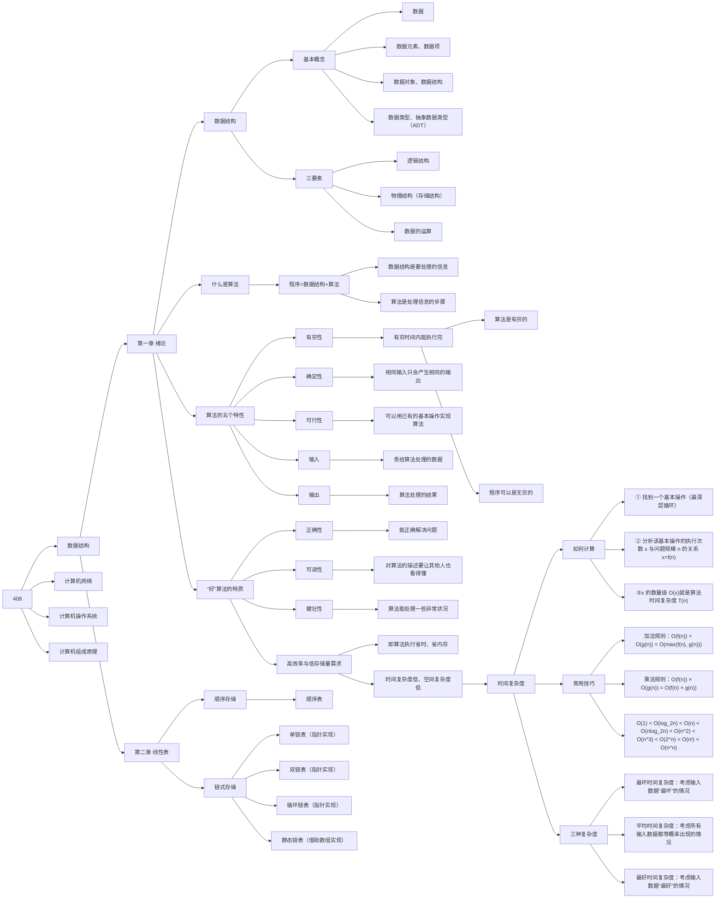

```mermaid
graph LR
408 --> A[数据结构]
A --> AA[第一章 绪论]
AA --> AAA[数据结构]
AAA --> AAAA[基本概念]
AAAA --> AAAAA[数据]
AAAA --> AAAAB["数据元素、数据项"]
AAAA --> AAAAC["数据对象、数据结构"]
AAAA --> AAAAD["数据类型、抽象数据类型（ADT）"]
AAA --> AAAB[三要素]
AAAB --> AAABA["逻辑结构"]
AAAB --> AAABB["物理结构（存储结构）"]
AAAB --> AAABC["数据的运算"]
AA --> AAB[什么是算法]
AAB --> AABA["程序=数据结构+算法"]
AABA --> 数据结构是要处理的信息
AABA --> 算法是处理信息的步骤
AA --> AAC[算法的五个特性]
AAC --> AACA[有穷性]
AACA --> AACAA[有穷时间内能执行完]
AACAA --> AACAAA[算法是有穷的]
AACAA --> AACAAB[程序可以是无穷的]
AAC --> AACB[确定性]
AACB --> 相同输入只会产生相同的输出
AAC --> AACC[可行性]
AACC --> 可以用已有的基本操作实现算法
AAC --> AACD[输入]
AACD --> 丢给算法处理的数据
AAC --> AACE[输出]
AACE --> 算法处理的结果
AA --> AAD["“好”算法的特质"]
AAD --> AADA[正确性]
AADA --> 能正确解决问题
AAD --> AADB[可读性]
AADB --> 对算法的描述要让其他人也看得懂
AAD --> AADC[健壮性]
AADC --> 算法能处理一些异常状况
AAD --> AADD[高效率与低存储量需求]
AADD --> AADDA["即算法执行省时、省内存"]
AADD --> AADDB["时间复杂度低、空间复杂度低"]
AADDB --> AADDBA[时间复杂度]
AADDBA --> AADDBAA[如何计算]
AADDBAA --> AADDBAAA["① 找到一个基本操作（最深层循环）"]
AADDBAA --> AADDBAAB["② 分析该基本操作的执行次数 x 与问题规模 n 的关系 x=f(n)"]
AADDBAA --> AADDBAAC["③x 的数量级 O(x)就是算法时间复杂度 T(n)"]
AADDBA --> AADDBAB[常用技巧]
AADDBAB --> AADDBABA["加法规则：O(f(n)) + O(g(n)) = O(max(f(n), g(n)))"]
AADDBAB --> AADDBABB["乘法规则：O(f(n)) × O(g(n)) = O(f(n) × g(n))"]
AADDBAB --> AADDBABC["O(1) < O(log_2n) < O(n) < O(nlog_2n) < O(n^2) < O(n^3) < O(2^n) < O(n!) < O(n^n)"]
AADDBA --> AADDBAC[三种复杂度]
AADDBAC --> AADDBACA["最坏时间复杂度：考虑输入数据“最坏”的情况"]
AADDBAC --> AADDBACB["平均时间复杂度：考虑所有输入数据都等概率出现的情况"]
AADDBAC --> AADDBACC["最好时间复杂度：考虑输入数据“最好”的情况"]
A --> AB[第二章 线性表]
AB --> ABA[顺序存储]
ABA --> 顺序表
AB --> ABB[链式存储]
ABB --> ABBA["单链表（指针实现）"]
ABB --> ABBB["双链表（指针实现）"]
ABB --> ABBC["循环链表（指针实现）"]
ABB --> ABBD["静态链表（借助数组实现）"]
408 --> B[计算机网络]
408 --> C[计算机操作系统]
408 --> D[计算机组成原理]
```
