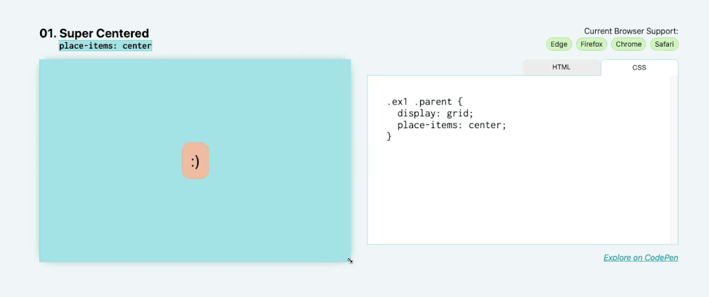
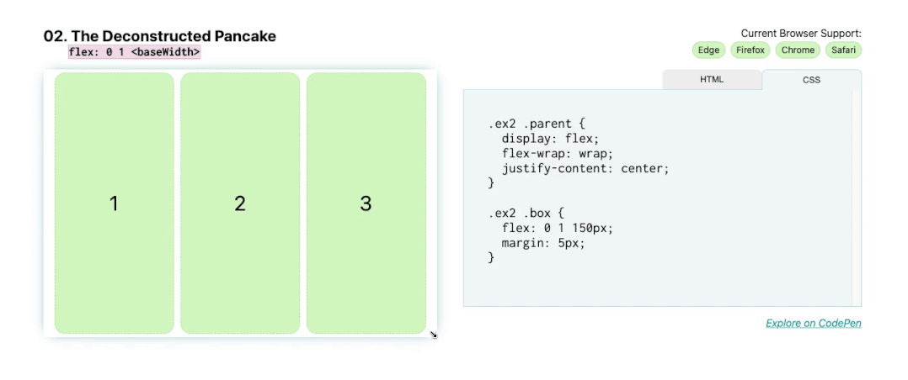
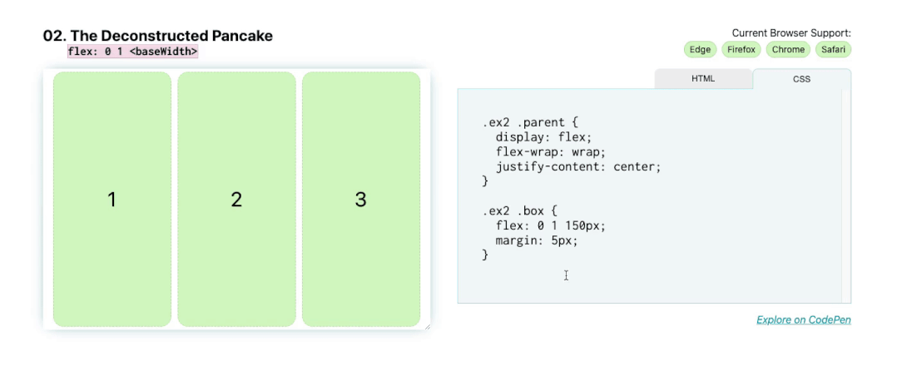

# 常见布局

#### 01. 超级居中：place-items: center



首先指定 grid 作为 display 方法，然后在同一个元素上写入 place-items: center。place-items 是同时设置 align-items 和 justify-items 的快速方法。通过将其设置为 center ， align-items 和 justify-items 都将设置为 center。

```css
.parent {
  display: grid;
  place-items: center;
}
```

#### 02. 解构煎饼式布局：flex: `<grow>` `<shrink>` `<baseWidth>`



接下来我们有解构的煎饼！这是营销网站的常见布局，例如，可能有一行 3 个项目，通常带有图像、标题，然后是一些描述产品某些功能的文本。在移动设备上，我们希望它们能够很好地堆叠，并随着我们增加屏幕尺寸而扩展。

通过使用 Flexbox 实现此效果，您不需要在屏幕尺寸发生变化时通过媒体查询来调整这些元素的位置。

flex 简写代表：flex: `<flex-grow>` `<flex-shrink>` `<flex-basis>` 。

正因为如此，如果您想让您的框填充到它们的 `<flex-basis>` 大小，缩小到更小的尺寸，但不拉伸以填充任何额外的空间，请写入：flex: 0 1 `<flex-basis>` 。在这种情况下，您的 `<flex-basis>` 是 150px，所以应该是这样：

```css
.parent {
  display: flex;
}

.child {
  flex: 0 1 150px;
}
```

如果您确实希望框在换到下一行时拉伸并填充空间，请将 `<flex-grow>` 设置为 1 ，所以应该是这样：

```css
.parent {
  display: flex;
}

.child {
  flex: 1 1 150px;
}
```



现在，当您增加或减少屏幕尺寸时，这些 flex 项目会缩小和增长。
