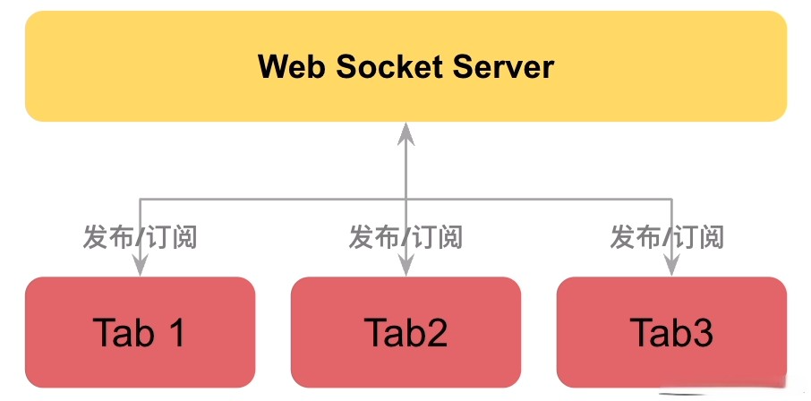
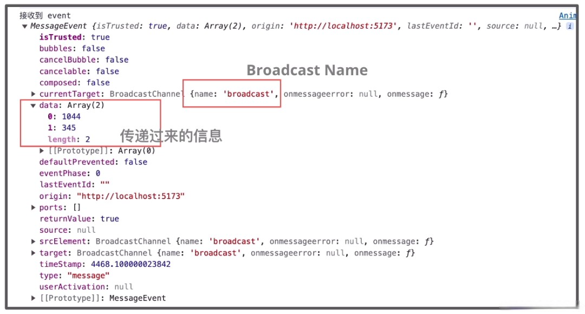
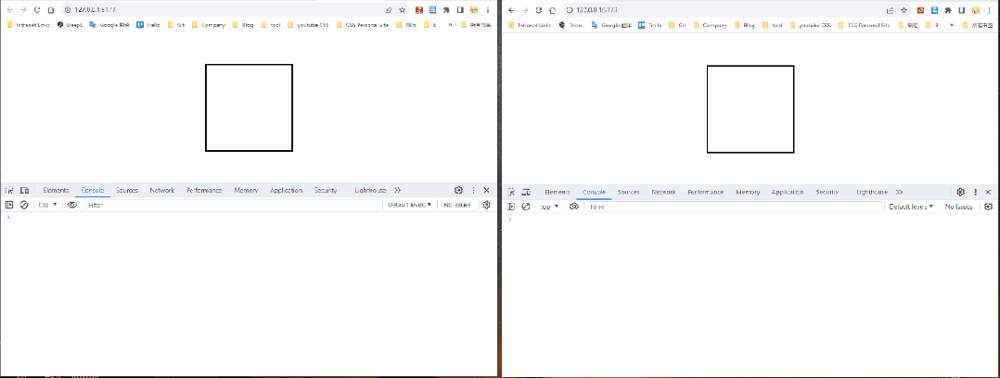
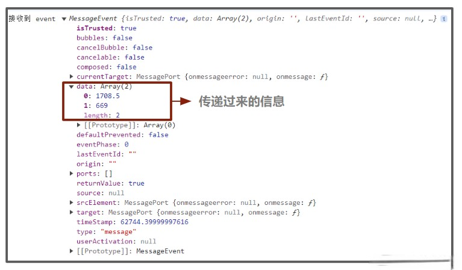
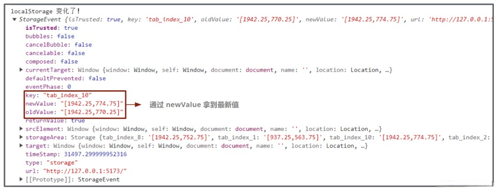
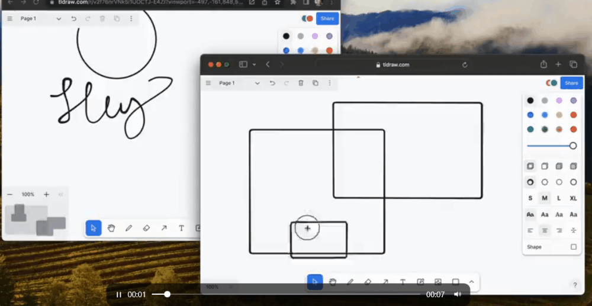

# 浏览器跨 Tab 窗口通信原理


所谓多窗口下进行互相通信，是指在浏览器中，不同窗口（包括不同标签页、不同浏览器窗口甚至不同浏览器实例）之间进行数据传输和通信的能力。

当然，本文我们探讨的是纯前端的跨 Tab 页面通信，在非纯前端的方式下，我们可以借助诸如 Web Socket 等方式，藉由后端这个中间载体，进行跨页面通信。



本文我们更多的重心将放在，如何基于纯前端技术，实现多窗口下进行互相通信。

为了实现跨窗口通信，它应该需要具备以下能力：

- 数据传输能力：能够将数据从一个窗口发送到另一个窗口，以及接收来自其他窗口的数据。
- 实时性：能够实现实时或近实时的数据传输，以便及时更新不同窗口的内容。
- 安全性：确保通信过程中的数据安全，防止恶意窃取或篡改通信数据。当然，这个不是本文讨论的重点，但是是实际应用中不应该忽视的一个重点。

## 方式一：Broadcast Channel ()

Broadcast Channel 是一个较新的 Web API，用于在不同的浏览器窗口、标签页或框架之间实现跨窗口通信。它基于发布 - 订阅模式，允许一个窗口发送消息，并由其他窗口接收。

其核心步骤如下：

- 创建一个 BroadcastChannel 对象：在发送和接收消息之前，首先需要在每个窗口中创建一个 BroadcastChannel 对象，使用相同的频道名称进行初始化。
- 发送消息：通过 BroadcastChannel 对象的 postMessage () 方法，可以向频道中的所有窗口发送消息。
- 接收消息：通过监听 BroadcastChannel 对象的 message 事件，可以在窗口中接收到来自其他窗口发送的消息。

同时，Broadcast Channel 遵循浏览器的同源策略。这意味着只有在同一个协议、主机和端口下的窗口才能正常进行通信。如果窗口不满足同源策略，将无法互相发送和接收消息。

因为有同源限制，我们需要起一个服务，这里我基于 Vite 快速起了一个 Vue 项目，简单的基于 .vue 文件下进行一个演示。

其核心代码非常简单：

```vue
<template>
  <div class="g-container" id="j-main">// ...</div>
</template>

<script setup>
import { onMounted } from 'vue'

onMounted(() => {
  createBroadcastChannel()
  resizeEventBind()
})

let broadcastChannel = null

const createBroadcastChannel = () => {
  broadcastChannel = new BroadcastChannel('broadcast')
  broadcastChannel.onmessage = handleMessage
}

const sendMessage = (data) => {
  broadcastChannel.postMessage(data)
}

const handleMessage = (event) => {
  console.log('接收到 event', event)
  // TODO: 处理接收到信息后的逻辑
}

const resizeEventBind = () => {
  window.addEventListener('resize', () => {
    const pos = getCurPos()
    sendMessage(pos)
  })
}

// 计算当前元素距离显示器窗口右上角的距离
const getCurPos = () => {
  const barHeight = window.outerHeight - window.innerHeight
  const element = document.getElementById('j-main')
  const rect = element.getBoundingClientRect()

  // 获取元素相对于屏幕左上角的 X 和 Y 坐标
  const x = rect.left + window.screenX // 元素左边缘相对于屏幕左边缘的距离
  const y = rect.top + window.screenY + barHeight // 元素顶部边缘相对于屏幕顶部边缘的距离

  return [x, y]
}
</script>
```

这里，我们的核心逻辑在于：

- `createBroadcastChannel()` 函数用于创建一个 BroadcastChannel 对象，并设置消息处理函数。
- `sendMessage(data)` 函数用于向 BroadcastChannel 发送消息。
- `handleMessage(event)` 函数用于处理接收到的消息。
- `resizeEventBind()` 函数用于监听窗口大小变化事件，并在事件发生时获取当前元素的位置信息，并通过 `sendMessage()` 函数发送位置信息到 BroadcastChannel。
- `getCurPos()` 函数用于计算当前元素相对于显示器窗口右上角的距离。

在 `onMounted()` 生命周期钩子中，调用了 `createBroadcastChannel()` 和 `resizeEventBind()` 函数，用于在组件挂载后执行相关的初始化操作。

这样，当我们同时打开两个窗口，移动其中一个窗口，就可以向另外一个窗口发生当前窗口希望传递过去的信息，在本例子中就是 `#j-main` 元素距离显示器右上角的距离。

假设 `#j-main` 只是一个在浏览器正中心矩形，我们同时打开两边的控制台，看看会发生什么：


可以看到，如果我们同时打开两个一个的页面，当触发右边页面的 Resize，左边的页面会收到基于 `broadcastChannel.onmessage = handleMessage` 接收到的信息，反之同理。

而一个完整的 Event 信息如下：



譬如，传递过来的信息放在 data 属性内、同时也可以获取当前的的 Broadcast Name 等。

基于 BroadcastChannel，就可以实现每个 Tab 内的核心信息互传， 可以得知当前在线设备数，再基于这些信息去完成我们想要的动画、交互等效果。

这里的核心点，还是：

- 数据向其他 Tab 页面传递的能力
- Tab 页面接受其他页面传递过来的数据的能力

其本质就是一个数据共享池子。

## 方式二：SharedWorker API

好，介绍完 `Broadcast Channel()`，我们再来看看 SharedWorker API。

SharedWorker API 是 HTML5 中提供的一种多线程解决方案，它可以在多个浏览器 TAB 页面之间共享一个后台线程，从而实现跨页面通信。

与其他 Worker 不同的是，SharedWorker 可以被多个浏览器 TAB 页面共享，且可以在同一域名下的不同页面之间建立连接。这意味着，多个页面可以通过 SharedWorker 实例之间的消息传递，实现跨 TAB 页面的通信。

它的实现与上面的 Broadcast Channel 非常类似，我们来看一看实际的代码：

```html
<!DOCTYPE html>
<html lang="en">
  <head>
    <meta charset="UTF-8" />
    <meta http-equiv="X-UA-Compatible" content="IE=edge" />
    <meta name="viewport" content="width=device-width, initial-scale=1.0" />
    <title>Document</title>
  </head>
  <body>
    <div id="j-main">//...</div>
    <script>
      let myWorker
      function initWorker() {
        // 创建一个 SharedWorker 对象
        myWorker = new SharedWorker('./shared-worker.js', 'tabWorker')

        // 监听消息事件
        myWorker.port.onmessage = function (event) {
          console.log('接收到 event', event)
        }
      }

      function sendMessage(data) {
        // 发送消息
        myWorker.port.postMessage({ status: 'getData', data })
      }

      function resizeEventBind() {
        window.addEventListener('resize', () => {
          const pos = getCurPos()
          sendMessage(pos)
        })
      }

      function getCurPos() {
        const barHeight = window.outerHeight - window.innerHeight
        const element = document.getElementById('j-main')
        const rect = element.getBoundingClientRect()

        // 获取元素相对于屏幕左上角的 X 和 Y 坐标
        const x = rect.left + window.screenX // 元素左边缘相对于屏幕左边缘的距离
        const y = rect.top + window.screenY + barHeight // 元素顶部边缘相对于屏幕顶部边缘的距离

        return [x, y]
      }

      window.onload = () => {
        initWorker()
        resizeEventBind()
      }

      window.onbeforeunload = () => {
        myWorker.port.postMessage({ status: 'close' })
        myWorker.port.close()
      }
    </script>
  </body>
</html>
```

简单描述一下，上面也说了，跨 Tab 页通信的核心在于数据向外的发送与接收的能力：

- `initWorker()` 方法中，使用 `myWorker= new SharedWorker('/shared-worker.js', 'tabWorker')` 创建了一个 SharedWorker ， 后面每一个被打开的同域浏览器 TAB 页面，都是共享这个 Worker 线程，从而实现跨页面通信

- 基于 `myWorker.port.postMessage(data)` 实现数据的传输
- 基于 `myWorker.port.onmessage = function() {}` 实现传输数据的监听

当然，上面有引入一个 `/shared-worker.js`，这个是需要额外定义的，一个极简版本的代码如下：

```javascript
// 储存所有port
const connections = []
onconnect = (e) => {
  const port = e.ports[0]
  !connections.includes(port) && connections.push(port)
  // 监听浏览器页签发送的消息
  port.onmessage = (e) => {
    switch (e.data.status) {
      case 'getData':
        // 广播：给所有port发消息
        broadcast(e.data.data)
        break
      case 'close':
        clearInvalidPort(port)
        break

      default:
        break
    }
  }
}

function broadcast(message) {
  connections.forEach((port) => {
    // 给浏览器页签发消息
    port.postMessage(message)
  })
}

function clearInvalidPort(port) {
  const index = connections.findIndex((item) => item === port)
  if (~index) {
    connections.splice(index, 1)
  }
}
```

简单解析一下，下面对其进行解析：

- 上面的代码中，定义了一个数组 connections，用于存储与 SharedWorker 建立连接的各个页面的端口对象；
- onconnect 是事件处理程序，当有新的连接建立时会触发该事件；
- 在 onconnect 函数中，通过 `event.ports[0]` 获取到与 SharedWorker 建立的连接的第一个端口对象，并将其添加到 connections 数组中，表示该页面与共享 Worker 建立了连接。
- 在连接建立后，为每个端口对象设置了 onmessage 事件处理程序。当端口对象接收到消息时，会触发该事件处理程序。
- 在 onmessage 事件处理程序中，通过遍历 connections 数组，将消息发送给除当前连接端口对象之外的所有连接。这样，消息就可以在不同的浏览器 TAB 页面之间传递。

总而言之，shared-worker.js 脚本创建了一个共享 Worker 实例，它可以接收来自不同页面的连接请求，并将接收到的消息发送给其他连接的页面。通过使用 SharedWorker API，实现跨 TAB 页面之间的通信和数据共享。

同理，我们来看看基于 Worker 的数据传输效果，同样是简化 DEMO，当 Resize 窗口时，向另外一个窗口发送当前窗口下 `#j-main` 元素的坐标：



可以看到，如果我们同时打开两个一个的页面，当触发右边页面的 Resize，左边的页面会利用 `myWorker.port.onmessage = function() {}` 收到基于 `myWorker.port.postMessage(data)` 发送的信息，反之同理。

而一个完整的 Event 信息如下：



可以看到，在 SharedWorker 方式中，传输数据与 Broadcast Channel 是一样的，都是利用 Message Event。简单对比一下：

- SharedWorker 通过在多个 Tab 页面之间共享相同的 Worker 实例，方便地共享数据和状态，SharedWorker 需要多定义一个 shared-worker.js;
- Broadcast Channel 通过向所有订阅同一频道的 Tab 页面广播消息，实现广播式的通信。

## 方式三：localStorage/sessionStorage

OK，最后一种跨 Tab 窗口通信的方式是利用 localStorage 、sessionStorage 本地化存储 API 以及的 storage 事件。

与上面 Broadcast Channel、SharedWorker 稍微不同的地方在于：

- localStorage 方式，利用了本地浏览器存储，实现了同域下的数据共享；
- localStorage 方式，基于 `window.addEventListener('storage', function(event) {})` 事件实现了 localStore 变化时候的数据监听；

简单看看代码：

```vue
<template>
  <div class="g-container" id="j-main">// ...</div>
</template>

<script>
import { ref, reactive, computed, onMounted } from 'vue'

export default {
  setup() {
    function initLocalStorage() {
      let tabArray = JSON.parse(localStorage.getItem('tab_array'))
      if (!tabArray) {
        const tabIndex = 1
        id = tabIndex
        localStorage.setItem('tab_array', JSON.stringify([tabIndex]))
      } else {
        const tabIndex = tabArray[tabArray.length - 1] + 1
        id = tabIndex
        const newTabArray = [...tabArray, tabIndex]
        localStorage.setItem('tab_array', JSON.stringify(newTabArray))
      }
    }

    function setLocalStorage(data) {
      localStorage.setItem(`tab_index_${id}`, JSON.stringify(data))
    }

    function handleMessage(data) {
      const rArray = JSON.parse(data)
      remoteX.value = rArray[0]
      remoteY.value = rArray[1]
    }

    function resizeEventBind() {
      window.addEventListener('resize', () => {
        const pos = getCurPos()
        setLocalStorage(pos)
      })

      window.addEventListener('storage', (event) => {
        console.log('localStorage 变化了！', event)
        console.log('键名：', event.key)
        console.log('变化前的值：', event.oldValue)
        console.log('变化后的值：', event.newValue)
        handleMessage(event.newValue)
      })
    }

    function getCurPos() {
      const barHeight = window.outerHeight - window.innerHeight
      const element = document.getElementById('j-main')
      const rect = element.getBoundingClientRect()

      // 获取元素相对于屏幕左上角的 X 和 Y 坐标
      const x = rect.left + window.screenX // 元素左边缘相对于屏幕左边缘的距离
      const y = rect.top + window.screenY + barHeight // 元素顶部边缘相对于屏幕顶部边缘的距离

      return [x, y]
    }

    onMounted(() => {
      initLocalStorage()
      resizeEventBind()
    })

    return {}
  },
}
</script>
```

同样的简单解析一下：

- 每次页面初始化时，都会首先有一个 initLocalStorage 过程，用于给当前页面一个唯一 ID 标识，并且存入 localStorage 中
- 每次页面 resize，将当前页面元素 `#j-main` 的坐标值，通过 ID 标识当 Key，存入 localStorage 中
- 其他页面，通过 `window.addEventListener('storage', (event)=> {})` 监听 localStorage 的变化

交互传输结果，与上述两个动图是一致的，就不额外贴图了，但是基于 storage 事件传输的值有点不一样，我们展开看看：



我们通过 `window.addEventListener('storage', (event)=> {})` ，可以拿到此次变化的 localStorage key 是什么，前值 oldValue 与 newValue 等等。

当然，由于 localStorage 存储过程只能是字符串，在读取的时候需要利用 JSON.stringify 和 JSON.parse 额外处理一层，调试的时候需要注意。

## 实际应用思考

当然，上面的实现其实有很大一个瑕疵。

那就是我们只顾着实现通信，没有考虑实际应用中的一些实际问题：

- 如何确定何时开始通信？
- Tab 页频繁的开关，如何知道当前还有多少页面处于打开状态？

基于实际应用，我们需要基于上述 3 种方式，进一步细化方案。

上面，为了方便演示，每次传输数据时，只传输动画需要的数据。而实际应用，我们可以需要细化整个传输数据，设定合理的协议。譬如：

```
 {
     // 传输状态：
     // 1 - 首次传输
     // 2 - 正常通信
     // 3 - 页面关闭
     status: 1 | 2 | 3,
     data: {}
 }
```

接收方需要基于收到信息所展示的不同的状态，做出不同的反馈。

当然，还有一个问题，我们如何知道页面被关闭了？基于组件的 onUnmounted 发送当前页面关闭的信息或者基于 window 对象的 beforeunload 事件发送当前页面关闭的信息？

这些信息都有可能因为 Tab 页面失活，导致关闭的信息无法正常被发送出去。所以，实际应用中，我们经常用的一项技术是心跳上报，一旦建立连接后，间隔 X 秒发送一次心跳广播，告诉其他接收端，我还在线。一旦超过某个时间阈值没有收到心跳上报，各个订阅方可以认为该设备已经下线。

总而言之，跨 Tab 窗口通信应用在实际应用的过程中，我们需要思考更多可能隐藏的问题。

## 跨 Tab 窗口通信应用场景

当然，除了最近大火的跨 Tab 动画应用场景，实际业务中，还有许多场景是它可以发挥作用的。这些场景利用了跨 Tab 通信技术，增强了用户体验并提供了更丰富的功能。

以下是一些常见的应用场景：

实时协作：多个用户可以在不同的 Tab 页上进行实时协作，比如编辑文档、共享白板、协同编辑等。通过跨 Tab 通信，可以实现实时更新和同步操作，提高协作效率。

譬如这个：



多标签页数据同步：当用户在一个标签页上进行了操作，希望其他标签页上的数据也能实时更新时，可以使用跨 Tab 通信来实现数据同步，保持用户在不同标签页上看到的数据一致性。

跨标签页通知：在某些场景下，需要向用户发送通知或提醒，即使用户不在当前标签页上也能及时收到。通过跨 Tab 通信，可以实现跨页面的消息传递，向用户发送通知或提醒。

多标签页状态同步：有些应用可能需要在不同标签页之间同步用户的状态信息，例如登录状态、购物车内容等。通过跨 Tab 通信，可以确保用户在不同标签页上看到的状态信息保持一致。

页面间数据传输：有时候用户需要从一个页面跳转到另一个页面，并携带一些数据，通过跨 Tab 通信可以在页面之间传递数据，实现数据的共享和传递。

举两个实际的例子：

- 某系统是一个国际化电商的仓库管理系统，系统能切换到全球各地不同的仓库进行数据操作，当用户打开了页面后，又新开了一个 Tab 页面，并且切换到另外一个仓库进行操作。当用户重新回到第一个打开的页面时，为了防止用户错误操作数据（前端界面是一致的，可能忘记了自己切换过仓库），通过弹窗提醒用户你已经切换过仓库；
- 某音乐播放器 PC 页面，在列表页面进行歌曲播放点击，如果当前没有音乐播放详情页，则打开一个新的播放详情页。但是，如果页面已经存在一个音乐播放详情页，则不会打开新的音乐播放详情页，而是直接使用已经存在的播放详情页面；

总之，跨 Tab 窗口通信在实时协作、数据同步、通知提醒等方面都能发挥重要作用，为用户提供更流畅、便捷的交互体验。
