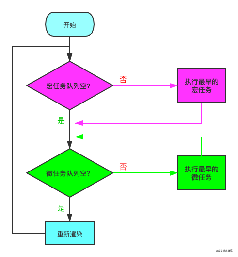

## 手写前需要先了解这些

如果感觉对 Promise 还不太熟悉的就先移步 Promise 入门，稍微做一下知识预习，了解一下 Promise 的常规用法。

### 什么是宏任务与微任务？

我们都知道 Js 是单线程都，但是一些高耗时操作就带来了进程阻塞问题。为了解决这个问题，Js 有两种任务的执行模式：**同步模式（Synchronous）和异步模式（Asynchronous）**。

在异步模式下，创建**异步任务主要分为宏任务与微任务两种**。ES6 规范中，宏任务（Macrotask） 称为 Task， 微任务（Microtask） 称为 Jobs。宏任务是由宿主（浏览器、Node）发起的，而微任务由 JS 自身发起。

**宏任务与微任务的几种创建方式** 👇

|    宏任务（Macrotask）    |       微任务（Microtask）       |
| :-----------------------: | :-----------------------------: |
|        setTimeout         | requestAnimationFrame（有争议） |
|        setInterval        | MutationObserver（浏览器环境）  |
|      MessageChannel       | Promise.[ then/catch/finally ]  |
|       I/O，事件队列       |  process.nextTick（Node 环境）  |
| setImmediate（Node 环境） |         queueMicrotask          |
|   script（整体代码块）    |                                 |

**如何理解 script（整体代码块）是个宏任务呢** 🤔

实际上如果同时存在两个 script 代码块，会首先在执行第一个 script 代码块中的同步代码，如果这个过程中创建了微任务并进入了微任务队列，第一个 script 同步代码执行完之后，会首先去清空微任务队列，再去开启第二个 script 代码块的执行。所以这里应该就可以理解 script（整体代码块）为什么会是宏任务。

### 什么是 EventLoop ？

先来看个图



1. 判断宏任务队列是否为空

2. - 不空 --> 执行最早进入队列的任务 --> 执行下一步
   - 空 --> 执行下一步

3. 判断微任务队列是否为空

4. - 不空 --> 执行最早进入队列的任务 --> **继续检查微任务队列空不空**
   - 空 --> 执行下一步

因为首次执行宏队列中会有 script（整体代码块）任务，所以实际上就是 Js 解析完成后，在异步任务中，会先执行完所有的微任务，这里也是很多面试题喜欢考察的。需要注意的是，新创建的微任务会立即进入微任务队列排队执行，不需要等待下一次轮回。

### 什么是 Promise A+ 规范？

看到 A+ 肯定会想到是不是还有 A，事实上确实有。其实 Promise 有多种规范，除了前面的 Promise A、promise A+ 还有 Promise/B，Promise/D。**目前我们使用的 Promise 是基于 Promise A+ 规范实现的**，感兴趣的移步 Promise A+规范了解一下，这里不赘述。

检验一份手写 Promise 靠不靠谱，通过 Promise A+ 规范自然是基本要求，这里我们可以借助 promises-aplus-tests 来检测我们的代码是否符合规范，后面我会讲到如何使用它。

### Promise 解决了什么问题？

Promise 的出现最重要的是为了**统一 JS 中的异步实现方案**

异步是 JS 中的常见场景，统一实现方案，不仅可以有效降低心智负担，更重要的是可以让不同的异步场景相互联动。

Promise 也无法消除回调，它只不过通过链式调用的方式让回调变得可控。

## 手写开始

很多手写版本都是使用 setTimeout 去做异步处理，但是 setTimeout 属于宏任务，这与 Promise 是个微任务相矛盾，所以我打算选择一种创建微任务的方式去实现我们的手写代码。

这里我们有几种选择，一种就是 Promise A+ 规范中也提到的，process.nextTick（ Node 端 ） 与 MutationObserver（ 浏览器端 ），考虑到利用这两种方式需要做环境判断，所以在这里我们就推荐另外一种创建微任务的方式 `queueMicrotask`，了解更多 --> 在 JavaScript 中通过 queueMicrotask() 使用微任务;

### 一、Promise 核心逻辑实现

我们先简单实现一下 Promise 的基础功能。先看原生 Promise 实现的 🌰，第一步我们要完成相同的功能。

原生 🌰 👇

```javascript
const promise = new Promise((resolve, reject) => {
  resolve(success)
  reject(err)
})

promise.then(
  (value) => {
    console.log(resolve, value)
  },
  (reason) => {
    console.log(reject, reason)
  }
)

// 输出 resolve success
```

我们来分析一下**基本原理**：

> 1. Promise 是一个类，在执行这个类的时候会传入一个执行器，这个执行器会立即执行
>
> 2. Promise 会有三种状态
>
> 3. - Pending 等待
>    - Fulfilled 完成
>    - Rejected 失败
>
> 4. 状态只能由 Pending --> Fulfilled 或者 Pending --> Rejected，且一但发生改变便不可二次修改；
>
> 5. Promise 中使用 resolve 和 reject 两个函数来更改状态；
>
> 6. then 方法内部做但事情就是状态判断
>
> 7. - 如果状态是成功，调用成功回调函数
>    - 如果状态是失败，调用失败回调函数

**下面开始实现**：
