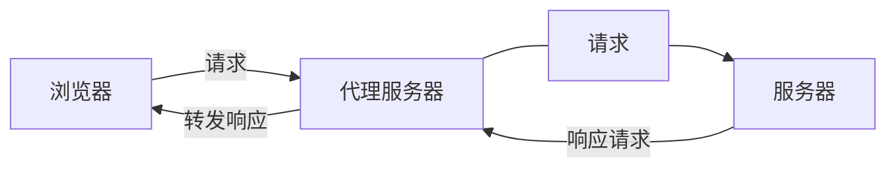

# 跨域

## 什么是跨域

跨域，是指浏览器不能执行其他网站的脚本。它是由浏览器的**同源策略**造成的，是浏览器对 JavaScript 实施的安全限制。浏览器从一个域名的网页去请求另一个域名的资源时，出现**域名、端口、协议**任一不同，都属于跨域。

同源策略限制了一下行为：

- Cookie、LocalStorage 和 IndexDB 无法读取
- DOM 和 JS 对象无法获取
- Ajax 请求发送不出去

但是有三个标签是允许跨域加载资源：

```html

<link href=XXX>
<script src=XXX>
```

下面举个例子：

```ruby
http://www.yyy.cn/index.html  		调用 	http://www.xxxyyy.cn/server.php 		非跨域
http://www.xxxyyy.cn/index.html 	调用  http://www.xxx.cn/server.php  			跨域,主域不同
http://abc.xxxyyy.cn/index.html 	调用  http://def.xxx.cn/server.php  			跨域,子域名不同
http://www.xxx.cn:8080/index.html 调用  http://www.xxx.cn/server.php  			跨域,端口不同
https://www.xxx.cn/index.html 		调用  http://www.xxx.cn/server.php 				跨域,协议不同
```

特别说明两点：

**第一：如果是协议和端口造成的跨域问题“前台”是无能为力的。**

**第二：在跨域问题上，仅仅是通过“URL 的首部”来识别而不会根据域名对应的 IP 地址是否相同来判断。“URL 的首部”可以理解为“协议, 域名和端口必须匹配”。**

这里你或许有个疑问：**请求跨域了，那么请求到底发出去没有？**

跨域并不是请求发不出去，请求能发出去，服务端能收到请求并正常返回结果，只是结果被浏览器拦截了。你可能会疑问明明通过表单的方式可以发起跨域请求，为什么 Ajax 就不会?因为归根结底，跨域是为了阻止用户读取到另一个域名下的内容，Ajax 可以获取响应，浏览器认为这不安全，所以拦截了响应。但是表单并不会获取新的内容，所以可以发起跨域请求。同时也说明了跨域并不能完全阻止 CSRF，因为请求毕竟是发出去了。

## 跨域解决方案

### 1.jsonp

**JSONP 原理**

利用 `script` 标签没有跨域限制的漏洞，网页可以得到从其他来源动态产生的 JSON 数据。JSONP 请求一定需要对方的服务器做支持才可以。

**JSONP 和 AJAX 对比**

JSONP 和 AJAX 相同，都是客户端向服务器端发送请求，从服务器端获取数据的方式。但 AJAX 属于同源策略，JSONP 属于非同源策略（跨域请求）

**JSONP 优缺点**

JSONP 优点是简单兼容性好，可用于解决主流浏览器的跨域数据访问的问题。缺点是仅支持 get 方法具有局限性,不安全可能会遭受 XSS 攻击。

**JSONP 的实现流程**

- 声明一个回调函数，其函数名(如 show)当做参数值，要传递给跨域请求数据的服务器，函数形参为要获取目标数据(服务器返回的 data)。
- 创建一个 script 标签，把那个跨域的 API 数据接口地址，赋值给 script 的 src,还要在这个地址中向服务器传递该函数名（可以通过问号传参:?callback=show）。
- 服务器接收到请求后，需要进行特殊的处理：把传递进来的函数名和它需要给你的数据拼接成一个字符串,例如：传递进去的函数名是 show，它准备好的数据是 show('我不爱你')。
- 最后服务器把准备的数据通过 HTTP 协议返回给客户端，客户端再调用执行之前声明的回调函数（show），对返回的数据进行操作。

在开发中可能会遇到多个 JSONP 请求的回调函数名是相同的，这时候就需要自己封装一个 JSONP 函数。

```javascript
// index.html
function jsonp({ url, params, callback }) {
  return new Promise((resolve, reject) ={
    let script = document.createElement('script')
    window[callback] = function(data) {
      resolve(data)
      document.body.removeChild(script)
    }
    params = { ...params, callback } // wd=b&callback=show
    let arrs = []
    for (let key in params) {
      arrs.push(`${key}=${params[key]}`)
    }
    script.src = `${url}?${arrs.join('&')}`
    document.body.appendChild(script)
  })
}
jsonp({
  url: 'http://localhost:3000/say',
  params: { wd: 'Iloveyou' },
  callback: 'show'
}).then(data ={
  console.log(data)
})
```

上面这段代码相当于向 `http://localhost:3000/say?wd=Iloveyou&callback=show` 这个地址请求数据，然后后台返回 `show('我不爱你')`，最后会运行 `show()`这个函数，打印出'我不爱你'

```javascript
// server.js
let express = require('express')
let app = express()
app.get('/say', function (req, res) {
  let { wd, callback } = req.query
  console.log(wd) // Iloveyou
  console.log(callback) // show
  res.end(`${callback}('我不爱你')`)
})
app.listen(3000)
```

### 2.cors

这是目前主流的解决方案。

CORS 是一个 W3C 标准，全称是"跨域资源共享"（Cross-origin resource sharing）。 它允许浏览器向跨源服务器，发出 XMLHttpRequest 请求，从而克服了 AJAX 只能同源使用的限制。

CORS 需要浏览器和服务器同时支持。目前，所有浏览器都支持该功能，IE 浏览器不能低于 IE10。IE8+：IE8/9 需要使用 XDomainRequest 对象来支持 CORS。

整个 CORS 通信过程，都是浏览器自动完成，不需要用户参与。对于开发者来说，CORS 通信与同源的 AJAX 通信没有差别，代码完全一样。浏览器一旦发现 AJAX 请求跨源，就会自动添加一些附加的头信息，有时还会多出一次附加的请求，但用户不会有感觉。 因此，实现 CORS 通信的关键是**服务器**。只要后端实现了 CORS，就实现了跨域。

基本只需要对**服务器**动手脚，前端代码跟同源时一样，也就是不跨域时一样。

服务端设置 `Access-Control-Allow-Origin` 就可以开启 CORS。 该属性表示哪些域名可以访问资源，如果设置通配符则表示所有网站都可以访问资源。

虽然设置 CORS 和前端没什么关系，但是通过这种方式解决跨域问题的话，会在发送请求时出现两种情况，**一种是简单请求，另一种是非简单请求。只要满足下面条件就是简单请求**

- 请求方式为 HEAD、POST 或者 GET
- http 头信息不超出以下字段：
  ```dart
  Accept、Accept-Language
  Content-Language
  Last-Event-ID
  Content-Type(限于三个值：application/x-www-form-urlencoded、multipart/form-data、text/plain)
  ```

为什么要分为简单请求和非简单请求，因为浏览器对这两种请求方式的处理方式是不同的。

#### 2.1 简单请求

对于简单请求，浏览器直接发出 CORS 请求。具体来说，就是在头信息之中，增加一个 Origin 字段。 下面是一个例子，浏览器发现这次跨源 AJAX 请求是简单请求，就自动在头信息之中，添加一个 Origin 字段。

```cpp
GET /cors HTTP/1.1
Origin: http://api.bob.com
Host: api.alice.com
Accept-Language: en-US
Connection: keep-alive
User-Agent: Mozilla/5.0
```

Origin 字段用来说明，本次请求来自哪个源（协议 + 域名 + 端口）。服务器根据这个值，决定是否同意这次请求。

如果 Origin 指定的源，不在许可范围内，服务器会返回一个正常的 HTTP 回应。 浏览器发现，这个响应头信息没有包含 Access-Control-Allow-Origin 字段，就知道出错了，从而抛出一个错误，被 XMLHttpRequest 的 onerror 回调函数捕获。

注意，这种错误无法通过状态码识别，因为 HTTP 回应的状态码有可能是 200。

如果 Origin 指定的域名在许可范围内，服务器返回的响应，会多出几个头信息字段：

```dart
Access-Control-Allow-Origin: http://api.bob.com
Access-Control-Allow-Credentials: true
Access-Control-Expose-Headers: FooBar
Content-Type: text/html; charset=utf-8
```

上面的头信息之中，有三个与 CORS 请求相关的字段，都以 Access-Control-开头

**Access-Control-Allow-Origin**:该字段是必须的。它的值要么是请求时 Origin 字段的值，要么是一个\*，表示接受任意域名的请求

**Access-Control-Allow-Credentials**: 该字段可选。它的值是一个布尔值，表示是否允许发送 Cookie。默认情况下，Cookie 不包括在 CORS 请求之中。设为 true，即表示服务器明确许可，Cookie 可以包含在请求中，一起发给服务器。这个值也只能设为 true，如果服务器不要浏览器发送 Cookie，删除该字段即可。

**Access-Control-Expose-Headers**:该字段可选。CORS 请求时，XMLHttpRequest 对象的 getResponseHeader()方法只能拿到 6 个基本字段：Cache-Control、Content-Language、Content-Type、Expires、Last-Modified、Pragma。如果想拿到其他字段，就必须在 Access-Control-Expose-Headers 里面指定。

**withCredentials 属性**

上面说到，CORS 请求默认不发送 Cookie 和 HTTP 认证信息。如果要把 Cookie 发到服务器，一方面要服务器同意，指定 Access-Control-Allow-Credentials 字段。

另一方面，开发者必须在 AJAX 请求中打开 withCredentials 属性。

```javascript
var xhr = new XMLHttpRequest() // IE8/9需用window.XDomainRequest兼容

// 前端设置是否带cookie
xhr.withCredentials = true
xhr.open('post', 'http://www.domain2.com:8080/login', true)
xhr.setRequestHeader('Content-Type', 'application/x-www-form-urlencoded')
xhr.send('user=admin')
xhr.onreadystatechange = function () {
  if (xhr.readyState == 4 && xhr.status == 200) {
    alert(xhr.responseText)
  }
}
```

否则，即使服务器同意发送 Cookie，浏览器也不会发送。或者，服务器要求设置 Cookie，浏览器也不会处理。 但是，如果省略 withCredentials 设置，有的浏览器还是会一起发送 Cookie。这时，可以显式关闭 withCredentials。

**需要注意的是，如果要发送 Cookie，Access-Control-Allow-Origin 就不能设为星号\*，必须指定明确的、与请求网页一致的域名。**同时，Cookie 依然遵循同源政策，只有用服务器域名设置的 Cookie 才会上传，其他域名的 Cookie 并不会上传，且（跨源）原网页代码中的 document.cookie 也无法读取服务器域名下的 Cookie。

#### 2.2 非简单请求

非简单请求是那种对服务器有特殊要求的请求，比如请求方法是 PUT 或 DELETE，或者 Content-Type 字段的类型是 application/json。

非简单请求的 CORS 请求，会在正式通信之前，增加一次 HTTP 查询请求，称为"预检"请求（preflight）——浏览器先询问服务器，当前网页所在的域名是否在服务器的许可名单之中，以及可以使用哪些 HTTP 动词和头信息字段。只有得到肯定答复，浏览器才会发出正式的 XMLHttpRequest 请求，否则就报错。

```csharp
var url = 'http://api.alice.com/cors';
var xhr = new XMLHttpRequest();
xhr.open('PUT', url, true);
xhr.setRequestHeader('X-Custom-Header', 'value');
xhr.send();
```

浏览器发现，这是一个非简单请求，就自动发出一个"**预检**"请求，要求服务器确认可以这样请求。下面是这个"预检"请求的 HTTP 头信息。

```cpp
OPTIONS /cors HTTP/1.1
Origin: http://api.bob.com
Access-Control-Request-Method: PUT
Access-Control-Request-Headers: X-Custom-Header
Host: api.alice.com
Accept-Language: en-US
Connection: keep-alive
User-Agent: Mozilla/5.0...
```

"预检"请求用的请求方法是**OPTIONS**，表示这个请求是用来询问的。头信息里面，关键字段是 Origin，表示请求来自哪个源。

除了 Origin 字段，"预检"**请求头**信息包括两个特殊字段。

Access-Control-Request-Method：该字段是必须的，用来列出浏览器的 CORS 请求会用到哪些 HTTP 方法，上例是 PUT。

Access-Control-Request-Headers：该字段是一个逗号分隔的字符串，指定浏览器 CORS 请求会额外发送的头信息字段，上例是 X-Custom-Header

**预检请求的回应**

服务器收到"预检"请求以后，检查了 Origin、Access-Control-Request-Method 和 Access-Control-Request-Headers 字段以后，确认允许跨源请求，就可以做出回应

```dart
HTTP/1.1 200 OK
Date: Mon, 01 Dec 2008 01:15:39 GMT
Server: Apache/2.0.61 (Unix)
Access-Control-Allow-Origin: http://api.bob.com
Access-Control-Allow-Methods: GET, POST, PUT
Access-Control-Allow-Headers: X-Custom-Header
Content-Type: text/html; charset=utf-8
Content-Encoding: gzip
Content-Length: 0
Keep-Alive: timeout=2, max=100
Connection: Keep-Alive
Content-Type: text/plain
```

上面的 HTTP 回应中，关键的是 Access-Control-Allow-Origin 字段，表示http://api.bob.com可以请求数据。该字段也可以设为星号，表示同意任意跨源请求。

如果浏览器否定了"预检"请求，会返回一个正常的 HTTP 回应，但是没有任何 CORS 相关的头信息字段。这时，浏览器就会认定，服务器不同意预检请求，因此触发一个错误，被 XMLHttpRequest 对象的 onerror 回调函数捕获。控制台会打印出报错信息。

服务器回应的其他 CORS 相关字段如下：

```bash
Access-Control-Allow-Methods: GET, POST, PUT
Access-Control-Allow-Headers: X-Custom-Header
Access-Control-Allow-Credentials: true
Access-Control-Max-Age: 1728000
```

Access-Control-Allow-Methods：该字段必需，它的值是逗号分隔的一个字符串，表明服务器支持的所有跨域请求的方法。注意，返回的是所有支持的方法，而不单是浏览器请求的那个方法。这是为了避免多次"预检"请求。

Access-Control-Allow-Headers：如果浏览器请求包括 Access-Control-Request-Headers 字段，则 Access-Control-Allow-Headers 字段是必需的。它也是一个逗号分隔的字符串，表明服务器支持的所有头信息字段，不限于浏览器在"预检"中请求的字段。

Access-Control-Allow-Credentials： 该字段与简单请求时的含义相同。

Access-Control-Max-Age： 该字段可选，用来指定本次预检请求的有效期，单位为秒。上面结果中，有效期是 20 天（1728000 秒），即允许缓存该条回应 1728000 秒（即 20 天），在此期间，不用发出另一条预检请求。

**浏览器正常请求回应**

一旦服务器通过了"预检"请求，以后每次浏览器正常的 CORS 请求，就都跟简单请求一样，会有一个 Origin 头信息字段。服务器的回应，也都会有一个 Access-Control-Allow-Origin 头信息字段。

```csharp
PUT /cors HTTP/1.1
Origin: http://api.bob.com
Host: api.alice.com
X-Custom-Header: value
Accept-Language: en-US
Connection: keep-alive
User-Agent: Mozilla/5.0...
```

浏览器的正常 CORS 请求。上面头信息的 Origin 字段是浏览器自动添加的。下面是服务器正常的回应。

```dart
Access-Control-Allow-Origin: http://api.bob.com
Content-Type: text/html; charset=utf-8
```

Access-Control-Allow-Origin 字段是每次回应都必定包含的

#### 2.3 Nodejs 跨域处理

##### 2.3.1 设置允许域名跨域

- 设置允许所有域名跨域

```javascript
var express = require('express')
var app = express()

// 设置允许所有域名跨域：
app.all('*', function (req, res, next) {
  //设置允许跨域的域名，*代表允许任意域名跨域
  res.header('Access-Control-Allow-Origin', '*')
  //允许的header类型
  res.header('Access-Control-Allow-Headers', 'content-type')
  //跨域允许的请求方式
  res.header('Access-Control-Allow-Methods', 'DELETE,PUT,POST,GET,OPTIONS')
  if (req.method.toLowerCase() == 'options') res.send(200) //让options尝试请求快速结束
  else next()
})
```

- 设置允许多个域名跨域：

```javascript
app.all('*', function (req, res, next) {
  var orginList = ['http://www.bibi.com', 'http://www.qq.com', 'http://www.baidu.com']
  // 防止undefined 报错
  if (!req.headers.origin) {
    return
  }
  if (orginList.includes(req.headers.origin.toLowerCase())) {
    //允许的header类型
    res.header('Access-Control-Allow-Headers', 'content-type')
    //跨域允许的请求方式
    res.header('Access-Control-Allow-Methods', 'DELETE,PUT,POST,GET,OPTIONS')
    //设置允许跨域的域名，*代表允许任意域名跨域
    res.header('Access-Control-Allow-Origin', req.headers.origin)
    if (req.method.toLowerCase() == 'options') {
      res.sendStatus(200) //让options尝试请求快速结束
    } else {
      next()
    }
  } else {
    res.sendStatus(500)
  }
})
```

##### 2.3.2 利用中间件 cors

安装 `npm i cors -S`

使用方式一： 为所有源启用跨域

```js
const cors = require('cors')
app.use(cors())
app.listen(8000, function () {
  console.log('start')
})
```

使用方式二： 按条件配置

```javascript
var express = require('express')
var cors = require('cors')
var app = express()
var whitelist = ['http://example1.com', 'http://example2.com']
//  异步配置
var corsOptions
var corsOptionsDelegate = function (req, callback) {
  if (whitelist.indexOf(req.header('Origin')) !== -1) {
    corsOptions = { origin: true } //在CORS响应中反映(启用)请求的起源
  } else {
    corsOptions = { origin: false } // 拦截请求
  }
  callback(null, corsOptions) //  error  options
}

app.all('*', cors(corsOptionsDelegate), function (req, res, next) {
  if (corsOptions.origin === true) {
    if (req.method.toLowerCase() == 'options') {
      res.sendStatus(200) //让options尝试请求快速结束
    } else {
      next()
    }
  } else {
    res.sendStatus(500) //被拦截
  }
})
app.post('/cors', (req, res) => {
  res.send('ok')
})
app.listen(8000, function () {
  console.log('start')
})
```

### 3.postMessage

`postMessage` 是 HTML5 XMLHttpRequest Level 2 中的 API，且是为数不多可以跨域操作的 `window` 属性之一，它可用于解决以下方面的问题：

- 页面和其打开的新窗口的数据传递
- 多窗口之间消息传递
- 页面与嵌套的 iframe 消息传递
- 上面三个场景的跨域数据传递

`postMessage()`方法允许来自不同源的脚本采用异步方式进行有限的通信，可以实现跨文本档、多窗口、跨域消息传递。

`otherWindow.postMessage(message, targetOrigin, [transfer]);`

- message: 将要发送到其他 window 的数据。
- targetOrigin:通过窗口的 origin 属性来指定哪些窗口能接收到消息事件，其值可以是字符串"\*"（表示无限制）或者一个 URI。在发送消息的时候，如果目标窗口的协议、主机地址或端口这三者的任意一项不匹配 targetOrigin 提供的值，那么消息就不会被发送；只有三者完全匹配，消息才会被发送。
- transfer(可选)：是一串和 message 同时传递的 Transferable 对象. 这些对象的所有权将被转移给消息的接收方，而发送一方将不再保有所有权。

接下来我们看个例子： `http://localhost:3000/a.html` 页面向 `http://localhost:4000/b.html` 传递“我爱你”,然后后者传回"我不爱你"。

```html
<!-- a.html  -->
<iframe src="http://localhost:4000/b.html" frameborder="0" id="frame" onload="load()"></iframe>
//等它加载完触发一个事件 //内嵌在http://localhost:3000/a.html
<script>
  function load() {
    let frame = document.getElementById('frame')
    frame.contentWindow.postMessage('我爱你', 'http://localhost:4000') //发送数据
    window.onmessage = function (e) {
      //接受返回数据
      console.log(e.data) //我不爱你
    }
  }
</script>
<!-- b.html -->
<script>
  window.onmessage = function (e) {
    console.log(e.data) //我爱你
    e.source.postMessage('我不爱你', e.origin)
  }
</script>
```

### 4.websocket

Websocket 是 HTML5 的一个持久化的协议，它实现了浏览器与服务器的全双工通信，同时也是跨域的一种解决方案。WebSocket 和 HTTP 都是应用层协议，都基于 TCP 协议。但是 WebSocket 是一种双向通信协议，在建立连接之后，WebSocket 的 server 与 client 都能主动向对方发送或接收数据。同时，WebSocket 在建立连接时需要借助 HTTP 协议，连接建立好了之后 client 与 server 之间的双向通信就与 HTTP 无关了。

原生 WebSocket API 使用起来不太方便，我们使用 Socket.io，它很好地封装了 webSocket 接口，提供了更简单、灵活的接口，也对不支持 webSocket 的浏览器提供了向下兼容。

我们先来看个例子：本地文件 socket.html 向 localhost:3000 发生数据和接受数据

```html
// socket.html
<script>
  let socket = new WebSocket('ws://localhost:3000')
  socket.onopen = function () {
    socket.send('我爱你') //向服务器发送数据
  }
  socket.onmessage = function (e) {
    console.log(e.data) //接收服务器返回的数据
  }
</script>
```

```javascript
// server.js
let express = require('express')
let app = express()
let WebSocket = require('ws') //记得安装ws
let wss = new WebSocket.Server({ port: 3000 })
wss.on('connection', function (ws) {
  ws.on('message', function (data) {
    console.log(data)
    ws.send('我不爱你')
  })
})
```

### 5. Node 中间件代理(两次跨域)

实现原理：同源策略是浏览器需要遵循的标准，而如果是服务器向服务器请求就无需遵循同源策略。

代理服务器，需要做以下几个步骤：

- 接受客户端请求 。
- 将请求 转发给服务器。
- 拿到服务器 响应 数据。
- 将 响应 转发给客户端。



我们先来看个例子：本地文件 index.html 文件，通过代理服务器 http://localhost:3000 向目标服务器 http://localhost:4000 请求数据。

```html
// index.html(http://127.0.0.1:5500)
<script src="https://cdn.bootcss.com/jquery/3.3.1/jquery.min.js"></script>
<script>
  $.ajax({
    url: 'http://localhost:3000',
    type: 'post',
    data: { name: 'xiamen', password: '123456' },
    contentType: 'application/json;charset=utf-8',
    success: function (result) {
      console.log(result) // {"title":"fontend","password":"123456"}
    },
    error: function (msg) {
      console.log(msg)
    }
  })
</script>
```

```javascript
// server1.js 代理服务器(http://localhost:3000)
const http = require('http')
// 第一步：接受客户端请求
const server = http.createServer((request, response) ={
  // 代理服务器，直接和浏览器直接交互，需要设置CORS 的首部字段
  response.writeHead(200, {
    'Access-Control-Allow-Origin': '*',
    'Access-Control-Allow-Methods': '*',
    'Access-Control-Allow-Headers': 'Content-Type'
  })
  // 第二步：将请求转发给服务器
  const proxyRequest = http
    .request(
      {
        host: '127.0.0.1',
        port: 4000,
        url: '/',
        method: request.method,
        headers: request.headers
      },
      serverResponse ={
        // 第三步：收到服务器的响应
        var body = ''
        serverResponse.on('data', chunk ={
          body += chunk
        })
        serverResponse.on('end', () ={
          console.log('The data is ' + body)
          // 第四步：将响应结果转发给浏览器
          response.end(body)
        })
      }
    )
    .end()
})
server.listen(3000, () ={
  console.log('The proxyServer is running at http://localhost:3000')
})

```

```javascript
// server2.js(http://localhost:4000)
const http = require('http')
const data = { title: 'fontend', password: '123456' }
const server = http.createServer((request, response) ={
  if (request.url === '/') {
    response.end(JSON.stringify(data))
  }
})
server.listen(4000, () ={
  console.log('The server is running at http://localhost:4000')
})
```

上述代码经过两次跨域，值得注意的是浏览器向代理服务器发送请求，也遵循同源策略，最后在 index.html 文件打印出{"title":"fontend","password":"123456"}

### 6.nginx 反向代理

实现原理类似于 Node 中间件代理，需要你搭建一个中转 nginx 服务器，用于转发请求。

使用 nginx 反向代理实现跨域，是最简单的跨域方式。只需要修改 nginx 的配置即可解决跨域问题，支持所有浏览器，支持 session，不需要修改任何代码，并且不会影响服务器性能。

实现思路：通过 nginx 配置一个代理服务器（域名与 domain1 相同，端口不同）做跳板机，反向代理访问 domain2 接口，并且可以顺便修改 cookie 中 domain 信息，方便当前域 cookie 写入，实现跨域登录。

先下载 nginx，然后将 nginx 目录下的 nginx.conf 修改如下:

```nginx
// proxy服务器
server {
  listen       80;
  server_name  www.domain1.com;
  location / {
    proxy_pass   http://www.domain2.com:8080;  #反向代理
    proxy_cookie_domain www.domain2.com www.domain1.com; #修改cookie里域名
    index  index.html index.htm;

    # 当用webpack-dev-server等中间件代理接口访问nignx时，此时无浏览器参与，故没有同源限制，下面的跨域配置可不启用
    add_header Access-Control-Allow-Origin http://www.domain1.com;  #当前端只跨域不带cookie时，可为*
    add_header Access-Control-Allow-Credentials true;
  }
}
```

最后通过命令行 `nginx -s reload` 启动 nginx

```html
<script>
  // index.html
  var xhr = new XMLHttpRequest()
  // 前端开关：浏览器是否读写cookie
  xhr.withCredentials = true
  // 访问nginx中的代理服务器
  xhr.open('get', 'http://www.domain1.com:81/?user=admin', true)
  xhr.send()
</script>
```

```javascript
// server.js
var http = require('http')
var server = http.createServer()
var qs = require('querystring')
server.on('request', function (req, res) {
  var params = qs.parse(req.url.substring(2))
  // 向前台写cookie
  res.writeHead(200, {
    'Set-Cookie': 'l=a123456;Path=/;Domain=www.domain2.com;HttpOnly' // HttpOnly:脚本无法读取
  })
  res.write(JSON.stringify(params))
  res.end()
})
server.listen('8080')
console.log('Server is running at port 8080...')
```

### 7.window.name + iframe

window.name 属性的独特之处：name 值在不同的页面（甚至不同域名）加载后依旧存在，并且可以支持非常长的 name 值（2MB）。

其中 a.html 和 b.html 是同域的，都是 http://localhost:3000;而 c.html 是 http://localhost:4000

```html
// a.html(http://localhost:3000/b.html)
<iframe src="http://localhost:4000/c.html" frameborder="0" onload="load()" id="iframe"></iframe>
<script>
  let first = true
  // onload事件会触发2次，第1次加载跨域页，并留存数据于window.name
  function load() {
    if (first) {
      // 第1次onload(跨域页)成功后，切换到同域代理页面
      let iframe = document.getElementById('iframe')
      iframe.src = 'http://localhost:3000/b.html'
      first = false
    } else {
      // 第2次onload(同域b.html页)成功后，读取同域window.name中数据
      console.log(iframe.contentWindow.name)
    }
  }
</script>
```

b.html 为中间代理页，与 a.html 同域，内容为空。

```html
// c.html(http://localhost:4000/c.html)
<script>
  window.name = '我不爱你'
</script>
```

总结：通过 iframe 的 src 属性由外域转向本地域，跨域数据即由 iframe 的 window.name 从外域传递到本地域。这个就巧妙地绕过了浏览器的跨域访问限制，但同时它又是安全操作。

### 8.location.hash + iframe

实现原理： a.html 欲与 c.html 跨域相互通信，通过中间页 b.html 来实现。 三个页面，不同域之间利用 iframe 的 location.hash 传值，相同域之间直接 js 访问来通信。

具体实现步骤：一开始 a.html 给 c.html 传一个 hash 值，然后 c.html 收到 hash 值后，再把 hash 值传递给 b.html，最后 b.html 将结果放到 a.html 的 hash 值中。
同样的，a.html 和 b.html 是同域的，都是 http://localhost:3000;而 c.html 是 http://localhost:4000

```html
// a.html
<iframe src="http://localhost:4000/c.html#iloveyou"></iframe>
<script>
  window.onhashchange = function () {
    //检测hash的变化
    console.log(location.hash)
  }
</script>

// b.html
<script>
  window.parent.parent.location.hash = location.hash
  //b.html将结果放到a.html的hash值中，b.html可通过parent.parent访问a.html页面
</script>

// c.html
<script>
  console.log(location.hash)
  let iframe = document.createElement('iframe')
  iframe.src = 'http://localhost:3000/b.html#idontloveyou'
  document.body.appendChild(iframe)
</script>
```

### 9.document.domain + iframe

该方式只能用于二级域名相同的情况下，比如 a.test.com 和 b.test.com 适用于该方式。
只需要给页面添加 document.domain ='test.com' 表示二级域名都相同就可以实现跨域。

实现原理：两个页面都通过 js 强制设置 document.domain 为基础主域，就实现了同域。

我们看个例子：页面 a.zf1.cn:3000/a.html 获取页面 b.zf1.cn:3000/b.html 中 a 的值

```html
// a.html
<body>
  helloa
  <iframe src="http://b.zf1.cn:3000/b.html" frameborder="0" onload="load()" id="frame"></iframe>
  <script>
    document.domain = 'zf1.cn'
    function load() {
      console.log(frame.contentWindow.a)
    }
  </script>
</body>
// b.html
<body>
  hellob
  <script>
    document.domain = 'zf1.cn'
    var a = 100
  </script>
</body>
```

## 总结

- CORS 支持所有类型的 HTTP 请求，是跨域 HTTP 请求的根本解决方案
- JSONP 只支持 GET 请求，JSONP 的优势在于支持老式浏览器，以及可以向不支持 CORS 的网站请求数据。
- 不管是 Node 中间件代理还是 nginx 反向代理，主要是通过同源策略对服务器不加限制。
- 日常工作中，用得比较多的跨域方案是 cors 和 nginx 反向代理
